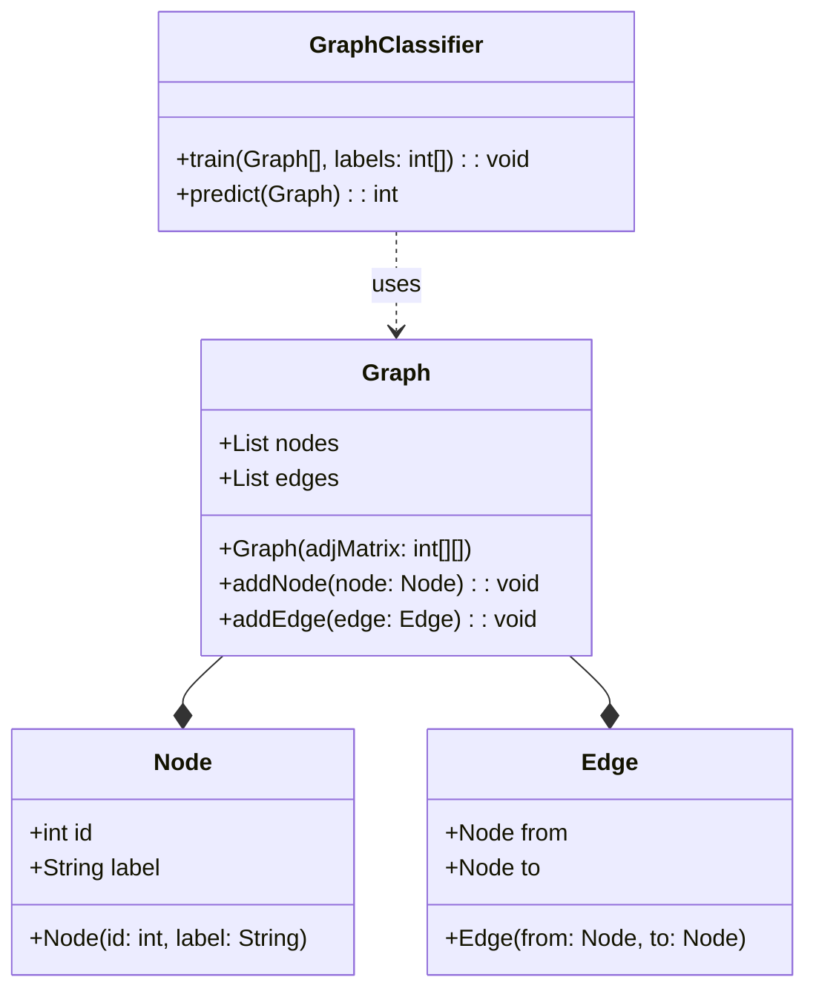
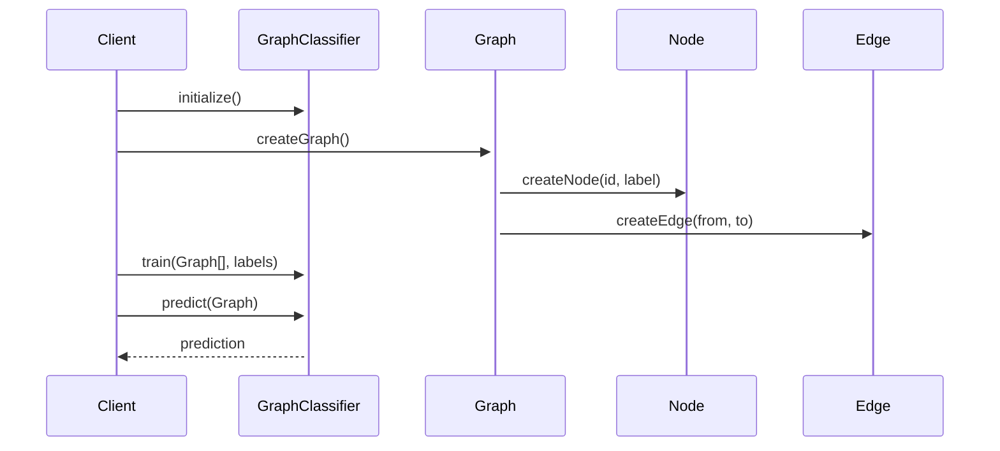

## Introduction

Graph classification is a design pattern used in neural networks for predicting the category of entire graphs. This pattern is particularly useful in scenarios where the data can be naturally represented as graphs, such as in molecular property prediction, social network analysis, and recommendation systems.

## Detailed Description

Graph classification involves assigning a label to an entire graph rather than to individual nodes or edges. The challenge lies in handling the variable size and complex structure of graphs. State-of-the-art methods like Graph Neural Networks (GNNs) and Graph Convolutional Networks (GCNs) have shown promising results in this domain.

## UML Class Diagram

Here's a UML Class Diagram for the Graph Classification design pattern:



## UML Sequence Diagram

Here's a UML Sequence Diagram showing the interaction for training and predicting with a Graph Classifier:



## Examples in Different Languages

### Python

```python
import networkx as nx
from sklearn.ensemble import RandomForestClassifier

class GraphClassifier:
    def __init__(self):
        self.model = RandomForestClassifier()
    
    def train(self, graphs, labels):
        features = [self.extract_features(g) for g in graphs]
        self.model.fit(features, labels)
    
    def predict(self, graph):
        features = self.extract_features(graph)
        return self.model.predict([features])[0]
    
    def extract_features(self, graph):
        # Example feature: node count
        return [len(graph.nodes)]
        
G1 = nx.Graph()
G1.add_edges_from([(1, 2), (2, 3)])
G2 = nx.Graph()
G2.add_edges_from([(1, 2)])

clf = GraphClassifier()
clf.train([G1, G2], [0, 1])
prediction = clf.predict(G1)
print(f'Prediction: {prediction}')
```

### Java

```java
import java.util.List;
import java.util.ArrayList;
import weka.classifiers.trees.RandomForest;
import weka.core.DenseInstance;
import weka.core.Instances;

public class GraphClassifier {
    private RandomForest model;
    
    public GraphClassifier() {
        model = new RandomForest();
    }
    
    public void train(List<Graph> graphs, List<Integer> labels) throws Exception {
        Instances dataset = new Instances("GraphData", new ArrayList<>(), graphs.size());
        for (int i = 0; i < graphs.size(); i++) {
            dataset.add(extractFeatures(graphs.get(i), labels.get(i)));
        }
        model.buildClassifier(dataset);
    }
    
    public double predict(Graph graph) throws Exception {
        return model.classifyInstance(extractFeatures(graph, -1));
    }
    
    private DenseInstance extractFeatures(Graph graph, int label) {
        DenseInstance instance = new DenseInstance(1);
        instance.setValue(0, graph.getNodeCount());
        instance.setClassValue(label);
        return instance;
    }
}
```

### Scala

```scala
import scala.collection.mutable.ArrayBuffer

class GraphClassifier {
    private val model = new RandomForestClassifier()
    
    def train(graphs: Seq[Graph], labels: Seq[Int]): Unit = {
        val features = graphs.map(extractFeatures)
        model.fit(features, labels)
    }
    
    def predict(graph: Graph): Int = {
        val features = extractFeatures(graph)
        model.predict(features)
    }
    
    private def extractFeatures(graph: Graph): Array[Double] = {
        Array(graph.nodes.size.toDouble)
    }
}

// Usage
val graph1 = new Graph()
graph1.addEdges(Array((1, 2), (2, 3)))

val graph2 = new Graph()
graph2.addEdges(Array((1, 2)))

val classifier = new GraphClassifier()
classifier.train(Seq(graph1, graph2), Seq(0, 1))
val prediction = classifier.predict(graph1)
println(s"Prediction: $prediction")
```

### Clojure

```clojure
(ns graph-classifier
  (:require [clj-ml.classifiers :as cls]))

(defn extract-features [graph]
  [(.size (:nodes graph))])

(defn train [graphs labels]
  (let [instances (mapv #(assoc {} :attrs (extract-features %) :class (labels %)) graphs)]
    (cls/classifier :random-forest {:train-instances instances})))

(defn predict [classifier graph]
  (cls/classify classifier (extract-features graph)))

;; Usage
(def graph1 {:nodes #{1 2 3} :edges #{[1 2] [2 3]}})
(def graph2 {:nodes #{1 2} :edges #{[1 2]}})

(def classifier (train [graph1 graph2] [0 1]))
(println (predict classifier graph1))
```

## Benefits

1. **Versatility:** Can handle any graph-structured data.
2. **Scalability:** Efficiently scalable with advanced architectures like GNNs.
3. **State-of-the-art Performance:** Achieves high accuracy with recent advancements.

## Trade-offs

1. **Complexity:** More complex compared to traditional ML algorithms.
2. **Computational Load:** Requires significant computational resources.
3. **Implementation Effort:** More effort needed to design and tune models.

## Examples of Use Cases

1. **Molecular Property Prediction:** Classifying molecules based on their properties.
2. **Social Network Analysis:** Classifying entire social networks or communities.
3. **Recommendation Systems:** Predicting preferences based on user-item interaction graphs.

## Related Design Patterns

1. **Node Classification:** Predicts categories for individual nodes in a graph.
2. **Edge Prediction:** Predicts the existence or attributes of edges between nodes in a graph.

## Resources

1. **Papers:** 
   - "Semi-Supervised Classification with Graph Convolutional Networks" by Kipf and Welling
   - "Inductive Representation Learning on Large Graphs" by Hamilton et al.
2. **Frameworks:** 
   - DGL (Deep Graph Library)
   - PyTorch Geometric
   - NetworkX

## Summary

Graph classification is an advanced design pattern used in neural networks for predicting the categories of entire graphs. It is powerful for various applications, including molecular property prediction and social network analysis. Although it comes with its own set of challenges, such as complexity and computational load, its benefits and versatility make it a crucial tool in the realm of machine learning and data science.

In this article, we covered the essential details of the Graph Classification pattern, provided UML diagrams for structural understanding, and implemented examples in Python, Java, Scala, and Clojure. We also discussed the benefits, trade-offs, and related design patterns. For those interested in further exploration, numerous resources and frameworks are available to delve deeper into this fascinating domain.
