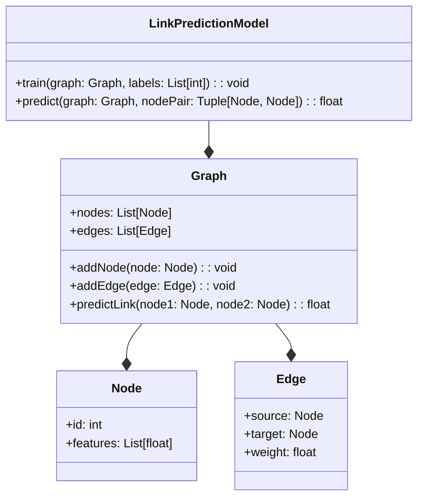
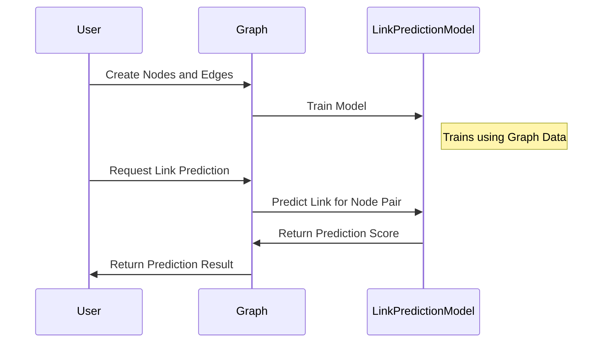

## Link Prediction: Predicting Missing Links in Graphs

Link Prediction is a neural network design pattern that focuses on predicting missing links in a graph. This pattern has significant applications in recommendation systems, social network analysis, biological network analysis, and more.

### Overview

Link prediction aims to infer the likelihood of a future or missing connection between nodes in a graph. By leveraging the structure and properties of the graph, this pattern helps in making data-driven predictions about node relationships.

### Use Cases

- **Recommendation Systems:** Predicting the likelihood of user-item interactions.
- **Social Networks:** Predicting friendship or follower links between users.
- **Biological Networks:** Inferring possible interactions between proteins or genes.

### UML Class Diagram



### UML Sequence Diagram



### Implementation Examples

#### Python Example

```python
import networkx as nx
import numpy as np
from sklearn.linear_model import LogisticRegression

class LinkPredictionModel:
    def __init__(self):
        self.model = LogisticRegression()

    def train(self, graph, labels):
        X = self._extract_features(graph)
        self.model.fit(X, labels)

    def predict(self, graph, node_pair):
        X = self._extract_features(graph, node_pair)
        return self.model.predict_proba(X)[0, 1]

    def _extract_features(self, graph, node_pair=None):
        # Implementation of feature extraction from graph
        # For simplicity, using a placeholder here
        return np.random.rand(1, 10)

graph = nx.Graph()
graph.add_edges_from([(0, 1), (1, 2), (2, 3)])
model = LinkPredictionModel()
model.train(graph, [1, 0, 1])  # Sample training labels
prediction = model.predict(graph, (0, 2))
print(f"Prediction Score: {prediction}")
```

#### Java Example

```java
import org.jgrapht.*;
import org.jgrapht.graph.*;
import weka.classifiers.functions.Logistic;
import weka.core.*;

public class LinkPredictionModel {
    private Logistic model;

    public LinkPredictionModel() {
        this.model = new Logistic();
    }

    public void train(Graph<Integer, DefaultEdge> graph, int[] labels) throws Exception {
        Instances data = extractFeatures(graph, labels.length);
        this.model.buildClassifier(data);
    }

    public double predict(Graph<Integer, DefaultEdge> graph, Pair<Integer, Integer> nodePair) throws Exception {
        Instance instance = extractFeatureInstance(graph, nodePair);
        return this.model.distributionForInstance(instance)[1];
    }

    private Instances extractFeatures(Graph<Integer, DefaultEdge> graph, int numInstances) {
        // Feature extraction logic
        // Placeholder implementation
        return new Instances("Rel", new FastVector(), numInstances);
    }

    private Instance extractFeatureInstance(Graph<Integer, DefaultEdge> graph, Pair<Integer, Integer> nodePair) {
        // Feature extraction logic
        // Placeholder implementation
        return new DenseInstance(1.0, new double[10]);
    }

    public static void main(String[] args) throws Exception {
        Graph<Integer, DefaultEdge> graph = new SimpleGraph<>(DefaultEdge.class);
        graph.addEdge(0, 1);
        graph.addEdge(1, 2);
        graph.addEdge(2, 3);

        LinkPredictionModel model = new LinkPredictionModel();
        model.train(graph, new int[]{1, 0, 1});

        double prediction = model.predict(graph, new Pair<>(0, 2));
        System.out.println("Prediction Score: " + prediction);
    }
}
```

#### Scala Example

```scala
import org.apache.spark.graphx._
import org.apache.spark.rdd.RDD
import org.apache.spark.ml.classification.LogisticRegression
import org.apache.spark.sql.SparkSession
import org.apache.spark.sql.functions._

case class LinkPredictionModel() {
  val logisticRegression = new LogisticRegression()

  def train(graph: Graph[Int, Int], labels: Array[Int]) = {
    val features = extractFeatures(graph)
    val trainingData = labels.zip(features).toDF("label", "features")
    logisticRegression.fit(trainingData)
  }

  def predict(graph: Graph[Int, Int], nodePair: (VertexId, VertexId)): Double = {
    val features = extractFeature(graph, nodePair)
    logisticRegression.predict(features)
  }

  def extractFeatures(graph: Graph[Int, Int]) = {
    // Feature extraction logic
    Array.fill(graph.edges.count().toInt)(Vectors.dense(Array.fill(10)(math.random)))
  }

  def extractFeature(graph: Graph[Int, Int], nodePair: (VertexId, VertexId)) = {
    // Feature extraction logic
    Vectors.dense(Array.fill(10)(math.random))
  }
}

object LinkPredictionExample {
  def main(args: Array[String]): Unit = {
    val spark = SparkSession.builder().appName("LinkPredictionExample").getOrCreate()
    import spark.implicits._

    val vertices: RDD[(VertexId, Int)] = spark.sparkContext.parallelize(Array((1L, 1), (2L, 2), (3L, 3)))
    val edges: RDD[Edge[Int]] = spark.sparkContext.parallelize(Array(Edge(1L, 2L, 1), Edge(2L, 3L, 1)))

    val graph = Graph(vertices, edges)

    val model = LinkPredictionModel()
    model.train(graph, Array(1, 0, 1))

    val prediction = model.predict(graph, (1L, 3L))
    println(s"Prediction Score: $prediction")
  }
}
```

#### Clojure Example

```clojure
(ns link-prediction.core
  (:require [clojure.java.io :as io]
            [clojure.data.csv :as csv])
  (:import [org.graphstream.graph Graph Node Edge]
           [org.graphstream.graph.implementations SingleGraph]
           [weka.classifiers.functions Logistic]
           [weka.core Instances DenseInstance FastVector]))

(defn create-graph []
  (let [graph (SingleGraph. "example")]
    (.addNode graph "A")
    (.addNode graph "B")
    (.addNode graph "C")
    (.addEdge graph "AB" "A" "B" true)
    (.addEdge graph "BC" "B" "C" true)
    graph))

(defn extract-features [graph]
  ;; Placeholder for feature extraction
  (DenseInstance. 1 (double-array [0.1 0.2 0.3 0.4 0.5 0.6 0.7 0.8 0.9 1.0])))

(defn train [graph labels]
  (let [data (Instances. "Rel" (FastVector.) (.size (.getEdgeSet graph)))
        model (Logistic.)]
    (doseq [label labels]
      (let [instance (extract-features graph)]
        (.setDataset instance data)
        (.setClassValue instance (double label))
        (.add data instance)))
    (.buildClassifier model data)
    model))

(defn predict [model graph node-pair]
  (let [instance (extract-features graph)]
    (.distributionForInstance model instance)))

(defn -main []
  (let [graph (create-graph)
        model (train graph [1 0 1])
        prediction (predict model graph ["A" "C"])]
    (println "Prediction Score:" (aget prediction 1))))
```

### Benefits

- **Accuracy:** Effectively predicts potential connections based on existing graph data.
- **Scalability:** Can handle large graphs with numerous nodes and edges.
- **Flexibility:** Applicable across various domains such as social networks, recommendation systems, and biological networks.

### Trade-offs

- **Complexity:** Requires comprehensive feature extraction and selection processes.
- **Data Dependency:** Performance heavily depends on the quality and completeness of the input data.

### Examples of Use Cases

- **Amazon:** Suggesting products to users based on their previous purchases.
- **LinkedIn:** Recommending connections for users based on mutual contacts.
- **Drug Discovery:** Predicting interactions between different proteins.

### Related Design Patterns

- **Graph Neural Networks (GNNs):** Extend neural networks for graph-structured data.
- **Recommendation Systems:** Utilize various techniques, including collaborative filtering and content-based filtering.

### Resources and References

- **Books:**
  - "Deep Learning with Python" by François Chollet.
  - "Graph Machine Learning" by Ma et al.
- **Research Papers:**
  - "Link Prediction Approaches and Performance Prediction in Social Networks" - Hasan et al.
- **Open Source Frameworks:**
  - **DeepGraph:** A library for deep learning on graphs.
  - **GraphSAGE:** Framework for generating embeddings for graph nodes.

### Summary

Link Prediction is a powerful design pattern for predicting missing or future links in graphs. It has widespread applications, particularly in recommendation systems, and utilizes neural networks to achieve high accuracy and scalability. By understanding its benefits, trade-offs, and practical applications, developers can effectively incorporate Link Prediction into their solutions.


