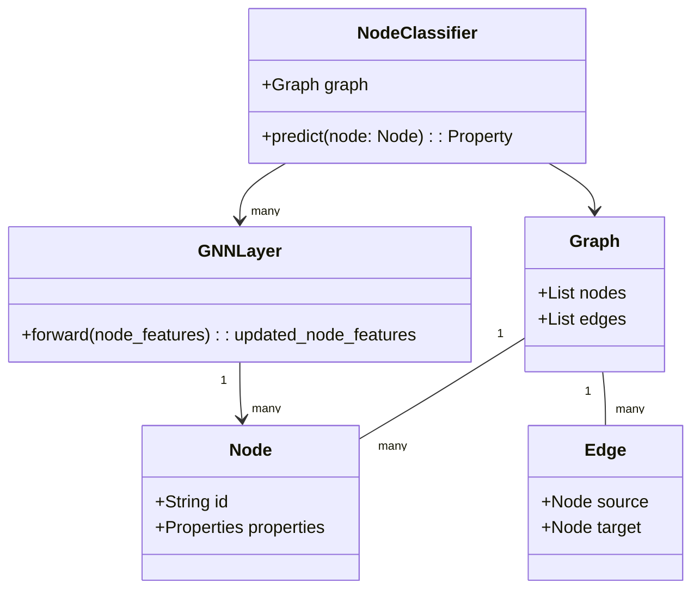
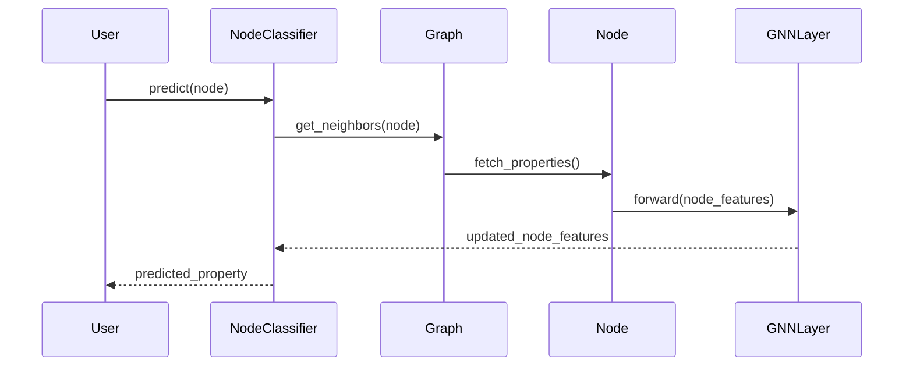

## Overview

Node classification is a powerful technique used in neural networks to predict properties of individual nodes in a graph. This technique is extensively employed in various domains, including social network analysis, recommendation systems, fraud detection, and biological network analysis.

## UML Class Diagram

Here’s a UML Class Diagram representing a typical implementation of Node Classification using Graph Neural Networks (GNNs).



## UML Sequence Diagram

Below is the sequence diagram illustrating the workflow of node classification:



## Detailed Explanation

### Components

1. **NodeClassifier**: This is the main class responsible for predicting node properties. It interacts with the Graph and GNNLayer classes to perform the prediction.
2. **Graph**: Represents the entire graph structure containing nodes and edges.
3. **Node**: Individual node within the graph, containing properties that may be utilized for predictions.
4. **Edge**: Represents a connection between two nodes in the graph.
5. **GNNLayer**: Encapsulates the neural network layers used to process and update node features.

## Example Implementations

### Python

```python
import torch
import torch.nn as nn
import torch.nn.functional as F
from torch_geometric.nn import GCNConv

class GNNLayer(nn.Module):
    def __init__(self, in_channels, out_channels):
        super(GNNLayer, self).__init__()
        self.conv = GCNConv(in_channels, out_channels)

    def forward(self, x, edge_index):
        x = self.conv(x, edge_index)
        return F.relu(x)

class NodeClassifier(nn.Module):
    def __init__(self, in_channels, hidden_channels, out_channels):
        super(NodeClassifier, self).__init__()
        self.layer1 = GNNLayer(in_channels, hidden_channels)
        self.layer2 = GNNLayer(hidden_channels, out_channels)

    def forward(self, x, edge_index):
        x = self.layer1(x, edge_index)
        x = self.layer2(x, edge_index)
        return F.log_softmax(x, dim=1)
```

### Java

```java
public class NodeClassifier {
    private Graph graph;
    private List<GNNLayer> layers;

    public NodeClassifier(Graph graph, List<GNNLayer> layers) {
        this.graph = graph;
        this.layers = layers;
    }

    public Property predict(Node node) {
        List<Node> neighbors = graph.getNeighbors(node);
        Properties updatedProperties = node.getProperties();

        for (GNNLayer layer : layers) {
            updatedProperties = layer.forward(updatedProperties);
        }
        
        return updatedProperties.get("predictedProperty");
    }
}
```

### Scala

```scala
class GNNLayer(inChannels: Int, outChannels: Int) {
  def forward(nodeFeatures: List[Double]): List[Double] = {
    // Implement the GCN layer logic here
    nodeFeatures.map(feature => math.max(0, feature))
  }
}

class NodeClassifier(graph: Graph, layers: List[GNNLayer]) {
  def predict(node: Node): Property = {
    val neighbors = graph.getNeighbors(node)
    var updatedFeatures = node.features

    for (layer <- layers) {
      updatedFeatures = layer.forward(updatedFeatures)
    }

    updatedFeatures("predictedProperty")
  }
}
```

### Clojure

```clojure
(defn gnn-layer [node-features in-channels out-channels]
  (mapv (fn [feature] (max 0 feature)) node-features))

(defn node-classifier [graph layers node]
  (let [neighbors (get-neighbors graph node)
        initial-features (:features node)
        updated-features (reduce (fn [features layer] 
                                   (layer features)) 
                                 initial-features 
                                 layers)]
    (:predicted-property updated-features)))
```

## Benefits

- **Accurate Predictions**: Leveraging GNNs for node classification enables highly accurate property predictions based on both local and global graph structures.
- **Scalability**: Can be applied to large-scale graphs with millions of nodes and edges.
- **Versatility**: Suitable for various applications, from social network analysis to fraud detection and more.

## Trade-offs

- **Computational Complexity**: Requires significant computational resources for large graphs.
- **Data Dependency**: Heavily dependent on the quality and completeness of the graph data.

## Use Cases

- **Social Network Analysis**: Predicting attributes of users such as interests, age, or occupation.
- **Recommendation Systems**: Suggesting products or services to users based on graph-based interactions.
- **Fraud Detection**: Identifying suspicious activities by analyzing transaction networks.

## Related Design Patterns

- **Graph Embeddings**: Techniques to represent nodes and edges in low-dimensional vectors, which can be used in conjunction with node classification.
- **Community Detection**: Grouping nodes into clusters, which can serve as input features for node classification tasks.

## Resources and References

- [PyTorch Geometric](https://pytorch-geometric.readthedocs.io/en/latest/): A library for deep learning on irregularly structured input data such as graphs.
- [Graph Neural Networks (GNNs): A Review](https://arxiv.org/abs/1812.08434): A comprehensive review of graph neural networks.

## Summary

Node classification using neural networks, particularly Graph Neural Networks, is a critical pattern for predicting node properties in complex graph structures. This technique is invaluable for a wide range of applications, from social network analysis to recommendation systems and beyond. While it offers high accuracy and scalability, the computational cost and data dependency are important considerations.

By understanding and implementing node classification, developers can leverage the full potential of graph-based data, uncovering hidden insights and making more informed decisions.

---

This article should provide a comprehensive guide to node classification, complete with UML diagrams, code examples in various languages, and a detailed discussion of its benefits, trade-offs, and related patterns.
