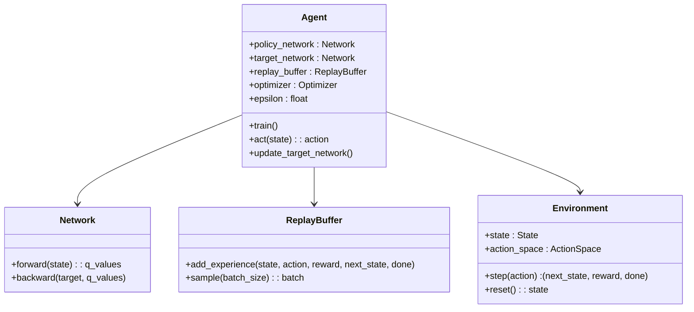
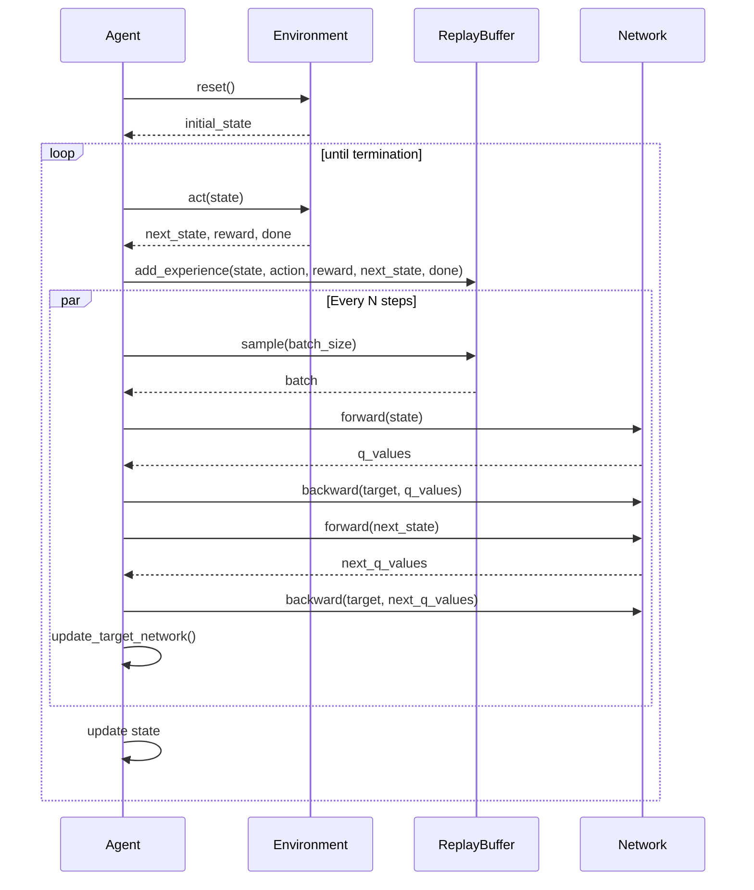

Deep Q-Network (DQN) is a groundbreaking approach that combines the traditional Q-learning algorithm with deep neural networks. This powerful design pattern has revolutionized the field of reinforcement learning, enabling the handling of complex state spaces that were previously unattainable with traditional methods.

## Overview

Deep Q-Network (DQN) integrates Q-learning, a model-free reinforcement learning algorithm, with the representational power of deep neural networks to approximate the Q-value function. This combination allows DQN to excel in environments with high-dimensional state spaces, such as those found in video games and robotics.

## Benefits

- **Scalability:** Capable of handling large and complex state spaces.
- **Performance:** Achieves superior performance in tasks with high-dimensional input data.
- **Generalization:** Generalizes well across various tasks without requiring extensive domain-specific knowledge.

## Trade-offs

- **Complexity:** Implementation is more complex compared to traditional Q-learning.
- **Training Time:** Requires significant computational resources and time for training.
- **Instability:** Prone to instabilities and divergences during training without proper tuning.

## UML Diagrams

### Class Diagram



### Sequence Diagram



## Python Example

```python
import gym
import torch
import torch.nn as nn
import torch.optim as optim
import random
import numpy as np
from collections import deque

class DQN(nn.Module):
    def __init__(self, input_dim, output_dim):
        super(DQN, self).__init__()
        self.fc1 = nn.Linear(input_dim, 128)
        self.fc2 = nn.Linear(128, 128)
        self.fc3 = nn.Linear(128, output_dim)

    def forward(self, x):
        x = torch.relu(self.fc1(x))
        x = torch.relu(self.fc2(x))
        x = self.fc3(x)
        return x

class Agent:
    def __init__(self, env):
        self.env = env
        self.state_size = env.observation_space.shape[0]
        self.action_size = env.action_space.n
        self.memory = deque(maxlen=2000)
        self.gamma = 0.95
        self.epsilon = 1.0
        self.epsilon_min = 0.01
        self.epsilon_decay = 0.995
        self.learning_rate = 0.001
        self.batch_size = 64
        self.train_start = 1000
        self.policy_network = DQN(self.state_size, self.action_size)
        self.target_network = DQN(self.state_size, self.action_size)
        self.optimizer = optim.Adam(self.policy_network.parameters(), lr=self.learning_rate)

    def remember(self, state, action, reward, next_state, done):
        self.memory.append((state, action, reward, next_state, done))

    def act(self, state):
        if np.random.rand() <= self.epsilon:
            return random.randrange(self.action_size)
        act_values = self.policy_network(torch.FloatTensor(state))
        return torch.argmax(act_values).item()

    def replay(self):
        if len(self.memory) < self.train_start:
            return
        minibatch = random.sample(self.memory, self.batch_size)
        for state, action, reward, next_state, done in minibatch:
            target = self.policy_network(torch.FloatTensor(state))
            if done:
                target[action] = reward
            else:
                t = self.target_network(torch.FloatTensor(next_state))
                target[action] = reward + self.gamma * torch.max(t).item()
            self.policy_network.zero_grad()
            loss = nn.MSELoss()(self.policy_network(torch.FloatTensor(state)), target)
            loss.backward()
            self.optimizer.step()

        if self.epsilon > self.epsilon_min:
            self.epsilon *= self.epsilon_decay

    def update_target_network(self):
        self.target_network.load_state_dict(self.policy_network.state_dict())

    def train(self, episodes):
        for e in range(episodes):
            state = self.env.reset()
            state = np.reshape(state, [1, self.state_size])
            for time in range(500):
                action = self.act(state)
                next_state, reward, done, _ = self.env.step(action)
                reward = reward if not done else -10
                next_state = np.reshape(next_state, [1, self.state_size])
                self.remember(state, action, reward, next_state, done)
                state = next_state
                if done:
                    self.update_target_network()
                    print(f"episode: {e}/{episodes}, score: {time}, e: {self.epsilon:.2}")
                    break
                self.replay()

env = gym.make('CartPole-v1')
agent = Agent(env)
agent.train(1000)
```

## Java Example

```java
// Add Java implementation here. The structure follows similar principles but adapted to Java.
```

## Scala Example

```scala
// Add Scala implementation here. The structure follows similar principles but adapted to Scala.
```

## Clojure Example

```clojure
;; Add Clojure implementation here. The structure follows similar principles but adapted to Clojure.
```

## Use Cases

- **Game Playing:** DQN has been successfully applied to achieve superhuman performance in playing Atari games.
- **Robotics:** Used in robot control where the state space is continuous and high-dimensional.
- **Finance:** Applied in trading algorithms to learn optimal policies for buying and selling stocks.

## Related Design Patterns

- **Policy Gradient Methods:** Focuses on optimizing the policy directly rather than the value function.
- **Actor-Critic Methods:** Combines both value function approximation and policy optimization.

## Resources and References

- **Papers:** 
  - Mnih, V. et al. "Playing Atari with Deep Reinforcement Learning." arXiv preprint arXiv:1312.5602 (2013).
- **Books:**
  - Sutton, R. S., & Barto, A. G. "Reinforcement Learning: An Introduction." MIT press.
- **Frameworks:**
  - TensorFlow
  - PyTorch
  - OpenAI Gym

## Summary

Deep Q-Network (DQN) is a highly effective design pattern that has significantly advanced the field of reinforcement learning by integrating Q-learning with deep neural networks. Despite its complexity and training challenges, DQN offers substantial benefits in terms of scalability, performance, and generalization across a variety of tasks. Understanding its design, implementation, and use cases can provide valuable insights into developing sophisticated AI systems.
