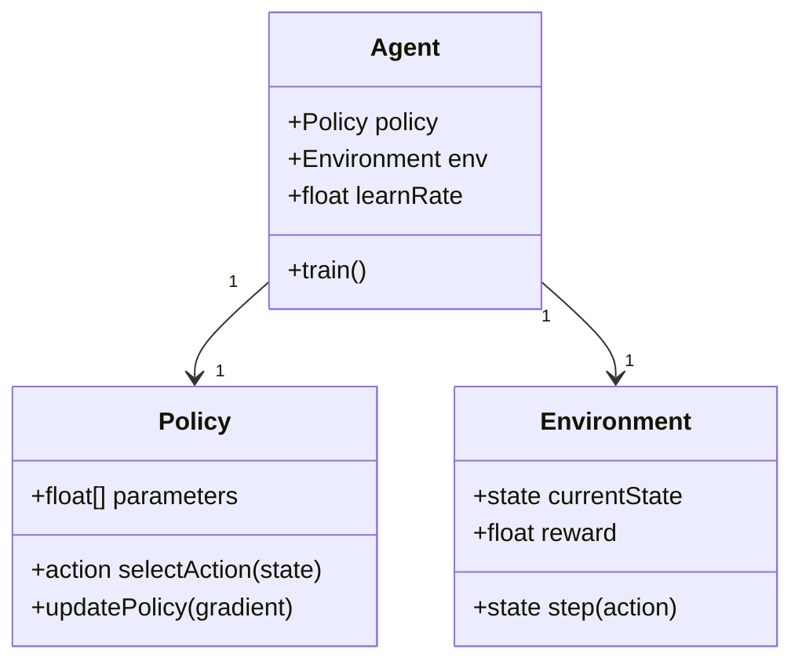
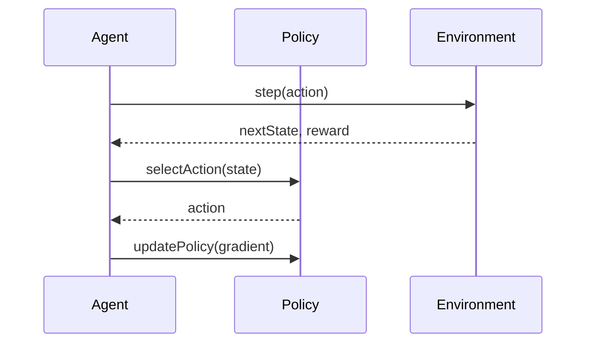

Policy Gradient Methods are a class of reinforcement learning (RL) algorithms used to optimize policies directly rather than the action-value function. These methods are particularly advantageous in high-dimensional action spaces and are instrumental in various complex RL tasks.

## Benefits and Trade-offs

### Benefits
1. **Direct Policy Optimization:** Policy Gradient Methods directly optimize the policy, which can be more efficient in high-dimensional spaces.
2. **Stochastic Policies:** These methods are well-suited for environments where the optimal policy is stochastic.
3. **Continuous Action Spaces:** They perform better in environments with continuous action spaces.

### Trade-offs
1. **Sample Efficiency:** These methods can be sample inefficient, requiring a large number of episodes to converge.
2. **Variance:** High variance in the gradient estimates can lead to instability during training.

## UML Diagrams

### Class Diagram


### Sequence Diagram


## Code Examples

### Python
```python
import numpy as np

class PolicyGradientAgent:
    def __init__(self, policy, env, learn_rate=0.01):
        self.policy = policy
        self.env = env
        self.learn_rate = learn_rate

    def train(self):
        state = self.env.reset()
        done = False
        while not done:
            action = self.policy.select_action(state)
            next_state, reward, done, _ = self.env.step(action)
            gradient = self.compute_gradient(state, action, reward)
            self.policy.update_policy(gradient)
            state = next_state

    def compute_gradient(self, state, action, reward):
        # Implement policy gradient computation
        pass

class Policy:
    def __init__(self, parameters):
        self.parameters = parameters

    def select_action(self, state):
        # Implement action selection logic
        pass

    def update_policy(self, gradient):
        self.parameters += self.learn_rate * gradient

class Environment:
    def reset(self):
        # Reset and return initial state
        pass

    def step(self, action):
        # Apply action and return next state and reward
        pass
```

### Java
```java
public class PolicyGradientAgent {
    private Policy policy;
    private Environment env;
    private double learnRate;

    public PolicyGradientAgent(Policy policy, Environment env, double learnRate) {
        this.policy = policy;
        this.env = env;
        this.learnRate = learnRate;
    }

    public void train() {
        State state = env.reset();
        boolean done = false;
        while (!done) {
            Action action = policy.selectAction(state);
            StepResult result = env.step(action);
            Gradient gradient = computeGradient(state, action, result.getReward());
            policy.updatePolicy(gradient);
            state = result.getNextState();
            done = result.isDone();
        }
    }

    private Gradient computeGradient(State state, Action action, double reward) {
        // Implement policy gradient computation
        return new Gradient();
    }
}

public class Policy {
    private double[] parameters;

    public Action selectAction(State state) {
        // Implement action selection logic
        return new Action();
    }

    public void updatePolicy(Gradient gradient) {
        // Update policy parameters
    }
}

public class Environment {
    public State reset() {
        // Reset and return initial state
        return new State();
    }

    public StepResult step(Action action) {
        // Apply action and return next state and reward
        return new StepResult();
    }
}
```

### Scala
```scala
class PolicyGradientAgent(val policy: Policy, val env: Environment, val learnRate: Double) {
  def train(): Unit = {
    var state = env.reset()
    var done = false
    while (!done) {
      val action = policy.selectAction(state)
      val (nextState, reward, isDone) = env.step(action)
      val gradient = computeGradient(state, action, reward)
      policy.updatePolicy(gradient)
      state = nextState
      done = isDone
    }
  }

  private def computeGradient(state: State, action: Action, reward: Double): Gradient = {
    // Implement policy gradient computation
    new Gradient()
  }
}

class Policy(var parameters: Array[Double]) {
  def selectAction(state: State): Action = {
    // Implement action selection logic
    new Action()
  }

  def updatePolicy(gradient: Gradient): Unit = {
    // Update policy parameters
  }
}

class Environment {
  def reset(): State = {
    // Reset and return initial state
    new State()
  }

  def step(action: Action): (State, Double, Boolean) = {
    // Apply action and return next state and reward
    (new State(), 0.0, false)
  }
}
```

### Clojure
```clojure
(defn train-agent [policy env learn-rate]
  (loop [state (env/reset)]
    (let [action (policy/select-action policy state)
          {:keys [next-state reward done]} (env/step env action)
          gradient (compute-gradient state action reward)]
      (policy/update-policy policy gradient learn-rate)
      (when-not done
        (recur next-state)))))

(defn compute-gradient [state action reward]
  ;; Implement policy gradient computation
  {})

(defrecord Policy [parameters]
  (select-action [this state]
    ;; Implement action selection logic
    {})
  (update-policy [this gradient learn-rate]
    ;; Update policy parameters
    ))

(defrecord Environment []
  (reset [this]
    ;; Reset and return initial state
    {})
  (step [this action]
    ;; Apply action and return next state and reward
    {}))
```

## Use Cases

1. **Robotics Control:** Optimal control of robotic systems with continuous action spaces.
2. **Autonomous Driving:** Decision-making in complex, high-dimensional driving environments.
3. **Finance:** Portfolio optimization and trading strategies with continuous action parameters.

## Related Design Patterns

1. **Q-Learning:** Optimizes action-value functions instead of policies directly.
2. **Actor-Critic Methods:** Combines value function approximation and policy optimization for stable training.

## Resources and References

- **Books:** 
  - "Reinforcement Learning: An Introduction" by Richard S. Sutton and Andrew G. Barto
  - "Deep Reinforcement Learning Hands-On" by Maxim Lapan
- **Research Papers:**
  - "Policy Gradient Methods for Reinforcement Learning with Function Approximation" by Richard S. Sutton et al.
- **Frameworks:**
  - TensorFlow: [TensorFlow Agents](https://www.tensorflow.org/agents)
  - PyTorch: [PyTorch RL](https://pytorch.org/tutorials/intermediate/reinforcement_q_learning.html)

## Summary

Policy Gradient Methods offer an efficient way to directly optimize policies, especially beneficial in high-dimensional and continuous action spaces. Despite their sample inefficiency and potential for high variance, they remain a cornerstone of modern reinforcement learning due to their flexibility and capability to handle complex RL environments. Combining this with robust frameworks and a deep understanding of underlying principles can lead to impressive results across various domains.


