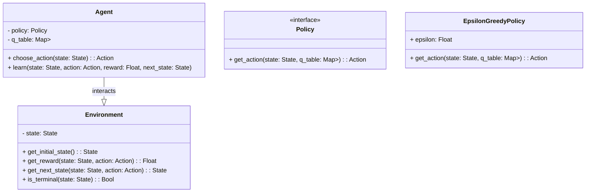
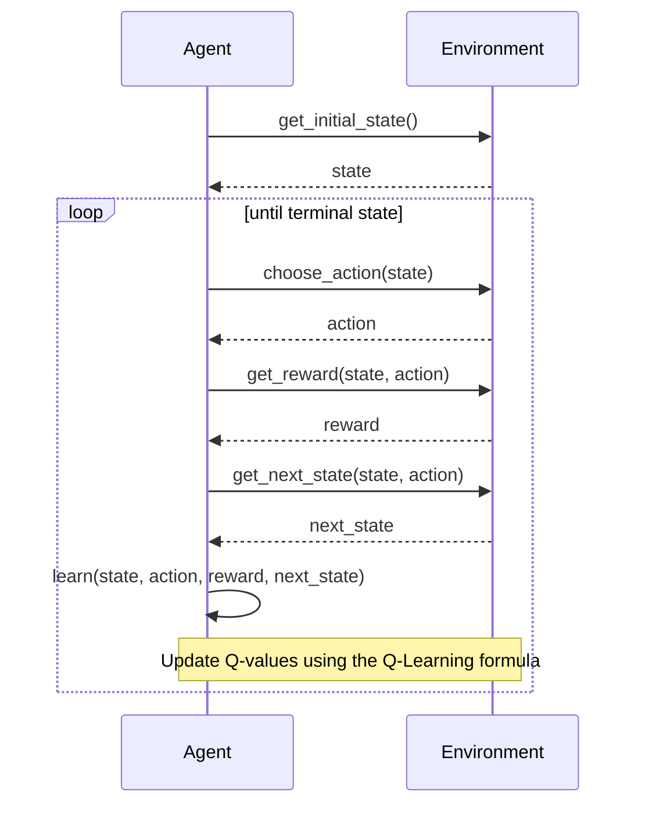

Q-Learning is a model-free reinforcement learning algorithm that aims to learn the quality of actions, informing an agent of which action to take under which circumstances. This is achieved through the agent exploring the environment and receiving rewards based on its actions.

## UML Diagrams

### UML Class Diagram



### UML Sequence Diagram



## Detailed Description

Q-Learning is aimed at finding the optimal policy which tells an agent the best action to take at any given state. This is achieved without requiring a model of the environment, making it a model-free algorithm. The central idea is to learn a Q-table which records the expected rewards (Q-values) for each state-action pair.

The Q-value update rule is defined as:


Q(s_t, a_t) = Q(s_t, a_t) + \alpha \left[ r_t + \gamma \max_a Q(s_{t+1}, a) - Q(s_t, a_t) \right]


where:
- \\( s_t \\) is the current state.
- \\( a_t \\) is the current action.
- \\( r_t \\) is the reward received after performing action \\( a_t \\).
- \\( s_{t+1} \\) is the next state.
- \\( \alpha \\) is the learning rate.
- \\( \gamma \\) is the discount factor.

## Benefits

- **Model-Free:** Does not require a model of the environment.
- **Simplicity:** Straightforward to implement.
- **Proven Convergence:** Converges to the optimal policy given infinite exploration.

## Trade-Offs

- **Slow Convergence:** May require many episodes to converge, especially in large state spaces.
- **Exploration-Exploitation Dilemma:** Needs a strategy like epsilon-greedy to balance exploration and exploitation.
- **Scalability:** May not scale well to problems with large or continuous state spaces without adaptations.

## Examples in Different Languages

### Python

```python
import numpy as np

class QLearningAgent:
    def __init__(self, num_states, num_actions, alpha, gamma, epsilon):
        self.q_table = np.zeros((num_states, num_actions))
        self.alpha = alpha
        self.gamma = gamma
        self.epsilon = epsilon

    def choose_action(self, state):
        if np.random.rand() < self.epsilon:
            return np.random.randint(self.q_table.shape[1])
        return np.argmax(self.q_table[state])

    def learn(self, state, action, reward, next_state):
        best_next_action = np.argmax(self.q_table[next_state])
        td_target = reward + self.gamma * self.q_table[next_state, best_next_action]
        td_error = td_target - self.q_table[state, action]
        self.q_table[state, action] += self.alpha * td_error
```

### Java

```java
import java.util.Random;

public class QLearningAgent {
    private double[][] qTable;
    private double alpha, gamma, epsilon;
    private Random random;

    public QLearningAgent(int numStates, int numActions, double alpha, double gamma, double epsilon) {
        qTable = new double[numStates][numActions];
        this.alpha = alpha;
        this.gamma = gamma;
        this.epsilon = epsilon;
        this.random = new Random();
    }

    public int chooseAction(int state) {
        if (random.nextDouble() < epsilon) {
            return random.nextInt(qTable[state].length);
        }
        return maxAction(state);
    }

    private int maxAction(int state) {
        int bestAction = 0;
        double maxVal = qTable[state][0];
        for (int i = 1; i < qTable[state].length; i++) {
            if (qTable[state][i] > maxVal) {
                bestAction = i;
                maxVal = qTable[state][i];
            }
        }
        return bestAction;
    }

    public void learn(int state, int action, double reward, int nextState) {
        int bestNextAction = maxAction(nextState);
        double tdTarget = reward + gamma * qTable[nextState][bestNextAction];
        double tdError = tdTarget - qTable[state][action];
        qTable[state][action] += alpha * tdError;
    }
}
```

### Scala

```scala
import scala.util.Random

class QLearningAgent(numStates: Int, numActions: Int, alpha: Double, gamma: Double, epsilon: Double) {
    private val qTable = Array.fill(numStates, numActions)(0.0)
    private val random = new Random()

    def chooseAction(state: Int): Int = {
        if (random.nextDouble() < epsilon) {
            random.nextInt(numActions)
        } else {
            qTable(state).zipWithIndex.maxBy(_._1)._2
        }
    }

    def learn(state: Int, action: Int, reward: Double, nextState: Int): Unit = {
        val bestNextAction = qTable(nextState).zipWithIndex.maxBy(_._1)._2
        val tdTarget = reward + gamma * qTable(nextState)(bestNextAction)
        val tdError = tdTarget - qTable(state)(action)
        qTable(state)(action) += alpha * tdError
    }
}
```

### Clojure

```clojure
(ns q-learning.core
  (:require [clojure.core.matrix :as m]))

(defn q-learning-agent [num-states num-actions alpha gamma epsilon]
  (let [q-table (m/zero-array [num-states num-actions])]
    {:q-table q-table
     :alpha alpha
     :gamma gamma
     :epsilon epsilon}))

(defn choose-action [agent state]
  (if (< (rand) (:epsilon agent))
    (rand-int (m/column-count (:q-table agent)))
    (m/emax-index (m/get-row (:q-table agent) state))))

(defn learn [agent state action reward next-state]
  (let [q-table (:q-table agent)
        best-next-action (m/emax-index (m/get-row q-table next-state))
        td-target (+ reward (* (:gamma agent) (m/get q-table next-state best-next-action)))
        td-error (- td-target (m/get q-table state action))
        updated-q (m/set q-table state action (+ (m/get q-table state action) (* (:alpha agent) td-error)))]
    (assoc agent :q-table updated-q)))
```

## Use Cases

- **Game AI:** Often used for training agents to play simple games like Tic-Tac-Toe, Snake, or Gridworld.
- **Robotics:** Helps in navigation and path planning where the robot learns optimal paths.
- **Autonomous Driving:** Used in simulated environments to train autonomous vehicles.

## Related Design Patterns

- **Deep Q-Learning (DQN):** Extends Q-Learning by using neural networks to approximate the Q-values for handling larger or continuous state spaces.
- **SARSA (State-Action-Reward-State-Action):** Similar to Q-Learning but updates the Q-values using the next action the agent actually takes.

## Resources and References

- **Books:** "Reinforcement Learning: An Introduction" by Sutton and Barto
- **Articles:** 
  - [Understanding Q-Learning](https://towardsdatascience.com/understanding-q-learning-algorithm-85e2fb3e2bfe)
  - [Reinforcement Learning Algorithms](https://deepmind.com/research/publications/learning-and-transferring)

- **Frameworks:** 
  - OpenAI Gym for testing and benchmarking RL algorithms.
  - TensorFlow and PyTorch for implementing more complex variants like DQN.

## Summary

Q-Learning is a foundational reinforcement learning algorithm used for learning the value of action-reward pairs in discrete action spaces. Its simplicity and proven convergence make it a popular choice for various applications, although it faces challenges in scalability and exploration. The pattern can be extended to handle more complex scenarios with algorithms like Deep Q-Learning and SARSA, broadening its applicability. 

By understanding Q-Learning, developers and researchers can harness its potential to create intelligent agents capable of optimal decision-making through interaction with their environments.
