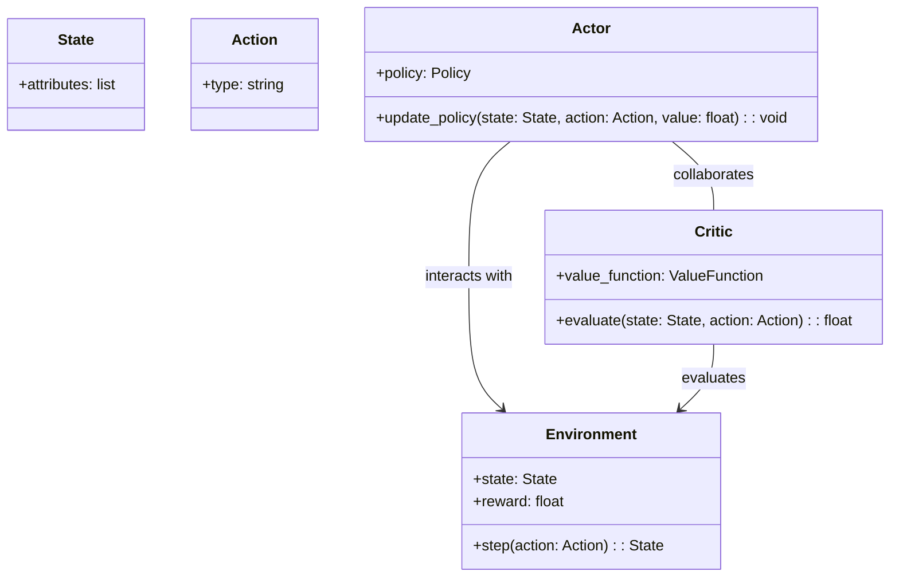
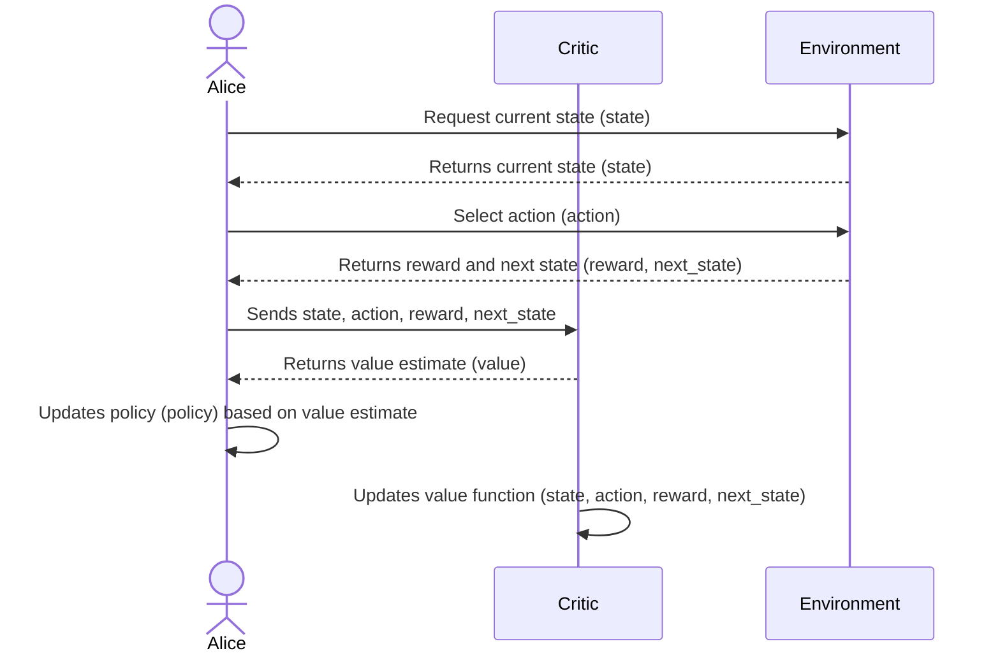

Actor-Critic methods are a class of reinforcement learning algorithms that bring together the best of both value-based and policy-based approaches. This hybrid model aims to stabilize training and often achieves faster convergence and more robust learning in various neural network applications.


## Introduction

In reinforcement learning (RL), the challenge often lies in effectively balancing exploration and exploitation while managing the instability of the learning process. Actor-Critic methods address these challenges by combining the value-based approach of Q-learning (critic) with the policy-based approach of policy gradients (actor). This blend allows for the optimization of a policy that guides an agent's actions while simultaneously evaluating the policy's value.

## Actor-Critic Architecture

### Components

1. **Actor**: The policy function that decides the actions to take based on the current state. This component updates the policy parameters in the direction that improves the actions taken.
2. **Critic**: The value function that evaluates how good the action taken by the actor is, given the current state. The critic provides feedback in the form of a value estimate, which helps in refining the policy.

## UML Class Diagram



## UML Sequence Diagram



## Examples

### Python

```python
import tensorflow as tf
import numpy as np

class Actor(tf.keras.Model):
    def __init__(self, action_dim):
        super(Actor, self).__init__()
        self.dense1 = tf.keras.layers.Dense(24, activation='relu')
        self.dense2 = tf.keras.layers.Dense(24, activation='relu')
        self.output_layer = tf.keras.layers.Dense(action_dim, activation='softmax')

    def call(self, state):
        x = self.dense1(state)
        x = self.dense2(x)
        return self.output_layer(x)

class Critic(tf.keras.Model):
    def __init__(self):
        super(Critic, self).__init__()
        self.dense1 = tf.keras.layers.Dense(24, activation='relu')
        self.dense2 = tf.keras.layers.Dense(24, activation='relu')
        self.output_layer = tf.keras.layers.Dense(1, activation='linear')

    def call(self, state):
        x = self.dense1(state)
        x = self.dense2(x)
        return self.output_layer(x)
```

### Java

```java
public class Actor {
    private DenseLayer layer1, layer2, outputLayer;

    public Actor(int actionDim) {
        layer1 = new DenseLayer(24, "relu");
        layer2 = new DenseLayer(24, "relu");
        outputLayer = new DenseLayer(actionDim, "softmax");
    }

    public double[] call(double[] state) {
        double[] x = layer1.forward(state);
        x = layer2.forward(x);
        return outputLayer.forward(x);
    }
}

public class Critic {
    private DenseLayer layer1, layer2, outputLayer;

    public Critic() {
        layer1 = new DenseLayer(24, "relu");
        layer2 = new DenseLayer(24, "relu");
        outputLayer = new DenseLayer(1, "linear");
    }

    public double call(double[] state) {
        double[] x = layer1.forward(state);
        x = layer2.forward(x);
        return outputLayer.forward(x)[0];
    }
}
```

### Scala

```scala
import scala.util.Random

class Actor(actionDim: Int) {
    val layer1 = new DenseLayer(24, "relu")
    val layer2 = new DenseLayer(24, "relu")
    val outputLayer = new DenseLayer(actionDim, "softmax")

    def call(state: Array[Double]): Array[Double] = {
        val x = layer1.forward(state)
        val y = layer2.forward(x)
        outputLayer.forward(y)
    }
}

class Critic() {
    val layer1 = new DenseLayer(24, "relu")
    val layer2 = new DenseLayer(24, "relu")
    val outputLayer = new DenseLayer(1, "linear")

    def call(state: Array[Double]): Double = {
        val x = layer1.forward(state)
        val y = layer2.forward(x)
        outputLayer.forward(y).head
    }
}
```

### Clojure

```clojure
(defn dense-layer [input-size output-size activation]
  ;; Initialize and return a dense layer
  )

(defn forward [layer inputs]
  ;; Compute forward pass for a layer
  )

(defn actor [action-dim]
  (let [layer1 (dense-layer 24 24 :relu)
        layer2 (dense-layer 24 24 :relu)
        output-layer (dense-layer 24 action-dim :softmax)]
    {:layer1 layer1
     :layer2 layer2
     :output-layer output-layer}))

(defn critic []
  (let [layer1 (dense-layer 24 24 :relu)
        layer2 (dense-layer 24 24 :relu)
        output-layer (dense-layer 24 1 :linear)]
    {:layer1 layer1
     :layer2 layer2
     :output-layer output-layer}))

(defn call [model state]
  (let [x (forward (:layer1 model) state)
        y (forward (:layer2 model) x)]
    (forward (:output-layer model) y)))
```

## Benefits

1. **Stabilized Training**: Combining the value and policy functions helps reduce variance and stabilize the learning process.
2. **Efficient Policy Learning**: The critic guides the actor, enabling more efficient policy updates.
3. **Flexibility**: Can be adapted for various reinforcement learning problems.

## Trade-offs

1. **Complexity**: Implementation and tuning can be more complex than using value-based or policy-based methods alone.
2. **Computational Resources**: Requires more computational power and memory.

## Use Cases

- **Game AI**: Developing agents for playing games such as Go, Chess, and video games.
- **Robotics**: Improving the control policies for robotic arms, drones, and other machinery.
- **Autonomous Vehicles**: Enhancing decision-making in self-driving cars.

## Related Design Patterns

- **Q-Learning**: A value-based method often used for comparison with Actor-Critic methods.
- **Policy Gradients**: A policy-based method that directly optimizes the policy.

## Resources and References

- Sutton, R. S., & Barto, A. G. (2018). Reinforcement Learning: An Introduction.
- [OpenAI's Spinning Up](https://spinningup.openai.com/en/latest/)
- [Deep Reinforcement Learning Hands-On](https://www.packtpub.com/product/deep-reinforcement-learning-hands-on-second-edition/9781838826994)

## Open Source Frameworks

- **TensorFlow**: [TensorFlow Agents](https://www.tensorflow.org/agents)
- **PyTorch**: [RLlib in Ray](https://docs.ray.io/en/latest/rllib.html)

## Summary

Actor-Critic methods are a powerful tool in the reinforcement learning toolkit, providing a balanced approach that stabilizes training and enables efficient policy optimization. By understanding and implementing this hybrid model, practitioners can build more robust and capable RL agents. This article has explored the architecture, provided code examples, and discussed benefits and trade-offs to give you a comprehensive understanding of Actor-Critic methods.

By leveraging related design patterns and open-source frameworks, you can further enhance and customize your RL solutions to meet specific needs and challenges.
