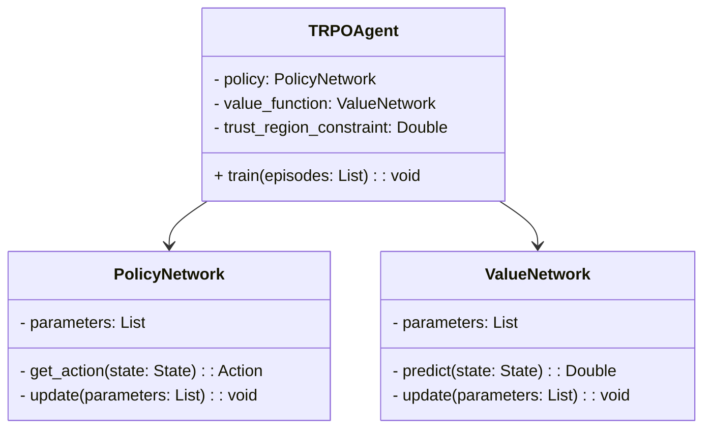
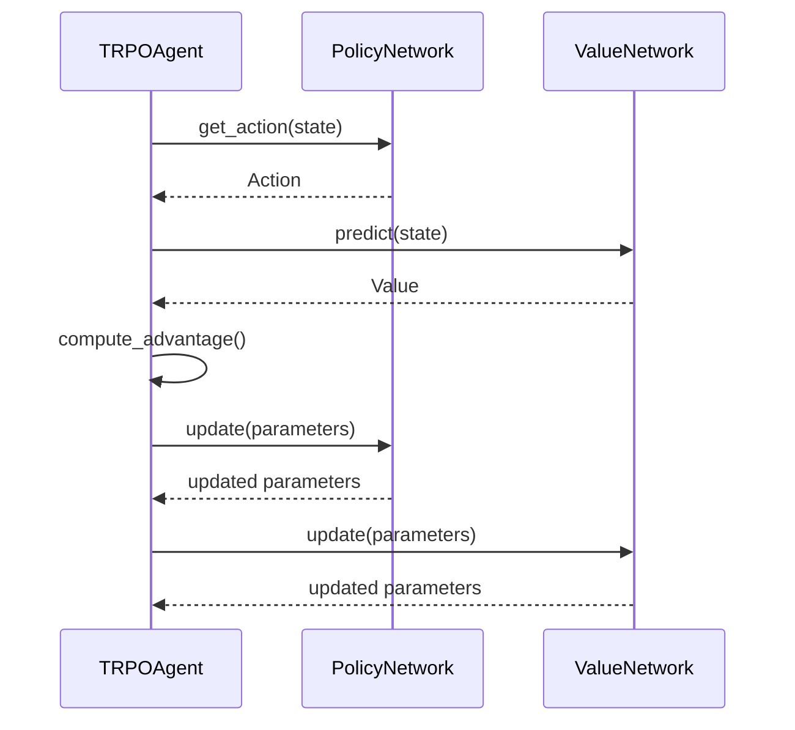

## Trust Region Policy Optimization (TRPO): Ensuring Large Updates Are Safe

### Overview
Trust Region Policy Optimization (TRPO) is an algorithm used in the context of reinforcement learning and neural networks. It focuses on improving the policy learning process by ensuring that each policy update is within a safe and reliable region, thereby enhancing the robustness and stability of the learned policies.

### Benefits
- **Stability**: Ensures that policy updates do not diverge significantly from the current policy.
- **Performance**: Achieves better performance compared to vanilla policy gradient methods.
- **Robustness**: Increases the robustness of policies by enforcing a trust region constraint.

### Trade-offs
- **Complexity**: TRPO is more complex than simpler policy gradient methods.
- **Computation**: Higher computational overhead due to the optimization constraints.
- **Implementation**: More challenging to implement and tune.

### UML Class Diagram
Below is a UML class diagram that captures the primary components involved in TRPO.



### UML Sequence Diagram
The sequence diagram below details the interaction between key components during the training process in TRPO.



### Example Implementations

#### Python
```python
import numpy as np

class PolicyNetwork:
    def __init__(self, parameters):
        self.parameters = parameters
    
    def get_action(self, state):
        # Compute action based on current policy parameters and state
        pass
    
    def update(self, parameters):
        self.parameters = parameters

class ValueNetwork:
    def __init__(self, parameters):
        self.parameters = parameters
    
    def predict(self, state):
        # Predict value based on state
        pass
    
    def update(self, parameters):
        self.parameters = parameters

class TRPOAgent:
    def __init__(self, policy, value_function, trust_region_constraint):
        self.policy = policy
        self.value_function = value_function
        self.trust_region_constraint = trust_region_constraint
    
    def train(self, episodes):
        for episode in episodes:
            state, action, reward = episode
            predicted_value = self.value_function.predict(state)
            advantage = reward - predicted_value
            
            # Update policy and value network within trust region constraint
            self.policy.update(new_parameters)
            self.value_function.update(new_parameters)

policy = PolicyNetwork(parameters=[])
value_function = ValueNetwork(parameters=[])
agent = TRPOAgent(policy, value_function, trust_region_constraint=0.01)

agent.train(episodes=[])
```

#### Java
```java
public class PolicyNetwork {
    private List<Double> parameters;

    public Action getAction(State state) {
        // Compute action based on current policy parameters and state
        return new Action();
    }

    public void update(List<Double> parameters) {
        this.parameters = parameters;
    }
}

public class ValueNetwork {
    private List<Double> parameters;

    public double predict(State state) {
        // Predict value based on state
        return 0.0;
    }

    public void update(List<Double> parameters) {
        this.parameters = parameters;
    }
}

public class TRPOAgent {
    private PolicyNetwork policy;
    private ValueNetwork valueFunction;
    private double trustRegionConstraint;

    public TRPOAgent(PolicyNetwork policy, ValueNetwork valueFunction, double trustRegionConstraint) {
        this.policy = policy;
        this.valueFunction = valueFunction;
        this.trustRegionConstraint = trustRegionConstraint;
    }

    public void train(List<Episode> episodes) {
        for (Episode episode : episodes) {
            State state = episode.getState();
            Action action = episode.getAction();
            double reward = episode.getReward();
            
            double predictedValue = valueFunction.predict(state);
            double advantage = reward - predictedValue;

            // Update policy and value network within trust region constraint
            policy.update(newParameters);
            valueFunction.update(newParameters);
        }
    }
}
```

#### Scala
```scala
class PolicyNetwork(var parameters: List[Double]) {
    def getAction(state: State): Action = {
        // Compute action based on current policy parameters and state
        new Action()
    }

    def update(parameters: List[Double]): Unit = {
        this.parameters = parameters
    }
}

class ValueNetwork(var parameters: List[Double]) {
    def predict(state: State): Double = {
        // Predict value based on state
        0.0
    }

    def update(parameters: List[Double]): Unit = {
        this.parameters = parameters
    }
}

class TRPOAgent(policy: PolicyNetwork, valueFunction: ValueNetwork, trustRegionConstraint: Double) {
    def train(episodes: List[Episode]): Unit = {
        episodes.foreach { episode =>
            val state = episode.state
            val action = episode.action
            val reward = episode.reward
            
            val predictedValue = valueFunction.predict(state)
            val advantage = reward - predictedValue

            // Update policy and value network within trust region constraint
            policy.update(newParameters)
            valueFunction.update(newParameters)
        }
    }
}
```

#### Clojure
```clojure
(defrecord PolicyNetwork [parameters]
  (get-action [this state]
    ;; Compute action based on current policy parameters and state
    ))

(defrecord ValueNetwork [parameters]
  (predict [this state]
    ;; Predict value based on state
    0.0))

(defrecord TRPOAgent [policy value-function trust-region-constraint]
  (train [this episodes]
    (doseq [episode episodes]
      (let [{:keys [state action reward]} episode
            predicted-value (predict value-function state)
            advantage (- reward predicted-value)]
        
        ;; Update policy and value network within trust region constraint
        (update policy new-parameters)
        (update value-function new-parameters)))))
```

### Use Cases
- **Robotics**: TRPO is used to optimize policies in robotic control tasks, ensuring safe and efficient movement.
- **Game Playing**: Enhances the learning of strategies in complex games.
- **Autonomous Driving**: Used for developing robust policies for self-driving cars.

### Related Design Patterns
- **Proximal Policy Optimization (PPO)**: An improvement over TRPO that simplifies the algorithm while preserving its stability benefits.
- **Deep Deterministic Policy Gradient (DDPG)**: A policy gradient method for continuous action spaces, focusing on deterministic policies.

### Resources and References
- **OpenAI Spinning Up**: [TRPO Documentation](https://spinningup.openai.com/en/latest/algorithms/trpo.html)
- **TRPO Paper**: "Trust Region Policy Optimization" by Schulman et al. [(PDF)](https://arxiv.org/pdf/1502.05477.pdf)
- **GitHub**: [TRPO Implementation](https://github.com/openai/baselines)

### Open Source Frameworks
- **OpenAI Baselines**: An implementation of TRPO and other reinforcement learning algorithms.
- **Ray RLLib**: A library for scalable reinforcement learning which includes TRPO.

### Summary
Trust Region Policy Optimization (TRPO) provides a robust and stable way to optimize policies in reinforcement learning. By ensuring policy updates remain within a "trust region", TRPO effectively mitigates the risks associated with large, unsafe updates. While it is computationally intensive and complex, its benefits in terms of performance and robustness make it a valuable method in various applications such as robotics, game playing, and autonomous driving.

By adhering to TRPO, practitioners can ensure safer and more reliable policy learning, thus paving the way for more advanced and capable AI systems.
