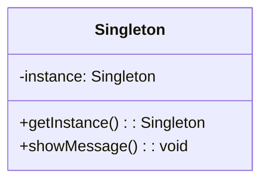

## 1.1. What Are Design Patterns?

Design patterns are a crucial concept in software engineering, particularly within the realm of object-oriented programming (OOP). They serve as reusable solutions to common problems that developers encounter when designing software. In this section, we will delve into the definition, purpose, and role of design patterns, exploring how they address software design challenges and facilitate efficient development practices.

### Definition and Purpose of Design Patterns

Design patterns are best described as general, reusable solutions to recurring problems within a given context in software design. They are not finished designs that can be directly transformed into code; rather, they are templates or blueprints that guide developers in solving design issues. By providing a proven approach to a problem, design patterns help developers avoid reinventing the wheel, thus saving time and effort.

#### Key Characteristics of Design Patterns

1. **Reusability**: Design patterns encapsulate best practices and solutions that can be applied across different projects, enhancing code reusability.
2. **Abstraction**: They abstract the underlying design problem, allowing developers to focus on higher-level design considerations.
3. **Documentation**: Patterns serve as a form of documentation that can be easily understood and communicated among team members.
4. **Flexibility**: By promoting loose coupling and high cohesion, design patterns enhance the flexibility and maintainability of software systems.

#### The Purpose of Design Patterns

The primary purpose of design patterns is to provide a common language and framework for developers to communicate complex design ideas. They help in:

- **Standardizing Solutions**: By offering a standard approach to solving design problems, patterns ensure consistency across different projects and teams.
- **Improving Communication**: Patterns enable developers to convey complex design concepts succinctly, improving collaboration and understanding.
- **Facilitating Design Decisions**: With a repertoire of patterns at their disposal, developers can make informed design decisions that align with best practices.

### How Design Patterns Solve Common Software Design Problems

Software design is fraught with challenges, from managing complexity to ensuring scalability and maintainability. Design patterns address these challenges by providing structured solutions that have been tested and refined over time.

#### Solving Complexity

One of the primary challenges in software design is managing complexity. As systems grow, they become more difficult to understand and maintain. Design patterns help manage complexity by:

- **Decomposing Systems**: Patterns like the Composite and Strategy patterns break down complex systems into manageable components.
- **Encapsulating Variability**: Patterns such as the Factory Method and Abstract Factory encapsulate variability, allowing systems to adapt to changing requirements without extensive rework.

#### Enhancing Scalability

Scalability is another critical concern in software design. Systems must be able to handle increased loads without degrading performance. Design patterns contribute to scalability by:

- **Promoting Loose Coupling**: Patterns like the Observer and Mediator reduce dependencies between components, enabling systems to scale more easily.
- **Supporting Concurrency**: Patterns such as the Singleton and Flyweight facilitate efficient resource management, supporting concurrent operations.

#### Ensuring Maintainability

Maintaining software over time is a significant challenge, especially as requirements evolve. Design patterns enhance maintainability by:

- **Encouraging Modularity**: Patterns like the Decorator and Proxy promote modular design, making it easier to modify and extend systems.
- **Facilitating Code Reuse**: By encapsulating common solutions, patterns reduce code duplication, simplifying maintenance efforts.

### The Role of Patterns in Software Development

Design patterns play a pivotal role in the software development lifecycle, influencing various stages from design to implementation and maintenance.

#### Design Phase

During the design phase, patterns guide the architectural decisions that shape the system. They help in:

- **Architectural Planning**: Patterns like the MVC (Model-View-Controller) and Layered Architecture provide frameworks for organizing system components.
- **Design Validation**: Patterns offer a way to validate design choices against established best practices, ensuring robust and scalable architectures.

#### Implementation Phase

In the implementation phase, patterns serve as blueprints for coding. They assist in:

- **Code Structuring**: Patterns provide a template for organizing code, ensuring consistency and readability.
- **Problem Solving**: When faced with specific design challenges, developers can refer to patterns for proven solutions.

#### Maintenance Phase

During maintenance, patterns facilitate the ongoing evolution of software systems. They aid in:

- **Refactoring**: Patterns offer guidance for refactoring code to improve its structure and performance.
- **Feature Addition**: By promoting modularity, patterns make it easier to add new features without disrupting existing functionality.

### Code Examples

To illustrate the concept of design patterns, let's explore a simple example using pseudocode. We'll demonstrate the Singleton pattern, which ensures that a class has only one instance and provides a global point of access to it.

#### Singleton Pattern Pseudocode

```pseudocode
class Singleton {
    private static instance = null

    // Private constructor to prevent instantiation
    private Singleton() {}

    // Method to get the single instance of the class
    public static getInstance() {
        if (instance == null) {
            instance = new Singleton()
        }
        return instance
    }

    // Example method to demonstrate functionality
    public void showMessage() {
        print("Hello, I am a Singleton!")
    }
}

// Usage
singleton = Singleton.getInstance()
singleton.showMessage()
```

In this example, the `Singleton` class has a private static variable `instance` that holds the single instance of the class. The constructor is private to prevent direct instantiation. The `getInstance` method checks if an instance already exists; if not, it creates one. This ensures that only one instance of the class is ever created.

#### Try It Yourself

Experiment with the Singleton pattern by modifying the pseudocode. Try adding a counter to track how many times the `getInstance` method is called. This will help you understand the pattern's behavior and its impact on resource management.

### Visualizing Design Patterns

To better understand the role of design patterns, let's visualize their interaction within a software system using a class diagram.



This diagram represents the Singleton pattern, highlighting the private `instance` variable and the public `getInstance` method. It illustrates how the pattern ensures a single instance of the class.

### References and Links

For further reading on design patterns, consider exploring the following resources:

- [Design Patterns: Elements of Reusable Object-Oriented Software](https://en.wikipedia.org/wiki/Design_Patterns) by Erich Gamma, Richard Helm, Ralph Johnson, and John Vlissides.
- [Refactoring: Improving the Design of Existing Code](https://martinfowler.com/books/refactoring.html) by Martin Fowler.
- [Head First Design Patterns](https://www.oreilly.com/library/view/head-first-design/0596007124/) by Eric Freeman and Elisabeth Robson.

### Knowledge Check

Let's test your understanding of design patterns with a few questions:

1. What is the primary purpose of design patterns in software development?
2. How do design patterns help manage complexity in software systems?
3. What role do design patterns play during the maintenance phase of software development?

### Embrace the Journey

Remember, mastering design patterns is a journey. As you continue to explore and apply these patterns, you'll gain a deeper understanding of their benefits and nuances. Keep experimenting, stay curious, and enjoy the process of becoming a more proficient software designer.

### Formatting and Structure

To ensure clarity and readability, we've organized this section with clear headings and subheadings. Key terms and concepts are highlighted to emphasize their importance.

### Writing Style

We've used a collaborative tone throughout this section, encouraging you to engage with the material and apply what you've learned. By avoiding jargon and using relatable examples, we've made complex concepts more accessible.

## Quiz Time!



### What is the primary purpose of design patterns in software development?

- [x] To provide reusable solutions to common design problems
- [ ] To dictate the exact code structure for all projects
- [ ] To replace the need for software architects
- [ ] To ensure all software projects look the same

> **Explanation:** Design patterns offer reusable solutions to common design problems, helping developers avoid reinventing the wheel.

### How do design patterns help manage complexity in software systems?

- [x] By decomposing systems into manageable components
- [ ] By increasing the number of classes in a system
- [ ] By enforcing strict coding standards
- [ ] By reducing the need for documentation

> **Explanation:** Design patterns decompose systems into manageable components, making them easier to understand and maintain.

### What role do design patterns play during the maintenance phase of software development?

- [x] They facilitate refactoring and feature addition
- [ ] They eliminate the need for testing
- [ ] They prevent all bugs from occurring
- [ ] They make systems immutable

> **Explanation:** Design patterns facilitate refactoring and feature addition, enhancing maintainability.

### Which of the following is a characteristic of design patterns?

- [x] Reusability
- [ ] Fixed implementation
- [ ] Language-specific
- [ ] One-time use

> **Explanation:** Design patterns are reusable, providing solutions that can be applied across different projects.

### What is the Singleton pattern used for?

- [x] Ensuring a class has only one instance
- [ ] Creating multiple instances of a class
- [ ] Encapsulating a request as an object
- [ ] Defining a family of algorithms

> **Explanation:** The Singleton pattern ensures a class has only one instance and provides a global access point to it.

### How do design patterns enhance scalability?

- [x] By promoting loose coupling
- [ ] By increasing code duplication
- [ ] By enforcing a single architecture style
- [ ] By reducing system flexibility

> **Explanation:** Design patterns promote loose coupling, enabling systems to scale more easily.

### What is a benefit of using design patterns?

- [x] Improving communication among developers
- [ ] Eliminating the need for code reviews
- [ ] Reducing the number of developers needed
- [ ] Making all code identical

> **Explanation:** Design patterns improve communication among developers by providing a common language for design concepts.

### Which phase of software development do design patterns influence?

- [x] Design, Implementation, and Maintenance
- [ ] Only Design
- [ ] Only Implementation
- [ ] Only Maintenance

> **Explanation:** Design patterns influence the Design, Implementation, and Maintenance phases of software development.

### What is a key characteristic of the Singleton pattern?

- [x] It restricts a class to a single instance
- [ ] It allows multiple instances of a class
- [ ] It defines a family of algorithms
- [ ] It encapsulates a request as an object

> **Explanation:** The Singleton pattern restricts a class to a single instance, providing a global access point.

### True or False: Design patterns are specific to a programming language.

- [ ] True
- [x] False

> **Explanation:** Design patterns are not specific to a programming language; they are general solutions applicable across different languages.


