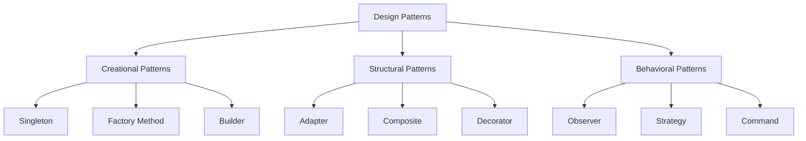

## 1.2. History of Design Patterns

Design patterns have become a cornerstone of modern software development, particularly within the realm of object-oriented programming (OOP). They provide a reusable solution to common problems faced during software design and development. In this section, we will delve into the history of design patterns, focusing on the pivotal role played by the Gang of Four (GoF) and the evolution of design patterns in OOP. We will also explore the significance of the GoF's seminal book, *"Design Patterns: Elements of Reusable Object-Oriented Software."*

### The Gang of Four (GoF) and Their Impact

The term "Gang of Four" refers to Erich Gamma, Richard Helm, Ralph Johnson, and John Vlissides, who authored the influential book *"Design Patterns: Elements of Reusable Object-Oriented Software"*. Published in 1994, this book introduced 23 foundational design patterns that have since become integral to software engineering.

#### Origins and Background

The concept of design patterns in software engineering was inspired by the work of architect Christopher Alexander, who introduced the idea of patterns in the context of building architecture. Alexander's work emphasized the importance of capturing design knowledge in a form that could be reused across different projects. The GoF adapted this concept to software design, recognizing that similar problems recur in software development and that proven solutions could be documented and reused.

#### The Impact of the GoF Book

The GoF's book had a profound impact on the field of software engineering. It provided a common vocabulary for developers to discuss design solutions and fostered a deeper understanding of object-oriented design principles. The patterns described in the book are categorized into three types:

1. **Creational Patterns**: These patterns deal with object creation mechanisms, trying to create objects in a manner suitable to the situation. Examples include the Singleton, Factory Method, and Builder patterns.

2. **Structural Patterns**: These patterns focus on the composition of classes or objects. Examples include Adapter, Composite, and Decorator patterns.

3. **Behavioral Patterns**: These patterns are concerned with algorithms and the assignment of responsibilities between objects. Examples include Observer, Strategy, and Command patterns.

The book's structured approach to documenting patterns, including sections on intent, applicability, structure, participants, collaborations, consequences, and implementation, has become a standard for pattern documentation.

### Evolution of Design Patterns in Object-Oriented Programming

Since the publication of the GoF book, the concept of design patterns has evolved significantly. Let's explore how design patterns have developed over the years and their impact on object-oriented programming.

#### Early Developments

Before the GoF, the idea of reusable software components was already being explored. In the 1980s, the concept of software reuse was gaining traction, and object-oriented programming languages like Smalltalk and C++ were becoming popular. These languages provided the necessary features, such as encapsulation, inheritance, and polymorphism, to implement design patterns effectively.

#### The Rise of Object-Oriented Programming

The 1990s saw a surge in the adoption of object-oriented programming languages, with Java and C++ leading the way. This shift towards OOP created a fertile ground for the application of design patterns. Developers began to recognize the value of using patterns to solve common design problems, leading to more robust and maintainable code.

#### Expansion Beyond the GoF

While the GoF book laid the foundation, the exploration of design patterns did not stop there. The software community began to identify new patterns and document them. Books like *"Pattern-Oriented Software Architecture"* by Buschmann et al. and *"Head First Design Patterns"* by Freeman and Freeman expanded on the GoF's work, introducing new patterns and providing practical examples.

#### Patterns in Modern Software Development

In recent years, design patterns have continued to evolve, adapting to new programming paradigms and technologies. Patterns are now applied in various domains, including web development, mobile applications, and cloud computing. The principles of design patterns have also influenced the development of frameworks and libraries, which often incorporate patterns to provide flexible and extensible solutions.

### Significance of the GoF Book *"Design Patterns: Elements of Reusable Object-Oriented Software"*

The GoF book remains a seminal work in the field of software engineering. Its significance can be attributed to several factors:

#### Establishing a Common Language

One of the most important contributions of the GoF book is the establishment of a common language for software developers. By providing a standardized vocabulary for discussing design solutions, the book has facilitated communication and collaboration among developers.

#### Promoting Best Practices

The patterns described in the GoF book promote best practices in software design. They encourage developers to think about design at a higher level of abstraction, focusing on the relationships between objects and the overall architecture of the system.

#### Enhancing Code Reusability and Maintainability

Design patterns help enhance code reusability and maintainability by providing proven solutions to common problems. By applying patterns, developers can create code that is easier to understand, modify, and extend.

#### Inspiring Further Research and Development

The GoF book has inspired further research and development in the field of design patterns. It has led to the identification of new patterns and the exploration of patterns in different programming paradigms, such as functional programming and reactive programming.

### Visualizing the Impact of the GoF

To better understand the impact of the GoF and their book, let's visualize the relationships between the different types of design patterns and their applications in software development.



**Diagram Description:** This diagram illustrates the categorization of design patterns into Creational, Structural, and Behavioral patterns, with examples of each type.

### Try It Yourself: Exploring Design Patterns

To deepen your understanding of design patterns, try implementing a simple design pattern in pseudocode. For example, let's explore the Singleton pattern, which ensures that a class has only one instance and provides a global access point to that instance.

```pseudocode
class Singleton
    private static instance

    private Singleton()
        // Private constructor to prevent instantiation

    public static getInstance()
        if instance is null
            instance = new Singleton()
        return instance
```

**Exercise:** Modify the pseudocode to include a method that demonstrates the use of the Singleton instance. Consider how you might handle thread safety in a multi-threaded environment.

### Knowledge Check

Before we conclude, let's reinforce our understanding with a few questions:

1. What inspired the concept of design patterns in software engineering?
2. How did the GoF book contribute to the field of software engineering?
3. What are the three categories of design patterns introduced by the GoF?
4. How have design patterns evolved since the publication of the GoF book?
5. Why is the establishment of a common language important in software development?

### Embrace the Journey

Remember, mastering design patterns is a journey. As you progress, you'll gain a deeper understanding of how to apply these patterns to create robust and maintainable software. Keep experimenting, stay curious, and enjoy the journey!

## Quiz Time!



### What inspired the concept of design patterns in software engineering?

- [x] The work of architect Christopher Alexander
- [ ] The rise of object-oriented programming
- [ ] The development of the GoF book
- [ ] The invention of the internet

> **Explanation:** The concept of design patterns in software engineering was inspired by the work of architect Christopher Alexander, who introduced the idea of patterns in building architecture.

### What is one of the main contributions of the GoF book?

- [x] Establishing a common language for software developers
- [ ] Introducing new programming languages
- [ ] Developing new software frameworks
- [ ] Creating the internet

> **Explanation:** The GoF book established a common language for software developers, facilitating communication and collaboration.

### Which category of design patterns focuses on object creation mechanisms?

- [x] Creational Patterns
- [ ] Structural Patterns
- [ ] Behavioral Patterns
- [ ] Functional Patterns

> **Explanation:** Creational Patterns focus on object creation mechanisms, trying to create objects in a manner suitable to the situation.

### How have design patterns evolved since the publication of the GoF book?

- [x] They have expanded to new programming paradigms and technologies
- [ ] They have remained unchanged
- [ ] They have been replaced by new concepts
- [ ] They have become obsolete

> **Explanation:** Design patterns have evolved by expanding to new programming paradigms and technologies, adapting to the changing landscape of software development.

### Why is the establishment of a common language important in software development?

- [x] It facilitates communication and collaboration among developers
- [ ] It reduces the need for documentation
- [ ] It eliminates the need for testing
- [ ] It simplifies coding

> **Explanation:** Establishing a common language is important because it facilitates communication and collaboration among developers, making it easier to discuss design solutions.

### What is the primary focus of Structural Patterns?

- [x] Composition of classes or objects
- [ ] Object creation mechanisms
- [ ] Algorithms and responsibilities
- [ ] User interface design

> **Explanation:** Structural Patterns focus on the composition of classes or objects, organizing them to form larger structures.

### Which pattern ensures a class has only one instance?

- [x] Singleton Pattern
- [ ] Factory Method Pattern
- [ ] Observer Pattern
- [ ] Strategy Pattern

> **Explanation:** The Singleton Pattern ensures that a class has only one instance and provides a global access point to that instance.

### What is a key benefit of using design patterns?

- [x] Enhancing code reusability and maintainability
- [ ] Increasing code complexity
- [ ] Reducing the need for testing
- [ ] Eliminating the need for documentation

> **Explanation:** Design patterns enhance code reusability and maintainability by providing proven solutions to common problems.

### What role did the GoF book play in the evolution of design patterns?

- [x] It laid the foundation for the exploration and documentation of design patterns
- [ ] It replaced existing programming languages
- [ ] It eliminated the need for software testing
- [ ] It introduced new hardware technologies

> **Explanation:** The GoF book laid the foundation for the exploration and documentation of design patterns, inspiring further research and development.

### True or False: The GoF book introduced the concept of software reuse.

- [ ] True
- [x] False

> **Explanation:** False. The concept of software reuse was already being explored before the GoF book, but the book provided a structured way to document and apply reusable design solutions.


