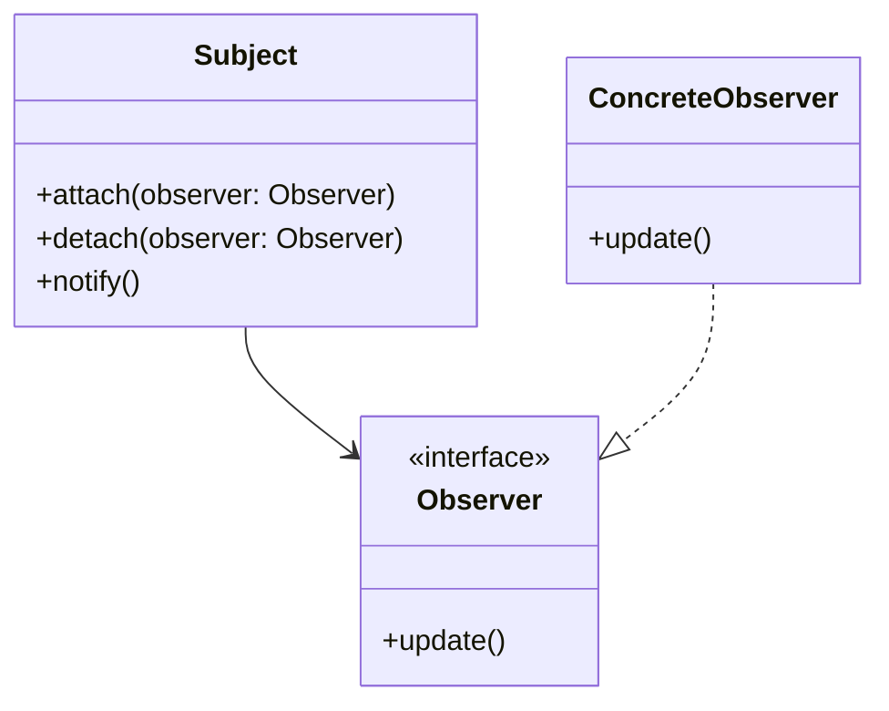
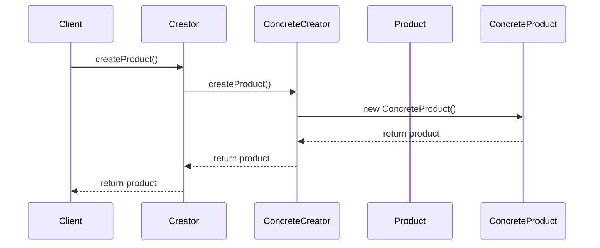

## 1.3. Importance of Design Patterns in OOP

Design patterns are a cornerstone of modern software development, particularly within the realm of Object-Oriented Programming (OOP). They provide a structured approach to solving common design problems, enabling developers to create robust, scalable, and maintainable software systems. In this section, we will delve into the importance of design patterns in OOP, focusing on their benefits in enhancing code reusability and maintainability, as well as facilitating communication among developers.

### Benefits of Using Design Patterns

Design patterns offer numerous advantages that significantly impact the quality and efficiency of software development. Let's explore these benefits in detail.

#### Enhancing Code Reusability and Maintainability

One of the primary benefits of design patterns is their ability to enhance code reusability and maintainability. By providing a proven solution to recurring design problems, design patterns allow developers to reuse established solutions, reducing the need to reinvent the wheel. This not only saves time and effort but also ensures that the code is built on a solid foundation.

**Code Reusability:**

Design patterns promote code reusability by encapsulating best practices and solutions that can be applied across different projects and domains. For example, the Singleton pattern ensures that a class has only one instance, which can be reused throughout the application. This is particularly useful in scenarios where a single point of access is required, such as managing a database connection or a configuration manager.

```pseudocode
// Singleton Pattern Pseudocode Example
class Singleton {
    private static instance: Singleton

    // Private constructor to prevent instantiation
    private Singleton() {}

    // Method to provide global access to the instance
    public static getInstance(): Singleton {
        if (instance is null) {
            instance = new Singleton()
        }
        return instance
    }
}
```

In this example, the `Singleton` class provides a single instance that can be accessed globally, promoting reusability across the application.

**Code Maintainability:**

Design patterns also enhance code maintainability by providing a clear and consistent structure for solving specific problems. This makes the code easier to understand, modify, and extend. For instance, the Observer pattern allows objects to be notified of changes in other objects, promoting a loose coupling between components.

```pseudocode
// Observer Pattern Pseudocode Example
class Subject {
    private observers: List<Observer>

    public attach(observer: Observer) {
        observers.add(observer)
    }

    public detach(observer: Observer) {
        observers.remove(observer)
    }

    public notify() {
        for each observer in observers {
            observer.update()
        }
    }
}

class ConcreteObserver implements Observer {
    public update() {
        // Handle update
    }
}
```

In this example, the `Subject` class manages a list of observers and notifies them of changes, making it easy to add or remove observers without affecting the core functionality.

#### Facilitating Communication Among Developers

Design patterns also play a crucial role in facilitating communication among developers. By providing a common vocabulary and a set of well-defined solutions, design patterns enable developers to communicate complex design concepts more effectively.

**Common Vocabulary:**

Design patterns serve as a shared language among developers, allowing them to convey ideas and solutions succinctly. For example, when a developer mentions the "Factory Method" pattern, other developers immediately understand the intent and structure of the solution, reducing the need for lengthy explanations.

```pseudocode
// Factory Method Pattern Pseudocode Example
abstract class Creator {
    // Factory method
    public abstract createProduct(): Product
}

class ConcreteCreator extends Creator {
    public createProduct(): Product {
        return new ConcreteProduct()
    }
}
```

In this example, the `Factory Method` pattern defines an interface for creating objects, allowing subclasses to decide which class to instantiate. This common understanding streamlines communication and collaboration among developers.

**Standardized Solutions:**

Design patterns provide standardized solutions to common problems, ensuring that developers are on the same page when it comes to design decisions. This reduces ambiguity and fosters a collaborative environment where developers can focus on solving the problem at hand rather than debating the best approach.

### Visualizing the Impact of Design Patterns

To further illustrate the importance of design patterns, let's visualize their impact on software development using diagrams.

#### Class Diagram of the Observer Pattern



*Figure 1: Class Diagram of the Observer Pattern*

This class diagram represents the Observer pattern, highlighting the relationship between the `Subject` and `Observer` classes. The `Subject` class maintains a list of observers and notifies them of changes, while the `Observer` interface defines the `update` method that concrete observers must implement.

#### Sequence Diagram of the Factory Method Pattern



*Figure 2: Sequence Diagram of the Factory Method Pattern*

This sequence diagram illustrates the Factory Method pattern, showing the interaction between the `Client`, `Creator`, and `ConcreteCreator` classes. The `Client` requests a product from the `Creator`, which delegates the creation to the `ConcreteCreator`, resulting in a new `ConcreteProduct`.

### Try It Yourself

To deepen your understanding of design patterns, try modifying the provided pseudocode examples. For instance, in the Singleton pattern example, experiment with implementing thread safety to ensure that the singleton instance is created safely in a multithreaded environment.

```pseudocode
// Thread-Safe Singleton Pattern Pseudocode Example
class Singleton {
    private static instance: Singleton
    private static lock: Object

    private Singleton() {}

    public static getInstance(): Singleton {
        synchronized(lock) {
            if (instance is null) {
                instance = new Singleton()
            }
        }
        return instance
    }
}
```

In this modified example, a lock is used to ensure that only one thread can create the singleton instance at a time, preventing race conditions.

### Knowledge Check

To reinforce your understanding of the importance of design patterns, consider the following questions:

1. How do design patterns enhance code reusability and maintainability?
2. What role do design patterns play in facilitating communication among developers?
3. How does the Observer pattern promote loose coupling between components?
4. Why is a common vocabulary important in software development?
5. How can design patterns provide standardized solutions to common problems?

### Embrace the Journey

Remember, mastering design patterns is an ongoing journey. As you continue to explore and apply these patterns in your projects, you'll gain a deeper understanding of their benefits and nuances. Keep experimenting, stay curious, and enjoy the process of becoming a more proficient and effective software developer.

### References and Links

For further reading on design patterns and their applications, consider exploring the following resources:

- [Design Patterns: Elements of Reusable Object-Oriented Software](https://en.wikipedia.org/wiki/Design_Patterns) by Erich Gamma, Richard Helm, Ralph Johnson, and John Vlissides
- [Refactoring: Improving the Design of Existing Code](https://martinfowler.com/books/refactoring.html) by Martin Fowler
- [Head First Design Patterns](https://www.oreilly.com/library/view/head-first-design/0596007124/) by Eric Freeman and Elisabeth Robson

### Quiz Time!



### How do design patterns enhance code reusability?

- [x] By providing proven solutions to common problems
- [ ] By making code more complex
- [ ] By reducing the need for testing
- [ ] By increasing the number of lines of code

> **Explanation:** Design patterns offer established solutions that can be reused across different projects, enhancing code reusability.

### What is the primary benefit of using the Singleton pattern?

- [x] Ensuring a class has only one instance
- [ ] Allowing multiple instances of a class
- [ ] Simplifying complex algorithms
- [ ] Improving performance

> **Explanation:** The Singleton pattern ensures that a class has only one instance, providing a global point of access.

### How does the Observer pattern facilitate communication among components?

- [x] By allowing objects to be notified of changes in other objects
- [ ] By creating a direct link between components
- [ ] By increasing the number of dependencies
- [ ] By reducing the number of classes

> **Explanation:** The Observer pattern allows objects to subscribe to changes in other objects, promoting loose coupling and effective communication.

### Why is a common vocabulary important in software development?

- [x] It enables developers to communicate complex concepts succinctly
- [ ] It increases the complexity of discussions
- [ ] It reduces the need for documentation
- [ ] It limits the number of design patterns available

> **Explanation:** A common vocabulary allows developers to convey ideas and solutions efficiently, enhancing collaboration.

### What is the role of the Factory Method pattern?

- [x] To define an interface for creating objects
- [ ] To manage object lifecycles
- [ ] To simplify data structures
- [ ] To improve performance

> **Explanation:** The Factory Method pattern defines an interface for creating objects, allowing subclasses to decide which class to instantiate.

### How do design patterns enhance code maintainability?

- [x] By providing a clear and consistent structure
- [ ] By increasing the number of classes
- [ ] By reducing the need for testing
- [ ] By making code more complex

> **Explanation:** Design patterns provide a structured approach to solving problems, making code easier to understand and maintain.

### What is the primary benefit of using the Observer pattern?

- [x] Promoting loose coupling between components
- [ ] Increasing the number of dependencies
- [ ] Simplifying complex algorithms
- [ ] Improving performance

> **Explanation:** The Observer pattern promotes loose coupling by allowing objects to be notified of changes in other objects.

### How can design patterns provide standardized solutions?

- [x] By offering well-defined solutions to common problems
- [ ] By increasing the number of lines of code
- [ ] By reducing the need for documentation
- [ ] By limiting the number of design patterns available

> **Explanation:** Design patterns provide standardized solutions that ensure developers are on the same page when it comes to design decisions.

### What is the role of the Singleton pattern in software development?

- [x] To ensure a class has only one instance
- [ ] To allow multiple instances of a class
- [ ] To simplify complex algorithms
- [ ] To improve performance

> **Explanation:** The Singleton pattern ensures that a class has only one instance, providing a global point of access.

### True or False: Design patterns increase the complexity of software development.

- [ ] True
- [x] False

> **Explanation:** Design patterns reduce complexity by providing proven solutions to common problems, making software development more efficient.




