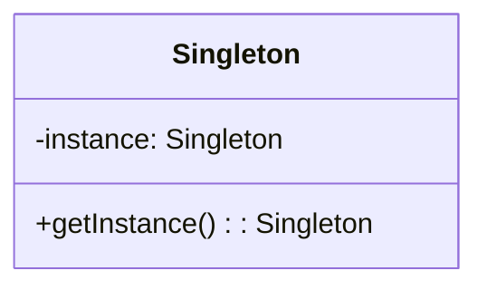

## 1.4. How to Use This Guide

Welcome to the section that will serve as your compass throughout the **Object-Oriented Design Patterns: Foundations and Implementations in Pseudocode** guide. This guide is meticulously crafted to provide expert developers like you with a comprehensive understanding of object-oriented design patterns, their applications, and their implementations using pseudocode. Let's embark on this journey by understanding how to navigate and utilize this guide effectively.

### Structure of the Guide

The guide is organized into several chapters, each focusing on different aspects of object-oriented design patterns. Here's a breakdown of how the guide is structured:

#### 1. Introduction to Object-Oriented Design Patterns

This introductory chapter sets the stage by explaining what design patterns are, their history, and their importance in object-oriented programming (OOP). It provides a foundational understanding that will be built upon in subsequent chapters.

#### 2. Fundamentals of Object-Oriented Design

In this chapter, we delve into the core principles of object-oriented design, such as SOLID principles and best practices. Understanding these fundamentals is crucial as they form the backbone of effective design pattern implementation.

#### 3. Creational Design Patterns

This chapter explores patterns that deal with object creation mechanisms, aiming to create objects in a manner suitable to the situation. Each pattern is discussed in detail, with pseudocode examples to illustrate implementation.

#### 4. Structural Design Patterns

Here, we focus on patterns that ease the design by identifying a simple way to realize relationships between entities. These patterns help ensure that if one part of a system changes, the entire system doesn't need to change.

#### 5. Behavioral Design Patterns

Behavioral patterns are concerned with algorithms and the assignment of responsibilities between objects. This chapter provides insights into how these patterns can be used to manage complex control flows.

#### 6. Applying Design Patterns in Practice

This chapter is dedicated to practical applications, helping you select the right patterns, combine them effectively, and refactor existing code to incorporate patterns.

#### 7. Best Practices and Advanced Topics

Advanced topics and best practices are covered here, including principles of good object-oriented design, design by contract, and the relationship between architectural and design patterns.

#### 8. Tools and Techniques for Modeling Patterns

This chapter introduces tools and techniques for modeling patterns, including UML and software tools for designing patterns.

#### 9. Conclusion

A recap of key concepts, future trends in design patterns, and resources for further learning are provided in this concluding chapter.

#### 10. Appendices

The appendices offer additional resources, including a glossary, reference guide, pseudocode syntax reference, exercises, and FAQs.

### Conventions and Notations Used

To ensure consistency and clarity throughout the guide, we adhere to specific conventions and notations. Understanding these will help you navigate the content more effectively.

#### Textual Conventions

- **Bold Text**: Used to highlight important terms or concepts.
- *Italic Text*: Used for emphasis or to denote new terms upon their first introduction.
- `Monospace Text`: Used for code snippets, commands, or file names.

#### Code Conventions

- Code examples are presented in **pseudocode**, a high-level representation of code that is language-agnostic. This allows you to focus on the logic and structure of the patterns without being tied to a specific programming language.
- Comments within code blocks are used to explain each step or important line, enhancing understanding.
- Key lines or sections within code examples are highlighted when discussing important points.

#### Diagram Conventions

- Diagrams are created using **Mermaid.js**, a tool compatible with Hugo rendering, to visually represent concepts, architectures, workflows, and relationships between objects.
- Each diagram is accompanied by a brief description or caption to explain what it represents.

### Understanding the Pseudocode Syntax

Pseudocode is a simplified, informal way of describing a program's logic. It uses the structural conventions of programming languages but is intended for human reading rather than machine reading. Here's a breakdown of the pseudocode syntax used in this guide:

#### Basic Syntax

- **Variables**: Declared without a specific type, using descriptive names.
  
  ```pseudocode
  variableName = value
  ```

- **Control Structures**: Use common keywords like `if`, `else`, `while`, `for`, etc.

  ```pseudocode
  if condition then
      // code block
  else
      // code block
  end if
  ```

- **Loops**: Use `for` and `while` loops to iterate over collections or repeat actions.

  ```pseudocode
  for each item in collection do
      // code block
  end for
  ```

- **Functions**: Defined with a name and parameters, followed by a code block.

  ```pseudocode
  function functionName(parameters)
      // code block
  end function
  ```

#### Naming Conventions

- Use **camelCase** for variable and function names to enhance readability.
- Use descriptive names that convey the purpose or functionality of the variable or function.

#### Comments

- Comments are used to explain the logic and flow of the pseudocode. They are prefixed with `//`.

  ```pseudocode
  // This is a comment explaining the following line of code
  ```

#### Example Pseudocode

Let's look at a simple example to illustrate these conventions:

```pseudocode
// Function to calculate the factorial of a number
function calculateFactorial(n)
    if n <= 1 then
        return 1
    else
        return n * calculateFactorial(n - 1)
    end if
end function

// Main program
number = 5
result = calculateFactorial(number)
print("The factorial of " + number + " is " + result)
```

In this example, we define a function `calculateFactorial` that calculates the factorial of a given number using recursion. The main program then calls this function and prints the result.

### Try It Yourself

We encourage you to experiment with the pseudocode examples provided in this guide. Here are some suggestions for modifications you can try:

- Modify the `calculateFactorial` function to use an iterative approach instead of recursion.
- Add error handling to check if the input number is a non-negative integer.
- Extend the program to calculate the factorial of multiple numbers in a list.

### Visualizing Concepts

To aid your understanding, we use diagrams to represent complex concepts visually. For example, when discussing the Singleton pattern, we might use a class diagram to illustrate the structure and relationships between the components.

#### Example Diagram: Singleton Pattern



**Caption**: This diagram represents the Singleton pattern, where the `Singleton` class has a private static instance and a public method to access that instance.

### References and Links

Throughout the guide, we provide hyperlinks to reputable external resources for further reading. These links serve as a supplement to the explanations provided and offer deeper dives into specific topics. For example, you might find links to the [MDN Web Docs](https://developer.mozilla.org/) or [W3Schools](https://www.w3schools.com/) for additional information on programming concepts.

### Knowledge Check

To reinforce your learning, we pose questions or small challenges within the text. Additionally, exercises or practice problems are included at the end of sections or chapters. These activities are designed to test your understanding and encourage you to apply what you've learned.

### Embrace the Journey

Remember, this guide is just the beginning of your journey into mastering object-oriented design patterns. As you progress, you'll build more complex and interactive systems. Keep experimenting, stay curious, and enjoy the journey!

### Formatting and Structure

The content is organized with clear headings and subheadings to guide you through the material. Bullet points are used to break down complex information, and important terms or concepts are highlighted using bold or italic text sparingly.

### Writing Style

We use a first-person plural (we, let's) to create a collaborative feel throughout the guide. Gender-specific pronouns are avoided, and sentences are rewritten to be inclusive. Acronyms and abbreviations are defined upon first use to ensure clarity.

By understanding the structure, conventions, and pseudocode syntax used in this guide, you are now equipped to navigate the content effectively. Let's continue our journey into the world of object-oriented design patterns with confidence and curiosity.

## Quiz Time!



### What is the primary purpose of using pseudocode in this guide?

- [x] To focus on logic and structure without being tied to a specific programming language
- [ ] To provide executable code for immediate use
- [ ] To demonstrate syntax specific to one programming language
- [ ] To replace the need for actual code implementation

> **Explanation:** Pseudocode is used to describe a program's logic in a language-agnostic way, focusing on the structure and flow rather than specific syntax.

### Which of the following is NOT a textual convention used in this guide?

- [ ] Bold Text
- [ ] Italic Text
- [x] Underlined Text
- [ ] Monospace Text

> **Explanation:** The guide uses bold, italic, and monospace text for emphasis and code representation, but not underlined text.

### What tool is used to create diagrams in this guide?

- [ ] Photoshop
- [ ] Illustrator
- [x] Mermaid.js
- [ ] Sketch

> **Explanation:** Mermaid.js is used for creating diagrams compatible with Hugo rendering, providing visual representations of concepts.

### What is the recommended naming convention for variables and functions in pseudocode?

- [ ] snake_case
- [x] camelCase
- [ ] UPPERCASE
- [ ] PascalCase

> **Explanation:** camelCase is recommended for naming variables and functions to enhance readability.

### Which chapter focuses on patterns that deal with object creation mechanisms?

- [ ] Structural Design Patterns
- [x] Creational Design Patterns
- [ ] Behavioral Design Patterns
- [ ] Fundamentals of Object-Oriented Design

> **Explanation:** Creational Design Patterns focus on object creation mechanisms, suitable for different situations.

### How are comments denoted in pseudocode?

- [ ] /* Comment */
- [ ] <!-- Comment -->
- [x] // Comment
- [ ] # Comment

> **Explanation:** Comments in pseudocode are denoted with `//`.

### What is the purpose of the "Try It Yourself" section?

- [ ] To provide executable code
- [x] To encourage experimentation with pseudocode examples
- [ ] To summarize key concepts
- [ ] To offer additional reading resources

> **Explanation:** The "Try It Yourself" section encourages readers to experiment with and modify pseudocode examples to deepen understanding.

### What does the Singleton pattern diagram represent?

- [ ] A class with multiple instances
- [x] A class with a single instance and a method to access it
- [ ] A class hierarchy with multiple subclasses
- [ ] A class with no methods

> **Explanation:** The Singleton pattern diagram represents a class with a single instance and a method to access that instance.

### Why are hyperlinks to external resources included in the guide?

- [ ] To replace the content of the guide
- [ ] To provide executable code
- [x] To supplement explanations and offer deeper dives into topics
- [ ] To promote specific websites

> **Explanation:** Hyperlinks are included to supplement explanations and provide additional resources for deeper exploration of topics.

### True or False: The guide uses gender-specific pronouns to enhance clarity.

- [ ] True
- [x] False

> **Explanation:** The guide avoids gender-specific pronouns, opting for inclusive language to enhance clarity and inclusivity.


