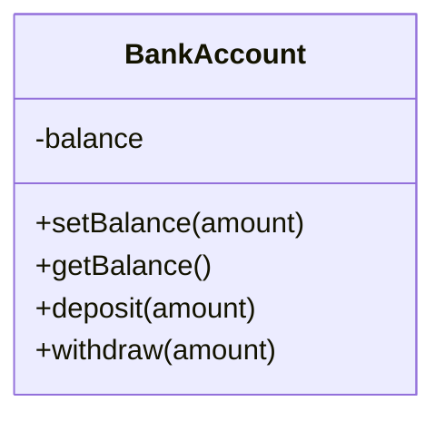
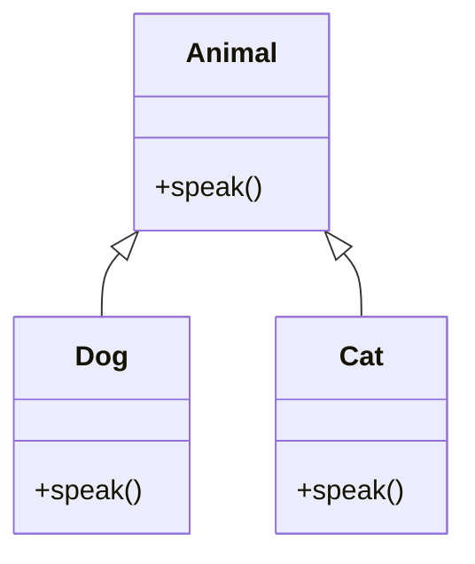
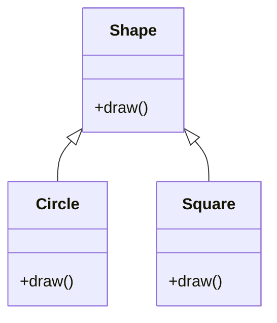
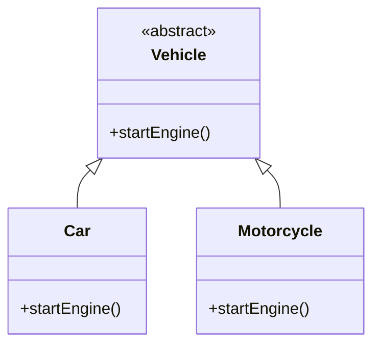

## 1.5. Overview of Object-Oriented Programming Principles

Object-Oriented Programming (OOP) is a paradigm that uses "objects" to design applications and computer programs. It leverages several principles that help developers create modular, reusable, and maintainable code. In this section, we will explore the four fundamental principles of OOP: Encapsulation, Inheritance, Polymorphism, and Abstraction. Understanding these principles is crucial for mastering design patterns and writing efficient code.

### Encapsulation

Encapsulation is the concept of bundling the data (variables) and the methods (functions) that operate on the data into a single unit or class. It restricts direct access to some of an object's components, which can prevent the accidental modification of data. This principle is often referred to as "data hiding."

#### Key Aspects of Encapsulation

- **Data Hiding:** Encapsulation allows an object to hide its internal state and require all interaction to be performed through an object's methods. This protects the integrity of the object's data.
- **Access Modifiers:** These are keywords used to set the accessibility of classes, methods, and other members. Common access modifiers include `private`, `protected`, and `public`.
- **Getter and Setter Methods:** These methods provide controlled access to the object's properties.

#### Example of Encapsulation in Pseudocode

```pseudocode
class BankAccount
    private balance

    function setBalance(amount)
        if amount >= 0
            balance = amount
        else
            print("Invalid amount")

    function getBalance()
        return balance

    function deposit(amount)
        if amount > 0
            balance = balance + amount
        else
            print("Invalid deposit amount")

    function withdraw(amount)
        if amount > 0 and amount <= balance
            balance = balance - amount
        else
            print("Invalid withdrawal amount")
```

In this pseudocode, the `BankAccount` class encapsulates the `balance` property and provides methods to interact with it. The balance can only be modified through the `deposit` and `withdraw` methods, ensuring that the balance cannot be set to an invalid state.

#### Visualizing Encapsulation



**Diagram Description:** The class diagram above shows the encapsulation of the `balance` attribute within the `BankAccount` class. The methods `setBalance`, `getBalance`, `deposit`, and `withdraw` provide controlled access to the `balance`.

#### Benefits of Encapsulation

- **Improved Security:** By hiding the internal state of objects, encapsulation prevents unauthorized access and modification.
- **Increased Flexibility:** Changes to encapsulated code can be made with minimal impact on the rest of the program.
- **Enhanced Maintainability:** Encapsulation makes it easier to manage and understand complex systems by breaking them down into smaller, more manageable components.

### Inheritance

Inheritance is a mechanism where a new class, known as a subclass, inherits the properties and behavior (methods) of another class, called the superclass. This allows for code reuse and the creation of a hierarchical class structure.

#### Key Aspects of Inheritance

- **Superclass and Subclass:** The superclass is the class being inherited from, while the subclass is the class that inherits.
- **Method Overriding:** Subclasses can override methods of the superclass to provide specific implementations.
- **`is-a` Relationship:** Inheritance represents an `is-a` relationship between the subclass and the superclass.

#### Example of Inheritance in Pseudocode

```pseudocode
class Animal
    function speak()
        print("Animal speaks")

class Dog extends Animal
    function speak()
        print("Dog barks")

class Cat extends Animal
    function speak()
        print("Cat meows")
```

In this example, `Dog` and `Cat` are subclasses of `Animal`. They inherit the `speak` method from `Animal` but override it to provide their specific behaviors.

#### Visualizing Inheritance



**Diagram Description:** The class diagram illustrates the inheritance relationship between `Animal`, `Dog`, and `Cat`. `Dog` and `Cat` inherit from `Animal` and override the `speak` method.

#### Benefits of Inheritance

- **Code Reusability:** Inheritance allows developers to reuse existing code, reducing redundancy.
- **Hierarchical Class Structure:** It helps in organizing classes in a hierarchical manner, making the codebase easier to understand.
- **Polymorphic Behavior:** Inheritance enables polymorphism, allowing objects to be treated as instances of their parent class.

### Polymorphism

Polymorphism allows objects to be treated as instances of their parent class, enabling a single function to operate on different types of objects. It is a powerful feature that enhances flexibility and integration in OOP.

#### Key Aspects of Polymorphism

- **Method Overloading:** Allows multiple methods with the same name but different parameters within the same class.
- **Method Overriding:** Allows a subclass to provide a specific implementation of a method already defined in its superclass.
- **Dynamic Binding:** The method to be invoked is determined at runtime based on the object's actual type.

#### Example of Polymorphism in Pseudocode

```pseudocode
class Shape
    function draw()
        print("Drawing a shape")

class Circle extends Shape
    function draw()
        print("Drawing a circle")

class Square extends Shape
    function draw()
        print("Drawing a square")

function render(shape)
    shape.draw()

circle = new Circle()
square = new Square()

render(circle)  // Outputs: Drawing a circle
render(square)  // Outputs: Drawing a square
```

In this example, the `render` function demonstrates polymorphism by accepting any object of type `Shape` and invoking the appropriate `draw` method based on the object's actual type.

#### Visualizing Polymorphism



**Diagram Description:** The class diagram shows the polymorphic relationship between `Shape`, `Circle`, and `Square`. The `render` function can operate on any `Shape` object, invoking the correct `draw` method.

#### Benefits of Polymorphism

- **Flexibility and Extensibility:** Polymorphism allows code to be more flexible and extensible, accommodating new classes with minimal changes.
- **Simplified Code Maintenance:** It reduces the need for complex conditional statements, simplifying code maintenance.
- **Enhanced Integration:** Polymorphism facilitates the integration of different components within a system.

### Abstraction

Abstraction is the process of hiding the complex implementation details of an object and exposing only the essential features. It allows developers to focus on high-level functionalities without worrying about low-level details.

#### Key Aspects of Abstraction

- **Abstract Classes and Interfaces:** Abstract classes and interfaces define a contract for subclasses to implement, providing a blueprint for creating objects.
- **Focus on What, Not How:** Abstraction emphasizes what an object does rather than how it does it.
- **Simplified Interaction:** By exposing only necessary details, abstraction simplifies interaction with complex systems.

#### Example of Abstraction in Pseudocode

```pseudocode
abstract class Vehicle
    abstract function startEngine()

class Car extends Vehicle
    function startEngine()
        print("Car engine started")

class Motorcycle extends Vehicle
    function startEngine()
        print("Motorcycle engine started")
```

In this example, `Vehicle` is an abstract class that defines the `startEngine` method. `Car` and `Motorcycle` are concrete classes that implement the `startEngine` method, providing specific functionality.

#### Visualizing Abstraction



**Diagram Description:** The class diagram illustrates abstraction with the abstract class `Vehicle` and its concrete subclasses `Car` and `Motorcycle`. The `startEngine` method is defined in `Vehicle` and implemented in the subclasses.

#### Benefits of Abstraction

- **Reduced Complexity:** Abstraction reduces complexity by hiding unnecessary details, allowing developers to focus on high-level design.
- **Improved Code Clarity:** By emphasizing essential features, abstraction improves code clarity and readability.
- **Enhanced Modularity:** Abstraction promotes modularity, making it easier to manage and scale large systems.

### Try It Yourself

To deepen your understanding of these principles, try modifying the pseudocode examples provided. Experiment with adding new classes, methods, or properties, and observe how the principles of encapsulation, inheritance, polymorphism, and abstraction influence the design and behavior of your code.

### Knowledge Check

- **What is encapsulation, and why is it important?**
- **How does inheritance promote code reuse?**
- **What is the difference between method overloading and method overriding?**
- **How does abstraction simplify complex systems?**

### Summary

In this section, we explored the four fundamental principles of Object-Oriented Programming: Encapsulation, Inheritance, Polymorphism, and Abstraction. These principles form the foundation of modern software design, enabling developers to create modular, reusable, and maintainable code. By mastering these principles, you will be well-equipped to understand and implement design patterns effectively.

Remember, this is just the beginning. As you progress, you'll build more complex and interactive systems. Keep experimenting, stay curious, and enjoy the journey!

## Quiz Time!



### What is encapsulation in Object-Oriented Programming?

- [x] Bundling data and methods that operate on the data into a single unit
- [ ] Creating a new class from an existing class
- [ ] Allowing objects to be treated as instances of their parent class
- [ ] Hiding complex implementation details

> **Explanation:** Encapsulation involves bundling data and methods that operate on the data into a single unit, often a class, and restricting access to some components.

### Which of the following is a benefit of inheritance?

- [x] Code Reusability
- [ ] Data Hiding
- [ ] Dynamic Binding
- [ ] Simplified Interaction

> **Explanation:** Inheritance promotes code reusability by allowing new classes to inherit properties and methods from existing classes.

### What is the main purpose of polymorphism?

- [x] Allowing a single function to operate on different types of objects
- [ ] Hiding the internal state of an object
- [ ] Defining a contract for subclasses to implement
- [ ] Creating a hierarchical class structure

> **Explanation:** Polymorphism allows a single function to operate on different types of objects, enabling flexibility and integration in OOP.

### How does abstraction benefit software development?

- [x] By reducing complexity and focusing on high-level functionalities
- [ ] By allowing multiple methods with the same name
- [ ] By enabling objects to inherit properties from other objects
- [ ] By providing a global access point to an instance

> **Explanation:** Abstraction reduces complexity by hiding unnecessary details and focusing on high-level functionalities, simplifying interaction with complex systems.

### Which principle involves method overriding?

- [x] Polymorphism
- [ ] Encapsulation
- [ ] Abstraction
- [ ] Inheritance

> **Explanation:** Polymorphism involves method overriding, where a subclass provides a specific implementation of a method already defined in its superclass.

### What is the `is-a` relationship in OOP?

- [x] A relationship where a subclass inherits from a superclass
- [ ] A relationship where an object contains another object
- [ ] A relationship where a class implements an interface
- [ ] A relationship where a method is overloaded

> **Explanation:** The `is-a` relationship represents inheritance, where a subclass inherits properties and behavior from a superclass.

### Which of the following is an example of data hiding?

- [x] Using private access modifiers to restrict access to a class's properties
- [ ] Allowing a subclass to override a method
- [ ] Defining an abstract class with abstract methods
- [ ] Creating a class diagram to visualize relationships

> **Explanation:** Data hiding involves using private access modifiers to restrict access to a class's properties, ensuring that they can only be accessed through controlled methods.

### What is the role of interfaces in abstraction?

- [x] Defining a contract for subclasses to implement
- [ ] Allowing objects to be treated as instances of their parent class
- [ ] Bundling data and methods into a single unit
- [ ] Creating a new class from an existing class

> **Explanation:** Interfaces define a contract for subclasses to implement, providing a blueprint for creating objects and promoting abstraction.

### Which principle emphasizes what an object does rather than how it does it?

- [x] Abstraction
- [ ] Encapsulation
- [ ] Inheritance
- [ ] Polymorphism

> **Explanation:** Abstraction emphasizes what an object does rather than how it does it, focusing on essential features and hiding complex implementation details.

### True or False: Polymorphism reduces the need for complex conditional statements.

- [x] True
- [ ] False

> **Explanation:** True. Polymorphism reduces the need for complex conditional statements by allowing a single function to operate on different types of objects, simplifying code maintenance.


