## 10.2. Design Pattern Reference Guide

Welcome to the Design Pattern Reference Guide, a comprehensive resource for understanding and applying object-oriented design patterns in software development. This guide is structured to provide a uniform overview of each pattern, including its intent, applicability, and key features. Whether you're a seasoned developer or just starting, this guide will serve as a valuable tool in your software design toolkit.

### Creational Patterns

#### Singleton Pattern

- **Category**: Creational
- **Intent**: Ensure a class has only one instance and provide a global access point to it.

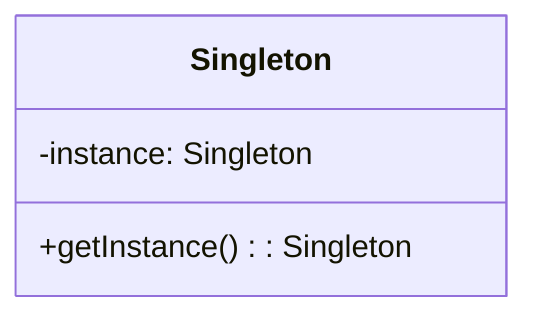
```mermaid
classDiagram
    class Singleton {
        -instance: Singleton
        +getInstance(): Singleton
    }
```

- **Key Participants**:
  - `Singleton`: The class that maintains a static reference to the sole instance and provides a static method for accessing it.

- **Applicability**: Use when exactly one instance of a class is needed to coordinate actions across the system.

- **Design Considerations**: 
  - Ensure thread safety in multi-threaded applications.
  - Consider lazy initialization to delay the creation of the instance until it is needed.

- **Differences and Similarities**: Often confused with static classes, but Singleton allows for more flexibility, such as implementing interfaces or inheritance.

#### Factory Method Pattern

- **Category**: Creational
- **Intent**: Define an interface for creating an object, but let subclasses alter the type of objects that will be created.

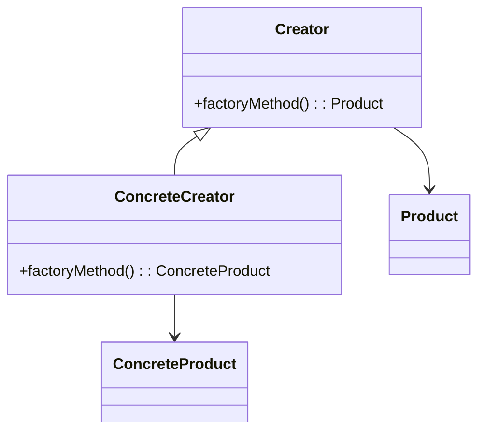
```mermaid
classDiagram
    class Creator {
        +factoryMethod(): Product
    }
    class ConcreteCreator {
        +factoryMethod(): ConcreteProduct
    }
    class Product
    class ConcreteProduct

    Creator <|-- ConcreteCreator
    Creator --> Product
    ConcreteCreator --> ConcreteProduct
```

- **Key Participants**:
  - `Creator`: Declares the factory method.
  - `ConcreteCreator`: Implements the factory method to return an instance of a `ConcreteProduct`.
  - `Product`: Defines the interface of objects the factory method creates.
  - `ConcreteProduct`: Implements the `Product` interface.

- **Applicability**: Use when a class can't anticipate the class of objects it must create.

- **Design Considerations**: 
  - Promotes loose coupling by eliminating the need to bind application-specific classes into your code.
  - Consider using parameterized factories to handle variations in product creation.

- **Differences and Similarities**: Similar to Abstract Factory, but Factory Method deals with one product, while Abstract Factory deals with families of products.

#### Abstract Factory Pattern

- **Category**: Creational
- **Intent**: Provide an interface for creating families of related or dependent objects without specifying their concrete classes.

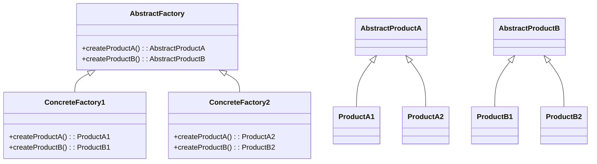
```mermaid
classDiagram
    class AbstractFactory {
        +createProductA(): AbstractProductA
        +createProductB(): AbstractProductB
    }
    class ConcreteFactory1 {
        +createProductA(): ProductA1
        +createProductB(): ProductB1
    }
    class ConcreteFactory2 {
        +createProductA(): ProductA2
        +createProductB(): ProductB2
    }
    class AbstractProductA
    class AbstractProductB
    class ProductA1
    class ProductB1
    class ProductA2
    class ProductB2

    AbstractFactory <|-- ConcreteFactory1
    AbstractFactory <|-- ConcreteFactory2
    AbstractProductA <|-- ProductA1
    AbstractProductA <|-- ProductA2
    AbstractProductB <|-- ProductB1
    AbstractProductB <|-- ProductB2
```

- **Key Participants**:
  - `AbstractFactory`: Declares an interface for operations that create abstract product objects.
  - `ConcreteFactory`: Implements the operations to create concrete product objects.
  - `AbstractProduct`: Declares an interface for a type of product object.
  - `ConcreteProduct`: Defines a product object to be created by the corresponding concrete factory.

- **Applicability**: Use when a system should be independent of how its products are created, composed, and represented.

- **Design Considerations**: 
  - Ensures consistency among products.
  - Adding new products requires extending the factory interface.

- **Differences and Similarities**: Often used with Factory Method, but Abstract Factory is more about creating families of products.

#### Builder Pattern

- **Category**: Creational
- **Intent**: Separate the construction of a complex object from its representation, allowing the same construction process to create different representations.

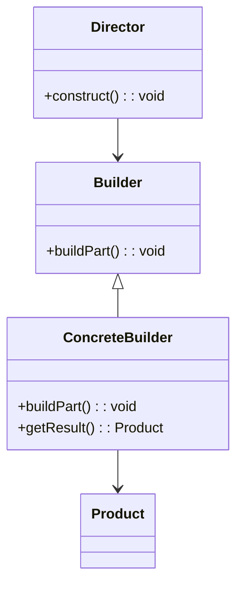
```mermaid
classDiagram
    class Builder {
        +buildPart(): void
    }
    class ConcreteBuilder {
        +buildPart(): void
        +getResult(): Product
    }
    class Director {
        +construct(): void
    }
    class Product

    Builder <|-- ConcreteBuilder
    Director --> Builder
    ConcreteBuilder --> Product
```

- **Key Participants**:
  - `Builder`: Specifies an abstract interface for creating parts of a `Product` object.
  - `ConcreteBuilder`: Constructs and assembles parts of the product by implementing the `Builder` interface.
  - `Director`: Constructs an object using the `Builder` interface.
  - `Product`: Represents the complex object under construction.

- **Applicability**: Use when the algorithm for creating a complex object should be independent of the parts that make up the object and how they're assembled.

- **Design Considerations**: 
  - Useful for creating complex objects with numerous configurations.
  - Consider using a fluent interface for better readability.

- **Differences and Similarities**: Similar to Abstract Factory, but Builder focuses on constructing a complex object step by step.

#### Prototype Pattern

- **Category**: Creational
- **Intent**: Specify the kinds of objects to create using a prototypical instance, and create new objects by copying this prototype.

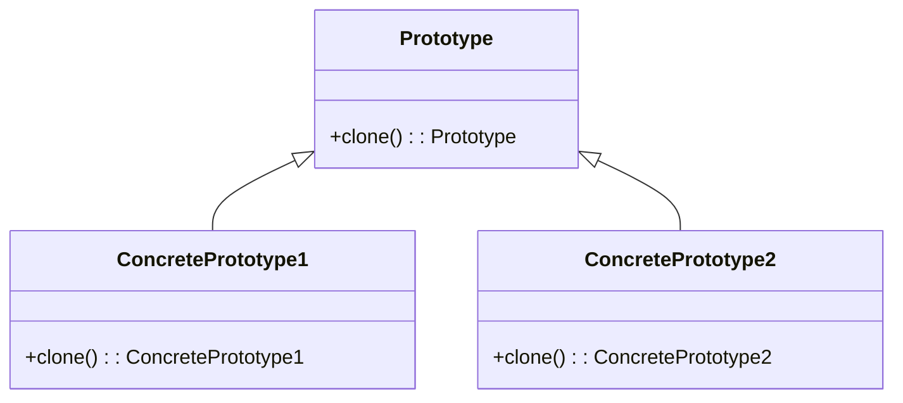
```mermaid
classDiagram
    class Prototype {
        +clone(): Prototype
    }
    class ConcretePrototype1 {
        +clone(): ConcretePrototype1
    }
    class ConcretePrototype2 {
        +clone(): ConcretePrototype2
    }

    Prototype <|-- ConcretePrototype1
    Prototype <|-- ConcretePrototype2
```

- **Key Participants**:
  - `Prototype`: Declares an interface for cloning itself.
  - `ConcretePrototype`: Implements the `Prototype` interface.

- **Applicability**: Use when a system should be independent of how its products are created, composed, and represented, and when classes to instantiate are specified at runtime.

- **Design Considerations**: 
  - Consider deep vs. shallow copy based on the complexity of the object.
  - Useful in scenarios where object creation is costly.

- **Differences and Similarities**: Often used with Factory Method, but Prototype is more about cloning existing objects.

### Structural Patterns

#### Adapter Pattern

- **Category**: Structural
- **Intent**: Convert the interface of a class into another interface clients expect. Adapter lets classes work together that couldn't otherwise because of incompatible interfaces.

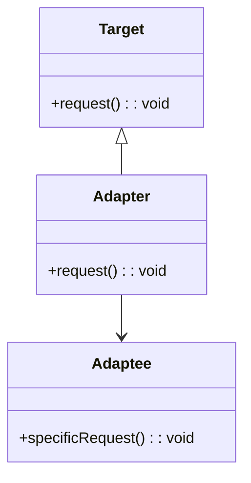
```mermaid
classDiagram
    class Target {
        +request(): void
    }
    class Adapter {
        +request(): void
    }
    class Adaptee {
        +specificRequest(): void
    }

    Target <|-- Adapter
    Adapter --> Adaptee
```

- **Key Participants**:
  - `Target`: Defines the domain-specific interface that `Client` uses.
  - `Adapter`: Adapts the interface of `Adaptee` to the `Target` interface.
  - `Adaptee`: Defines an existing interface that needs adapting.

- **Applicability**: Use when you want to use an existing class, and its interface does not match the one you need.

- **Design Considerations**: 
  - Class Adapter vs. Object Adapter: Class adapter uses multiple inheritance to adapt one interface to another, while object adapter uses composition.
  - Useful for integrating new components into existing systems.

- **Differences and Similarities**: Similar to Bridge, but Adapter is about making two incompatible interfaces work together.

#### Bridge Pattern

- **Category**: Structural
- **Intent**: Decouple an abstraction from its implementation so that the two can vary independently.

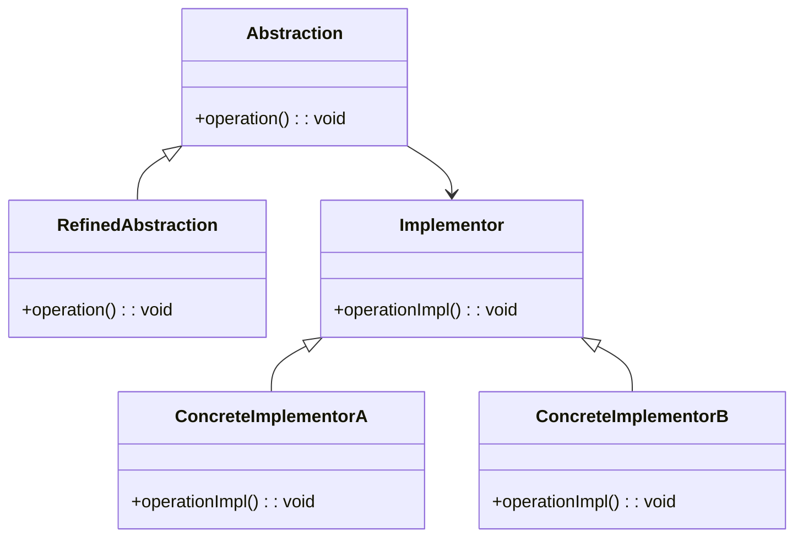
```mermaid
classDiagram
    class Abstraction {
        +operation(): void
    }
    class RefinedAbstraction {
        +operation(): void
    }
    class Implementor {
        +operationImpl(): void
    }
    class ConcreteImplementorA {
        +operationImpl(): void
    }
    class ConcreteImplementorB {
        +operationImpl(): void
    }

    Abstraction <|-- RefinedAbstraction
    Abstraction --> Implementor
    Implementor <|-- ConcreteImplementorA
    Implementor <|-- ConcreteImplementorB
```

- **Key Participants**:
  - `Abstraction`: Defines the abstraction's interface.
  - `RefinedAbstraction`: Extends the interface defined by `Abstraction`.
  - `Implementor`: Defines the interface for implementation classes.
  - `ConcreteImplementor`: Implements the `Implementor` interface.

- **Applicability**: Use when you want to avoid a permanent binding between an abstraction and its implementation.

- **Design Considerations**: 
  - Helps in managing complexity by separating abstraction and implementation.
  - Useful in scenarios where you need to switch implementations at runtime.

- **Differences and Similarities**: Often confused with Adapter, but Bridge is about separating abstraction from implementation.

#### Composite Pattern

- **Category**: Structural
- **Intent**: Compose objects into tree structures to represent part-whole hierarchies. Composite lets clients treat individual objects and compositions of objects uniformly.

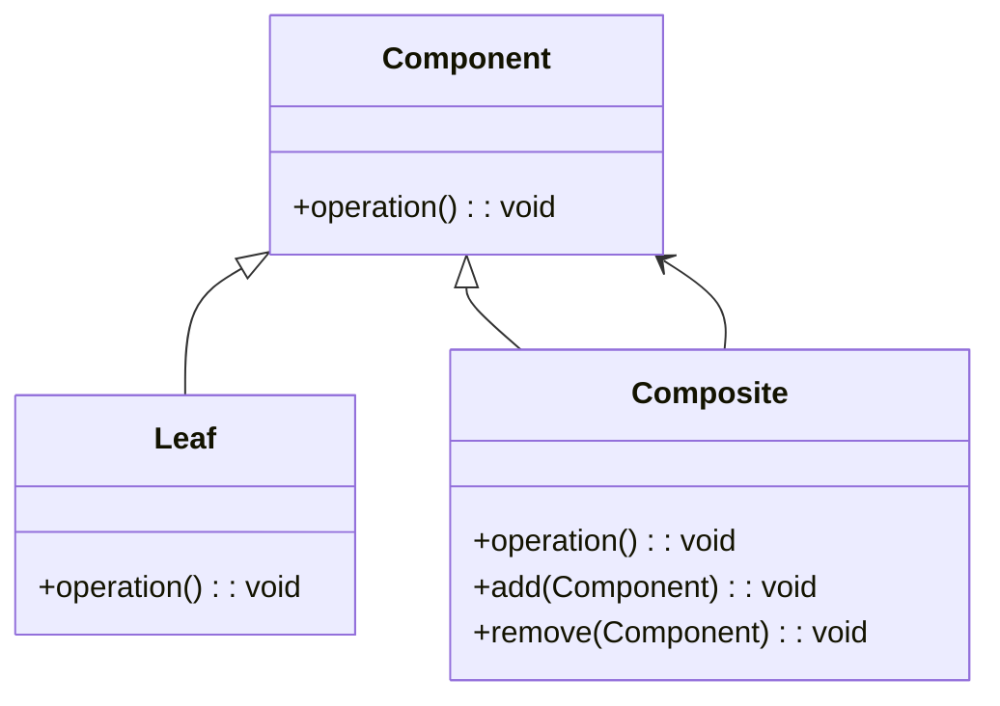
```mermaid
classDiagram
    class Component {
        +operation(): void
    }
    class Leaf {
        +operation(): void
    }
    class Composite {
        +operation(): void
        +add(Component): void
        +remove(Component): void
    }

    Component <|-- Leaf
    Component <|-- Composite
    Composite --> Component
```

- **Key Participants**:
  - `Component`: Declares the interface for objects in the composition.
  - `Leaf`: Represents leaf objects in the composition.
  - `Composite`: Defines behavior for components having children.

- **Applicability**: Use when you want to represent part-whole hierarchies of objects.

- **Design Considerations**: 
  - Simplifies client code by treating individual objects and compositions uniformly.
  - Consider how to manage child components efficiently.

- **Differences and Similarities**: Similar to Decorator, but Composite is about part-whole hierarchies.

#### Decorator Pattern

- **Category**: Structural
- **Intent**: Attach additional responsibilities to an object dynamically. Decorators provide a flexible alternative to subclassing for extending functionality.

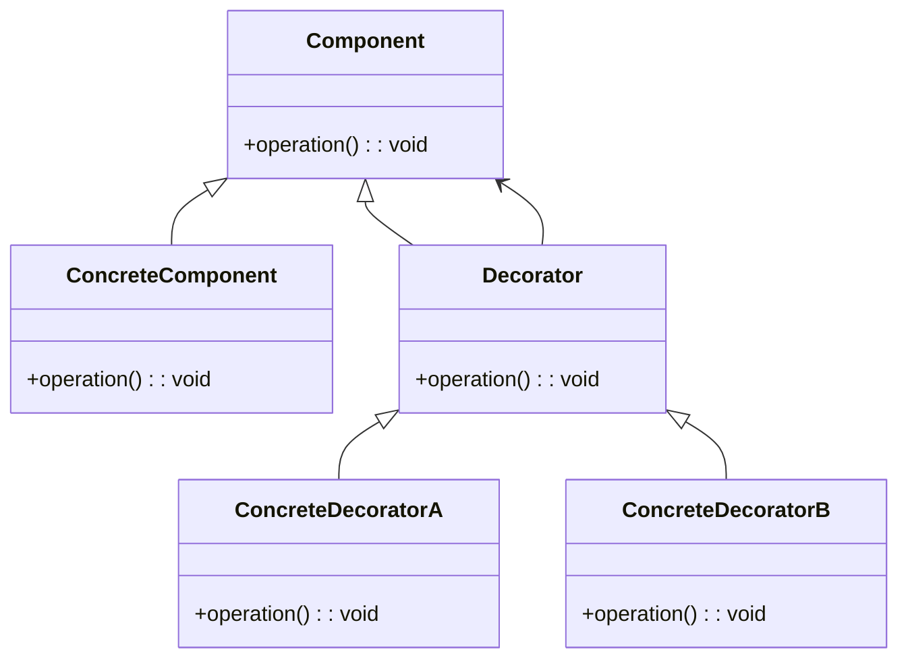
```mermaid
classDiagram
    class Component {
        +operation(): void
    }
    class ConcreteComponent {
        +operation(): void
    }
    class Decorator {
        +operation(): void
    }
    class ConcreteDecoratorA {
        +operation(): void
    }
    class ConcreteDecoratorB {
        +operation(): void
    }

    Component <|-- ConcreteComponent
    Component <|-- Decorator
    Decorator <|-- ConcreteDecoratorA
    Decorator <|-- ConcreteDecoratorB
    Decorator --> Component
```

- **Key Participants**:
  - `Component`: Defines the interface for objects that can have responsibilities added to them dynamically.
  - `ConcreteComponent`: Defines an object to which additional responsibilities can be attached.
  - `Decorator`: Maintains a reference to a `Component` object and defines an interface that conforms to `Component`'s interface.
  - `ConcreteDecorator`: Adds responsibilities to the component.

- **Applicability**: Use to add responsibilities to individual objects dynamically and transparently, without affecting other objects.

- **Design Considerations**: 
  - Useful for adhering to the open/closed principle.
  - Consider how to manage multiple decorators.

- **Differences and Similarities**: Often confused with Composite, but Decorator is about adding responsibilities dynamically.

#### Facade Pattern

- **Category**: Structural
- **Intent**: Provide a unified interface to a set of interfaces in a subsystem. Facade defines a higher-level interface that makes the subsystem easier to use.

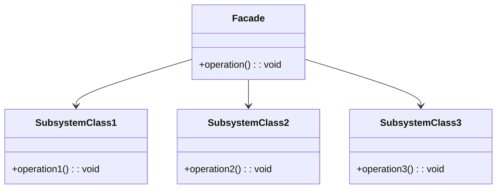
```mermaid
classDiagram
    class Facade {
        +operation(): void
    }
    class SubsystemClass1 {
        +operation1(): void
    }
    class SubsystemClass2 {
        +operation2(): void
    }
    class SubsystemClass3 {
        +operation3(): void
    }

    Facade --> SubsystemClass1
    Facade --> SubsystemClass2
    Facade --> SubsystemClass3
```

- **Key Participants**:
  - `Facade`: Knows which subsystem classes are responsible for a request.
  - `Subsystem classes`: Implement subsystem functionality.

- **Applicability**: Use when you want to provide a simple interface to a complex subsystem.

- **Design Considerations**: 
  - Simplifies client interactions with the subsystem.
  - Useful for reducing dependencies between clients and subsystems.

- **Differences and Similarities**: Often used with Adapter, but Facade is about simplifying interactions with a subsystem.

#### Flyweight Pattern

- **Category**: Structural
- **Intent**: Use sharing to support large numbers of fine-grained objects efficiently.

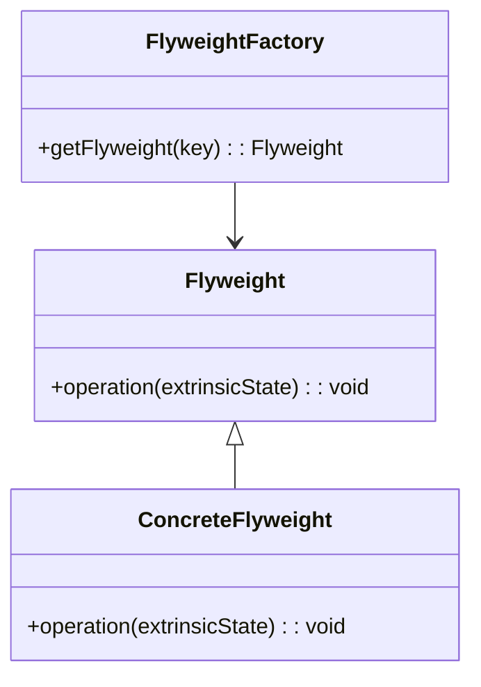
```mermaid
classDiagram
    class Flyweight {
        +operation(extrinsicState): void
    }
    class ConcreteFlyweight {
        +operation(extrinsicState): void
    }
    class FlyweightFactory {
        +getFlyweight(key): Flyweight
    }

    Flyweight <|-- ConcreteFlyweight
    FlyweightFactory --> Flyweight
```

- **Key Participants**:
  - `Flyweight`: Declares an interface through which flyweights can receive and act on extrinsic state.
  - `ConcreteFlyweight`: Implements the `Flyweight` interface and adds storage for intrinsic state.
  - `FlyweightFactory`: Creates and manages flyweight objects.

- **Applicability**: Use when many objects must be created and managed efficiently.

- **Design Considerations**: 
  - Distinguish between intrinsic and extrinsic state.
  - Useful for optimizing memory usage.

- **Differences and Similarities**: Similar to Proxy, but Flyweight is about sharing objects efficiently.

#### Proxy Pattern

- **Category**: Structural
- **Intent**: Provide a surrogate or placeholder for another object to control access to it.

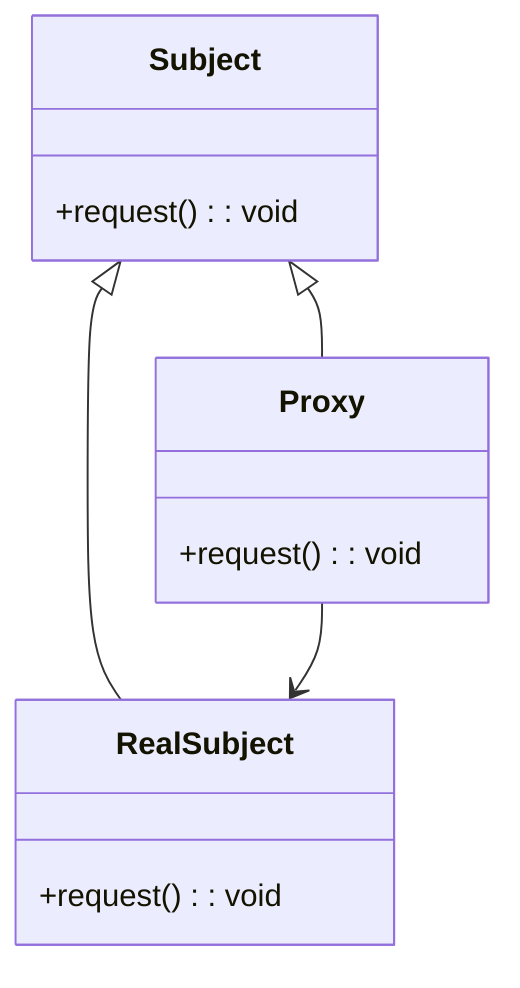
```mermaid
classDiagram
    class Subject {
        +request(): void
    }
    class RealSubject {
        +request(): void
    }
    class Proxy {
        +request(): void
    }

    Subject <|-- RealSubject
    Subject <|-- Proxy
    Proxy --> RealSubject
```

- **Key Participants**:
  - `Subject`: Defines the common interface for `RealSubject` and `Proxy`.
  - `RealSubject`: Defines the real object that the proxy represents.
  - `Proxy`: Maintains a reference that lets the proxy access the real subject.

- **Applicability**: Use when you need a more versatile or sophisticated reference to an object.

- **Design Considerations**: 
  - Useful for controlling access to an object.
  - Consider the overhead of using a proxy.

- **Differences and Similarities**: Similar to Flyweight, but Proxy is about controlling access.

### Behavioral Patterns

#### Chain of Responsibility Pattern

- **Category**: Behavioral
- **Intent**: Avoid coupling the sender of a request to its receiver by giving more than one object a chance to handle the request.

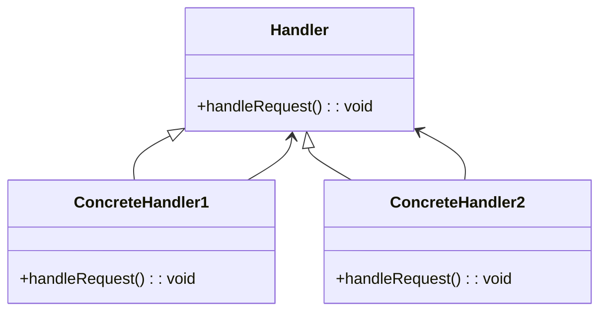
```mermaid
classDiagram
    class Handler {
        +handleRequest(): void
    }
    class ConcreteHandler1 {
        +handleRequest(): void
    }
    class ConcreteHandler2 {
        +handleRequest(): void
    }

    Handler <|-- ConcreteHandler1
    Handler <|-- ConcreteHandler2
    ConcreteHandler1 --> Handler
    ConcreteHandler2 --> Handler
```

- **Key Participants**:
  - `Handler`: Defines an interface for handling requests.
  - `ConcreteHandler`: Handles requests it is responsible for.

- **Applicability**: Use when more than one object may handle a request, and the handler isn't known a priori.

- **Design Considerations**: 
  - Promotes loose coupling.
  - Consider how to terminate the chain.

- **Differences and Similarities**: Similar to Command, but Chain of Responsibility is about passing requests along a chain.

#### Command Pattern

- **Category**: Behavioral
- **Intent**: Encapsulate a request as an object, thereby allowing for parameterization of clients with queues, requests, and operations.

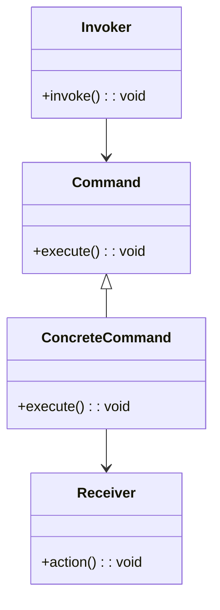
```mermaid
classDiagram
    class Command {
        +execute(): void
    }
    class ConcreteCommand {
        +execute(): void
    }
    class Invoker {
        +invoke(): void
    }
    class Receiver {
        +action(): void
    }

    Command <|-- ConcreteCommand
    Invoker --> Command
    ConcreteCommand --> Receiver
```

- **Key Participants**:
  - `Command`: Declares an interface for executing an operation.
  - `ConcreteCommand`: Defines a binding between a `Receiver` object and an action.
  - `Invoker`: Asks the command to carry out the request.
  - `Receiver`: Knows how to perform the operations associated with carrying out a request.

- **Applicability**: Use when you want to parameterize objects with operations.

- **Design Considerations**: 
  - Supports undo/redo operations.
  - Consider how to manage command histories.

- **Differences and Similarities**: Similar to Strategy, but Command is about encapsulating requests.

#### Interpreter Pattern

- **Category**: Behavioral
- **Intent**: Given a language, define a representation for its grammar along with an interpreter that uses the representation to interpret sentences in the language.

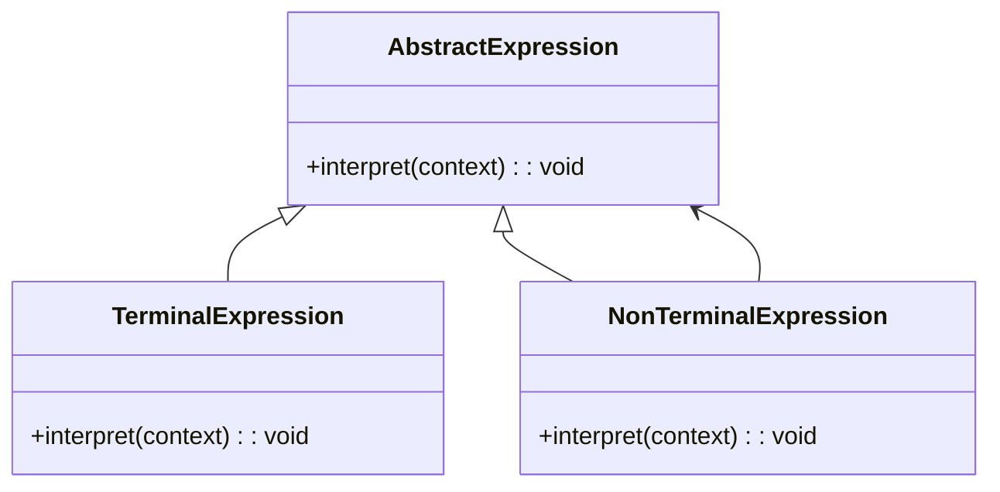
```mermaid
classDiagram
    class AbstractExpression {
        +interpret(context): void
    }
    class TerminalExpression {
        +interpret(context): void
    }
    class NonTerminalExpression {
        +interpret(context): void
    }

    AbstractExpression <|-- TerminalExpression
    AbstractExpression <|-- NonTerminalExpression
    NonTerminalExpression --> AbstractExpression
```

- **Key Participants**:
  - `AbstractExpression`: Declares an abstract `interpret` operation.
  - `TerminalExpression`: Implements an `interpret` operation associated with terminal symbols.
  - `NonTerminalExpression`: Implements an `interpret` operation for non-terminal symbols.

- **Applicability**: Use when you have a language to interpret, and you can represent statements in the language as abstract syntax trees.

- **Design Considerations**: 
  - Useful for designing grammars for simple languages.
  - Consider parsing techniques.

- **Differences and Similarities**: Similar to Visitor, but Interpreter is about interpreting languages.

#### Iterator Pattern

- **Category**: Behavioral
- **Intent**: Provide a way to access the elements of an aggregate object sequentially without exposing its underlying representation.

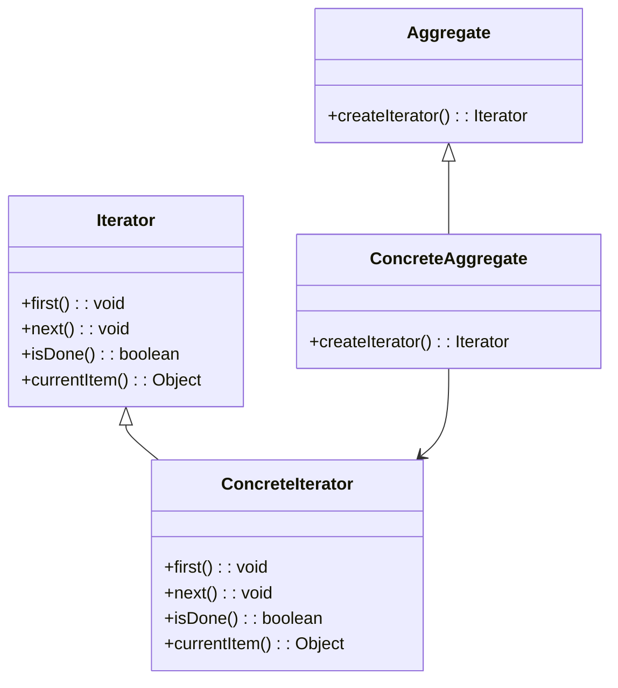
```mermaid
classDiagram
    class Iterator {
        +first(): void
        +next(): void
        +isDone(): boolean
        +currentItem(): Object
    }
    class ConcreteIterator {
        +first(): void
        +next(): void
        +isDone(): boolean
        +currentItem(): Object
    }
    class Aggregate {
        +createIterator(): Iterator
    }
    class ConcreteAggregate {
        +createIterator(): Iterator
    }

    Iterator <|-- ConcreteIterator
    Aggregate <|-- ConcreteAggregate
    ConcreteAggregate --> ConcreteIterator
```

- **Key Participants**:
  - `Iterator`: Defines an interface for accessing and traversing elements.
  - `ConcreteIterator`: Implements the `Iterator` interface.
  - `Aggregate`: Defines an interface for creating an `Iterator` object.
  - `ConcreteAggregate`: Implements the `Aggregate` interface.

- **Applicability**: Use to access an aggregate object's contents without exposing its internal representation.

- **Design Considerations**: 
  - Supports polymorphic iteration.
  - Consider external vs. internal iterators.

- **Differences and Similarities**: Similar to Composite, but Iterator is about traversing elements.

#### Mediator Pattern

- **Category**: Behavioral
- **Intent**: Define an object that encapsulates how a set of objects interact.

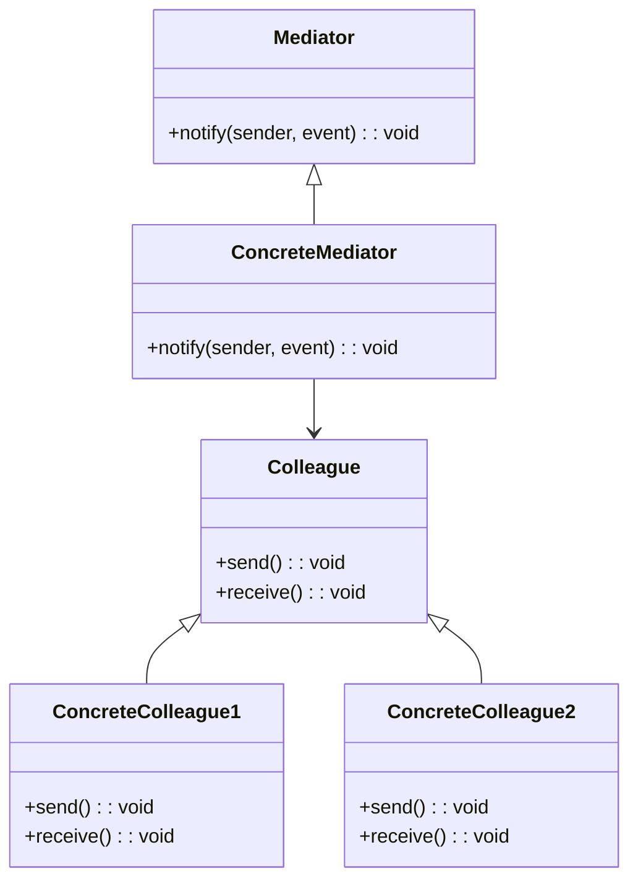
```mermaid
classDiagram
    class Mediator {
        +notify(sender, event): void
    }
    class ConcreteMediator {
        +notify(sender, event): void
    }
    class Colleague {
        +send(): void
        +receive(): void
    }
    class ConcreteColleague1 {
        +send(): void
        +receive(): void
    }
    class ConcreteColleague2 {
        +send(): void
        +receive(): void
    }

    Mediator <|-- ConcreteMediator
    Colleague <|-- ConcreteColleague1
    Colleague <|-- ConcreteColleague2
    ConcreteMediator --> Colleague
```

- **Key Participants**:
  - `Mediator`: Defines an interface for communicating with `Colleague` objects.
  - `ConcreteMediator`: Implements cooperative behavior by coordinating `Colleague` objects.
  - `Colleague`: Each `Colleague` communicates with its `Mediator` whenever it would have otherwise communicated with another `Colleague`.

- **Applicability**: Use to reduce coupling between components.

- **Design Considerations**: 
  - Useful for managing complexity.
  - Consider how to manage interactions between colleagues.

- **Differences and Similarities**: Similar to Observer, but Mediator is about coordinating interactions.

#### Memento Pattern

- **Category**: Behavioral
- **Intent**: Without violating encapsulation, capture and externalize an object's internal state so that the object can be restored to this state later.

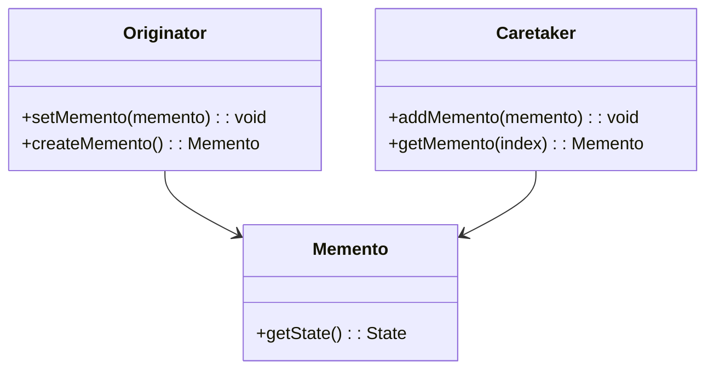
```mermaid
classDiagram
    class Memento {
        +getState(): State
    }
    class Originator {
        +setMemento(memento): void
        +createMemento(): Memento
    }
    class Caretaker {
        +addMemento(memento): void
        +getMemento(index): Memento
    }

    Originator --> Memento
    Caretaker --> Memento
```

- **Key Participants**:
  - `Memento`: Stores internal state of the `Originator` object.
  - `Originator`: Creates a `Memento` containing a snapshot of its current internal state.
  - `Caretaker`: Responsible for the memento's safekeeping.

- **Applicability**: Use when you need to save and restore the state of an object.

- **Design Considerations**: 
  - Useful for saving and restoring state.
  - Consider how to handle state changes.

- **Differences and Similarities**: Similar to Command, but Memento is about saving state.

#### Observer Pattern

- **Category**: Behavioral
- **Intent**: Define a one-to-many dependency between objects so that when one object changes state, all its dependents are notified and updated automatically.

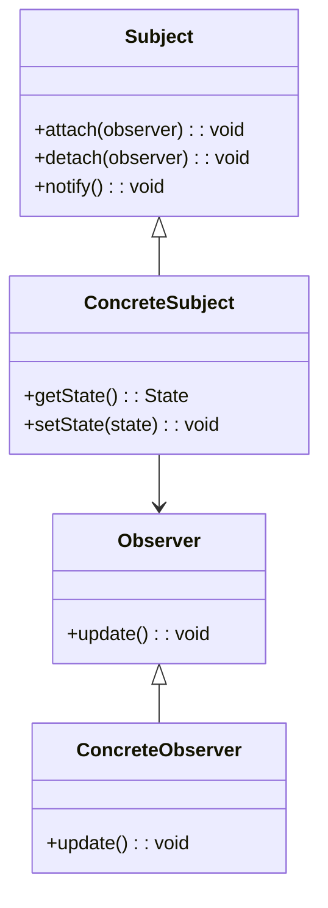
```mermaid
classDiagram
    class Subject {
        +attach(observer): void
        +detach(observer): void
        +notify(): void
    }
    class Observer {
        +update(): void
    }
    class ConcreteSubject {
        +getState(): State
        +setState(state): void
    }
    class ConcreteObserver {
        +update(): void
    }

    Subject <|-- ConcreteSubject
    Observer <|-- ConcreteObserver
    ConcreteSubject --> Observer
```

- **Key Participants**:
  - `Subject`: Knows its observers and provides an interface for attaching and detaching `Observer` objects.
  - `Observer`: Defines an updating interface for objects that should be notified of changes in a `Subject`.
  - `ConcreteSubject`: Stores state of interest to `ConcreteObserver` objects.
  - `ConcreteObserver`: Maintains a reference to a `ConcreteSubject` object.

- **Applicability**: Use when a change to one object requires changing others, and you don't know how many objects need to be changed.

- **Design Considerations**: 
  - Promotes loose coupling.
  - Consider push vs. pull models.

- **Differences and Similarities**: Similar to Mediator, but Observer is about notifying dependents.

#### State Pattern

- **Category**: Behavioral
- **Intent**: Allow an object to alter its behavior when its internal state changes. The object will appear to change its class.

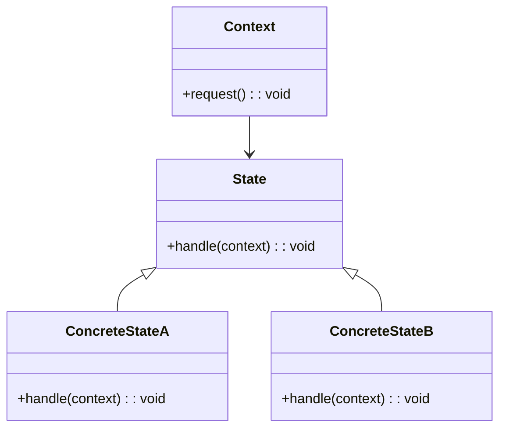
```mermaid
classDiagram
    class Context {
        +request(): void
    }
    class State {
        +handle(context): void
    }
    class ConcreteStateA {
        +handle(context): void
    }
    class ConcreteStateB {
        +handle(context): void
    }

    Context --> State
    State <|-- ConcreteStateA
    State <|-- ConcreteStateB
```

- **Key Participants**:
  - `Context`: Maintains an instance of a `ConcreteState` subclass that defines the current state.
  - `State`: Defines an interface for encapsulating the behavior associated with a particular state of the `Context`.
  - `ConcreteState`: Each subclass implements a behavior associated with a state of the `Context`.

- **Applicability**: Use when an object's behavior depends on its state, and it must change its behavior at runtime.

- **Design Considerations**: 
  - Simplifies complex conditionals.
  - Consider how to manage state transitions.

- **Differences and Similarities**: Similar to Strategy, but State is about changing behavior based on state.

#### Strategy Pattern

- **Category**: Behavioral
- **Intent**: Define a family of algorithms, encapsulate each one, and make them interchangeable. Strategy lets the algorithm vary independently from clients that use it.

```mermaid
classDiagram
    class Context {
        +setStrategy(strategy): void
        +executeStrategy(): void
    }
    class Strategy {
        +execute(): void
    }
    class ConcreteStrategyA {
        +execute(): void
    }
    class ConcreteStrategyB {
        +execute(): void
    }

    Context --> Strategy
    Strategy <|-- ConcreteStrategyA
    Strategy <|-- ConcreteStrategyB
```

- **Key Participants**:
  - `Context`: Maintains a reference to a `Strategy` object.
  - `Strategy`: Declares an interface common to all supported algorithms.
  - `ConcreteStrategy`: Implements the algorithm using the `Strategy` interface.

- **Applicability**: Use when you want to define a class that has one behavior that is similar to other behaviors in a list.

- **Design Considerations**: 
  - Enhances flexibility.
  - Consider how to select strategies.

- **Differences and Similarities**: Similar to State, but Strategy is about selecting algorithms.

#### Template Method Pattern

- **Category**: Behavioral
- **Intent**: Define the skeleton of an algorithm in an operation, deferring some steps to subclasses. Template Method lets subclasses redefine certain steps of an algorithm without changing the algorithm's structure.

```mermaid
classDiagram
    class AbstractClass {
        +templateMethod(): void
        +primitiveOperation1(): void
        +primitiveOperation2(): void
    }
    class ConcreteClass {
        +primitiveOperation1(): void
        +primitiveOperation2(): void
    }

    AbstractClass <|-- ConcreteClass
```

- **Key Participants**:
  - `AbstractClass`: Defines abstract primitive operations that concrete subclasses define to implement steps of an algorithm.
  - `ConcreteClass`: Implements the primitive operations to carry out subclass-specific steps of the algorithm.

- **Applicability**: Use to implement the invariant parts of an algorithm once and leave it up to subclasses to implement the behavior that can vary.

- **Design Considerations**: 
  - Promotes code reuse.
  - Consider using hook methods.

- **Differences and Similarities**: Similar to Strategy, but Template Method is about defining a skeleton of an algorithm.

#### Visitor Pattern

- **Category**: Behavioral
- **Intent**: Represent an operation to be performed on the elements of an object structure. Visitor lets you define a new operation without changing the classes of the elements on which it operates.

```mermaid
classDiagram
    class Visitor {
        +visitConcreteElementA(element): void
        +visitConcreteElementB(element): void
    }
    class ConcreteVisitor1 {
        +visitConcreteElementA(element): void
        +visitConcreteElementB(element): void
    }
    class ConcreteVisitor2 {
        +visitConcreteElementA(element): void
        +visitConcreteElementB(element): void
    }
    class Element {
        +accept(visitor): void
    }
    class ConcreteElementA {
        +accept(visitor): void
    }
    class ConcreteElementB {
        +accept(visitor): void
    }

    Visitor <|-- ConcreteVisitor1
    Visitor <|-- ConcreteVisitor2
    Element <|-- ConcreteElementA
    Element <|-- ConcreteElementB
    ConcreteElementA --> Visitor
    ConcreteElementB --> Visitor
```

- **Key Participants**:
  - `Visitor`: Declares a visit operation for each class of `ConcreteElement` in the object structure.
  - `ConcreteVisitor`: Implements each operation declared by `Visitor`.
  - `Element`: Defines an `accept` operation that takes a visitor as an argument.
  - `ConcreteElement`: Implements an `accept` operation that takes a visitor as an argument.

- **Applicability**: Use when you want to perform an operation on the elements of an object structure.

- **Design Considerations**: 
  - Useful for adding new operations easily.
  - Consider using double dispatch.

- **Differences and Similarities**: Similar to Interpreter, but Visitor is about performing operations on elements.

## Quiz Time!



### Which pattern ensures a class has only one instance and provides a global access point to it?

- [x] Singleton Pattern
- [ ] Factory Method Pattern
- [ ] Abstract Factory Pattern
- [ ] Builder Pattern

> **Explanation:** The Singleton Pattern is designed to ensure a class has only one instance and provides a global access point to it.

### Which pattern is used to decouple an abstraction from its implementation?

- [ ] Adapter Pattern
- [x] Bridge Pattern
- [ ] Composite Pattern
- [ ] Decorator Pattern

> **Explanation:** The Bridge Pattern is used to decouple an abstraction from its implementation so that the two can vary independently.

### What is the primary intent of the Observer Pattern?

- [ ] To define a family of algorithms
- [x] To define a one-to-many dependency between objects
- [ ] To encapsulate a request as an object
- [ ] To provide a unified interface to a set of interfaces

> **Explanation:** The Observer Pattern defines a one-to-many dependency between objects so that when one object changes state, all its dependents are notified and updated automatically.

### Which pattern is useful for creating complex objects with numerous configurations?

- [ ] Prototype Pattern
- [ ] Singleton Pattern
- [x] Builder Pattern
- [ ] Factory Method Pattern

> **Explanation:** The Builder Pattern is useful for creating complex objects with numerous configurations by separating the construction of a complex object from its representation.

### Which pattern provides a surrogate or placeholder for another object to control access to it?

- [ ] Flyweight Pattern
- [ ] Adapter Pattern
- [x] Proxy Pattern
- [ ] Facade Pattern

> **Explanation:** The Proxy Pattern provides a surrogate or placeholder for another object to control access to it.

### Which pattern is about making two incompatible interfaces work together?

- [x] Adapter Pattern
- [ ] Bridge Pattern
- [ ] Composite Pattern
- [ ] Decorator Pattern

> **Explanation:** The Adapter Pattern is about making two incompatible interfaces work together by converting the interface of a class into another interface clients expect.

### Which pattern is often used with Factory Method but focuses on cloning existing objects?

- [x] Prototype Pattern
- [ ] Abstract Factory Pattern
- [ ] Builder Pattern
- [ ] Singleton Pattern

> **Explanation:** The Prototype Pattern is often used with Factory Method but focuses on creating new objects by copying an existing object.

### Which pattern is about defining a skeleton of an algorithm?

- [ ] Strategy Pattern
- [ ] State Pattern
- [ ] Visitor Pattern
- [x] Template Method Pattern

> **Explanation:** The Template Method Pattern is about defining the skeleton of an algorithm in an operation, deferring some steps to subclasses.

### Which pattern is used when you want to perform an operation on the elements of an object structure?

- [ ] Interpreter Pattern
- [ ] Iterator Pattern
- [ ] Command Pattern
- [x] Visitor Pattern

> **Explanation:** The Visitor Pattern is used when you want to perform an operation on the elements of an object structure, allowing you to define a new operation without changing the classes of the elements.

### True or False: The Facade Pattern is used to simplify client interactions with a complex subsystem.

- [x] True
- [ ] False

> **Explanation:** True. The Facade Pattern provides a unified interface to a set of interfaces in a subsystem, simplifying client interactions with the subsystem.


