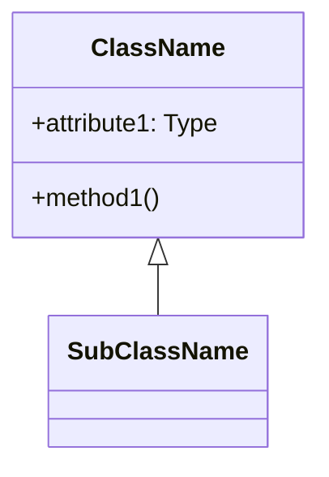
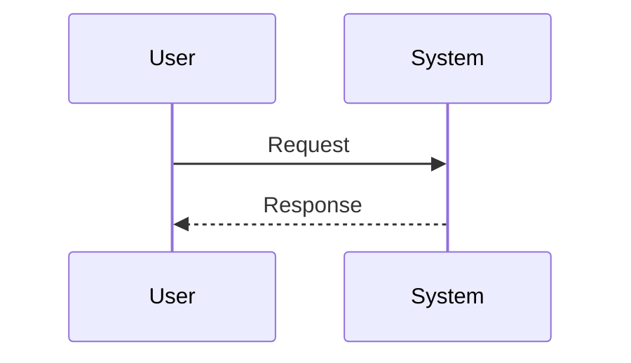

## 10.3. Pseudocode Syntax Reference

Welcome to the Pseudocode Syntax Reference section of our guide on Object-Oriented Design Patterns. In this section, we will delve into the conventions and styles used in pseudocode to represent design patterns effectively. Understanding these conventions is crucial for translating complex design patterns into clear and concise pseudocode, which can be universally understood regardless of the programming language you use.

### Introduction to Pseudocode

Pseudocode is a high-level description of an algorithm or a design pattern that uses the structural conventions of programming languages but is intended for human reading rather than machine reading. It bridges the gap between the abstract concepts of design patterns and their concrete implementations in code.

#### Why Use Pseudocode?

- **Language Agnostic**: Pseudocode is not tied to any specific programming language, making it versatile and widely applicable.
- **Focus on Logic**: It emphasizes the logic and flow of the algorithm without getting bogged down by syntax.
- **Ease of Understanding**: It is easier to read and understand, especially for those who are new to programming or a particular language.
- **Facilitates Communication**: It serves as a common language for developers to discuss and refine algorithms and design patterns.

### Basic Syntax Conventions

Before we delve into specific patterns, let's establish some basic syntax conventions used throughout this guide.

#### Control Structures

Control structures in pseudocode are used to dictate the flow of execution. Here are some common control structures:

- **If-Else Statements**: Used for conditional execution.
  
  ```pseudocode
  IF condition THEN
      // code to execute if condition is true
  ELSE
      // code to execute if condition is false
  END IF
  ```

- **Loops**: Used for repeated execution of a block of code.

  ```pseudocode
  FOR i FROM 1 TO n DO
      // code to execute repeatedly
  END FOR
  ```

  ```pseudocode
  WHILE condition DO
      // code to execute while condition is true
  END WHILE
  ```

#### Data Structures

Pseudocode often uses basic data structures such as arrays and lists:

- **Arrays**: Indexed collections of elements.

  ```pseudocode
  DECLARE array[n]
  SET array[i] TO value
  ```

- **Lists**: Ordered collections that can grow dynamically.

  ```pseudocode
  LIST myList
  ADD element TO myList
  ```

#### Functions and Procedures

Functions and procedures encapsulate reusable blocks of code:

- **Function Declaration**:

  ```pseudocode
  FUNCTION functionName(parameters)
      // code block
      RETURN value
  END FUNCTION
  ```

- **Procedure Declaration**:

  ```pseudocode
  PROCEDURE procedureName(parameters)
      // code block
  END PROCEDURE
  ```

### Object-Oriented Concepts in Pseudocode

Object-oriented programming (OOP) introduces concepts such as classes, objects, inheritance, and polymorphism. Here's how these are represented in pseudocode:

#### Classes and Objects

- **Class Declaration**:

  ```pseudocode
  CLASS ClassName
      // attributes
      // methods
  END CLASS
  ```

- **Object Instantiation**:

  ```pseudocode
  CREATE objectName AS NEW ClassName
  ```

#### Inheritance

Inheritance allows a class to inherit properties and methods from another class:

```pseudocode
CLASS SubClassName INHERITS SuperClassName
    // additional attributes and methods
END CLASS
```

#### Polymorphism

Polymorphism allows methods to do different things based on the object it is acting upon:

```pseudocode
CALL objectName.methodName()
```

### Advanced Syntax and Conventions

As we explore more complex design patterns, we will encounter advanced pseudocode syntax. Let's look at some of these conventions:

#### Abstract Classes and Interfaces

Abstract classes and interfaces define methods without implementing them:

- **Abstract Class**:

  ```pseudocode
  ABSTRACT CLASS AbstractClassName
      // abstract methods
  END CLASS
  ```

- **Interface**:

  ```pseudocode
  INTERFACE InterfaceName
      // method signatures
  END INTERFACE
  ```

#### Exception Handling

Exception handling is crucial for robust software design:

```pseudocode
TRY
    // code that may throw an exception
CATCH ExceptionType
    // code to handle the exception
END TRY
```

### Visualizing Pseudocode with Diagrams

To enhance understanding, we can use diagrams to represent pseudocode concepts visually. Let's explore some examples:

#### Class Diagrams

Class diagrams represent the structure of a system by showing its classes, attributes, and relationships:



#### Sequence Diagrams

Sequence diagrams show how objects interact in a particular sequence:



### Practical Examples and Exercises

Let's look at some practical examples to solidify our understanding of pseudocode syntax:

#### Example: Implementing a Simple Calculator

```pseudocode
CLASS Calculator
    FUNCTION add(a, b)
        RETURN a + b
    END FUNCTION

    FUNCTION subtract(a, b)
        RETURN a - b
    END FUNCTION
END CLASS

CREATE myCalculator AS NEW Calculator
PRINT myCalculator.add(5, 3) // Outputs: 8
PRINT myCalculator.subtract(5, 3) // Outputs: 2
```

#### Try It Yourself

Experiment with the pseudocode above by adding more operations such as multiplication and division. Consider how you might handle division by zero.

### Knowledge Check

Let's pose some questions to test your understanding of pseudocode syntax:

1. What is the purpose of pseudocode in software design?
2. How do you represent a loop in pseudocode?
3. What is the difference between a function and a procedure in pseudocode?
4. How is inheritance represented in pseudocode?

### Summary and Key Takeaways

In this section, we've explored the conventions and syntax used in pseudocode to represent object-oriented design patterns. We've covered basic and advanced syntax, visualized concepts with diagrams, and provided practical examples to enhance understanding. Remember, pseudocode is a powerful tool for bridging the gap between abstract design patterns and concrete implementations.

### References and Further Reading

- [MDN Web Docs: Pseudocode](https://developer.mozilla.org/en-US/docs/Web/JavaScript/Guide)
- [W3Schools: Pseudocode](https://www.w3schools.com/)
- [Gang of Four: Design Patterns](https://en.wikipedia.org/wiki/Design_Patterns)

## Quiz Time!



### What is the primary purpose of pseudocode?

- [x] To describe algorithms in a language-agnostic way
- [ ] To execute code on a computer
- [ ] To replace programming languages
- [ ] To compile into machine code

> **Explanation:** Pseudocode is used to describe algorithms in a way that is independent of any specific programming language.

### How is a loop typically represented in pseudocode?

- [x] Using FOR or WHILE constructs
- [ ] Using SWITCH statements
- [ ] Using TRY-CATCH blocks
- [ ] Using IF-ELSE statements

> **Explanation:** Loops in pseudocode are represented using constructs like FOR and WHILE.

### What is the difference between a function and a procedure in pseudocode?

- [x] Functions return values, procedures do not
- [ ] Procedures return values, functions do not
- [ ] Both return values
- [ ] Neither return values

> **Explanation:** Functions return values, whereas procedures do not return any value.

### How is inheritance represented in pseudocode?

- [x] Using the INHERITS keyword
- [ ] Using the EXTENDS keyword
- [ ] Using the IMPLEMENTS keyword
- [ ] Using the DERIVES keyword

> **Explanation:** Inheritance is represented using the INHERITS keyword in pseudocode.

### Which of the following is a control structure in pseudocode?

- [x] IF-ELSE
- [ ] CLASS
- [x] FOR
- [ ] FUNCTION

> **Explanation:** IF-ELSE and FOR are control structures used to dictate the flow of execution in pseudocode.

### What does pseudocode emphasize?

- [x] Logic and flow of algorithms
- [ ] Syntax of programming languages
- [ ] Compilation process
- [ ] Machine-level instructions

> **Explanation:** Pseudocode emphasizes the logic and flow of algorithms, not the syntax of specific programming languages.

### How are abstract classes represented in pseudocode?

- [x] Using the ABSTRACT CLASS keyword
- [ ] Using the INTERFACE keyword
- [ ] Using the VIRTUAL CLASS keyword
- [ ] Using the BASE CLASS keyword

> **Explanation:** Abstract classes are represented using the ABSTRACT CLASS keyword in pseudocode.

### What is the purpose of exception handling in pseudocode?

- [x] To manage errors and exceptions gracefully
- [ ] To define class hierarchies
- [ ] To execute loops
- [ ] To declare functions

> **Explanation:** Exception handling is used to manage errors and exceptions gracefully in pseudocode.

### Which diagram is used to represent the structure of a system?

- [x] Class Diagram
- [ ] Sequence Diagram
- [ ] Flowchart
- [ ] State Diagram

> **Explanation:** Class diagrams represent the structure of a system by showing its classes, attributes, and relationships.

### True or False: Pseudocode can be directly executed by a computer.

- [ ] True
- [x] False

> **Explanation:** Pseudocode cannot be directly executed by a computer; it is meant for human reading and understanding.



Remember, mastering pseudocode is just the beginning. As you progress, you'll be able to translate these concepts into real-world programming languages, enhancing your ability to design and implement complex systems. Keep practicing, stay curious, and enjoy the journey!
