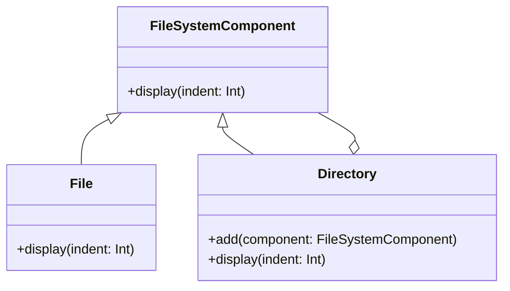

## 10.4. Additional Exercises and Solutions

Welcome to the additional exercises and solutions section of our guide on object-oriented design patterns. This section is designed to reinforce your understanding of the patterns covered in previous chapters through practical exercises and detailed solutions. By working through these exercises, you'll gain a deeper understanding of how to apply design patterns in real-world scenarios.

### Introduction to Exercises

The exercises in this section are structured to gradually increase in complexity, allowing you to build upon your existing knowledge. Each exercise is accompanied by a detailed solution, providing step-by-step explanations to ensure clarity and comprehension.

### Exercise 1: Singleton Pattern

#### Problem Statement

Design a logging system using the Singleton pattern to ensure that all log messages are written to a single log file. The logger should support different log levels (e.g., INFO, WARNING, ERROR).

#### Solution

The Singleton pattern ensures that a class has only one instance and provides a global point of access to it. Here's a pseudocode implementation of the logging system:

```pseudocode
class Logger
    private static instance: Logger
    private logFile: File

    private Logger()
        logFile = open("log.txt", "a")

    public static getInstance(): Logger
        if instance is null
            instance = new Logger()
        return instance

    public log(message: String, level: String)
        logFile.write("[" + level + "] " + message + "\n")

// Usage
logger = Logger.getInstance()
logger.log("Application started", "INFO")
```

**Explanation:** The `Logger` class has a private constructor to prevent direct instantiation. The `getInstance` method ensures that only one instance of the `Logger` is created. The `log` method writes messages to the log file with the specified log level.

**Try It Yourself:** Modify the logger to include timestamps in the log messages.

### Exercise 2: Factory Method Pattern

#### Problem Statement

Create a system for generating different types of documents (e.g., Word, PDF) using the Factory Method pattern. Each document type should have a method to save the document.

#### Solution

The Factory Method pattern defines an interface for creating an object but allows subclasses to alter the type of objects that will be created. Here's a pseudocode implementation:

```pseudocode
interface Document
    method save()

class WordDocument implements Document
    method save()
        print("Saving Word document")

class PDFDocument implements Document
    method save()
        print("Saving PDF document")

abstract class DocumentCreator
    abstract method createDocument(): Document

class WordDocumentCreator extends DocumentCreator
    method createDocument(): Document
        return new WordDocument()

class PDFDocumentCreator extends DocumentCreator
    method createDocument(): Document
        return new PDFDocument()

// Usage
creator: DocumentCreator = new WordDocumentCreator()
document: Document = creator.createDocument()
document.save()
```

**Explanation:** The `DocumentCreator` class defines the `createDocument` method, which is implemented by subclasses to create specific document types. The `WordDocumentCreator` and `PDFDocumentCreator` classes create instances of `WordDocument` and `PDFDocument`, respectively.

**Try It Yourself:** Add a new document type, such as Excel, and implement the corresponding creator class.

### Exercise 3: Observer Pattern

#### Problem Statement

Implement a stock price monitoring system using the Observer pattern. The system should notify subscribers whenever a stock price changes.

#### Solution

The Observer pattern defines a one-to-many dependency between objects so that when one object changes state, all its dependents are notified. Here's a pseudocode implementation:

```pseudocode
interface Observer
    method update(price: Float)

class StockPriceMonitor implements Observer
    method update(price: Float)
        print("Stock price updated to: " + price)

class Stock
    private observers: List<Observer>
    private price: Float

    method addObserver(observer: Observer)
        observers.add(observer)

    method removeObserver(observer: Observer)
        observers.remove(observer)

    method setPrice(newPrice: Float)
        price = newPrice
        notifyObservers()

    private method notifyObservers()
        for observer in observers
            observer.update(price)

// Usage
stock = new Stock()
monitor = new StockPriceMonitor()
stock.addObserver(monitor)
stock.setPrice(100.0)
```

**Explanation:** The `Stock` class maintains a list of observers and notifies them when the stock price changes. The `StockPriceMonitor` class implements the `Observer` interface and updates the stock price.

**Try It Yourself:** Implement a second observer that sends an email notification when the stock price changes.

### Exercise 4: Strategy Pattern

#### Problem Statement

Design a payment processing system using the Strategy pattern. The system should support multiple payment methods, such as credit card and PayPal.

#### Solution

The Strategy pattern defines a family of algorithms, encapsulates each one, and makes them interchangeable. Here's a pseudocode implementation:

```pseudocode
interface PaymentStrategy
    method pay(amount: Float)

class CreditCardPayment implements PaymentStrategy
    method pay(amount: Float)
        print("Paying " + amount + " using Credit Card")

class PayPalPayment implements PaymentStrategy
    method pay(amount: Float)
        print("Paying " + amount + " using PayPal")

class PaymentProcessor
    private strategy: PaymentStrategy

    method setStrategy(strategy: PaymentStrategy)
        this.strategy = strategy

    method processPayment(amount: Float)
        strategy.pay(amount)

// Usage
processor = new PaymentProcessor()
processor.setStrategy(new CreditCardPayment())
processor.processPayment(50.0)
```

**Explanation:** The `PaymentProcessor` class uses a `PaymentStrategy` to process payments. Different payment methods are implemented as classes that implement the `PaymentStrategy` interface.

**Try It Yourself:** Add a new payment method, such as Bitcoin, and implement the corresponding strategy class.

### Exercise 5: Decorator Pattern

#### Problem Statement

Create a text formatting system using the Decorator pattern. The system should allow text to be formatted with bold and italic styles.

#### Solution

The Decorator pattern attaches additional responsibilities to an object dynamically. Here's a pseudocode implementation:

```pseudocode
interface Text
    method render(): String

class PlainText implements Text
    private content: String

    constructor(content: String)
        this.content = content

    method render(): String
        return content

class BoldDecorator implements Text
    private text: Text

    constructor(text: Text)
        this.text = text

    method render(): String
        return "<b>" + text.render() + "</b>"

class ItalicDecorator implements Text
    private text: Text

    constructor(text: Text)
        this.text = text

    method render(): String
        return "<i>" + text.render() + "</i>"

// Usage
text: Text = new PlainText("Hello, World!")
boldText: Text = new BoldDecorator(text)
italicBoldText: Text = new ItalicDecorator(boldText)
print(italicBoldText.render())
```

**Explanation:** The `BoldDecorator` and `ItalicDecorator` classes add formatting to the `Text` object. The `render` method combines the decorators to produce the formatted text.

**Try It Yourself:** Implement an underline decorator and apply it to the text.

### Exercise 6: Composite Pattern

#### Problem Statement

Design a file system using the Composite pattern. The system should support files and directories, where directories can contain files and other directories.

#### Solution

The Composite pattern composes objects into tree structures to represent part-whole hierarchies. Here's a pseudocode implementation:

```pseudocode
interface FileSystemComponent
    method display(indent: Int)

class File implements FileSystemComponent
    private name: String

    constructor(name: String)
        this.name = name

    method display(indent: Int)
        print(" " * indent + name)

class Directory implements FileSystemComponent
    private name: String
    private children: List<FileSystemComponent>

    constructor(name: String)
        this.name = name
        children = new List<FileSystemComponent>()

    method add(component: FileSystemComponent)
        children.add(component)

    method display(indent: Int)
        print(" " * indent + name)
        for child in children
            child.display(indent + 2)

// Usage
root: Directory = new Directory("root")
file1: File = new File("file1.txt")
file2: File = new File("file2.txt")
subDir: Directory = new Directory("subdir")
subDir.add(file2)
root.add(file1)
root.add(subDir)
root.display(0)
```

**Explanation:** The `Directory` class can contain both files and other directories, forming a tree structure. The `display` method recursively displays the directory structure.

**Try It Yourself:** Add a method to remove a component from a directory.

### Exercise 7: Command Pattern

#### Problem Statement

Implement an undoable text editor using the Command pattern. The editor should support operations like typing and deleting text.

#### Solution

The Command pattern encapsulates a request as an object, thereby allowing for parameterization of clients with queues, requests, and operations. Here's a pseudocode implementation:

```pseudocode
interface Command
    method execute()
    method undo()

class TextEditor
    private text: String

    method appendText(newText: String)
        text += newText

    method deleteLastChar()
        text = text.substring(0, text.length() - 1)

    method getText(): String
        return text

class AppendCommand implements Command
    private editor: TextEditor
    private text: String

    constructor(editor: TextEditor, text: String)
        this.editor = editor
        this.text = text

    method execute()
        editor.appendText(text)

    method undo()
        for i from 0 to text.length()
            editor.deleteLastChar()

// Usage
editor = new TextEditor()
command = new AppendCommand(editor, "Hello")
command.execute()
print(editor.getText()) // Output: Hello
command.undo()
print(editor.getText()) // Output: 
```

**Explanation:** The `AppendCommand` class implements the `Command` interface and provides methods to execute and undo the append operation.

**Try It Yourself:** Implement a `DeleteCommand` that deletes a specified number of characters.

### Exercise 8: Adapter Pattern

#### Problem Statement

Create a media player system that can play both MP3 and MP4 files using the Adapter pattern.

#### Solution

The Adapter pattern converts the interface of a class into another interface clients expect. Here's a pseudocode implementation:

```pseudocode
interface MediaPlayer
    method play(fileName: String)

class MP3Player implements MediaPlayer
    method play(fileName: String)
        print("Playing MP3 file: " + fileName)

class MP4Player
    method playMP4(fileName: String)
        print("Playing MP4 file: " + fileName)

class MP4Adapter implements MediaPlayer
    private mp4Player: MP4Player

    constructor(mp4Player: MP4Player)
        this.mp4Player = mp4Player

    method play(fileName: String)
        mp4Player.playMP4(fileName)

// Usage
mp3Player = new MP3Player()
mp3Player.play("song.mp3")

mp4Player = new MP4Player()
adapter = new MP4Adapter(mp4Player)
adapter.play("video.mp4")
```

**Explanation:** The `MP4Adapter` class adapts the `MP4Player` to the `MediaPlayer` interface, allowing it to be used interchangeably with `MP3Player`.

**Try It Yourself:** Add support for a new media format, such as WAV, using an adapter.

### Exercise 9: Template Method Pattern

#### Problem Statement

Design a data processing framework using the Template Method pattern. The framework should define a template for reading, processing, and saving data.

#### Solution

The Template Method pattern defines the skeleton of an algorithm in an operation, deferring some steps to subclasses. Here's a pseudocode implementation:

```pseudocode
abstract class DataProcessor
    method process()
        readData()
        processData()
        saveData()

    abstract method readData()
    abstract method processData()
    abstract method saveData()

class CSVDataProcessor extends DataProcessor
    method readData()
        print("Reading CSV data")

    method processData()
        print("Processing CSV data")

    method saveData()
        print("Saving CSV data")

// Usage
processor = new CSVDataProcessor()
processor.process()
```

**Explanation:** The `DataProcessor` class defines the `process` method, which calls the abstract methods `readData`, `processData`, and `saveData`. The `CSVDataProcessor` class provides implementations for these methods.

**Try It Yourself:** Implement a `JSONDataProcessor` that processes JSON data.

### Exercise 10: State Pattern

#### Problem Statement

Implement a traffic light system using the State pattern. The system should transition between red, yellow, and green states.

#### Solution

The State pattern allows an object to alter its behavior when its internal state changes. Here's a pseudocode implementation:

```pseudocode
interface TrafficLightState
    method changeLight(trafficLight: TrafficLight)

class RedState implements TrafficLightState
    method changeLight(trafficLight: TrafficLight)
        print("Changing from Red to Green")
        trafficLight.setState(new GreenState())

class GreenState implements TrafficLightState
    method changeLight(trafficLight: TrafficLight)
        print("Changing from Green to Yellow")
        trafficLight.setState(new YellowState())

class YellowState implements TrafficLightState
    method changeLight(trafficLight: TrafficLight)
        print("Changing from Yellow to Red")
        trafficLight.setState(new RedState())

class TrafficLight
    private state: TrafficLightState

    constructor()
        state = new RedState()

    method setState(state: TrafficLightState)
        this.state = state

    method change()
        state.changeLight(this)

// Usage
trafficLight = new TrafficLight()
trafficLight.change() // Output: Changing from Red to Green
trafficLight.change() // Output: Changing from Green to Yellow
trafficLight.change() // Output: Changing from Yellow to Red
```

**Explanation:** The `TrafficLight` class maintains a reference to a `TrafficLightState` object, which defines the current state. The `change` method transitions the traffic light to the next state.

**Try It Yourself:** Add a timer to automatically change the light after a certain period.

### Visualizing Design Patterns

To enhance your understanding, let's visualize the structure of the Composite Pattern using a class diagram:



**Diagram Description:** The class diagram illustrates the Composite pattern, where `FileSystemComponent` is the base interface, and `File` and `Directory` are concrete implementations. The `Directory` class can contain multiple `FileSystemComponent` objects, forming a tree structure.

### Knowledge Check

To reinforce your understanding, consider the following questions:

1. How does the Singleton pattern ensure only one instance of a class is created?
2. What is the primary benefit of using the Factory Method pattern?
3. How does the Observer pattern promote loose coupling?
4. In what scenarios would you use the Strategy pattern?
5. How does the Decorator pattern differ from subclassing?

### Embrace the Journey

Remember, this is just the beginning. As you progress, you'll build more complex systems and gain a deeper understanding of design patterns. Keep experimenting, stay curious, and enjoy the journey!

## Quiz Time!



### What is the primary purpose of the Singleton pattern?

- [x] To ensure a class has only one instance
- [ ] To provide multiple instances of a class
- [ ] To define a family of algorithms
- [ ] To convert one interface into another

> **Explanation:** The Singleton pattern ensures that a class has only one instance and provides a global point of access to it.

### Which pattern is used to define a one-to-many dependency between objects?

- [ ] Singleton
- [x] Observer
- [ ] Factory Method
- [ ] Strategy

> **Explanation:** The Observer pattern defines a one-to-many dependency between objects so that when one object changes state, all its dependents are notified.

### How does the Strategy pattern enhance flexibility?

- [x] By defining a family of algorithms and making them interchangeable
- [ ] By ensuring only one instance of a class
- [ ] By attaching additional responsibilities to an object
- [ ] By converting one interface into another

> **Explanation:** The Strategy pattern defines a family of algorithms, encapsulates each one, and makes them interchangeable, enhancing flexibility.

### What is the main advantage of the Factory Method pattern?

- [x] It allows subclasses to decide which class to instantiate
- [ ] It ensures a class has only one instance
- [ ] It defines a family of algorithms
- [ ] It converts one interface into another

> **Explanation:** The Factory Method pattern defines an interface for creating an object but allows subclasses to alter the type of objects that will be created.

### Which pattern is used to compose objects into tree structures?

- [ ] Singleton
- [ ] Observer
- [x] Composite
- [ ] Strategy

> **Explanation:** The Composite pattern composes objects into tree structures to represent part-whole hierarchies.

### What is the primary benefit of the Decorator pattern?

- [x] It attaches additional responsibilities to an object dynamically
- [ ] It ensures only one instance of a class
- [ ] It defines a family of algorithms
- [ ] It converts one interface into another

> **Explanation:** The Decorator pattern attaches additional responsibilities to an object dynamically, providing a flexible alternative to subclassing.

### How does the Adapter pattern work?

- [x] By converting the interface of a class into another interface clients expect
- [ ] By defining a family of algorithms
- [ ] By ensuring only one instance of a class
- [ ] By composing objects into tree structures

> **Explanation:** The Adapter pattern converts the interface of a class into another interface clients expect, allowing classes to work together that couldn't otherwise because of incompatible interfaces.

### What is the main purpose of the Template Method pattern?

- [x] To define the skeleton of an algorithm in an operation
- [ ] To ensure only one instance of a class
- [ ] To define a family of algorithms
- [ ] To convert one interface into another

> **Explanation:** The Template Method pattern defines the skeleton of an algorithm in an operation, deferring some steps to subclasses.

### Which pattern allows an object to alter its behavior when its internal state changes?

- [ ] Singleton
- [ ] Observer
- [ ] Factory Method
- [x] State

> **Explanation:** The State pattern allows an object to alter its behavior when its internal state changes, making it appear as if the object changed its class.

### True or False: The Command pattern encapsulates a request as an object.

- [x] True
- [ ] False

> **Explanation:** The Command pattern encapsulates a request as an object, thereby allowing for parameterization of clients with queues, requests, and operations.


