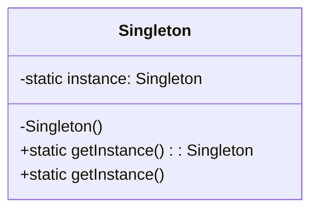
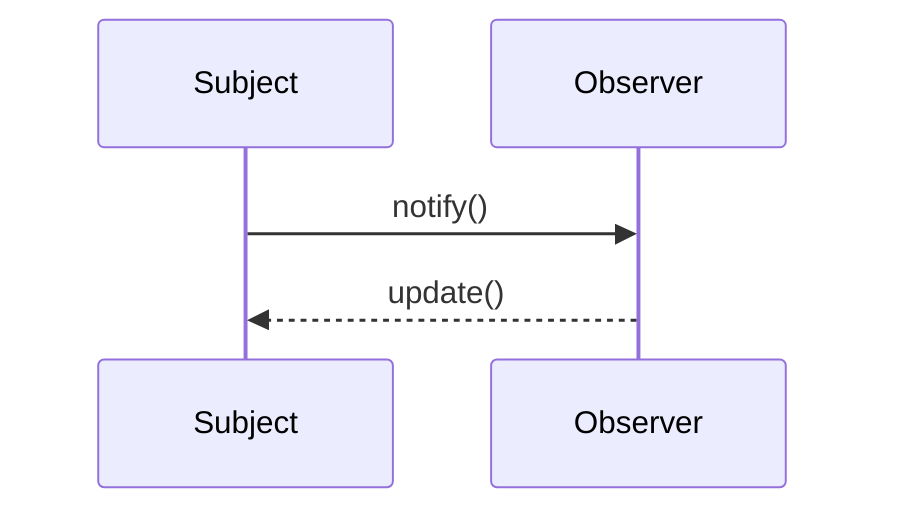

## 10.6. Bibliography and Further Reading

As we delve deeper into the world of object-oriented design patterns, it is essential to acknowledge the foundational works and influential papers that have shaped our understanding and application of these patterns. This section provides a comprehensive bibliography and suggestions for further reading, aimed at both reinforcing your current knowledge and guiding you toward advanced study.

### Foundational Works

1. **"Design Patterns: Elements of Reusable Object-Oriented Software" by Erich Gamma, Richard Helm, Ralph Johnson, and John Vlissides (Gang of Four)**
   - This seminal book, often referred to as the "GoF book," is the cornerstone of design pattern literature. It introduces 23 classic design patterns and provides a framework for understanding and applying these patterns in software development. The book's influence is profound, making it a must-read for anyone serious about mastering design patterns.

2. **"Object-Oriented Analysis and Design with Applications" by Grady Booch**
   - Grady Booch's work is pivotal in the field of object-oriented analysis and design. This book offers a comprehensive introduction to object-oriented concepts and methodologies, providing practical insights into applying these principles in real-world scenarios.

3. **"Refactoring: Improving the Design of Existing Code" by Martin Fowler**
   - While not exclusively about design patterns, Fowler's book on refactoring is essential for understanding how to improve and evolve software design. It emphasizes the importance of clean code and provides techniques for refactoring code to incorporate design patterns effectively.

4. **"Patterns of Enterprise Application Architecture" by Martin Fowler**
   - This book explores enterprise-level design patterns, offering solutions to common architectural challenges. It serves as an excellent resource for developers working on large-scale applications, providing patterns that complement those introduced by the Gang of Four.

5. **"Domain-Driven Design: Tackling Complexity in the Heart of Software" by Eric Evans**
   - Evans' book introduces the concept of domain-driven design (DDD), which emphasizes the importance of aligning software design with the core business domain. It provides patterns and practices that enhance the application of object-oriented design patterns in complex domains.

### Influential Papers

1. **"A Pattern Language: Towns, Buildings, Construction" by Christopher Alexander**
   - Although this work focuses on architecture, it laid the groundwork for the pattern movement in software engineering. Alexander's ideas on patterns as solutions to recurring problems have deeply influenced software design patterns.

2. **"The Architecture of Open Source Applications" edited by Amy Brown and Greg Wilson**
   - This collection of essays provides insights into the architecture of successful open-source applications, highlighting the use of design patterns in real-world projects. It offers practical examples of how patterns are applied in diverse software systems.

3. **"Design Patterns in Dynamic Programming" by Ralph Johnson and Brian Foote**
   - This paper explores the application of design patterns in dynamic programming languages, providing a unique perspective on how patterns can be adapted to different programming paradigms.

4. **"The Pragmatic Programmer: Your Journey to Mastery" by Andrew Hunt and David Thomas**
   - While not solely focused on design patterns, this book emphasizes pragmatic approaches to software development, including the use of patterns to create flexible and maintainable code.

5. **"Software Architecture in Practice" by Len Bass, Paul Clements, and Rick Kazman**
   - This book provides a comprehensive overview of software architecture, including the role of design patterns in architectural design. It offers insights into how patterns contribute to building robust and scalable software systems.

### Advanced Study Suggestions

1. **Explore Online Courses and Tutorials**
   - Platforms like Coursera, Udemy, and Pluralsight offer courses on design patterns and object-oriented programming. These courses provide interactive learning experiences, often including hands-on projects and quizzes to reinforce understanding.

2. **Join Online Communities and Forums**
   - Engage with communities such as Stack Overflow, Reddit's r/programming, and GitHub discussions to share knowledge and learn from others. These platforms offer opportunities to ask questions, share experiences, and gain insights from fellow developers.

3. **Attend Conferences and Workshops**
   - Participating in conferences like O'Reilly Software Architecture Conference, QCon, and DevOps Days can provide exposure to the latest trends and advancements in design patterns and software architecture. Workshops offer hands-on experience and networking opportunities with industry experts.

4. **Read Blogs and Articles by Industry Experts**
   - Follow blogs by thought leaders such as Martin Fowler, Uncle Bob (Robert C. Martin), and Kent Beck. These experts often share valuable insights and practical advice on applying design patterns and improving software design.

5. **Study Open Source Projects**
   - Analyze the source code of popular open-source projects on GitHub to see how design patterns are implemented in real-world applications. This practice can provide practical examples and inspire innovative solutions to design challenges.

6. **Experiment with New Patterns and Techniques**
   - Challenge yourself to apply design patterns in personal projects or contribute to open-source initiatives. Experimenting with different patterns and techniques can deepen your understanding and enhance your problem-solving skills.

7. **Explore Pattern-Oriented Software Architecture (POSA) Series**
   - The POSA series offers a deep dive into architectural patterns, complementing the design patterns introduced by the Gang of Four. These books provide advanced insights into integrating patterns into software architectures.

### Visualizing Design Patterns

To enhance your understanding of design patterns, consider using visual tools and diagrams. Visual representations can clarify complex concepts and illustrate the relationships between different patterns. Below are some examples of how to visualize design patterns using Mermaid.js diagrams:

#### Class Diagram for Singleton Pattern

**Description:** This diagram illustrates the Singleton pattern, showing the static `instance` variable and the `getInstance` method that ensures only one instance of the class is created.

#### Sequence Diagram for Observer Pattern

**Description:** This sequence diagram demonstrates the interaction between a `Subject` and an `Observer` in the Observer pattern. The `Subject` notifies the `Observer`, which then updates its state.

### Knowledge Check

To reinforce your understanding of design patterns and their applications, consider the following questions:

1. What are the key benefits of using design patterns in software development?
2. How do design patterns contribute to code reusability and maintainability?
3. What is the significance of the Gang of Four's contribution to design patterns?
4. How can visualizing design patterns enhance your understanding of their structure and interactions?
5. What are some common challenges when applying design patterns in real-world projects?

### Embrace the Journey

Remember, mastering design patterns is a journey that involves continuous learning and practice. As you explore the resources and suggestions provided in this section, stay curious and open to new ideas. Design patterns are powerful tools that can transform your approach to software development, enabling you to create robust, flexible, and maintainable systems.

Keep experimenting, engage with the community, and enjoy the journey of becoming a proficient software designer. The world of design patterns is vast and full of opportunities for growth and innovation.

## Quiz Time!



### What is the primary focus of the Gang of Four's book on design patterns?

- [x] Introducing 23 classic design patterns for object-oriented software
- [ ] Exploring functional programming paradigms
- [ ] Providing a comprehensive guide to software testing
- [ ] Analyzing data structures and algorithms

> **Explanation:** The Gang of Four's book is renowned for introducing 23 classic design patterns that are foundational to object-oriented software design.

### Which book emphasizes the importance of clean code and refactoring?

- [x] "Refactoring: Improving the Design of Existing Code" by Martin Fowler
- [ ] "Design Patterns: Elements of Reusable Object-Oriented Software" by the Gang of Four
- [ ] "Domain-Driven Design: Tackling Complexity in the Heart of Software" by Eric Evans
- [ ] "The Pragmatic Programmer: Your Journey to Mastery" by Andrew Hunt and David Thomas

> **Explanation:** Martin Fowler's book on refactoring focuses on improving the design of existing code, emphasizing clean code practices.

### What is the primary contribution of Christopher Alexander's work to software engineering?

- [x] Laying the groundwork for the pattern movement in software engineering
- [ ] Developing the first object-oriented programming language
- [ ] Creating the UML notation for software design
- [ ] Introducing agile methodologies

> **Explanation:** Christopher Alexander's work on patterns in architecture inspired the pattern movement in software engineering, influencing the development of design patterns.

### Which resource provides insights into the architecture of successful open-source applications?

- [x] "The Architecture of Open Source Applications" edited by Amy Brown and Greg Wilson
- [ ] "Patterns of Enterprise Application Architecture" by Martin Fowler
- [ ] "Software Architecture in Practice" by Len Bass, Paul Clements, and Rick Kazman
- [ ] "Object-Oriented Analysis and Design with Applications" by Grady Booch

> **Explanation:** "The Architecture of Open Source Applications" offers insights into the architecture of successful open-source projects, highlighting the use of design patterns.

### What is the focus of the POSA series?

- [x] Providing advanced insights into integrating patterns into software architectures
- [ ] Introducing basic object-oriented programming concepts
- [ ] Exploring data structures and algorithms
- [ ] Analyzing software testing methodologies

> **Explanation:** The Pattern-Oriented Software Architecture (POSA) series focuses on integrating patterns into software architectures, providing advanced insights.

### Which diagram is used to illustrate the interaction between a Subject and an Observer?

- [x] Sequence Diagram
- [ ] Class Diagram
- [ ] Use Case Diagram
- [ ] Activity Diagram

> **Explanation:** Sequence diagrams are used to illustrate the interaction between objects, such as a Subject and an Observer in the Observer pattern.

### What is a key benefit of visualizing design patterns?

- [x] Clarifying complex concepts and illustrating relationships
- [ ] Simplifying code syntax
- [ ] Enhancing code execution speed
- [ ] Reducing memory usage

> **Explanation:** Visualizing design patterns helps clarify complex concepts and illustrates the relationships between different components.

### Which book introduces the concept of domain-driven design?

- [x] "Domain-Driven Design: Tackling Complexity in the Heart of Software" by Eric Evans
- [ ] "Refactoring: Improving the Design of Existing Code" by Martin Fowler
- [ ] "Design Patterns: Elements of Reusable Object-Oriented Software" by the Gang of Four
- [ ] "The Pragmatic Programmer: Your Journey to Mastery" by Andrew Hunt and David Thomas

> **Explanation:** Eric Evans' book introduces domain-driven design, emphasizing the alignment of software design with the core business domain.

### What is a common challenge when applying design patterns in real-world projects?

- [x] Ensuring patterns are applied appropriately to solve specific problems
- [ ] Finding patterns that are universally applicable
- [ ] Eliminating the need for code refactoring
- [ ] Avoiding the use of object-oriented programming

> **Explanation:** A common challenge is ensuring that design patterns are applied appropriately to solve specific problems, rather than using them indiscriminately.

### True or False: Design patterns are only applicable to object-oriented programming languages.

- [ ] True
- [x] False

> **Explanation:** While design patterns are often associated with object-oriented programming, they can be adapted and applied to other programming paradigms as well.



