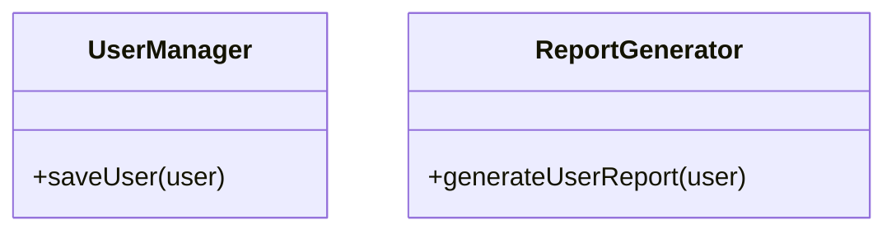
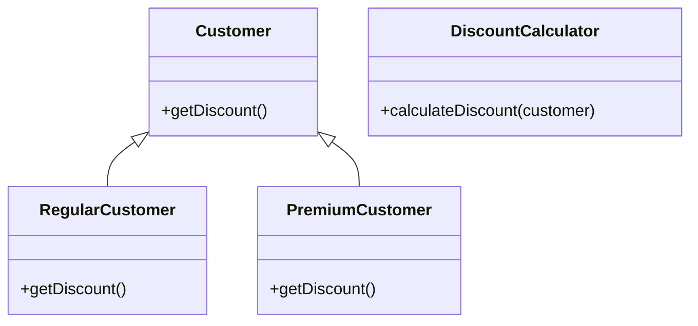
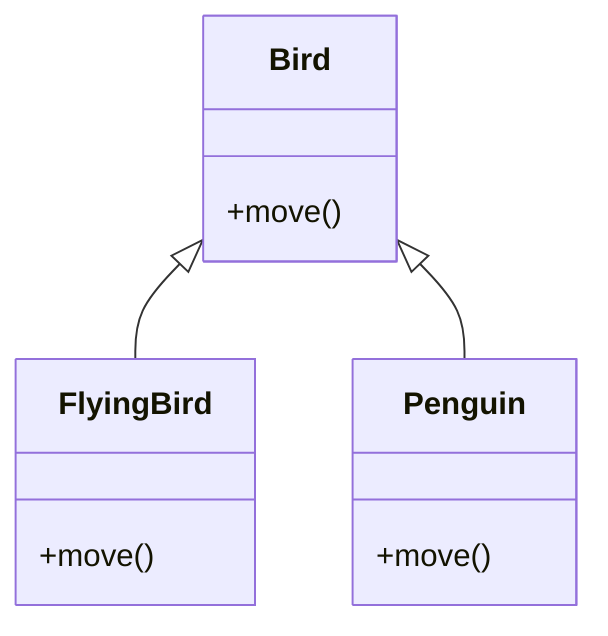
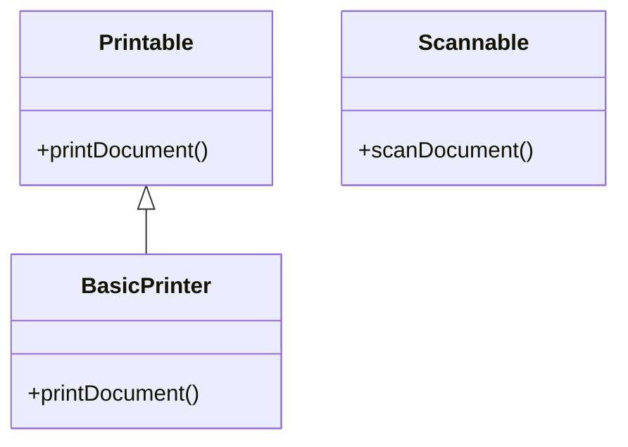
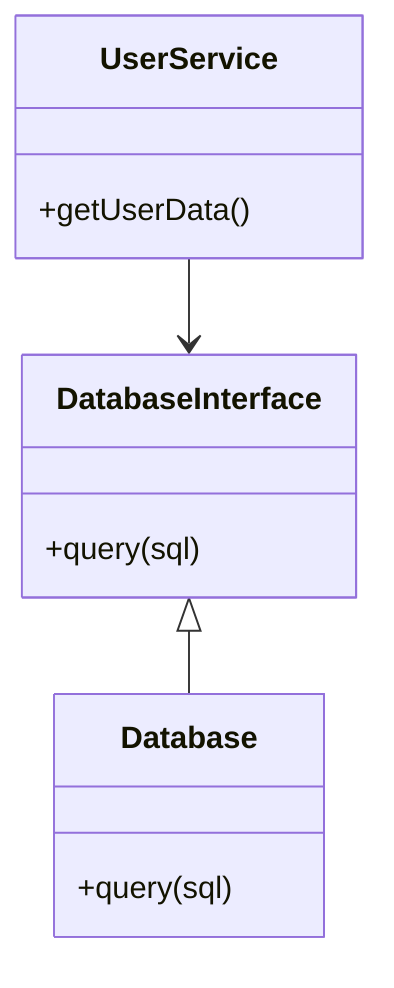

## 2.1. SOLID Design Principles

In the realm of software development, particularly in object-oriented programming (OOP), the SOLID principles serve as a cornerstone for creating robust, maintainable, and scalable systems. These principles, introduced by Robert C. Martin, are designed to guide developers in crafting software that is both flexible and easy to understand. Let's delve into each of these principles, exploring their significance, application, and how they can be implemented using pseudocode.

### Introduction to SOLID Principles

The SOLID principles are an acronym representing five key design principles:

- **S**ingle Responsibility Principle (SRP)
- **O**pen/Closed Principle (OCP)
- **L**iskov Substitution Principle (LSP)
- **I**nterface Segregation Principle (ISP)
- **D**ependency Inversion Principle (DIP)

These principles aim to improve software design by promoting practices that lead to better code organization, reduced complexity, and enhanced flexibility. Let's explore each principle in detail.

### Single Responsibility Principle (SRP)

**Definition:** A class should have one, and only one, reason to change. This means that a class should only have one job or responsibility.

**Intent:** The Single Responsibility Principle emphasizes that a class should focus on a single task or responsibility. By adhering to this principle, we can ensure that changes in one part of the system do not affect unrelated parts, thereby enhancing maintainability.

#### Example and Explanation

Consider a class responsible for handling user data and also generating reports. This violates SRP as it has two responsibilities. Let's refactor this using pseudocode:

```pseudocode
// Before SRP
class UserManager {
    function saveUser(user) {
        // Code to save user
    }

    function generateUserReport(user) {
        // Code to generate report
    }
}

// After SRP
class UserManager {
    function saveUser(user) {
        // Code to save user
    }
}

class ReportGenerator {
    function generateUserReport(user) {
        // Code to generate report
    }
}
```

By separating the responsibilities, we create two distinct classes, each with a single responsibility. This makes the system easier to maintain and extend.

#### Visualizing SRP



**Key Takeaways:** SRP encourages developers to break down classes into smaller, focused units, making the codebase easier to manage and understand.

### Open/Closed Principle (OCP)

**Definition:** Software entities (classes, modules, functions, etc.) should be open for extension but closed for modification.

**Intent:** The Open/Closed Principle advocates for designing software that can be extended without altering existing code. This is achieved through abstraction and polymorphism.

#### Example and Explanation

Suppose we have a class that calculates discounts for different customer types. Initially, it might look like this:

```pseudocode
// Before OCP
class DiscountCalculator {
    function calculateDiscount(customer) {
        if (customer.type == "Regular") {
            return 10;
        } else if (customer.type == "Premium") {
            return 20;
        }
    }
}
```

To adhere to OCP, we can refactor this using polymorphism:

```pseudocode
// After OCP
abstract class Customer {
    abstract function getDiscount();
}

class RegularCustomer extends Customer {
    function getDiscount() {
        return 10;
    }
}

class PremiumCustomer extends Customer {
    function getDiscount() {
        return 20;
    }
}

class DiscountCalculator {
    function calculateDiscount(customer) {
        return customer.getDiscount();
    }
}
```

By using inheritance and polymorphism, we can add new customer types without modifying the existing `DiscountCalculator` class.

#### Visualizing OCP



**Key Takeaways:** OCP promotes code extensibility and reduces the risk of introducing bugs when adding new features.

### Liskov Substitution Principle (LSP)

**Definition:** Objects of a superclass should be replaceable with objects of a subclass without affecting the correctness of the program.

**Intent:** The Liskov Substitution Principle ensures that a subclass can stand in for its superclass without altering the desirable properties of the program.

#### Example and Explanation

Consider a scenario where we have a `Bird` class and a `Penguin` subclass. Initially, it might look like this:

```pseudocode
// Before LSP
class Bird {
    function fly() {
        // Code to fly
    }
}

class Penguin extends Bird {
    function fly() {
        throw new Exception("Penguins can't fly!");
    }
}
```

This violates LSP because `Penguin` cannot be substituted for `Bird` without causing errors. Let's refactor it:

```pseudocode
// After LSP
abstract class Bird {
    abstract function move();
}

class FlyingBird extends Bird {
    function move() {
        // Code to fly
    }
}

class Penguin extends Bird {
    function move() {
        // Code to walk
    }
}
```

By introducing an abstract `move` method, we ensure that all subclasses implement their own version of movement, adhering to LSP.

#### Visualizing LSP



**Key Takeaways:** LSP ensures that subclasses can be used interchangeably with their parent classes, maintaining program correctness.

### Interface Segregation Principle (ISP)

**Definition:** Clients should not be forced to depend on interfaces they do not use.

**Intent:** The Interface Segregation Principle advocates for creating specific, client-focused interfaces rather than a large, general-purpose interface.

#### Example and Explanation

Consider an interface for a printer that includes methods for both printing and scanning:

```pseudocode
// Before ISP
interface Printer {
    function printDocument();
    function scanDocument();
}

class BasicPrinter implements Printer {
    function printDocument() {
        // Code to print
    }

    function scanDocument() {
        throw new Exception("Scan not supported!");
    }
}
```

This violates ISP as `BasicPrinter` is forced to implement a method it doesn't support. Let's refactor it:

```pseudocode
// After ISP
interface Printable {
    function printDocument();
}

interface Scannable {
    function scanDocument();
}

class BasicPrinter implements Printable {
    function printDocument() {
        // Code to print
    }
}
```

By splitting the interface, we ensure that classes only implement methods they actually use.

#### Visualizing ISP



**Key Takeaways:** ISP encourages the creation of smaller, more focused interfaces, reducing the burden on implementing classes.

### Dependency Inversion Principle (DIP)

**Definition:** High-level modules should not depend on low-level modules. Both should depend on abstractions. Abstractions should not depend on details. Details should depend on abstractions.

**Intent:** The Dependency Inversion Principle aims to reduce the coupling between high-level and low-level modules by introducing abstractions.

#### Example and Explanation

Consider a scenario where a `Database` class is directly used by a `UserService` class:

```pseudocode
// Before DIP
class Database {
    function query(sql) {
        // Execute SQL query
    }
}

class UserService {
    private database;

    function __construct() {
        this.database = new Database();
    }

    function getUserData() {
        return this.database.query("SELECT * FROM users");
    }
}
```

This creates a tight coupling between `UserService` and `Database`. Let's refactor it:

```pseudocode
// After DIP
interface DatabaseInterface {
    function query(sql);
}

class Database implements DatabaseInterface {
    function query(sql) {
        // Execute SQL query
    }
}

class UserService {
    private database;

    function __construct(DatabaseInterface database) {
        this.database = database;
    }

    function getUserData() {
        return this.database.query("SELECT * FROM users");
    }
}
```

By introducing an interface, we decouple `UserService` from the concrete `Database` class, allowing for more flexibility and easier testing.

#### Visualizing DIP



**Key Takeaways:** DIP promotes the use of interfaces or abstract classes to decouple high-level and low-level modules, enhancing flexibility and testability.

### Try It Yourself

Experiment with the pseudocode examples provided. Try modifying the classes and interfaces to see how changes affect the design. Consider implementing additional features or refactoring existing code to adhere to SOLID principles.

### Conclusion

The SOLID principles are fundamental to creating well-structured and maintainable software. By adhering to these principles, developers can produce code that is easier to understand, extend, and maintain. Remember, mastering these principles is a journey. Keep experimenting, stay curious, and enjoy the process of becoming a better software designer.

## Quiz Time!



### What does the Single Responsibility Principle (SRP) state?

- [x] A class should have only one reason to change.
- [ ] A class should be open for extension but closed for modification.
- [ ] A class should implement all methods of an interface.
- [ ] A class should depend on abstractions, not concretions.

> **Explanation:** SRP emphasizes that a class should have only one responsibility, leading to a single reason for change.

### Which principle advocates for extending software without modifying existing code?

- [ ] Single Responsibility Principle
- [x] Open/Closed Principle
- [ ] Liskov Substitution Principle
- [ ] Dependency Inversion Principle

> **Explanation:** The Open/Closed Principle states that software entities should be open for extension but closed for modification.

### What is the main focus of the Liskov Substitution Principle (LSP)?

- [ ] Interfaces should be small and client-specific.
- [ ] Classes should have only one responsibility.
- [x] Subtypes should be substitutable for their base types.
- [ ] High-level modules should not depend on low-level modules.

> **Explanation:** LSP ensures that objects of a superclass should be replaceable with objects of a subclass without affecting the program's correctness.

### Which principle emphasizes the use of client-specific interfaces?

- [ ] Single Responsibility Principle
- [ ] Open/Closed Principle
- [x] Interface Segregation Principle
- [ ] Dependency Inversion Principle

> **Explanation:** The Interface Segregation Principle advocates for creating specific, client-focused interfaces rather than a large, general-purpose interface.

### What does the Dependency Inversion Principle (DIP) promote?

- [x] High-level modules should not depend on low-level modules.
- [ ] Classes should have only one reason to change.
- [ ] Subtypes should be substitutable for their base types.
- [ ] Software entities should be open for extension but closed for modification.

> **Explanation:** DIP promotes the use of abstractions to decouple high-level and low-level modules.

### Which principle is violated if a subclass cannot be used in place of its superclass?

- [ ] Single Responsibility Principle
- [ ] Open/Closed Principle
- [x] Liskov Substitution Principle
- [ ] Interface Segregation Principle

> **Explanation:** LSP is violated if a subclass cannot be used as a substitute for its superclass without affecting program correctness.

### What is the benefit of adhering to the Single Responsibility Principle?

- [x] It makes the system easier to maintain and extend.
- [ ] It allows for more flexible and extensible code.
- [ ] It ensures that subclasses can be used interchangeably with their parent classes.
- [ ] It reduces the coupling between high-level and low-level modules.

> **Explanation:** SRP makes the system easier to maintain and extend by ensuring each class has a single responsibility.

### How does the Open/Closed Principle benefit software design?

- [ ] By promoting the use of client-specific interfaces.
- [ ] By ensuring that subclasses can be used interchangeably with their parent classes.
- [x] By allowing software to be extended without modifying existing code.
- [ ] By reducing the coupling between high-level and low-level modules.

> **Explanation:** OCP allows software to be extended without modifying existing code, promoting flexibility and reducing the risk of bugs.

### Which principle helps in reducing the burden on implementing classes by creating smaller interfaces?

- [ ] Single Responsibility Principle
- [ ] Open/Closed Principle
- [x] Interface Segregation Principle
- [ ] Dependency Inversion Principle

> **Explanation:** ISP encourages the creation of smaller, more focused interfaces, reducing the burden on implementing classes.

### True or False: The Dependency Inversion Principle states that details should depend on abstractions.

- [x] True
- [ ] False

> **Explanation:** DIP states that both high-level and low-level modules should depend on abstractions, and details should depend on abstractions.


