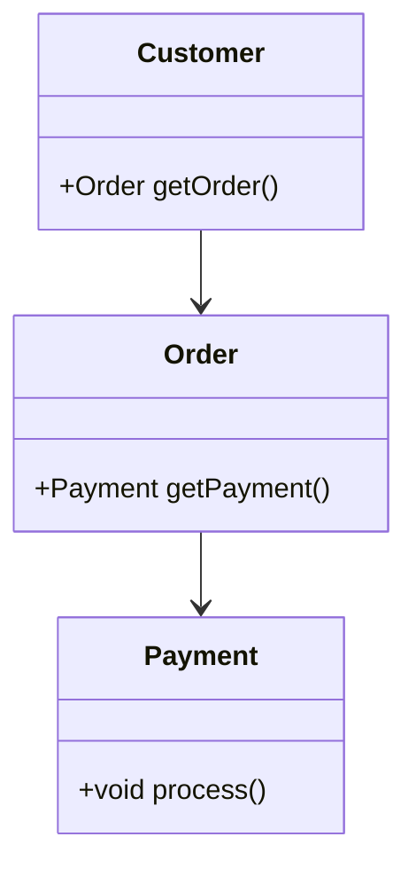

## 2.2. Design Principles and Best Practices

In the realm of software development, particularly in object-oriented programming (OOP), adhering to design principles and best practices is crucial for creating robust, maintainable, and scalable software. This section delves into four fundamental principles: DRY (Don't Repeat Yourself), KISS (Keep It Simple, Stupid), YAGNI (You Aren't Gonna Need It), and the Principle of Least Knowledge (also known as the Law of Demeter). By understanding and applying these principles, developers can improve code quality and streamline the development process.

### DRY (Don't Repeat Yourself)

The DRY principle emphasizes the importance of reducing repetition within code. Repetition can lead to increased maintenance costs, as changes in one part of the codebase may necessitate changes in multiple other areas. Let's explore how to implement DRY effectively.

#### Explanation

DRY stands for "Don't Repeat Yourself." The core idea is to avoid duplicating code by abstracting common functionality into reusable components. This principle helps in minimizing redundancy and ensures that any modification needs to be made in only one place.

#### Benefits of DRY

- **Maintainability**: Changes in the codebase are easier and less error-prone.
- **Readability**: Code becomes cleaner and more understandable.
- **Consistency**: Reduces the risk of inconsistencies across the codebase.

#### Implementing DRY

To implement DRY, identify repetitive code patterns and refactor them into functions, classes, or modules. Here's a simple pseudocode example demonstrating DRY:

```pseudocode
// Before DRY
function calculateAreaOfSquare(sideLength) {
    return sideLength * sideLength;
}

function calculateAreaOfRectangle(width, height) {
    return width * height;
}

// After applying DRY
function calculateArea(shape) {
    if shape.type == "square" {
        return shape.sideLength * shape.sideLength;
    } else if shape.type == "rectangle" {
        return shape.width * shape.height;
    }
}
```

#### Try It Yourself

Experiment by adding a new shape, such as a circle, to the `calculateArea` function. Consider how you might refactor the code to accommodate additional shapes without violating the DRY principle.

### KISS (Keep It Simple, Stupid)

The KISS principle advocates for simplicity in design. Complex solutions can lead to increased bugs and difficulties in understanding and maintaining the code.

#### Explanation

KISS stands for "Keep It Simple, Stupid." The principle suggests that systems should be as simple as possible. Complexity should only be introduced when absolutely necessary.

#### Benefits of KISS

- **Ease of Understanding**: Simple code is easier to read and understand.
- **Reduced Bugs**: Fewer complexities mean fewer places for bugs to hide.
- **Faster Development**: Simple solutions are often quicker to implement.

#### Implementing KISS

To apply KISS, break down complex problems into smaller, manageable parts. Avoid over-engineering solutions. Here's a pseudocode example illustrating KISS:

```pseudocode
// Complex solution
function calculateDiscount(price, discountType) {
    if discountType == "seasonal" {
        return price * 0.9;
    } else if discountType == "clearance" {
        return price * 0.5;
    } else if discountType == "member" {
        return price * 0.85;
    }
}

// Simplified solution
function calculateDiscount(price, discountRate) {
    return price * discountRate;
}
```

#### Try It Yourself

Refactor a complex function in your codebase to simplify its logic. Consider whether all branches and conditions are necessary or if they can be streamlined.

### YAGNI (You Aren't Gonna Need It)

YAGNI is a principle that discourages adding functionality until it is necessary. Premature optimization and feature creep can lead to bloated, unmanageable code.

#### Explanation

YAGNI stands for "You Aren't Gonna Need It." It advises developers to avoid implementing features that are not currently required. This principle helps in focusing on current needs rather than speculative future requirements.

#### Benefits of YAGNI

- **Focus**: Keeps the development process focused on current requirements.
- **Efficiency**: Reduces wasted effort on unnecessary features.
- **Simplicity**: Helps maintain a lean codebase.

#### Implementing YAGNI

To apply YAGNI, prioritize features based on immediate needs. Avoid adding code for hypothetical scenarios. Here's a pseudocode example demonstrating YAGNI:

```pseudocode
// Before YAGNI
function processOrder(order) {
    // Process payment
    // Apply discount
    // Send confirmation email
    // Future: Integrate with third-party shipping service
}

// After applying YAGNI
function processOrder(order) {
    // Process payment
    // Apply discount
    // Send confirmation email
}
```

#### Try It Yourself

Review a section of your codebase and identify any features or code that are not currently needed. Consider removing or postponing them until they become necessary.

### Principle of Least Knowledge (Law of Demeter)

The Principle of Least Knowledge, also known as the Law of Demeter, encourages minimizing the amount of knowledge one part of the system has about other parts. This principle promotes loose coupling and enhances modularity.

#### Explanation

The Principle of Least Knowledge suggests that a module should only communicate with its immediate dependencies and not with the internal details of other modules. This reduces dependencies and enhances encapsulation.

#### Benefits of the Principle of Least Knowledge

- **Loose Coupling**: Reduces dependencies between modules.
- **Modularity**: Encourages encapsulation and separation of concerns.
- **Flexibility**: Makes the system easier to modify and extend.

#### Implementing the Principle of Least Knowledge

To apply this principle, limit the interactions between objects to only those that are necessary. Avoid chaining method calls across multiple objects. Here's a pseudocode example illustrating the Principle of Least Knowledge:

```pseudocode
// Violating the Principle of Least Knowledge
customer.getOrder().getPayment().process();

// Applying the Principle of Least Knowledge
order = customer.getOrder();
payment = order.getPayment();
payment.process();
```

#### Try It Yourself

Identify areas in your code where method chaining occurs. Refactor the code to reduce dependencies and adhere to the Principle of Least Knowledge.

### Visualizing the Principles

To better understand these principles, let's visualize their interactions and effects using a class diagram.



**Diagram Description:** This class diagram illustrates the relationship between `Customer`, `Order`, and `Payment` classes. By adhering to the Principle of Least Knowledge, we ensure that each class only interacts with its immediate dependencies.

### References and Links

For further reading on these principles, consider exploring the following resources:

- [DRY Principle on Wikipedia](https://en.wikipedia.org/wiki/Don%27t_repeat_yourself)
- [KISS Principle on Wikipedia](https://en.wikipedia.org/wiki/KISS_principle)
- [YAGNI Principle on Wikipedia](https://en.wikipedia.org/wiki/You_aren%27t_gonna_need_it)
- [Law of Demeter on Wikipedia](https://en.wikipedia.org/wiki/Law_of_Demeter)

### Knowledge Check

As you progress through this section, consider the following questions to test your understanding:

1. How does the DRY principle help in maintaining code consistency?
2. What are the potential pitfalls of not adhering to the KISS principle?
3. Why is it important to avoid premature optimization according to the YAGNI principle?
4. How does the Principle of Least Knowledge contribute to loose coupling in software design?

### Embrace the Journey

Remember, mastering these principles is a journey. As you continue to apply them, you'll find your code becoming more efficient, maintainable, and scalable. Keep experimenting, stay curious, and enjoy the process of refining your software design skills.

## Quiz Time!



### What does the DRY principle stand for?

- [x] Don't Repeat Yourself
- [ ] Do Repeat Yourself
- [ ] Don't Read Yourself
- [ ] Do Read Yourself

> **Explanation:** DRY stands for "Don't Repeat Yourself," emphasizing the reduction of code duplication.

### Which principle advises against adding functionality until necessary?

- [ ] DRY
- [ ] KISS
- [x] YAGNI
- [ ] Principle of Least Knowledge

> **Explanation:** YAGNI stands for "You Aren't Gonna Need It," advising against premature feature implementation.

### What is the main benefit of the KISS principle?

- [x] Simplicity
- [ ] Complexity
- [ ] Redundancy
- [ ] Coupling

> **Explanation:** The KISS principle promotes simplicity, making code easier to understand and maintain.

### Which principle is also known as the Law of Demeter?

- [ ] DRY
- [ ] KISS
- [ ] YAGNI
- [x] Principle of Least Knowledge

> **Explanation:** The Principle of Least Knowledge is also known as the Law of Demeter, focusing on minimizing dependencies.

### How does the DRY principle improve code maintainability?

- [x] By reducing redundancy
- [ ] By increasing complexity
- [ ] By adding more features
- [ ] By promoting coupling

> **Explanation:** DRY improves maintainability by reducing redundancy, making changes easier and less error-prone.

### What should you avoid according to the YAGNI principle?

- [x] Premature optimization
- [ ] Code refactoring
- [ ] Code documentation
- [ ] Testing

> **Explanation:** YAGNI advises against premature optimization and adding features that are not currently needed.

### What is a key characteristic of the KISS principle?

- [x] Simplicity
- [ ] Complexity
- [ ] Redundancy
- [ ] Coupling

> **Explanation:** The KISS principle emphasizes simplicity, reducing complexity in code design.

### Which principle encourages loose coupling in software design?

- [ ] DRY
- [ ] KISS
- [ ] YAGNI
- [x] Principle of Least Knowledge

> **Explanation:** The Principle of Least Knowledge encourages loose coupling by minimizing dependencies between modules.

### What is the main focus of the DRY principle?

- [x] Reducing code duplication
- [ ] Increasing code complexity
- [ ] Adding more features
- [ ] Promoting coupling

> **Explanation:** The main focus of the DRY principle is to reduce code duplication, enhancing maintainability.

### The Principle of Least Knowledge is also known as the Law of Demeter.

- [x] True
- [ ] False

> **Explanation:** True. The Principle of Least Knowledge is commonly referred to as the Law of Demeter, promoting minimal knowledge between components.


