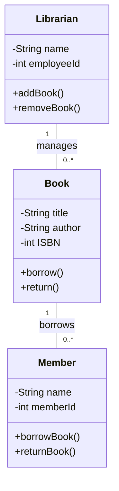
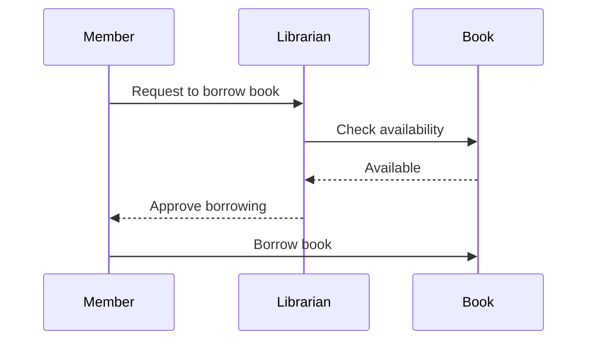
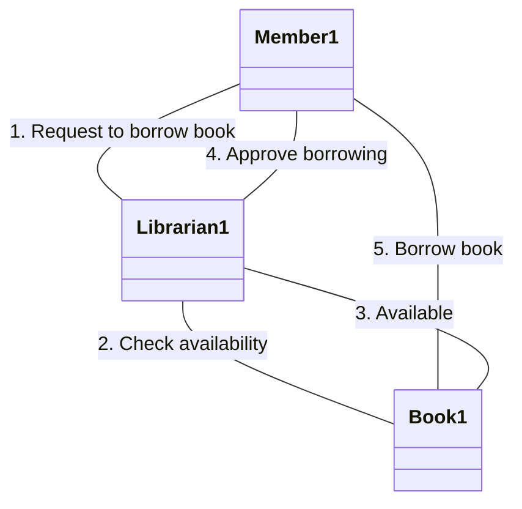
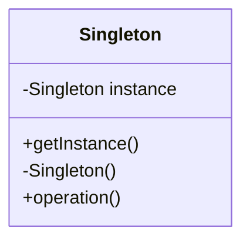

## 2.3. UML Notations and Diagrams

Unified Modeling Language (UML) is a standardized modeling language that provides a set of graphical notation techniques to create visual models of object-oriented software-intensive systems. In this section, we will explore various UML diagrams and notations that are essential for understanding and implementing object-oriented design patterns. Let's dive into the world of UML and see how it can help us visualize and communicate complex software designs effectively.

### Understanding Class Diagrams

Class diagrams are the backbone of UML and are used to represent the static structure of a system. They show the system's classes, their attributes, operations (or methods), and the relationships among the objects. Class diagrams are crucial for modeling the data structures and the relationships between them in an object-oriented system.

#### Key Components of Class Diagrams

1. **Classes**: Represented by rectangles divided into three compartments. The top compartment contains the class name, the middle compartment lists the attributes, and the bottom compartment lists the operations.

2. **Attributes**: Define the properties of a class. They are usually listed with their data types.

3. **Operations**: Define the behavior of a class. They are listed with their parameters and return types.

4. **Relationships**: Include associations, generalizations, and dependencies. These are represented by lines connecting the classes.

5. **Multiplicity**: Indicates how many instances of a class can be associated with one instance of another class.

#### Example of a Class Diagram

Let's consider a simple class diagram for a library system:



In this diagram, we have three classes: `Book`, `Member`, and `Librarian`. The `Book` class has attributes like `title`, `author`, and `ISBN`, and operations like `borrow()` and `return()`. The relationships show that a `Member` can borrow multiple books, and a `Librarian` manages multiple books.

### Object Diagrams

Object diagrams are a snapshot of the objects in a system at a particular point in time. They are similar to class diagrams but focus on the instances of classes (objects) and their relationships at a specific moment.

#### Purpose of Object Diagrams

- **Visualize Object Structure**: Show how objects interact with each other in a system.
- **Understand Object Relationships**: Provide a clear picture of the links between objects.
- **Analyze Object Behavior**: Help in understanding how objects behave in different scenarios.

#### Example of an Object Diagram

Consider an object diagram for the library system:

```mermaid
classDiagram
    object Book1 {
        title = "1984"
        author = "George Orwell"
        ISBN = 123456789
    }
    object Member1 {
        name = "Alice"
        memberId = 101
    }
    object Librarian1 {
        name = "Bob"
        employeeId = 201
    }
    Book1 -- Member1 : borrows
    Librarian1 -- Book1 : manages
```

This diagram shows specific instances of the `Book`, `Member`, and `Librarian` classes. It illustrates that `Alice` has borrowed the book "1984", which is managed by `Bob`.

### Sequence Diagrams

Sequence diagrams are used to model the dynamic behavior of a system. They show how objects interact in a particular sequence of events. Sequence diagrams are particularly useful for detailing the flow of control and data among objects.

#### Components of Sequence Diagrams

1. **Lifelines**: Represent the different objects or roles that participate in the interaction.

2. **Activation Boxes**: Indicate the period during which an object is active or controlling the flow.

3. **Messages**: Represent the communication between objects. They can be synchronous or asynchronous.

4. **Arrows**: Indicate the direction of message flow.

#### Example of a Sequence Diagram

Let's create a sequence diagram for the process of borrowing a book:



In this sequence diagram, the `Member` requests to borrow a book from the `Librarian`, who checks the `Book`'s availability. If the book is available, the `Librarian` approves the borrowing, and the `Member` proceeds to borrow the book.

### Collaboration Diagrams

Collaboration diagrams, also known as communication diagrams, focus on the structural organization of objects that interact in a system. They emphasize the roles and associations between objects rather than the time sequence.

#### Key Elements of Collaboration Diagrams

1. **Objects**: Represented by rectangles, similar to class diagrams.

2. **Links**: Show the relationships between objects.

3. **Messages**: Indicate the interactions between objects, usually numbered to show the sequence.

#### Example of a Collaboration Diagram

Consider a collaboration diagram for the library system:



This diagram illustrates the same interaction as the sequence diagram but focuses on the relationships and roles of the objects involved.

### Using UML to Represent Design Patterns

UML diagrams are invaluable tools for representing design patterns. They provide a visual representation of the pattern's structure and interactions, making it easier to understand and implement.

#### Representing Design Patterns with UML

1. **Identify the Pattern**: Determine which design pattern you want to represent.

2. **Create Class Diagrams**: Use class diagrams to show the static structure of the pattern, including classes, interfaces, and relationships.

3. **Use Sequence Diagrams**: Illustrate the dynamic behavior and interactions of the pattern using sequence diagrams.

4. **Incorporate Collaboration Diagrams**: Highlight the roles and associations between objects in the pattern.

#### Example: Singleton Pattern in UML

The Singleton pattern ensures that a class has only one instance and provides a global point of access to it. Here's how you can represent it using UML:



In this class diagram, the `Singleton` class has a private static instance and a public method `getInstance()` to provide access to the instance. The constructor is private to prevent direct instantiation.

### Try It Yourself

Now that we've covered the basics of UML diagrams, try creating your own diagrams for a simple system. Consider a system with classes like `User`, `Account`, and `Transaction`. Use class diagrams to define the structure, sequence diagrams to model interactions, and collaboration diagrams to show object relationships.

### Knowledge Check

Before we wrap up, let's reinforce what we've learned:

- **What are the main components of a class diagram?**
- **How do object diagrams differ from class diagrams?**
- **What is the purpose of sequence diagrams?**
- **How do collaboration diagrams emphasize object roles?**

### Embrace the Journey

Remember, mastering UML diagrams is a journey. As you practice, you'll become more adept at visualizing and communicating complex designs. Keep experimenting, stay curious, and enjoy the process!

## Quiz Time!



### What is the primary purpose of a class diagram?

- [x] To represent the static structure of a system
- [ ] To model the dynamic behavior of a system
- [ ] To show the sequence of events in a system
- [ ] To highlight the roles and associations between objects

> **Explanation:** Class diagrams focus on the static structure, including classes, attributes, operations, and relationships.

### Which UML diagram is used to show a snapshot of the objects in a system at a particular point in time?

- [ ] Class Diagram
- [x] Object Diagram
- [ ] Sequence Diagram
- [ ] Collaboration Diagram

> **Explanation:** Object diagrams represent instances of classes and their relationships at a specific moment.

### What do activation boxes in a sequence diagram indicate?

- [ ] The sequence of messages
- [x] The period during which an object is active
- [ ] The roles of objects
- [ ] The static structure of a system

> **Explanation:** Activation boxes show the duration an object is active or controlling the flow in a sequence diagram.

### How do collaboration diagrams differ from sequence diagrams?

- [x] They focus on object roles and associations
- [ ] They emphasize the time sequence of interactions
- [ ] They represent the static structure of a system
- [ ] They show the dynamic behavior of a system

> **Explanation:** Collaboration diagrams highlight the structural organization and roles of objects, not the sequence of interactions.

### What is the key benefit of using UML to represent design patterns?

- [x] Provides a visual representation of structure and interactions
- [ ] Simplifies the code implementation
- [ ] Eliminates the need for documentation
- [ ] Ensures code reusability

> **Explanation:** UML diagrams visually represent the structure and interactions of design patterns, aiding understanding and implementation.

### In a class diagram, what does multiplicity indicate?

- [ ] The sequence of operations
- [ ] The roles of objects
- [x] The number of instances associated with another class
- [ ] The dynamic behavior of a system

> **Explanation:** Multiplicity shows how many instances of a class can be associated with one instance of another class.

### Which UML diagram is most useful for detailing the flow of control and data among objects?

- [ ] Class Diagram
- [ ] Object Diagram
- [x] Sequence Diagram
- [ ] Collaboration Diagram

> **Explanation:** Sequence diagrams are used to model the dynamic behavior and interactions among objects.

### What is the main focus of collaboration diagrams?

- [ ] Static structure of classes
- [ ] Dynamic behavior of a system
- [x] Structural organization and roles of objects
- [ ] Sequence of events

> **Explanation:** Collaboration diagrams emphasize the roles and associations between objects in a system.

### How can UML diagrams aid in understanding object-oriented design patterns?

- [x] By providing visual representations of patterns
- [ ] By simplifying code syntax
- [ ] By eliminating the need for pseudocode
- [ ] By ensuring pattern implementation

> **Explanation:** UML diagrams offer visual representations of design patterns, making them easier to understand and implement.

### True or False: Sequence diagrams are used to represent the static structure of a system.

- [ ] True
- [x] False

> **Explanation:** Sequence diagrams model the dynamic behavior and interactions of a system, not the static structure.


