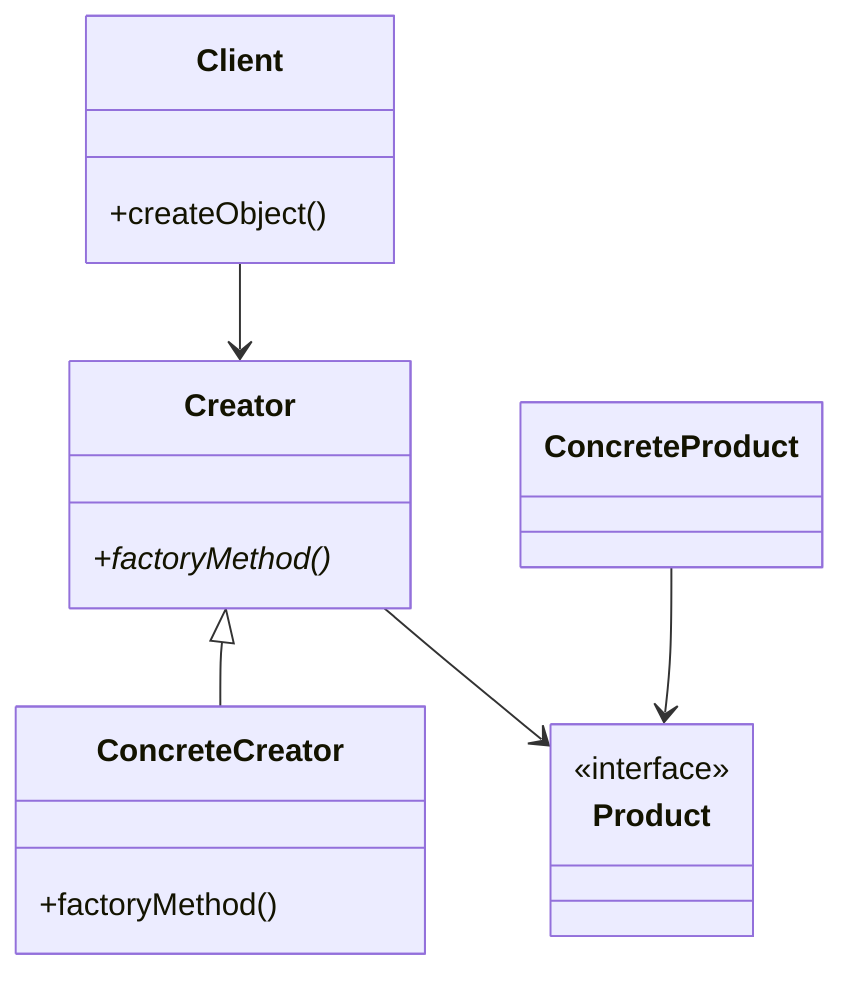

## 3.1. Introduction to Creational Patterns

In the realm of software engineering, design patterns serve as time-tested solutions to common problems. Among these, **Creational Design Patterns** play a pivotal role in object-oriented programming by addressing the complexities of object creation. This section delves into the purpose, selection, and common characteristics of Creational Patterns, providing you with the foundational knowledge to apply them effectively in your projects.

### The Purpose of Creational Patterns

Creational Patterns are essential in object-oriented design as they abstract the instantiation process, making a system independent of how its objects are created, composed, and represented. They encapsulate the knowledge about which concrete classes the system uses and hide the details of how instances of these classes are created and put together.

#### Key Objectives

1. **Encapsulation of Object Creation**: By encapsulating the instantiation logic, Creational Patterns promote flexibility and scalability. This allows developers to change the system's structure without altering the code that uses the objects.

2. **Decoupling**: They help decouple a system from the specifics of object creation, enabling the system to be more adaptable to changes.

3. **Enhanced Flexibility**: By providing multiple ways to create objects, Creational Patterns offer flexibility in terms of object creation, allowing for more dynamic and complex object structures.

4. **Improved Code Manageability**: They contribute to cleaner, more manageable code by centralizing the instantiation logic, which simplifies maintenance and reduces errors.

### Choosing the Right Creational Pattern

Selecting the appropriate Creational Pattern requires a clear understanding of the problem at hand and the specific requirements of your system. Here are some guidelines to help you choose:

1. **Understand the Problem Domain**: Analyze the problem domain to determine the nature of the objects that need to be created and their lifecycle.

2. **Evaluate Flexibility Needs**: Consider how much flexibility you need in terms of object creation. Do you need to create objects dynamically at runtime, or is a static creation process sufficient?

3. **Consider Object Complexity**: For complex objects with multiple parts, patterns like Builder or Abstract Factory might be more suitable.

4. **Assess System Dependencies**: If your system requires a single point of access to a resource, the Singleton pattern might be appropriate.

5. **Analyze Future Requirements**: Consider potential future changes and how different patterns might accommodate these changes.

#### Example Scenario

Imagine you're developing a graphics editor that needs to support various shapes like circles, squares, and triangles. Each shape has different properties and behaviors. In this scenario, a Factory Method pattern could be used to define an interface for creating these shapes, allowing you to extend the system with new shapes without modifying existing code.

### Common Characteristics of Creational Patterns

Creational Patterns share several common characteristics that make them powerful tools in software design:

1. **Abstract Instantiation**: They abstract the instantiation process, allowing for more flexible and reusable code.

2. **Encapsulation of Construction Logic**: By encapsulating the construction logic, these patterns promote separation of concerns and enhance code readability.

3. **Support for Polymorphism**: Creational Patterns often leverage polymorphism to allow for dynamic object creation, enabling systems to be more adaptable and scalable.

4. **Reduction of Complexity**: They help reduce complexity by centralizing the creation logic, which simplifies the overall system architecture.

5. **Promotion of Reusability**: By providing a standardized way to create objects, Creational Patterns promote code reusability across different parts of the system.

#### Visualizing Creational Patterns

To better understand how Creational Patterns work, let's visualize the relationship between a client and the object creation process using a class diagram.



**Diagram Explanation**: In this diagram, the `Client` interacts with the `Creator` to create a `Product`. The `Creator` defines a `factoryMethod` that is overridden by the `ConcreteCreator` to instantiate a `ConcreteProduct`. This encapsulation of the creation logic allows for flexibility and scalability.

### Sample Code Snippets

Let's explore a simple pseudocode example to illustrate the Factory Method pattern, a common Creational Pattern.

```pseudocode
// Define an interface for creating an object
interface ShapeFactory {
    method createShape(): Shape
}

// Concrete implementation of the interface
class CircleFactory implements ShapeFactory {
    method createShape(): Shape {
        return new Circle()
    }
}

class SquareFactory implements ShapeFactory {
    method createShape(): Shape {
        return new Square()
    }
}

// Client code
method main() {
    factory = new CircleFactory()
    shape = factory.createShape()
    shape.draw()

    factory = new SquareFactory()
    shape = factory.createShape()
    shape.draw()
}
```

**Code Explanation**: In this example, `ShapeFactory` is an interface with a method `createShape`. `CircleFactory` and `SquareFactory` are concrete implementations that create specific shapes. The client code uses these factories to create and draw shapes without needing to know the details of their instantiation.

### Design Considerations

When using Creational Patterns, consider the following:

- **Performance**: Some patterns, like Singleton, can introduce performance bottlenecks if not implemented correctly, especially in multi-threaded environments.
- **Complexity**: While these patterns can reduce complexity in the long run, they may introduce additional complexity initially, which should be carefully managed.
- **Flexibility vs. Simplicity**: Strive to balance flexibility and simplicity. Overusing patterns can lead to over-engineering.

### Differences and Similarities

Creational Patterns often share similarities, which can lead to confusion. Here's a brief comparison:

- **Factory Method vs. Abstract Factory**: Both involve creating objects, but Factory Method focuses on a single product, while Abstract Factory deals with families of related products.
- **Builder vs. Prototype**: Builder constructs complex objects step by step, whereas Prototype creates new objects by copying existing ones.
- **Singleton**: Unique in ensuring a class has only one instance, unlike other patterns that focus on object creation flexibility.

### Try It Yourself

To solidify your understanding, try modifying the pseudocode example to include a new shape, such as a `Triangle`. Implement a `TriangleFactory` and update the client code to create and draw a triangle.

### Knowledge Check

- What are the main objectives of Creational Patterns?
- How do Creational Patterns promote flexibility and scalability?
- What are the key differences between Factory Method and Abstract Factory?

### Embrace the Journey

Remember, mastering Creational Patterns is a journey. As you progress, you'll gain a deeper understanding of how to apply these patterns effectively in your projects. Keep experimenting, stay curious, and enjoy the journey!

## Quiz Time!



### What is the primary purpose of Creational Design Patterns?

- [x] To abstract the instantiation process and make a system independent of how objects are created.
- [ ] To provide a way to organize classes and objects.
- [ ] To define a family of algorithms and make them interchangeable.
- [ ] To encapsulate a request as an object.

> **Explanation:** Creational Design Patterns focus on abstracting the instantiation process, allowing systems to be independent of object creation specifics.

### Which Creational Pattern is best suited for creating families of related objects?

- [ ] Singleton
- [ ] Builder
- [x] Abstract Factory
- [ ] Prototype

> **Explanation:** The Abstract Factory pattern provides an interface for creating families of related objects without specifying their concrete classes.

### What is a common characteristic of Creational Patterns?

- [x] They abstract the instantiation process.
- [ ] They focus on the interaction between objects.
- [ ] They deal with the composition of objects.
- [ ] They encapsulate algorithms.

> **Explanation:** Creational Patterns abstract the instantiation process, allowing for more flexible and reusable code.

### Which pattern ensures a class has only one instance?

- [x] Singleton
- [ ] Factory Method
- [ ] Builder
- [ ] Prototype

> **Explanation:** The Singleton pattern ensures that a class has only one instance and provides a global point of access to it.

### How do Creational Patterns enhance code manageability?

- [x] By centralizing the instantiation logic.
- [ ] By defining a family of algorithms.
- [ ] By organizing classes and objects.
- [ ] By encapsulating a request as an object.

> **Explanation:** Creational Patterns enhance code manageability by centralizing the instantiation logic, simplifying maintenance and reducing errors.

### What should you consider when choosing a Creational Pattern?

- [x] The complexity of objects and flexibility needs.
- [ ] The number of classes in the system.
- [ ] The algorithms used in the system.
- [ ] The interaction between objects.

> **Explanation:** When choosing a Creational Pattern, consider the complexity of objects, flexibility needs, and how they fit into the system's architecture.

### What is a key difference between Builder and Prototype patterns?

- [x] Builder constructs objects step by step, while Prototype creates new objects by copying existing ones.
- [ ] Builder is used for single instances, while Prototype is for multiple instances.
- [ ] Builder focuses on object composition, while Prototype focuses on object interaction.
- [ ] Builder encapsulates algorithms, while Prototype encapsulates requests.

> **Explanation:** Builder constructs complex objects step by step, whereas Prototype creates new objects by copying existing ones.

### Which pattern is used to define an interface for creating an object, but letting subclasses alter the type of objects that will be created?

- [ ] Singleton
- [x] Factory Method
- [ ] Builder
- [ ] Prototype

> **Explanation:** The Factory Method pattern defines an interface for creating an object but allows subclasses to alter the type of objects that will be created.

### What is a potential drawback of using Singleton pattern?

- [x] It can introduce performance bottlenecks in multi-threaded environments.
- [ ] It increases the number of classes in the system.
- [ ] It complicates the interaction between objects.
- [ ] It makes the system dependent on specific algorithms.

> **Explanation:** The Singleton pattern can introduce performance bottlenecks in multi-threaded environments if not implemented correctly.

### Creational Patterns are primarily concerned with which aspect of a system?

- [x] Object creation
- [ ] Object interaction
- [ ] Object composition
- [ ] Object encapsulation

> **Explanation:** Creational Patterns are primarily concerned with object creation, abstracting the instantiation process to enhance flexibility and scalability.


