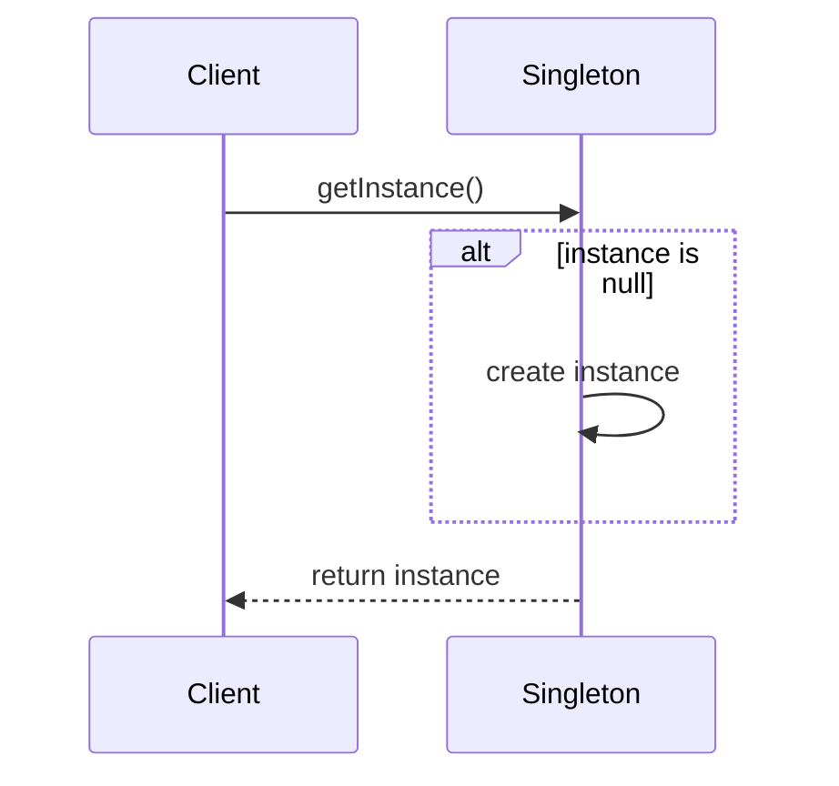

## 3.2. Singleton Pattern

The Singleton Pattern is one of the most well-known design patterns in object-oriented programming. It is a creational pattern that ensures a class has only one instance and provides a global point of access to that instance. This pattern is particularly useful in scenarios where a single instance of a class is required to coordinate actions across a system.

### Intent and Motivation

The primary intent of the Singleton Pattern is to:

- **Ensure a Class Has Only One Instance**: This is crucial in scenarios where having multiple instances would lead to inconsistent behavior or resource conflicts. For example, a configuration manager or a logging service should have a single point of control.
  
- **Provide a Global Access Point to the Instance**: This allows any part of the application to access the singleton instance without needing to pass references around, simplifying the code structure and enhancing maintainability.

### Applicability

The Singleton Pattern is appropriate in the following situations:

- **Resource Management**: When managing a resource that is expensive to create or access, such as a database connection or a file system handler.
  
- **Configuration Management**: When a single configuration object is needed to manage application settings.
  
- **Logging**: When a centralized logging mechanism is required to ensure consistent logging across different parts of an application.

- **Control Access to Shared Resources**: When you need to control access to shared resources, such as printers or hardware interfaces.

### Structure

The structure of the Singleton Pattern can be represented using a class diagram. The diagram below illustrates the basic structure of a Singleton class.

```mermaid
classDiagram
    class Singleton {
        - static instance : Singleton
        - Singleton()
        + static getInstance() : Singleton
    }
    Singleton : + static getInstance() : Singleton
    Singleton : - static instance : Singleton
```

### Participants and Collaborations

- **Singleton Class**: This class is responsible for creating and managing its single instance. It provides a static method to access the instance.

- **Client**: The client accesses the singleton instance through the static method provided by the Singleton class.

### Consequences

The Singleton Pattern offers several advantages and trade-offs:

#### Advantages

- **Controlled Access to the Single Instance**: The singleton class controls the instantiation process, ensuring that only one instance is created.

- **Reduced Namespace Pollution**: By providing a single global access point, it reduces the need for global variables.

- **Flexibility**: The singleton instance can be subclassed, allowing for more flexible designs.

#### Trade-offs

- **Global State**: Singletons can introduce global state into an application, making it harder to test and maintain.

- **Concurrency Issues**: In multi-threaded applications, care must be taken to ensure that the singleton instance is created in a thread-safe manner.

- **Difficulties in Subclassing**: Subclassing a singleton can be challenging, as it requires careful management of the instance.

### Implementation Considerations

When implementing the Singleton Pattern, several considerations must be taken into account:

#### Lazy Initialization

Lazy initialization is a technique where the singleton instance is created only when it is needed. This can improve performance by avoiding unnecessary object creation.

#### Thread Safety

In multi-threaded applications, it is crucial to ensure that the singleton instance is created in a thread-safe manner. This can be achieved using synchronization mechanisms or by using language-specific features, such as the `volatile` keyword in Java.

#### Serialization Issues

When a singleton class implements the `Serializable` interface, special care must be taken to ensure that the singleton property is maintained during serialization and deserialization.

### Detailed Pseudocode Implementation

Let's explore a detailed pseudocode implementation of the Singleton Pattern, incorporating lazy initialization and thread safety.

```pseudocode
class Singleton
    private static instance : Singleton = null

    // Private constructor to prevent instantiation
    private Singleton()
        // Initialization code here

    // Static method to get the singleton instance
    public static getInstance() : Singleton
        if instance == null
            lock Singleton.class
                if instance == null
                    instance = new Singleton()
        return instance
```

#### Step-by-Step Explanation

1. **Private Static Instance**: The singleton instance is stored in a private static variable. This ensures that only one instance exists.

2. **Private Constructor**: The constructor is private, preventing direct instantiation from outside the class.

3. **Public Static Method**: The `getInstance` method provides a global access point to the singleton instance. It checks if the instance is `null` and creates a new instance if necessary.

4. **Double-Checked Locking**: To ensure thread safety, the method uses double-checked locking. This minimizes the overhead of acquiring a lock by first checking if the instance is `null` outside of the synchronized block.

### Example Usage Scenarios

The Singleton Pattern can be used in various scenarios, such as:

- **Configuration Manager**: A singleton configuration manager can be used to manage application settings, ensuring that all parts of the application use the same configuration.

- **Logging Service**: A singleton logging service can be used to provide a centralized logging mechanism, ensuring consistent logging across different parts of an application.

- **Database Connection Pool**: A singleton database connection pool can be used to manage a pool of database connections, ensuring efficient use of resources.

### Exercises

To reinforce your understanding of the Singleton Pattern, try solving the following exercises:

1. **Implement a Singleton Logger**: Create a singleton logger class that provides a method to log messages to a file. Ensure that the logger is thread-safe.

2. **Singleton Configuration Manager**: Implement a singleton configuration manager that reads configuration settings from a file and provides methods to access these settings.

3. **Thread-Safe Singleton**: Modify the singleton implementation to ensure that it is thread-safe without using synchronization.

### Visual Aids

#### UML Diagrams

The UML class diagram provided earlier illustrates the basic structure of the Singleton Pattern. Let's also look at a sequence diagram to understand how the singleton instance is accessed.



#### Sequence Diagrams Illustrating Singleton Usage

The sequence diagram above shows the interaction between the client and the singleton class. The client calls the `getInstance` method, which checks if the instance is `null` and creates a new instance if necessary.

### Design Considerations

When using the Singleton Pattern, consider the following:

- **When to Use**: Use the Singleton Pattern when a single instance of a class is required to coordinate actions across a system.

- **Avoid Overuse**: Avoid using singletons for classes that do not require a single instance, as this can lead to unnecessary complexity and global state.

- **Testing**: Singletons can make testing difficult, as they introduce global state. Consider using dependency injection to manage singleton instances in tests.

### Differences and Similarities

The Singleton Pattern is often compared to other creational patterns, such as the Factory Method and Abstract Factory patterns. While these patterns focus on object creation, the Singleton Pattern specifically ensures that only one instance of a class is created. Unlike the Factory Method and Abstract Factory patterns, the Singleton Pattern does not provide a way to create multiple instances or families of related objects.

### Try It Yourself

To deepen your understanding of the Singleton Pattern, try modifying the pseudocode example provided earlier:

- **Add Logging**: Add logging statements to the `getInstance` method to track when the singleton instance is created.

- **Experiment with Thread Safety**: Remove the synchronization from the `getInstance` method and observe the behavior in a multi-threaded environment.

- **Implement a Subclass**: Attempt to subclass the singleton class and observe the challenges involved.

### Embrace the Journey

Remember, mastering design patterns is a journey. The Singleton Pattern is just one of many patterns that can enhance your software design skills. Keep experimenting, stay curious, and enjoy the journey!

## Quiz Time!



### What is the primary intent of the Singleton Pattern?

- [x] To ensure a class has only one instance and provide a global access point to it
- [ ] To create multiple instances of a class
- [ ] To encapsulate a group of algorithms
- [ ] To define a family of interchangeable algorithms

> **Explanation:** The Singleton Pattern ensures a class has only one instance and provides a global access point to it.

### In which scenario is the Singleton Pattern most appropriate?

- [x] When a single instance of a class is needed to coordinate actions across a system
- [ ] When multiple instances of a class are needed
- [ ] When a class needs to be subclassed
- [ ] When a class needs to encapsulate a group of algorithms

> **Explanation:** The Singleton Pattern is most appropriate when a single instance of a class is needed to coordinate actions across a system.

### What is a potential trade-off of using the Singleton Pattern?

- [x] It can introduce global state into an application
- [ ] It simplifies testing
- [ ] It allows for easy subclassing
- [ ] It reduces flexibility

> **Explanation:** A potential trade-off of using the Singleton Pattern is that it can introduce global state into an application, making it harder to test and maintain.

### What is lazy initialization in the context of the Singleton Pattern?

- [x] Creating the singleton instance only when it is needed
- [ ] Creating the singleton instance at the start of the application
- [ ] Creating multiple instances of the singleton class
- [ ] Creating the singleton instance in a separate thread

> **Explanation:** Lazy initialization refers to creating the singleton instance only when it is needed, improving performance by avoiding unnecessary object creation.

### How can thread safety be ensured in a Singleton Pattern implementation?

- [x] By using synchronization mechanisms
- [ ] By creating multiple instances of the singleton class
- [ ] By avoiding the use of static methods
- [ ] By using global variables

> **Explanation:** Thread safety can be ensured in a Singleton Pattern implementation by using synchronization mechanisms to control access to the singleton instance.

### What is double-checked locking in the context of the Singleton Pattern?

- [x] A technique to minimize the overhead of acquiring a lock by checking if the instance is null outside of the synchronized block
- [ ] A technique to create multiple instances of the singleton class
- [ ] A technique to avoid using static methods
- [ ] A technique to use global variables

> **Explanation:** Double-checked locking is a technique to minimize the overhead of acquiring a lock by checking if the instance is null outside of the synchronized block.

### What is a potential issue when a singleton class implements the Serializable interface?

- [x] Maintaining the singleton property during serialization and deserialization
- [ ] Creating multiple instances of the singleton class
- [ ] Avoiding the use of static methods
- [ ] Using global variables

> **Explanation:** A potential issue when a singleton class implements the Serializable interface is maintaining the singleton property during serialization and deserialization.

### What is a disadvantage of using the Singleton Pattern?

- [x] It can make testing difficult due to global state
- [ ] It simplifies testing
- [ ] It allows for easy subclassing
- [ ] It reduces flexibility

> **Explanation:** A disadvantage of using the Singleton Pattern is that it can make testing difficult due to the introduction of global state.

### Which design pattern is often compared to the Singleton Pattern?

- [x] Factory Method Pattern
- [ ] Observer Pattern
- [ ] Strategy Pattern
- [ ] Decorator Pattern

> **Explanation:** The Factory Method Pattern is often compared to the Singleton Pattern, as both are creational patterns focused on object creation.

### True or False: The Singleton Pattern provides a way to create multiple instances of a class.

- [ ] True
- [x] False

> **Explanation:** False. The Singleton Pattern ensures that only one instance of a class is created.


