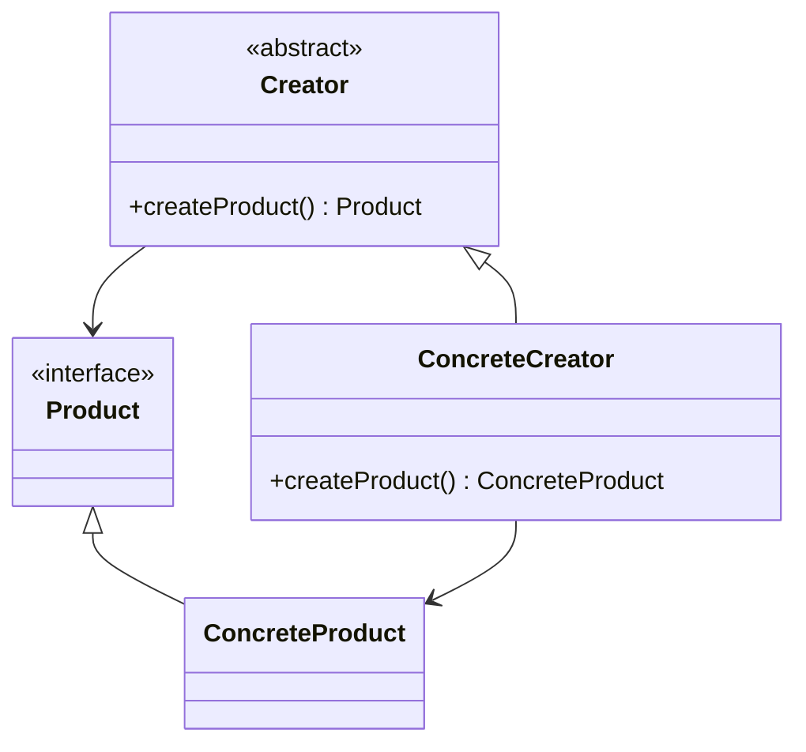
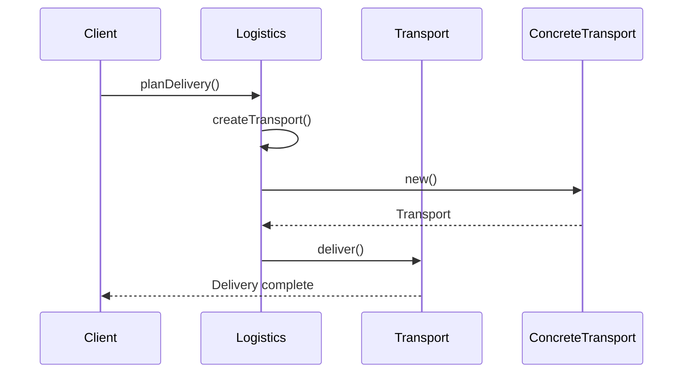

## 3.3. Factory Method Pattern

In the realm of object-oriented programming (OOP), the Factory Method Pattern stands as a cornerstone for creating objects in a way that promotes flexibility and extensibility. This pattern is particularly useful when a class cannot anticipate the class of objects it must create. Let's delve into the intricacies of the Factory Method Pattern, exploring its intent, structure, and practical implementation through pseudocode.

### Intent and Motivation

The Factory Method Pattern is a creational design pattern that provides an interface for creating objects in a superclass, but allows subclasses to alter the type of objects that will be created. The primary intent is to define an interface for object creation, while deferring the instantiation process to subclasses. This approach is beneficial in scenarios where a class needs to delegate the responsibility of object creation to its subclasses.

#### Key Motivations:

- **Decoupling Object Creation:** By using a factory method, we decouple the code that creates an object from the code that uses the object. This separation allows for more flexible and maintainable code.
- **Promoting Extensibility:** Subclasses can override the factory method to change the class of objects that will be created, allowing for easy extension of the codebase.
- **Encapsulating Instantiation Logic:** The pattern encapsulates the instantiation logic, making it easier to manage changes and variations in object creation.

### Applicability

The Factory Method Pattern is applicable in various scenarios, including:

- **Dynamic Object Creation:** When a class cannot anticipate the class of objects it needs to create.
- **Complex Object Initialization:** When the initialization of an object is complex or requires multiple steps.
- **Extensible Frameworks:** In frameworks where the core framework defines the interface for creating objects, and the specific implementations are provided by the client code.

### Structure

The structure of the Factory Method Pattern involves several key components:

- **Product:** Defines the interface for objects the factory method creates.
- **ConcreteProduct:** Implements the Product interface.
- **Creator:** Declares the factory method, which returns an object of type Product. It may also define a default implementation of the factory method.
- **ConcreteCreator:** Overrides the factory method to return an instance of ConcreteProduct.

Here is a UML diagram illustrating the structure of the Factory Method Pattern:



### Participants and Collaborations

- **Creator:** The class that contains the factory method. It may provide a default implementation of the factory method that returns a default ConcreteProduct object.
- **ConcreteCreator:** A subclass of Creator that overrides the factory method to return an instance of a specific ConcreteProduct.
- **Product:** The interface or abstract class that defines the type of objects the factory method creates.
- **ConcreteProduct:** A class that implements the Product interface.

These participants collaborate to allow the client code to work with the Product interface, while the ConcreteCreator handles the instantiation of specific ConcreteProduct objects.

### Consequences

The Factory Method Pattern offers several advantages, including:

- **Flexibility:** By decoupling the instantiation process from the client code, the pattern allows for more flexible and maintainable code.
- **Extensibility:** New ConcreteProduct classes can be added without modifying the existing client code.
- **Encapsulation:** The pattern encapsulates the instantiation logic, making it easier to manage changes and variations in object creation.

However, there are also some trade-offs to consider:

- **Complexity:** The pattern can introduce additional complexity, as it requires the creation of multiple classes and interfaces.
- **Overhead:** The pattern may introduce overhead if used in scenarios where simple object creation would suffice.

### Implementation Considerations

When implementing the Factory Method Pattern, consider the following:

- **Parameterized Factories:** The factory method can be parameterized to allow for more flexible object creation. For example, the method can take a parameter that specifies the type of object to create.
- **Handling Product Variations:** The pattern can be extended to handle variations in product creation. For example, the factory method can be overridden to create different variations of a product based on specific criteria.

### Detailed Pseudocode Implementation

Let's explore a detailed pseudocode implementation of the Factory Method Pattern. We'll use a simple example of a logistics application that needs to create different types of transport vehicles.

```pseudocode
// Define the Product interface
interface Transport {
    method deliver()
}

// Implement ConcreteProduct classes
class Truck implements Transport {
    method deliver() {
        print("Delivering by land in a truck.")
    }
}

class Ship implements Transport {
    method deliver() {
        print("Delivering by sea in a ship.")
    }
}

// Define the Creator class
abstract class Logistics {
    // Factory method
    abstract method createTransport() : Transport

    method planDelivery() {
        // Call the factory method to create a Transport object
        transport = createTransport()
        // Use the Transport object
        transport.deliver()
    }
}

// Implement ConcreteCreator classes
class RoadLogistics extends Logistics {
    method createTransport() : Transport {
        return new Truck()
    }
}

class SeaLogistics extends Logistics {
    method createTransport() : Transport {
        return new Ship()
    }
}

// Client code
method main() {
    logistics = new RoadLogistics()
    logistics.planDelivery()

    logistics = new SeaLogistics()
    logistics.planDelivery()
}
```

In this pseudocode example, we define a `Transport` interface with a `deliver` method. The `Truck` and `Ship` classes implement this interface. The `Logistics` class is the Creator, which declares the factory method `createTransport`. The `RoadLogistics` and `SeaLogistics` classes are ConcreteCreators that override the factory method to create specific types of transport.

### Example Usage Scenarios

The Factory Method Pattern is widely used in various applications, including:

- **GUI Libraries:** To create different types of UI components based on the platform or theme.
- **Document Editors:** To create different types of documents (e.g., Word, PDF) based on user input.
- **Game Development:** To create different types of game objects (e.g., enemies, power-ups) based on the game level.

### Exercises

To reinforce your understanding of the Factory Method Pattern, try the following exercises:

1. **Extend the Logistics Example:** Add a new type of transport, such as `Airplane`, and implement a new `AirLogistics` class.
2. **Parameterized Factory Method:** Modify the factory method to accept a parameter that specifies the type of transport to create.
3. **Real-World Application:** Identify a real-world application where the Factory Method Pattern could be applied, and outline how you would implement it.

### Visual Aids

To further illustrate the Factory Method Pattern, consider the following sequence diagram, which shows the interaction between the client code and the factory method:



### Knowledge Check

Before we wrap up, let's review some key takeaways:

- The Factory Method Pattern provides an interface for creating objects, allowing subclasses to decide which class to instantiate.
- It promotes flexibility and extensibility by decoupling the instantiation process from the client code.
- The pattern is applicable in scenarios where a class cannot anticipate the class of objects it needs to create.

### Embrace the Journey

Remember, mastering design patterns is a journey. As you continue to explore and apply these patterns, you'll gain a deeper understanding of how they can enhance your software development skills. Keep experimenting, stay curious, and enjoy the journey!

## Quiz Time!



### What is the primary intent of the Factory Method Pattern?

- [x] To define an interface for creating objects and allow subclasses to decide which class to instantiate.
- [ ] To encapsulate a request as an object.
- [ ] To provide a way to access elements of an aggregate object sequentially.
- [ ] To define a family of algorithms, encapsulate each one, and make them interchangeable.

> **Explanation:** The Factory Method Pattern's primary intent is to define an interface for creating objects, allowing subclasses to decide which class to instantiate.

### Which component in the Factory Method Pattern declares the factory method?

- [x] Creator
- [ ] ConcreteProduct
- [ ] Product
- [ ] ConcreteCreator

> **Explanation:** The Creator class declares the factory method, which is then overridden by ConcreteCreator classes.

### What is a key advantage of using the Factory Method Pattern?

- [x] It promotes flexibility and extensibility by decoupling object creation from client code.
- [ ] It simplifies the code by reducing the number of classes.
- [ ] It ensures that a class has only one instance.
- [ ] It provides a unified interface to a set of interfaces in a subsystem.

> **Explanation:** The Factory Method Pattern promotes flexibility and extensibility by decoupling the instantiation process from the client code.

### In the provided pseudocode example, what does the `createTransport` method return?

- [x] An object of type Transport
- [ ] An object of type Logistics
- [ ] An object of type Client
- [ ] An object of type ConcreteCreator

> **Explanation:** The `createTransport` method returns an object of type Transport, which is the interface for the objects created by the factory method.

### How can the Factory Method Pattern be extended to handle product variations?

- [x] By parameterizing the factory method to allow for more flexible object creation.
- [ ] By reducing the number of ConcreteProduct classes.
- [ ] By merging the Creator and ConcreteCreator classes.
- [ ] By eliminating the Product interface.

> **Explanation:** The Factory Method Pattern can be extended to handle product variations by parameterizing the factory method, allowing for more flexible object creation.

### What is a potential trade-off of using the Factory Method Pattern?

- [x] It can introduce additional complexity by requiring multiple classes and interfaces.
- [ ] It limits the flexibility of the code.
- [ ] It reduces the maintainability of the code.
- [ ] It makes it difficult to add new ConcreteProduct classes.

> **Explanation:** A potential trade-off of using the Factory Method Pattern is that it can introduce additional complexity by requiring multiple classes and interfaces.

### Which of the following is NOT a participant in the Factory Method Pattern?

- [ ] Creator
- [ ] ConcreteCreator
- [x] Adapter
- [ ] Product

> **Explanation:** The Adapter is not a participant in the Factory Method Pattern. The participants include Creator, ConcreteCreator, Product, and ConcreteProduct.

### In what scenario is the Factory Method Pattern particularly useful?

- [x] When a class cannot anticipate the class of objects it needs to create.
- [ ] When a class needs to ensure only one instance of itself is created.
- [ ] When a class needs to provide a unified interface to a set of interfaces in a subsystem.
- [ ] When a class needs to encapsulate a request as an object.

> **Explanation:** The Factory Method Pattern is particularly useful when a class cannot anticipate the class of objects it needs to create.

### What does the ConcreteCreator class do in the Factory Method Pattern?

- [x] It overrides the factory method to return an instance of a specific ConcreteProduct.
- [ ] It declares the factory method.
- [ ] It defines the interface for objects the factory method creates.
- [ ] It provides a default implementation of the factory method.

> **Explanation:** The ConcreteCreator class overrides the factory method to return an instance of a specific ConcreteProduct.

### True or False: The Factory Method Pattern can be used to create different types of UI components based on the platform or theme.

- [x] True
- [ ] False

> **Explanation:** True. The Factory Method Pattern can be used in GUI libraries to create different types of UI components based on the platform or theme.


