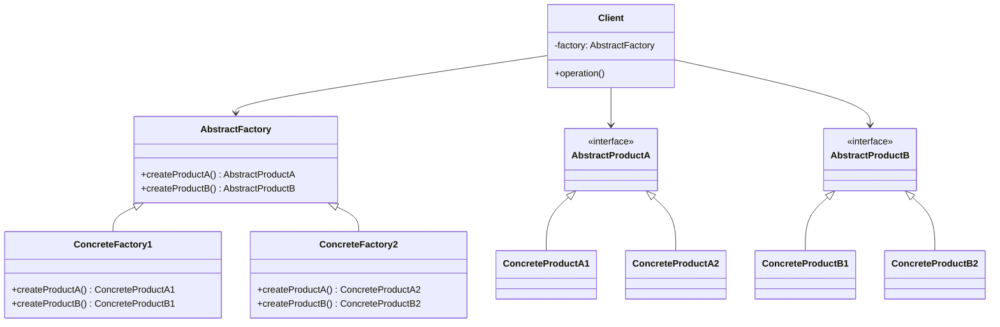

## 3.4. Abstract Factory Pattern

### Intent and Motivation

The Abstract Factory Pattern is a creational design pattern that provides an interface for creating families of related or dependent objects without specifying their concrete classes. This pattern is particularly useful when a system needs to be independent of how its objects are created, composed, and represented. It allows for the creation of a suite of products that are designed to work together seamlessly, ensuring consistency among products.

**Motivation:**

Imagine you are developing a cross-platform GUI application. You want to support different operating systems like Windows, macOS, and Linux. Each OS has its own set of UI components, such as buttons, checkboxes, and text fields. The Abstract Factory Pattern allows you to create a family of related UI components for each operating system without altering the client code.

### Applicability

The Abstract Factory Pattern is applicable when:

- A system needs to be independent of how its products are created, composed, and represented.
- A system should be configured with one of multiple families of products.
- A family of related product objects is designed to be used together, and you need to enforce this constraint.
- You want to provide a library of products, and you want to reveal just their interfaces, not their implementations.

### Structure

The Abstract Factory Pattern involves several key components:

- **AbstractFactory**: Declares an interface for operations that create abstract product objects.
- **ConcreteFactory**: Implements the operations to create concrete product objects.
- **AbstractProduct**: Declares an interface for a type of product object.
- **ConcreteProduct**: Defines a product object to be created by the corresponding concrete factory and implements the AbstractProduct interface.
- **Client**: Uses only interfaces declared by AbstractFactory and AbstractProduct classes.

Here's a visual representation of the Abstract Factory Pattern using a class diagram:



### Participants and Collaborations

- **AbstractFactory**: Defines the interface for creating abstract products.
- **ConcreteFactory**: Implements the operations to create concrete products.
- **AbstractProduct**: Declares an interface for a type of product object.
- **ConcreteProduct**: Implements the AbstractProduct interface.
- **Client**: Uses the interfaces declared by AbstractFactory and AbstractProduct classes.

**Collaborations:**

- Clients use the AbstractFactory to create instances of AbstractProduct.
- Each ConcreteFactory corresponds to a specific product family and creates concrete products that are part of that family.

### Consequences

The Abstract Factory Pattern provides several benefits:

- **Ensures Consistency Among Products**: By using a single factory to create related products, you ensure that the products are compatible and designed to work together.
- **Encapsulates Object Creation**: The pattern encapsulates the creation of product objects, allowing for flexibility in changing product families without modifying client code.
- **Promotes Code Reusability**: The pattern promotes code reusability by allowing you to introduce new product families without altering existing code.

However, there are also some trade-offs:

- **Complexity**: The pattern can introduce additional complexity due to the increased number of classes and interfaces.
- **Difficulty in Supporting New Products**: Adding new products to the existing family can be challenging, as it requires changes to the AbstractFactory interface and all its concrete implementations.

### Implementation Considerations

When implementing the Abstract Factory Pattern, consider the following:

- **Expanding Product Families**: If you anticipate the need to add new product families, ensure that your AbstractFactory interface is flexible enough to accommodate these changes.
- **Managing Dependencies**: Be mindful of dependencies between products. Ensure that the products created by a factory are compatible and designed to work together.
- **Avoiding Class Explosion**: The pattern can lead to a proliferation of classes and interfaces. Use it judiciously and consider alternatives if the complexity outweighs the benefits.

### Detailed Pseudocode Implementation

Let's explore a detailed pseudocode implementation of the Abstract Factory Pattern. We'll use the example of creating UI components for different operating systems.

```pseudocode
// Abstract Factory Interface
interface GUIFactory {
    createButton() : Button
    createCheckbox() : Checkbox
}

// Concrete Factory for Windows
class WindowsFactory implements GUIFactory {
    createButton() : Button {
        return new WindowsButton()
    }
    createCheckbox() : Checkbox {
        return new WindowsCheckbox()
    }
}

// Concrete Factory for macOS
class MacOSFactory implements GUIFactory {
    createButton() : Button {
        return new MacOSButton()
    }
    createCheckbox() : Checkbox {
        return new MacOSCheckbox()
    }
}

// Abstract Product for Button
interface Button {
    render()
}

// Concrete Product for Windows Button
class WindowsButton implements Button {
    render() {
        // Render a button in Windows style
        print("Rendering Windows Button")
    }
}

// Concrete Product for macOS Button
class MacOSButton implements Button {
    render() {
        // Render a button in macOS style
        print("Rendering macOS Button")
    }
}

// Abstract Product for Checkbox
interface Checkbox {
    render()
}

// Concrete Product for Windows Checkbox
class WindowsCheckbox implements Checkbox {
    render() {
        // Render a checkbox in Windows style
        print("Rendering Windows Checkbox")
    }
}

// Concrete Product for macOS Checkbox
class MacOSCheckbox implements Checkbox {
    render() {
        // Render a checkbox in macOS style
        print("Rendering macOS Checkbox")
    }
}

// Client Code
class Application {
    private factory: GUIFactory

    constructor(factory: GUIFactory) {
        this.factory = factory
    }

    createUI() {
        button: Button = this.factory.createButton()
        checkbox: Checkbox = this.factory.createCheckbox()
        button.render()
        checkbox.render()
    }
}

// Usage
factory: GUIFactory = new WindowsFactory()
app: Application = new Application(factory)
app.createUI()

factory = new MacOSFactory()
app = new Application(factory)
app.createUI()
```

### Example Usage Scenarios

The Abstract Factory Pattern is widely used in scenarios where a system needs to be independent of how its products are created. Here are some common usage scenarios:

- **Cross-Platform UI Libraries**: As demonstrated in the pseudocode example, the pattern is ideal for creating cross-platform UI libraries where different operating systems require different UI components.
- **Database Management Systems**: When developing a database management system that supports multiple database engines, the pattern can be used to create database connections and queries that are specific to each engine.
- **Game Development**: In game development, the pattern can be used to create different types of game objects, such as characters, weapons, and environments, that are specific to different game levels or themes.

### Exercises

To reinforce your understanding of the Abstract Factory Pattern, try the following exercises:

1. **Exercise 1**: Implement an Abstract Factory Pattern for a document editor that supports different document formats (e.g., PDF, Word, HTML). Create factories for each format that produce related components such as text editors, image handlers, and format converters.

2. **Exercise 2**: Modify the pseudocode example to add a new product family for Linux UI components. Implement the necessary factories and products to support this new family.

3. **Exercise 3**: Consider a scenario where you need to create a reporting system that generates reports in different formats (e.g., PDF, Excel, CSV). Use the Abstract Factory Pattern to design a system that creates report generators for each format.

### Visual Aids

To further illustrate the Abstract Factory Pattern, let's look at a sequence diagram that shows the interaction between the client and the factory to create UI components:


### Differences and Similarities

The Abstract Factory Pattern is often compared to other creational patterns, such as the Factory Method and Builder patterns. Here's how they differ:

- **Abstract Factory vs. Factory Method**: The Factory Method pattern focuses on creating a single product, while the Abstract Factory pattern creates families of related products. The Abstract Factory pattern uses multiple factory methods to achieve this.

- **Abstract Factory vs. Builder**: The Builder pattern is used to construct complex objects step by step, whereas the Abstract Factory pattern is used to create families of related objects. The Builder pattern focuses on the construction process, while the Abstract Factory pattern focuses on product families.

### Try It Yourself

To deepen your understanding of the Abstract Factory Pattern, try modifying the pseudocode example. Here are some suggestions:

- **Add a New Product**: Introduce a new product type, such as a `Slider`, and update the factories and products to support this new type.
- **Implement a New Factory**: Create a new factory for a different operating system, such as Linux, and implement the necessary products for this factory.
- **Experiment with Different Product Families**: Consider a different domain, such as a vehicle manufacturing system, and use the Abstract Factory Pattern to create families of related vehicle components.

### Knowledge Check

Before moving on, let's summarize the key takeaways from this section:

- The Abstract Factory Pattern provides an interface for creating families of related objects without specifying their concrete classes.
- It ensures consistency among products and promotes code reusability.
- The pattern is applicable in scenarios where a system needs to be independent of how its products are created.
- It involves several key components, including AbstractFactory, ConcreteFactory, AbstractProduct, ConcreteProduct, and Client.

Remember, mastering design patterns takes practice and experimentation. Keep exploring and applying the Abstract Factory Pattern in different scenarios to build a deeper understanding.

## Quiz Time!



### What is the primary intent of the Abstract Factory Pattern?

- [x] To provide an interface for creating families of related objects without specifying their concrete classes.
- [ ] To encapsulate a request as an object, thereby allowing for parameterization of clients with queues, requests, and operations.
- [ ] To define an interface for creating a single object, but let subclasses alter the type of objects that will be created.
- [ ] To separate the construction of a complex object from its representation so that the same construction process can create different representations.

> **Explanation:** The Abstract Factory Pattern is designed to provide an interface for creating families of related objects without specifying their concrete classes.

### Which of the following is a key component of the Abstract Factory Pattern?

- [x] AbstractFactory
- [ ] Singleton
- [ ] Prototype
- [ ] Adapter

> **Explanation:** The AbstractFactory is a key component of the Abstract Factory Pattern, responsible for declaring an interface for creating abstract product objects.

### What is a common consequence of using the Abstract Factory Pattern?

- [x] Ensures consistency among products.
- [ ] Reduces the number of classes needed in a system.
- [ ] Simplifies the creation of complex objects.
- [ ] Increases the coupling between client and product classes.

> **Explanation:** The Abstract Factory Pattern ensures consistency among products by using a single factory to create related products.

### In the Abstract Factory Pattern, what role does the Client play?

- [x] The Client uses only interfaces declared by AbstractFactory and AbstractProduct classes.
- [ ] The Client implements the operations to create concrete product objects.
- [ ] The Client defines an interface for a type of product object.
- [ ] The Client declares an interface for operations that create abstract product objects.

> **Explanation:** The Client in the Abstract Factory Pattern uses only interfaces declared by AbstractFactory and AbstractProduct classes.

### Which pattern is often compared to the Abstract Factory Pattern?

- [x] Factory Method
- [ ] Observer
- [ ] Decorator
- [ ] Command

> **Explanation:** The Factory Method Pattern is often compared to the Abstract Factory Pattern as both involve object creation.

### What is a potential drawback of the Abstract Factory Pattern?

- [x] It can introduce additional complexity due to the increased number of classes and interfaces.
- [ ] It limits the flexibility of a system by enforcing a single product family.
- [ ] It makes it difficult to add new product families.
- [ ] It increases the dependency between client and product classes.

> **Explanation:** The Abstract Factory Pattern can introduce additional complexity due to the increased number of classes and interfaces.

### How does the Abstract Factory Pattern promote code reusability?

- [x] By allowing you to introduce new product families without altering existing code.
- [ ] By reducing the number of classes needed in a system.
- [ ] By simplifying the creation of complex objects.
- [ ] By increasing the coupling between client and product classes.

> **Explanation:** The Abstract Factory Pattern promotes code reusability by allowing you to introduce new product families without altering existing code.

### Which of the following is NOT a participant in the Abstract Factory Pattern?

- [ ] ConcreteFactory
- [ ] AbstractProduct
- [x] Singleton
- [ ] ConcreteProduct

> **Explanation:** Singleton is not a participant in the Abstract Factory Pattern. The participants include ConcreteFactory, AbstractProduct, and ConcreteProduct.

### What is a common use case for the Abstract Factory Pattern?

- [x] Cross-platform UI libraries
- [ ] Real-time data processing
- [ ] Network communication protocols
- [ ] Memory management systems

> **Explanation:** Cross-platform UI libraries are a common use case for the Abstract Factory Pattern, where different operating systems require different UI components.

### True or False: The Abstract Factory Pattern is used to create a single product.

- [ ] True
- [x] False

> **Explanation:** False. The Abstract Factory Pattern is used to create families of related objects, not just a single product.


