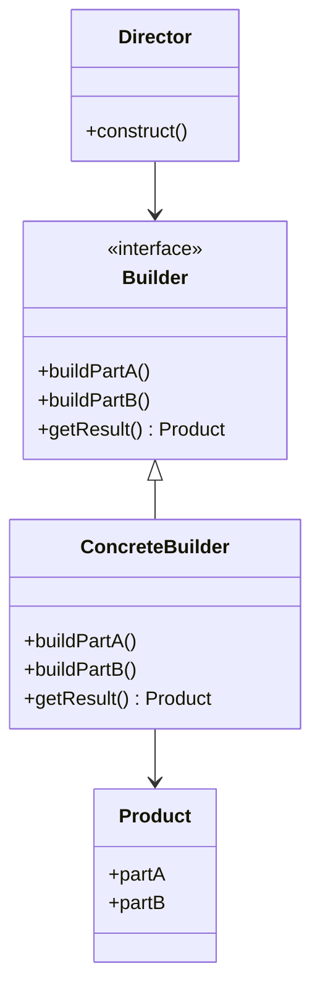
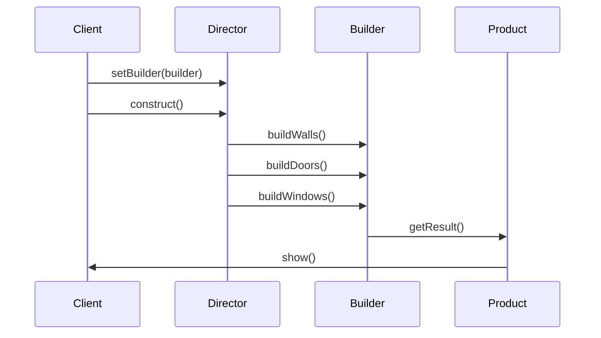

## 3.5. Builder Pattern

The Builder Pattern is a creational design pattern that provides a flexible solution to constructing complex objects. It separates the construction of an object from its representation, allowing the same construction process to create different representations. This pattern is particularly useful when an object needs to be created with many optional parameters or when the construction process involves multiple steps.

### Intent and Motivation

The primary intent of the Builder Pattern is to separate the construction of a complex object from its representation, enabling the same construction process to create various representations. This pattern is particularly beneficial when:

- **Objects are complex**: If an object requires multiple steps to construct, the Builder Pattern can manage this complexity by breaking down the construction process into manageable steps.
- **Objects have numerous optional parameters**: The pattern allows for the creation of objects with optional parameters without needing to pass numerous arguments to a constructor.
- **Objects require a consistent construction process**: By using a builder, you can ensure that objects are constructed consistently, even if they have different representations.

### Applicability

Consider using the Builder Pattern when:

- You need to create complex objects with many parts.
- The construction process must allow different representations of the object.
- You want to isolate the construction code from the representation code.
- You need to construct an object in a step-by-step manner.

### Structure

The Builder Pattern typically involves the following components:

- **Builder**: An interface or abstract class defining the steps to construct a product.
- **ConcreteBuilder**: A class that implements the Builder interface and provides specific implementations for the construction steps.
- **Director**: A class that constructs an object using the Builder interface.
- **Product**: The complex object being constructed.

#### Diagram

Here is a visual representation of the Builder Pattern structure:



### Participants and Collaborations

- **Director**: Constructs an object using the Builder interface. It is responsible for executing the construction steps in a particular sequence.
- **Builder**: Specifies an abstract interface for creating parts of a Product object.
- **ConcreteBuilder**: Constructs and assembles parts of the product by implementing the Builder interface. It also defines and keeps track of the representation it creates and provides an interface for retrieving the product.
- **Product**: Represents the complex object under construction. ConcreteBuilder builds the product's internal representation and defines the process by which it's assembled.

### Consequences

The Builder Pattern offers several advantages:

- **Improved Code Readability**: By separating the construction of an object from its representation, the Builder Pattern makes the code more readable and maintainable.
- **Flexibility**: The pattern allows for the construction of complex objects in a step-by-step manner, providing flexibility in the construction process.
- **Reusability**: Builders can be reused to create different representations of the same object.

### Implementation Considerations

When implementing the Builder Pattern, consider the following:

- **Fluent Interface**: Implementing a fluent interface can make the Builder Pattern more intuitive and easier to use. A fluent interface allows method chaining, making the code more readable.
- **Handling Optional Parameters**: The Builder Pattern is ideal for handling optional parameters, as it allows for the construction of objects with only the necessary parameters.

### Detailed Pseudocode Implementation

Let's explore a detailed pseudocode implementation of the Builder Pattern. We'll create a `House` object with various parts, such as walls, doors, and windows.

```pseudocode
// Product class
class House
    var walls
    var doors
    var windows

    method show()
        print("House with " + walls + " walls, " + doors + " doors, and " + windows + " windows.")

// Builder interface
interface HouseBuilder
    method buildWalls()
    method buildDoors()
    method buildWindows()
    method getResult() : House

// ConcreteBuilder class
class ConcreteHouseBuilder implements HouseBuilder
    private var house : House

    constructor()
        house = new House()

    method buildWalls()
        house.walls = 4

    method buildDoors()
        house.doors = 2

    method buildWindows()
        house.windows = 6

    method getResult() : House
        return house

// Director class
class Director
    private var builder : HouseBuilder

    method setBuilder(builder : HouseBuilder)
        this.builder = builder

    method construct()
        builder.buildWalls()
        builder.buildDoors()
        builder.buildWindows()

// Client code
method main()
    var builder : HouseBuilder = new ConcreteHouseBuilder()
    var director : Director = new Director()

    director.setBuilder(builder)
    director.construct()

    var house : House = builder.getResult()
    house.show()
```

In this pseudocode:

- We define a `House` class representing the product.
- The `HouseBuilder` interface specifies the steps required to build a house.
- `ConcreteHouseBuilder` implements the `HouseBuilder` interface and provides specific implementations for building walls, doors, and windows.
- The `Director` class constructs the house using the `HouseBuilder` interface.
- The client code demonstrates how to use the Builder Pattern to construct a `House` object.

### Example Usage Scenarios

The Builder Pattern is versatile and can be used in various scenarios, such as:

- **Building a complex UI**: When constructing a complex user interface with multiple components, the Builder Pattern can manage the construction process.
- **Creating complex configurations**: When creating complex configuration objects with multiple optional parameters, the Builder Pattern can simplify the construction process.
- **Constructing complex data structures**: When constructing complex data structures with multiple components, the Builder Pattern can manage the construction process.

### Exercises

1. Modify the `House` example to include additional parts, such as a roof and a garden. Implement these changes in the `ConcreteHouseBuilder` class.
2. Implement a `CarBuilder` class to construct a `Car` object with parts such as engine, wheels, and seats. Use the Builder Pattern to manage the construction process.
3. Create a `PizzaBuilder` class to construct a `Pizza` object with various toppings. Use the Builder Pattern to manage the construction process.

### Visual Aids

Here is a sequence diagram illustrating the interaction between the Director, Builder, and Product in the Builder Pattern:



### Try It Yourself

Experiment with the Builder Pattern by modifying the pseudocode examples. Try adding new parts to the `House` object or creating a new product, such as a `Computer`, with components like CPU, RAM, and storage. Consider implementing a fluent interface to make the Builder Pattern more intuitive and easier to use.

### Knowledge Check

- What is the primary intent of the Builder Pattern?
- How does the Builder Pattern improve code readability?
- In what scenarios is the Builder Pattern particularly useful?
- What are the key components of the Builder Pattern?
- How can a fluent interface enhance the Builder Pattern?

### Embrace the Journey

Remember, mastering design patterns is a journey. As you continue to explore the Builder Pattern, consider how it can be applied to your projects. Keep experimenting, stay curious, and enjoy the journey!

### Differences and Similarities

The Builder Pattern is often compared to the Factory Method and Abstract Factory patterns. While all three patterns deal with object creation, the Builder Pattern focuses on constructing a complex object step by step, whereas the Factory Method and Abstract Factory patterns focus on creating objects without specifying the exact class of object that will be created.

## Quiz Time!



### What is the primary intent of the Builder Pattern?

- [x] To separate the construction of a complex object from its representation
- [ ] To create a single instance of a class
- [ ] To define an interface for creating objects
- [ ] To provide a unified interface to a set of interfaces

> **Explanation:** The Builder Pattern's primary intent is to separate the construction of a complex object from its representation, allowing the same construction process to create different representations.

### Which of the following is NOT a component of the Builder Pattern?

- [ ] Director
- [ ] Builder
- [ ] ConcreteBuilder
- [x] Singleton

> **Explanation:** The Singleton is not a component of the Builder Pattern. The Builder Pattern consists of the Director, Builder, ConcreteBuilder, and Product.

### How does the Builder Pattern improve code readability?

- [x] By separating the construction of an object from its representation
- [ ] By providing a global access point to an instance
- [ ] By defining a family of algorithms
- [ ] By encapsulating a request as an object

> **Explanation:** The Builder Pattern improves code readability by separating the construction of an object from its representation, making the code more maintainable.

### In what scenario is the Builder Pattern particularly useful?

- [x] When constructing complex objects with many parts
- [ ] When ensuring a class has only one instance
- [ ] When defining an interface for creating objects
- [ ] When providing a unified interface to a set of interfaces

> **Explanation:** The Builder Pattern is particularly useful when constructing complex objects with many parts, as it allows for a step-by-step construction process.

### What is a fluent interface in the context of the Builder Pattern?

- [x] A design that allows method chaining for more readable code
- [ ] An interface that defines a family of algorithms
- [ ] A global access point to an instance
- [ ] A representation of an operation to be performed on elements

> **Explanation:** A fluent interface in the context of the Builder Pattern is a design that allows method chaining, making the code more readable and intuitive.

### Which pattern is often compared to the Builder Pattern?

- [x] Factory Method
- [ ] Observer
- [ ] Strategy
- [ ] Decorator

> **Explanation:** The Builder Pattern is often compared to the Factory Method pattern, as both deal with object creation.

### What is the role of the Director in the Builder Pattern?

- [x] To construct an object using the Builder interface
- [ ] To define an interface for creating parts of a product
- [ ] To provide a global access point to an instance
- [ ] To encapsulate a request as an object

> **Explanation:** The Director's role in the Builder Pattern is to construct an object using the Builder interface, executing the construction steps in a particular sequence.

### How can the Builder Pattern handle optional parameters?

- [x] By allowing the construction of objects with only the necessary parameters
- [ ] By providing a global access point to an instance
- [ ] By defining a family of algorithms
- [ ] By encapsulating a request as an object

> **Explanation:** The Builder Pattern can handle optional parameters by allowing the construction of objects with only the necessary parameters, making it ideal for objects with many optional parameters.

### What is the benefit of using the Builder Pattern for complex UI construction?

- [x] It manages the construction process of multiple components
- [ ] It provides a global access point to an instance
- [ ] It defines a family of algorithms
- [ ] It encapsulates a request as an object

> **Explanation:** The Builder Pattern benefits complex UI construction by managing the construction process of multiple components, allowing for a step-by-step approach.

### True or False: The Builder Pattern can be used to create different representations of the same object.

- [x] True
- [ ] False

> **Explanation:** True. The Builder Pattern allows the same construction process to create different representations of the same object.


