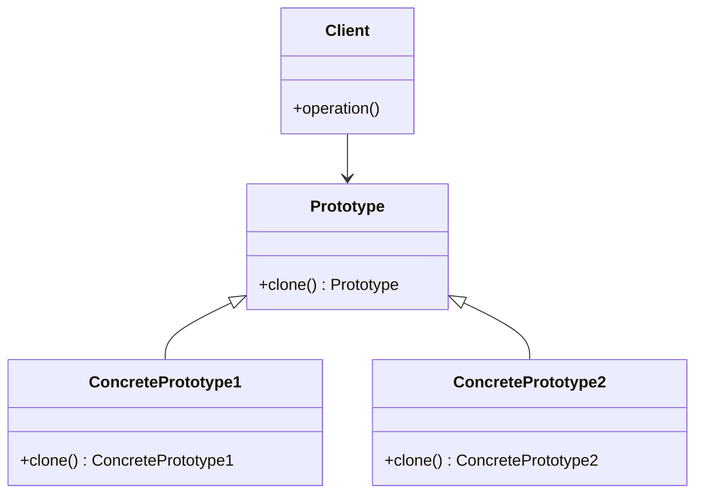
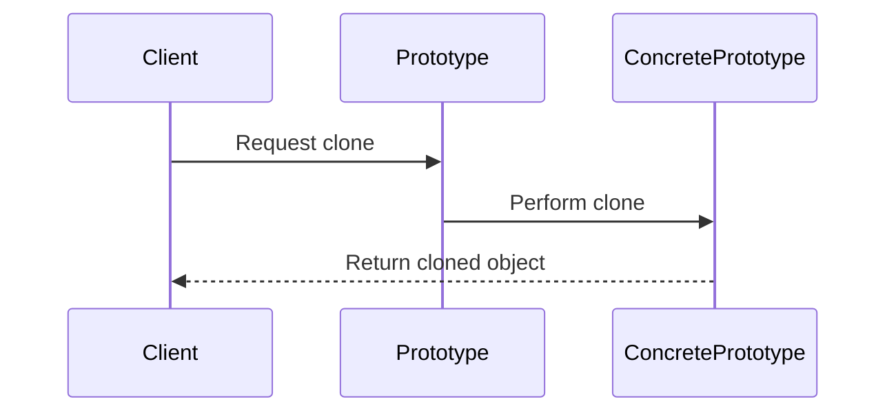

## 3.6. Prototype Pattern

The Prototype Pattern is a creational design pattern that focuses on the creation of new objects by copying an existing object, known as the prototype. This pattern is particularly useful when the cost of creating a new instance of a class is more expensive than copying an existing instance. In this section, we will delve into the intent and motivation behind the Prototype Pattern, explore its applicability, structure, and key participants, and provide a detailed pseudocode implementation. We will also discuss the consequences of using this pattern, including considerations for deep versus shallow copying and managing object state.

### Intent and Motivation

The primary intent of the Prototype Pattern is to enable the creation of new objects by copying an existing object, thereby reducing the overhead associated with creating objects from scratch. This pattern is motivated by scenarios where object creation is resource-intensive, such as when objects are complex, involve costly initialization, or require significant configuration.

#### Key Benefits

- **Efficiency**: By cloning existing objects, the Prototype Pattern can significantly reduce the time and resources required for object creation.
- **Flexibility**: The pattern allows for the dynamic addition of new object types at runtime without altering existing code.
- **Decoupling**: It decouples the client from the specific classes of objects it needs to instantiate, promoting a more flexible and maintainable codebase.

### Applicability

The Prototype Pattern is applicable in the following scenarios:

- When the cost of creating a new instance of a class is more expensive than copying an existing instance.
- When the system should be independent of how its products are created, composed, and represented.
- When instances of a class can have one of only a few different combinations of state, and it would be more convenient to clone a prototype than to manually set the state.

### Structure

The structure of the Prototype Pattern involves a prototype interface, concrete prototypes, and a client that interacts with these prototypes to create new objects.



### Participants and Collaborations

- **Prototype**: Declares an interface for cloning itself.
- **ConcretePrototype**: Implements the operation for cloning itself.
- **Client**: Creates a new object by asking a prototype to clone itself.

### Consequences

The Prototype Pattern offers several advantages, but it also comes with certain trade-offs:

- **Cloning Objects Efficiently**: The pattern allows for efficient object creation by cloning existing instances, which can be particularly beneficial for objects that are costly to create.
- **Deep vs. Shallow Copy**: A critical consideration when implementing the Prototype Pattern is whether to perform a deep copy or a shallow copy. A deep copy duplicates all objects referenced by the fields of the prototype, while a shallow copy duplicates only the top-level structure.
- **Managing Object State**: Care must be taken to ensure that the cloned objects are in a valid state and that any necessary adjustments are made to their internal state.

### Implementation Considerations

#### Deep vs. Shallow Copy

- **Shallow Copy**: Copies the object's fields directly, which means that if the object contains references to other objects, only the references are copied, not the actual objects.
- **Deep Copy**: Copies all objects referenced by the fields of the prototype, creating new instances of each referenced object.

#### Managing Object State

When cloning objects, it's essential to ensure that the cloned object is in a valid and consistent state. This may involve resetting certain fields or performing additional initialization steps.

### Detailed Pseudocode Implementation

Below is a detailed pseudocode implementation of the Prototype Pattern, illustrating both shallow and deep copying techniques.

```pseudocode
// Prototype interface
interface Prototype {
    function clone() : Prototype
}

// Concrete prototype implementing shallow copy
class ShallowConcretePrototype implements Prototype {
    var data
    var reference

    function clone() : Prototype {
        // Create a new instance and copy the data
        var copy = new ShallowConcretePrototype()
        copy.data = this.data
        copy.reference = this.reference // Shallow copy of reference
        return copy
    }
}

// Concrete prototype implementing deep copy
class DeepConcretePrototype implements Prototype {
    var data
    var reference

    function clone() : Prototype {
        // Create a new instance and copy the data
        var copy = new DeepConcretePrototype()
        copy.data = this.data
        copy.reference = new ReferenceType(this.reference) // Deep copy of reference
        return copy
    }
}

// Client code
function main() {
    // Create an original object
    var original = new DeepConcretePrototype()
    original.data = "Sample Data"
    original.reference = new ReferenceType("Reference Data")

    // Clone the original object
    var cloned = original.clone()

    // Output to demonstrate cloning
    print("Original data: " + original.data)
    print("Cloned data: " + cloned.data)
    print("Original reference: " + original.reference.data)
    print("Cloned reference: " + cloned.reference.data)
}
```

### Example Usage Scenarios

The Prototype Pattern is particularly useful in scenarios where object creation is resource-intensive or when objects need to be created dynamically at runtime. Here are a few examples:

- **Game Development**: In games, creating complex objects like characters or environments can be resource-intensive. By using prototypes, developers can clone existing objects to create new instances quickly.
- **Document Processing**: In applications that process documents, templates can be used as prototypes to create new documents with predefined structures and content.
- **Configuration Management**: In systems with complex configurations, prototypes can be used to create new configurations based on existing ones, allowing for easy customization and modification.

### Exercises

1. **Implement a Prototype Pattern**: Create a pseudocode implementation of the Prototype Pattern for a simple game character, including both shallow and deep copy methods.
2. **Experiment with Cloning**: Modify the provided pseudocode to include additional fields and methods. Observe how changes affect the cloning process.
3. **Design a Prototype Registry**: Implement a registry that stores prototypes and allows clients to request clones by prototype name.

### Visual Aids

Below is a sequence diagram illustrating the cloning process in the Prototype Pattern.



### Try It Yourself

To deepen your understanding of the Prototype Pattern, try modifying the pseudocode examples provided. Experiment with different types of objects, and explore the effects of shallow versus deep copying. Consider creating a prototype registry that allows for easy management and retrieval of prototypes.

### Knowledge Check

- **What is the primary benefit of using the Prototype Pattern?**
- **How does a shallow copy differ from a deep copy?**
- **In what scenarios is the Prototype Pattern most beneficial?**

### Embrace the Journey

Remember, mastering design patterns is a journey. The Prototype Pattern is just one of many tools in your software design toolkit. As you continue to explore and experiment with different patterns, you'll gain a deeper understanding of how to create flexible, efficient, and maintainable software. Keep experimenting, stay curious, and enjoy the journey!

## Quiz Time!



### What is the primary intent of the Prototype Pattern?

- [x] To create new objects by copying an existing object
- [ ] To define a family of algorithms
- [ ] To provide a unified interface to a set of interfaces
- [ ] To decouple an abstraction from its implementation

> **Explanation:** The Prototype Pattern is intended to create new objects by copying an existing object, which can be more efficient than creating new instances from scratch.

### Which of the following is a key benefit of the Prototype Pattern?

- [x] Efficiency in object creation
- [ ] Simplifying client interactions
- [ ] Enhancing testability
- [ ] Supporting undo/redo operations

> **Explanation:** The Prototype Pattern provides efficiency in object creation by allowing objects to be cloned rather than created from scratch.

### What is the difference between a shallow copy and a deep copy?

- [x] A shallow copy duplicates only the top-level structure, while a deep copy duplicates all referenced objects.
- [ ] A shallow copy duplicates all referenced objects, while a deep copy duplicates only the top-level structure.
- [ ] A shallow copy is faster than a deep copy.
- [ ] A deep copy is faster than a shallow copy.

> **Explanation:** A shallow copy duplicates only the top-level structure, meaning that references are copied but not the objects they point to. A deep copy duplicates all referenced objects, creating new instances of each.

### In which scenario is the Prototype Pattern most beneficial?

- [x] When object creation is resource-intensive
- [ ] When objects need to be accessed sequentially
- [ ] When objects need to be composed into tree structures
- [ ] When objects need to be decorated with additional responsibilities

> **Explanation:** The Prototype Pattern is most beneficial when object creation is resource-intensive, as it allows for efficient cloning of existing objects.

### What is a critical consideration when implementing the Prototype Pattern?

- [x] Deciding between deep and shallow copying
- [ ] Defining a stable interface
- [ ] Managing command histories
- [ ] Defining hook methods

> **Explanation:** A critical consideration when implementing the Prototype Pattern is deciding between deep and shallow copying, as this affects how the cloned objects are created and managed.

### True or False: The Prototype Pattern decouples the client from the specific classes of objects it needs to instantiate.

- [x] True
- [ ] False

> **Explanation:** True. The Prototype Pattern decouples the client from the specific classes of objects it needs to instantiate by allowing objects to be cloned from prototypes.

### Which participant in the Prototype Pattern declares an interface for cloning itself?

- [x] Prototype
- [ ] ConcretePrototype
- [ ] Client
- [ ] Context

> **Explanation:** The Prototype participant declares an interface for cloning itself, which is implemented by concrete prototypes.

### What is the role of the Client in the Prototype Pattern?

- [x] To create new objects by asking a prototype to clone itself
- [ ] To implement the operation for cloning itself
- [ ] To define a family of algorithms
- [ ] To encapsulate how a set of objects interact

> **Explanation:** The Client creates new objects by asking a prototype to clone itself, leveraging the Prototype Pattern to efficiently create objects.

### How does the Prototype Pattern promote flexibility?

- [x] By allowing for the dynamic addition of new object types at runtime
- [ ] By providing a unified interface to a set of interfaces
- [ ] By reducing coupling among components
- [ ] By supporting polymorphic iteration

> **Explanation:** The Prototype Pattern promotes flexibility by allowing for the dynamic addition of new object types at runtime without altering existing code.

### True or False: The Prototype Pattern is only applicable when objects are simple and easy to create.

- [ ] True
- [x] False

> **Explanation:** False. The Prototype Pattern is particularly useful when objects are complex and costly to create, as it allows for efficient cloning of existing instances.


