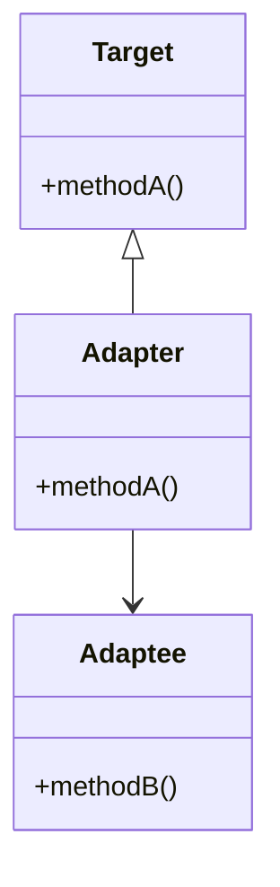
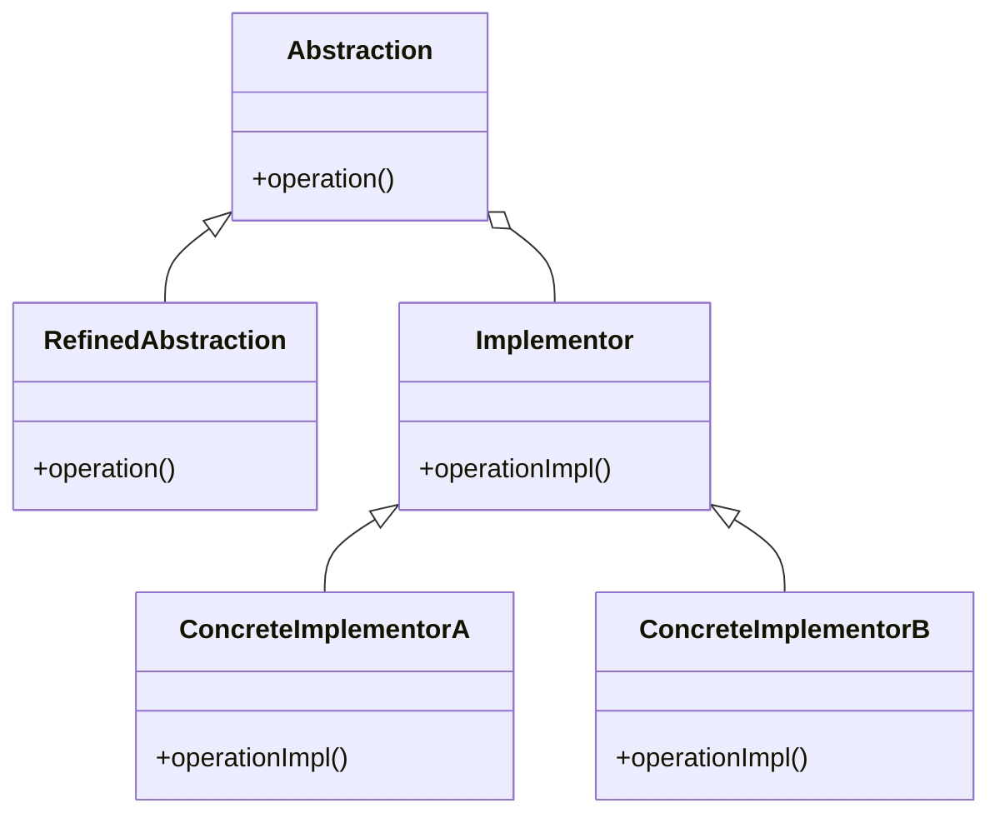
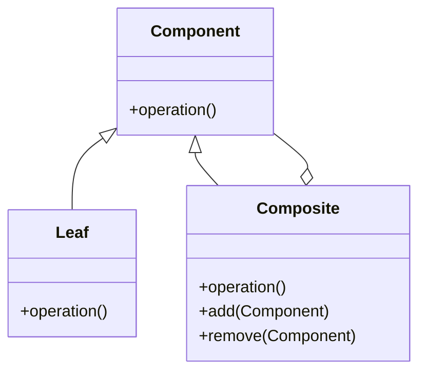
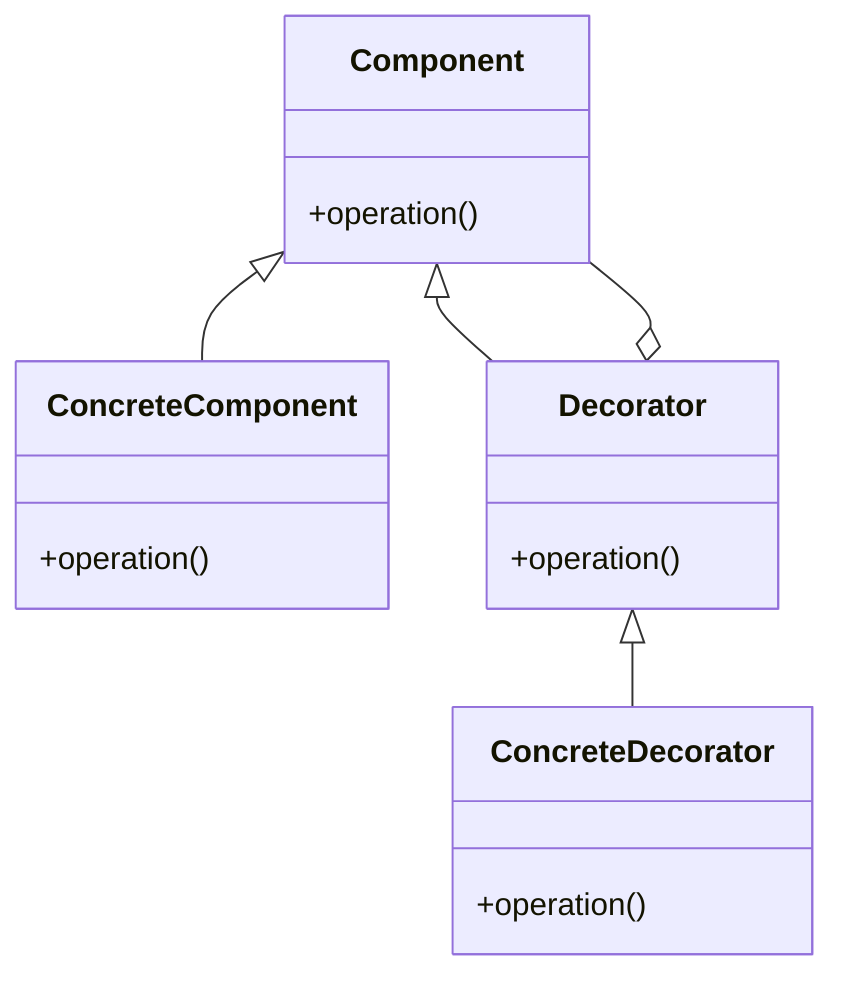

## 4.1. Introduction to Structural Patterns

In the realm of object-oriented design, structural patterns play a crucial role in defining the composition of classes and objects. They focus on simplifying the relationships between entities, facilitating code reuse, and ensuring that systems are both flexible and efficient. As we delve into the world of structural patterns, we'll explore their purpose, how they organize classes and objects, and why they are indispensable in modern software development.

### The Purpose of Structural Patterns

Structural design patterns are primarily concerned with how classes and objects are composed to form larger structures. They provide solutions to ease the design by identifying a simple way to realize relationships between entities. Let's break down the key purposes of structural patterns:

1. **Facilitating Code Reuse:** Structural patterns help in creating reusable components by defining clear interfaces and relationships between classes. This modularity allows developers to reuse code across different parts of an application or even in different projects.

2. **Improving Flexibility:** By decoupling the interface from the implementation, structural patterns make it easier to change the system's behavior without altering the existing codebase. This flexibility is vital for adapting to new requirements or integrating with other systems.

3. **Enhancing Maintainability:** Clear organization of classes and objects leads to code that is easier to understand and maintain. Structural patterns promote a clean architecture, reducing the complexity of the system and making it easier to debug and extend.

4. **Optimizing Performance:** Some structural patterns, like the Flyweight pattern, are specifically designed to improve performance by minimizing memory usage and processing time. They achieve this by sharing objects or reducing the number of objects created.

5. **Simplifying Complex Structures:** Structural patterns offer ways to manage complex class hierarchies and object compositions. They provide mechanisms to create complex structures from simpler components, making it easier to manage and understand large systems.

### How Structural Patterns Organize Classes and Objects

Structural patterns organize classes and objects in various ways to achieve their objectives. Here are some common strategies employed by these patterns:

- **Composition Over Inheritance:** Many structural patterns favor composition over inheritance. By composing objects, these patterns allow for more flexible and dynamic relationships, avoiding the rigidity of deep inheritance hierarchies.

- **Interface Abstraction:** Structural patterns often use interfaces to abstract the implementation details. This abstraction allows different implementations to be swapped easily without affecting the clients that use them.

- **Delegation:** Delegation is a technique where an object passes on a task to another object. Structural patterns use delegation to distribute responsibilities among different objects, promoting a separation of concerns.

- **Aggregation and Association:** Structural patterns use aggregation and association to define relationships between objects. Aggregation represents a "whole-part" relationship, while association defines a more general connection between objects.

- **Encapsulation of Variability:** By encapsulating the variability of a system, structural patterns allow for changes in behavior without affecting the core logic. This encapsulation is achieved through interfaces and abstract classes.

Let's explore some of the most common structural design patterns and see how they implement these strategies to organize classes and objects effectively.

### Key Structural Design Patterns

#### Adapter Pattern

- **Intent:** Convert the interface of a class into another interface that clients expect. The Adapter pattern allows classes to work together that couldn't otherwise because of incompatible interfaces.

- **Key Participants:**
  - **Target:** Defines the domain-specific interface that the client uses.
  - **Adapter:** Adapts the interface of the Adaptee to the Target interface.
  - **Adaptee:** Defines an existing interface that needs adapting.
  - **Client:** Collaborates with objects conforming to the Target interface.

- **Applicability:** Use the Adapter pattern when you want to use an existing class, and its interface does not match the one you need.

- **Sample Code Snippet:**

```pseudocode
// Target interface
interface Target {
    methodA()
}

// Adaptee class with a different interface
class Adaptee {
    methodB() {
        // Implementation
    }
}

// Adapter class that adapts Adaptee to Target
class Adapter implements Target {
    private adaptee: Adaptee

    constructor(adaptee: Adaptee) {
        this.adaptee = adaptee
    }

    methodA() {
        // Call the Adaptee's methodB
        this.adaptee.methodB()
    }
}

// Client code
function clientCode(target: Target) {
    target.methodA()
}

// Usage
let adaptee = new Adaptee()
let adapter = new Adapter(adaptee)
clientCode(adapter)
```

- **Design Considerations:** Consider using the Adapter pattern when you need to integrate with legacy systems or third-party libraries that have incompatible interfaces.

- **Differences and Similarities:** The Adapter pattern is often confused with the Bridge pattern. While both involve abstraction, the Adapter pattern focuses on making incompatible interfaces work together, whereas the Bridge pattern separates abstraction from implementation.

#### Bridge Pattern

- **Intent:** Decouple an abstraction from its implementation so that the two can vary independently.

- **Key Participants:**
  - **Abstraction:** Defines the abstraction's interface and maintains a reference to an object of type Implementor.
  - **RefinedAbstraction:** Extends the interface defined by Abstraction.
  - **Implementor:** Defines the interface for implementation classes.
  - **ConcreteImplementor:** Implements the Implementor interface.

- **Applicability:** Use the Bridge pattern when you want to separate an abstraction from its implementation, allowing them to evolve independently.

- **Sample Code Snippet:**

```pseudocode
// Implementor interface
interface Implementor {
    operationImpl()
}

// ConcreteImplementor class
class ConcreteImplementorA implements Implementor {
    operationImpl() {
        // Implementation A
    }
}

// ConcreteImplementor class
class ConcreteImplementorB implements Implementor {
    operationImpl() {
        // Implementation B
    }
}

// Abstraction class
class Abstraction {
    protected implementor: Implementor

    constructor(implementor: Implementor) {
        this.implementor = implementor
    }

    operation() {
        this.implementor.operationImpl()
    }
}

// RefinedAbstraction class
class RefinedAbstraction extends Abstraction {
    operation() {
        // Additional behavior
        super.operation()
    }
}

// Usage
let implementorA = new ConcreteImplementorA()
let abstraction = new RefinedAbstraction(implementorA)
abstraction.operation()
```

- **Design Considerations:** The Bridge pattern is useful when you have a complex class hierarchy and you want to separate the abstraction from its implementation to reduce the number of classes.

- **Differences and Similarities:** The Bridge pattern is similar to the Adapter pattern in that both involve abstraction. However, the Bridge pattern is used to separate abstraction from implementation, while the Adapter pattern is used to make incompatible interfaces work together.

#### Composite Pattern

- **Intent:** Compose objects into tree structures to represent part-whole hierarchies. The Composite pattern lets clients treat individual objects and compositions of objects uniformly.

- **Key Participants:**
  - **Component:** Declares the interface for objects in the composition.
  - **Leaf:** Represents leaf objects in the composition.
  - **Composite:** Defines behavior for components having children and stores child components.
  - **Client:** Manipulates objects in the composition through the Component interface.

- **Applicability:** Use the Composite pattern when you want to represent part-whole hierarchies of objects and allow clients to treat individual objects and compositions uniformly.

- **Sample Code Snippet:**

```pseudocode
// Component interface
interface Component {
    operation()
}

// Leaf class
class Leaf implements Component {
    operation() {
        // Leaf-specific behavior
    }
}

// Composite class
class Composite implements Component {
    private children: List<Component> = []

    operation() {
        // Composite-specific behavior
        for (let child of children) {
            child.operation()
        }
    }

    add(component: Component) {
        children.add(component)
    }

    remove(component: Component) {
        children.remove(component)
    }
}

// Usage
let leaf1 = new Leaf()
let leaf2 = new Leaf()
let composite = new Composite()
composite.add(leaf1)
composite.add(leaf2)
composite.operation()
```

- **Design Considerations:** The Composite pattern is useful when you need to work with tree structures and want to treat individual objects and compositions uniformly.

- **Differences and Similarities:** The Composite pattern is often confused with the Decorator pattern. While both involve composition, the Composite pattern focuses on part-whole hierarchies, whereas the Decorator pattern focuses on adding responsibilities to objects dynamically.

#### Decorator Pattern

- **Intent:** Attach additional responsibilities to an object dynamically. Decorators provide a flexible alternative to subclassing for extending functionality.

- **Key Participants:**
  - **Component:** Defines the interface for objects that can have responsibilities added to them dynamically.
  - **ConcreteComponent:** Defines an object to which additional responsibilities can be attached.
  - **Decorator:** Maintains a reference to a Component object and defines an interface that conforms to Component's interface.
  - **ConcreteDecorator:** Adds responsibilities to the component.

- **Applicability:** Use the Decorator pattern when you want to add responsibilities to individual objects dynamically and transparently, without affecting other objects.

- **Sample Code Snippet:**

```pseudocode
// Component interface
interface Component {
    operation()
}

// ConcreteComponent class
class ConcreteComponent implements Component {
    operation() {
        // ConcreteComponent-specific behavior
    }
}

// Decorator class
class Decorator implements Component {
    protected component: Component

    constructor(component: Component) {
        this.component = component
    }

    operation() {
        this.component.operation()
    }
}

// ConcreteDecorator class
class ConcreteDecorator extends Decorator {
    operation() {
        // Additional behavior
        super.operation()
    }
}

// Usage
let component = new ConcreteComponent()
let decorator = new ConcreteDecorator(component)
decorator.operation()
```

- **Design Considerations:** The Decorator pattern is useful when you need to add responsibilities to objects dynamically and want to avoid subclassing.

- **Differences and Similarities:** The Decorator pattern is similar to the Composite pattern in that both involve composition. However, the Decorator pattern focuses on adding responsibilities to objects dynamically, while the Composite pattern focuses on part-whole hierarchies.

#### Facade Pattern

- **Intent:** Provide a unified interface to a set of interfaces in a subsystem. The Facade pattern defines a higher-level interface that makes the subsystem easier to use.

- **Key Participants:**
  - **Facade:** Provides a simplified interface to the subsystem.
  - **Subsystem Classes:** Implement subsystem functionality and handle work assigned by the Facade object.

- **Applicability:** Use the Facade pattern when you want to provide a simple interface to a complex subsystem.

- **Sample Code Snippet:**

```pseudocode
// Subsystem classes
class SubsystemA {
    operationA() {
        // SubsystemA-specific behavior
    }
}

class SubsystemB {
    operationB() {
        // SubsystemB-specific behavior
    }
}

// Facade class
class Facade {
    private subsystemA: SubsystemA
    private subsystemB: SubsystemB

    constructor() {
        this.subsystemA = new SubsystemA()
        this.subsystemB = new SubsystemB()
    }

    operation() {
        this.subsystemA.operationA()
        this.subsystemB.operationB()
    }
}

// Usage
let facade = new Facade()
facade.operation()
```

- **Design Considerations:** The Facade pattern is useful when you need to simplify interactions with a complex subsystem and want to provide a unified interface.

- **Differences and Similarities:** The Facade pattern is often confused with the Adapter pattern. While both provide a simplified interface, the Facade pattern is used to simplify interactions with a complex subsystem, whereas the Adapter pattern is used to make incompatible interfaces work together.

#### Flyweight Pattern

- **Intent:** Use sharing to support large numbers of fine-grained objects efficiently.

- **Key Participants:**
  - **Flyweight:** Declares an interface through which flyweights can receive and act on extrinsic state.
  - **ConcreteFlyweight:** Implements the Flyweight interface and stores intrinsic state.
  - **FlyweightFactory:** Creates and manages flyweight objects.
  - **Client:** Maintains references to flyweights and computes or stores extrinsic state.

- **Applicability:** Use the Flyweight pattern when you need to support a large number of fine-grained objects efficiently.

- **Sample Code Snippet:**

```pseudocode
// Flyweight interface
interface Flyweight {
    operation(extrinsicState)
}

// ConcreteFlyweight class
class ConcreteFlyweight implements Flyweight {
    private intrinsicState

    operation(extrinsicState) {
        // Use intrinsicState and extrinsicState
    }
}

// FlyweightFactory class
class FlyweightFactory {
    private flyweights: Map<String, Flyweight> = new Map()

    getFlyweight(key: String): Flyweight {
        if (!flyweights.has(key)) {
            flyweights.set(key, new ConcreteFlyweight())
        }
        return flyweights.get(key)
    }
}

// Usage
let factory = new FlyweightFactory()
let flyweight = factory.getFlyweight("key")
flyweight.operation("extrinsicState")
```

- **Design Considerations:** The Flyweight pattern is useful when you need to support a large number of fine-grained objects efficiently and want to minimize memory usage.

- **Differences and Similarities:** The Flyweight pattern is often confused with the Singleton pattern. While both involve sharing, the Flyweight pattern is used to support a large number of fine-grained objects, whereas the Singleton pattern is used to ensure a class has only one instance.

#### Proxy Pattern

- **Intent:** Provide a placeholder for another object to control access to it.

- **Key Participants:**
  - **Proxy:** Maintains a reference to the real subject and provides an interface identical to the subject's.
  - **RealSubject:** Defines the real object that the proxy represents.
  - **Client:** Interacts with the proxy object.

- **Applicability:** Use the Proxy pattern when you need to control access to an object and want to provide a placeholder for another object.

- **Sample Code Snippet:**

```pseudocode
// Subject interface
interface Subject {
    request()
}

// RealSubject class
class RealSubject implements Subject {
    request() {
        // RealSubject-specific behavior
    }
}

// Proxy class
class Proxy implements Subject {
    private realSubject: RealSubject

    request() {
        if (!this.realSubject) {
            this.realSubject = new RealSubject()
        }
        this.realSubject.request()
    }
}

// Usage
let proxy = new Proxy()
proxy.request()
```

- **Design Considerations:** The Proxy pattern is useful when you need to control access to an object and want to provide a placeholder for another object.

- **Differences and Similarities:** The Proxy pattern is often confused with the Decorator pattern. While both involve providing an interface to another object, the Proxy pattern focuses on controlling access, whereas the Decorator pattern focuses on adding responsibilities.

### Visualizing Structural Patterns

To better understand how structural patterns organize classes and objects, let's visualize some of these patterns using Mermaid.js diagrams.

#### Adapter Pattern Diagram



**Description:** The diagram illustrates how the Adapter pattern converts the interface of the Adaptee class into the Target interface expected by the client.

#### Bridge Pattern Diagram



**Description:** The diagram shows how the Bridge pattern decouples an abstraction from its implementation, allowing both to vary independently.

#### Composite Pattern Diagram



**Description:** The diagram represents the Composite pattern's ability to compose objects into tree structures, treating individual objects and compositions uniformly.

#### Decorator Pattern Diagram



**Description:** The diagram illustrates how the Decorator pattern attaches additional responsibilities to an object dynamically.

### Try It Yourself

To deepen your understanding of structural patterns, try modifying the code examples provided. For instance, in the Adapter pattern, add a new method to the Adaptee class and update the Adapter to accommodate this change. Experiment with different configurations and observe how the patterns facilitate flexibility and maintainability.

### Knowledge Check

1. **What is the primary purpose of structural design patterns?**
   - To organize classes and objects in a way that simplifies relationships and promotes code reuse.

2. **How do structural patterns improve flexibility in a system?**
   - By decoupling the interface from the implementation, allowing changes without affecting the existing codebase.

3. **What is the difference between the Adapter and Bridge patterns?**
   - The Adapter pattern makes incompatible interfaces work together, while the Bridge pattern separates abstraction from implementation.

4. **Why is the Composite pattern useful in representing part-whole hierarchies?**
   - It allows clients to treat individual objects and compositions uniformly.

5. **How does the Decorator pattern differ from subclassing?**
   - It adds responsibilities to objects dynamically without affecting other objects, providing a flexible alternative to subclassing.

### Embrace the Journey

Remember, mastering structural patterns is a journey. As you explore these patterns, you'll discover new ways to organize your code, making it more maintainable and flexible. Keep experimenting, stay curious, and enjoy the process of becoming a more proficient software architect.

## Quiz Time!



### What is the primary purpose of structural design patterns?

- [x] To organize classes and objects in a way that simplifies relationships and promotes code reuse.
- [ ] To define the behavior of objects.
- [ ] To manage the lifecycle of objects.
- [ ] To encapsulate algorithms.

> **Explanation:** Structural design patterns focus on organizing classes and objects to simplify relationships and promote code reuse.

### How do structural patterns improve flexibility in a system?

- [x] By decoupling the interface from the implementation.
- [ ] By encapsulating algorithms.
- [ ] By managing object lifecycles.
- [ ] By defining object behavior.

> **Explanation:** Structural patterns improve flexibility by decoupling the interface from the implementation, allowing changes without affecting the existing codebase.

### What is the difference between the Adapter and Bridge patterns?

- [x] The Adapter pattern makes incompatible interfaces work together, while the Bridge pattern separates abstraction from implementation.
- [ ] The Adapter pattern focuses on part-whole hierarchies, while the Bridge pattern adds responsibilities to objects dynamically.
- [ ] The Adapter pattern provides a simplified interface, while the Bridge pattern controls access to objects.
- [ ] The Adapter pattern supports large numbers of objects, while the Bridge pattern ensures a class has only one instance.

> **Explanation:** The Adapter pattern makes incompatible interfaces work together, while the Bridge pattern separates abstraction from implementation.

### Why is the Composite pattern useful in representing part-whole hierarchies?

- [x] It allows clients to treat individual objects and compositions uniformly.
- [ ] It provides a simplified interface to a complex subsystem.
- [ ] It controls access to objects.
- [ ] It adds responsibilities to objects dynamically.

> **Explanation:** The Composite pattern is useful because it allows clients to treat individual objects and compositions uniformly.

### How does the Decorator pattern differ from subclassing?

- [x] It adds responsibilities to objects dynamically without affecting other objects.
- [ ] It provides a simplified interface to a complex subsystem.
- [ ] It controls access to objects.
- [ ] It supports large numbers of objects efficiently.

> **Explanation:** The Decorator pattern adds responsibilities to objects dynamically without affecting other objects, providing a flexible alternative to subclassing.

### Which pattern is used to provide a unified interface to a set of interfaces in a subsystem?

- [x] Facade Pattern
- [ ] Adapter Pattern
- [ ] Composite Pattern
- [ ] Proxy Pattern

> **Explanation:** The Facade pattern provides a unified interface to a set of interfaces in a subsystem.

### Which pattern is useful when you need to support a large number of fine-grained objects efficiently?

- [x] Flyweight Pattern
- [ ] Singleton Pattern
- [ ] Decorator Pattern
- [ ] Proxy Pattern

> **Explanation:** The Flyweight pattern is used to support a large number of fine-grained objects efficiently.

### Which pattern is often confused with the Decorator pattern but focuses on controlling access to objects?

- [x] Proxy Pattern
- [ ] Composite Pattern
- [ ] Facade Pattern
- [ ] Flyweight Pattern

> **Explanation:** The Proxy pattern is often confused with the Decorator pattern but focuses on controlling access to objects.

### True or False: The Bridge pattern is used to make incompatible interfaces work together.

- [ ] True
- [x] False

> **Explanation:** The Bridge pattern is used to separate abstraction from implementation, not to make incompatible interfaces work together.

### True or False: The Adapter pattern is used to provide a simplified interface to a complex subsystem.

- [ ] True
- [x] False

> **Explanation:** The Adapter pattern is used to make incompatible interfaces work together, not to provide a simplified interface to a complex subsystem.


