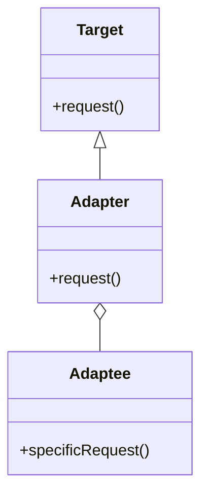
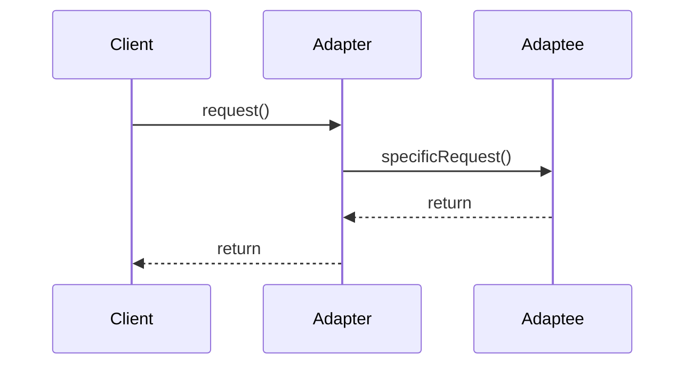

## 4.2. Adapter Pattern

The Adapter Pattern is a structural design pattern that allows objects with incompatible interfaces to collaborate. It acts as a bridge between two incompatible interfaces, enabling them to work together seamlessly. This pattern is particularly useful when integrating new components into an existing system or when adapting legacy code to meet new requirements.

### Intent and Motivation

The primary intent of the Adapter Pattern is to convert the interface of a class into another interface that clients expect. This conversion allows classes with incompatible interfaces to work together without modifying their source code. By using an adapter, we can achieve the following:

- **Interface Compatibility**: Enable classes with incompatible interfaces to communicate and collaborate.
- **Reusability**: Reuse existing classes without altering their code, thus preserving their integrity.
- **Flexibility**: Allow systems to evolve and incorporate new functionalities without extensive refactoring.

### Applicability

The Adapter Pattern is applicable in scenarios where:

- You want to use an existing class, but its interface does not match the one you need.
- You need to create a reusable class that cooperates with unrelated or unforeseen classes, that is, classes that don't necessarily have compatible interfaces.
- You want to use several existing subclasses, but it's impractical to adapt their interface by subclassing every one. An object adapter can adapt the interface of its parent class.

### Structure

The Adapter Pattern can be implemented in two main forms: **Class Adapter** and **Object Adapter**.

#### Class Adapter

A Class Adapter uses multiple inheritance to adapt one interface to another. It inherits interfaces from both the target and the adaptee. This form is less common in languages that do not support multiple inheritance.

#### Object Adapter

An Object Adapter relies on object composition. It contains an instance of the class it wraps and delegates calls to the adaptee. This form is more flexible and widely used.

Below is a UML diagram illustrating the structure of the Adapter Pattern:



**Diagram Description**: The `Target` class defines the domain-specific interface that `Client` uses. `Adaptee` is the existing interface that needs adapting. `Adapter` makes `Adaptee`'s interface compatible with `Target`.

### Participants and Collaborations

- **Target**: Defines the domain-specific interface that `Client` uses.
- **Client**: Collaborates with objects conforming to the `Target` interface.
- **Adaptee**: Defines an existing interface that needs adapting.
- **Adapter**: Adapts the interface of `Adaptee` to the `Target` interface.

### Consequences

#### Class Adapter vs. Object Adapter

- **Class Adapter**:
  - Pros: Can override `Adaptee` behavior since it is a subclass.
  - Cons: Requires multiple inheritance, which is not supported in all languages.

- **Object Adapter**:
  - Pros: More flexible, as it can work with any subclass of `Adaptee`.
  - Cons: Cannot override `Adaptee` behavior.

### Implementation Considerations

#### Adapting Legacy Code

When adapting legacy code, consider the following:

- **Minimize Changes**: Use the adapter to minimize changes to the existing codebase.
- **Maintainability**: Ensure that the adapter is easy to maintain and understand.
- **Performance**: Be mindful of any performance overhead introduced by the adapter.

### Detailed Pseudocode Implementation

Let's explore a detailed pseudocode implementation of the Adapter Pattern using the Object Adapter approach.

```pseudocode
// Target interface
interface Target {
    method request()
}

// Adaptee class with an incompatible interface
class Adaptee {
    method specificRequest()
        // Implementation of specific request
}

// Adapter class that makes Adaptee compatible with Target
class Adapter implements Target {
    private adaptee: Adaptee

    constructor Adapter(adaptee: Adaptee)
        this.adaptee = adaptee

    method request()
        // Translate the request to the specificRequest
        this.adaptee.specificRequest()
}

// Client code
function main()
    adaptee = new Adaptee()
    adapter = new Adapter(adaptee)
    adapter.request()
```

**Explanation**: In this pseudocode, the `Adapter` class implements the `Target` interface and holds an instance of `Adaptee`. The `request` method in `Adapter` translates the call to `specificRequest` in `Adaptee`.

### Example Usage Scenarios

- **Integrating Third-Party Libraries**: When integrating a third-party library that does not match your application's interface, use an adapter to bridge the gap.
- **Refactoring Legacy Systems**: When refactoring legacy systems, use adapters to introduce new functionalities without altering existing code.
- **Cross-Platform Development**: In cross-platform development, adapters can help unify different platform-specific interfaces into a single, consistent interface.

### Exercises

1. **Exercise 1**: Implement a class adapter for a scenario where multiple inheritance is possible. Compare its advantages and disadvantages with the object adapter approach.
2. **Exercise 2**: Create an adapter for a third-party library in a hypothetical application. Discuss the challenges faced and how the adapter resolves them.
3. **Exercise 3**: Refactor a legacy system using the Adapter Pattern. Identify areas where adapters can improve code maintainability and flexibility.

### Visual Aids

Below is a sequence diagram illustrating the interaction between the client, adapter, and adaptee:



**Diagram Description**: The sequence diagram shows the flow of a request from the `Client` to the `Adapter`, which then delegates the request to the `Adaptee`.

### Try It Yourself

To deepen your understanding, try modifying the pseudocode examples:

- **Experiment 1**: Add additional methods to the `Adaptee` class and modify the `Adapter` to support these methods.
- **Experiment 2**: Implement error handling in the adapter to manage potential issues when calling `Adaptee` methods.
- **Experiment 3**: Create a new `Target` interface with additional methods and adapt the existing `Adaptee` to this new interface.

### References and Links

For further reading on the Adapter Pattern, consider the following resources:

- [Design Patterns: Elements of Reusable Object-Oriented Software](https://en.wikipedia.org/wiki/Design_Patterns) by Erich Gamma, Richard Helm, Ralph Johnson, and John Vlissides.
- [Adapter Pattern on Refactoring Guru](https://refactoring.guru/design-patterns/adapter)
- [Adapter Pattern on SourceMaking](https://sourcemaking.com/design_patterns/adapter)

### Knowledge Check

- **Question 1**: What is the primary purpose of the Adapter Pattern?
- **Question 2**: How does a class adapter differ from an object adapter?
- **Question 3**: In what scenarios is the Adapter Pattern most useful?

### Embrace the Journey

Remember, mastering design patterns is a journey. As you continue to explore and apply the Adapter Pattern, you'll discover new ways to enhance your software design skills. Keep experimenting, stay curious, and enjoy the process!

## Quiz Time!



### What is the primary purpose of the Adapter Pattern?

- [x] To convert the interface of a class into another interface clients expect
- [ ] To provide a way to access elements of an aggregate object sequentially
- [ ] To define a family of algorithms, encapsulate each one, and make them interchangeable
- [ ] To attach additional responsibilities to an object dynamically

> **Explanation:** The Adapter Pattern is used to convert the interface of a class into another interface that clients expect, allowing incompatible interfaces to work together.

### Which of the following is a key difference between a class adapter and an object adapter?

- [x] A class adapter uses multiple inheritance, while an object adapter uses composition
- [ ] A class adapter is more flexible than an object adapter
- [ ] A class adapter can work with any subclass of Adaptee, while an object adapter cannot
- [ ] A class adapter is more commonly used than an object adapter

> **Explanation:** A class adapter uses multiple inheritance to adapt interfaces, whereas an object adapter uses composition, making it more flexible.

### In which scenario is the Adapter Pattern most useful?

- [x] When you want to use an existing class but its interface does not match the one you need
- [ ] When you need to define a one-to-many dependency between objects
- [ ] When you want to provide a way to access elements of an aggregate object sequentially
- [ ] When you need to encapsulate a request as an object

> **Explanation:** The Adapter Pattern is most useful when you need to use an existing class with an incompatible interface.

### What is a potential disadvantage of using a class adapter?

- [x] It requires multiple inheritance, which is not supported in all languages
- [ ] It cannot override Adaptee behavior
- [ ] It is less flexible than an object adapter
- [ ] It introduces significant performance overhead

> **Explanation:** Class adapters require multiple inheritance, which is not supported in all programming languages, limiting their applicability.

### Which of the following is a benefit of using an object adapter?

- [x] It is more flexible as it can work with any subclass of Adaptee
- [ ] It can override Adaptee behavior
- [ ] It is more efficient than a class adapter
- [ ] It is easier to implement than a class adapter

> **Explanation:** Object adapters are more flexible because they use composition, allowing them to work with any subclass of Adaptee.

### What is the role of the Adapter in the Adapter Pattern?

- [x] To adapt the interface of Adaptee to the Target interface
- [ ] To define the domain-specific interface that Client uses
- [ ] To encapsulate a request as an object
- [ ] To provide a way to access elements of an aggregate object sequentially

> **Explanation:** The Adapter's role is to adapt the interface of Adaptee to the Target interface, enabling compatibility.

### How does the Adapter Pattern enhance code reusability?

- [x] By allowing existing classes to be reused without altering their code
- [ ] By defining a family of algorithms and making them interchangeable
- [ ] By providing a way to access elements of an aggregate object sequentially
- [ ] By defining a one-to-many dependency between objects

> **Explanation:** The Adapter Pattern enhances code reusability by allowing existing classes to be reused without modifying their source code.

### What is a common use case for the Adapter Pattern?

- [x] Integrating third-party libraries with incompatible interfaces
- [ ] Defining a family of algorithms and making them interchangeable
- [ ] Providing a way to access elements of an aggregate object sequentially
- [ ] Defining a one-to-many dependency between objects

> **Explanation:** A common use case for the Adapter Pattern is integrating third-party libraries with interfaces that do not match the application's requirements.

### True or False: The Adapter Pattern can only be implemented using object composition.

- [ ] True
- [x] False

> **Explanation:** The Adapter Pattern can be implemented using both object composition (object adapter) and multiple inheritance (class adapter).

### Which design pattern is commonly confused with the Adapter Pattern?

- [x] Bridge Pattern
- [ ] Singleton Pattern
- [ ] Observer Pattern
- [ ] Factory Method Pattern

> **Explanation:** The Bridge Pattern is often confused with the Adapter Pattern because both involve decoupling interfaces and implementations, but they serve different purposes.


