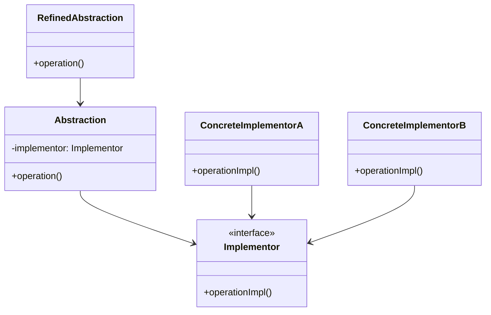
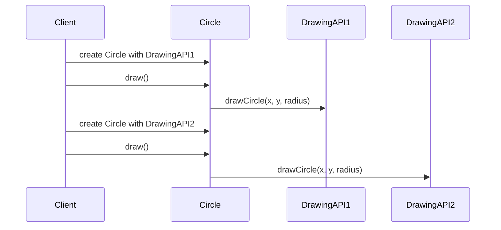

## 4.3. Bridge Pattern

In the world of software design, the Bridge Pattern stands out as a powerful tool for decoupling an abstraction from its implementation. This separation allows both the abstraction and the implementation to evolve independently, enhancing the flexibility and extensibility of the codebase. Let's dive deep into the Bridge Pattern, exploring its intent, structure, and practical applications.

### Intent and Motivation

The primary intent of the Bridge Pattern is to decouple an abstraction from its implementation so that the two can vary independently. This separation is crucial in scenarios where both the abstraction and the implementation are expected to change frequently. By using the Bridge Pattern, we can avoid a rigid system where changes in one part necessitate changes in another, thus promoting a more maintainable and scalable architecture.

#### Key Motivations:

- **Decoupling**: Separate the abstraction from the implementation to allow for independent evolution.
- **Flexibility**: Enable the combination of different abstractions with various implementations without creating a complex inheritance hierarchy.
- **Extensibility**: Facilitate the addition of new abstractions and implementations without modifying existing code.

### Applicability

The Bridge Pattern is particularly useful in the following scenarios:

- When you want to avoid a permanent binding between an abstraction and its implementation.
- When both the abstraction and the implementation should be extensible by subclassing.
- When changes in the implementation of an abstraction should not affect the clients of the abstraction.
- When you have a proliferation of classes due to a combination of multiple dimensions of variation.

### Structure

The Bridge Pattern involves several key components that work together to achieve its goals. Let's break down these components and their interactions.

#### Key Participants:

- **Abstraction**: Defines the abstraction's interface and maintains a reference to an object of type Implementor.
- **RefinedAbstraction**: Extends the interface defined by Abstraction.
- **Implementor**: Defines the interface for implementation classes. This interface doesn't need to correspond exactly to Abstraction's interface; in fact, the two interfaces can be quite different.
- **ConcreteImplementor**: Implements the Implementor interface and defines its concrete implementation.

#### Diagram

Below is a visual representation of the Bridge Pattern using a class diagram:



### Participants and Collaborations

- **Abstraction**: Maintains a reference to an Implementor object and delegates operations to it.
- **RefinedAbstraction**: Extends the interface defined by Abstraction and can add additional operations.
- **Implementor**: Provides an interface for the concrete implementations.
- **ConcreteImplementor**: Implements the Implementor interface and provides the actual implementation of the operations.

### Consequences

The Bridge Pattern offers several benefits, but it also comes with some trade-offs.

#### Advantages:

- **Enhanced Extensibility**: By decoupling the abstraction from its implementation, new abstractions and implementations can be added independently.
- **Reduced Complexity**: Avoids a proliferation of classes by separating the abstraction from the implementation.
- **Improved Maintainability**: Changes in the implementation do not affect the abstraction, making the system easier to maintain.

#### Trade-offs:

- **Increased Complexity**: The pattern introduces additional layers of abstraction, which can make the system more complex.
- **Performance Overhead**: The indirection introduced by the pattern may lead to a slight performance overhead.

### Implementation Considerations

When implementing the Bridge Pattern, consider the following:

- **Defining Stable Interfaces**: Ensure that both the abstraction and the implementation interfaces are stable and well-defined to minimize the impact of changes.
- **Managing Dependencies**: Carefully manage dependencies between the abstraction and the implementation to maintain the decoupling.

### Detailed Pseudocode Implementation

Let's explore a detailed pseudocode implementation of the Bridge Pattern. We'll use a simple example of a drawing application where different shapes can be drawn using different drawing APIs.

```pseudocode
// Implementor interface
interface DrawingAPI {
    method drawCircle(x, y, radius)
}

// ConcreteImplementor 1
class DrawingAPI1 implements DrawingAPI {
    method drawCircle(x, y, radius) {
        print("Drawing circle at (" + x + ", " + y + ") with radius " + radius + " using API1")
    }
}

// ConcreteImplementor 2
class DrawingAPI2 implements DrawingAPI {
    method drawCircle(x, y, radius) {
        print("Drawing circle at (" + x + ", " + y + ") with radius " + radius + " using API2")
    }
}

// Abstraction
class Shape {
    protected implementor: DrawingAPI

    constructor(implementor: DrawingAPI) {
        this.implementor = implementor
    }

    method draw()
}

// RefinedAbstraction
class Circle extends Shape {
    private x, y, radius

    constructor(x, y, radius, implementor: DrawingAPI) {
        super(implementor)
        this.x = x
        this.y = y
        this.radius = radius
    }

    method draw() {
        implementor.drawCircle(x, y, radius)
    }
}

// Client code
let circle1 = new Circle(1, 2, 3, new DrawingAPI1())
circle1.draw()

let circle2 = new Circle(4, 5, 6, new DrawingAPI2())
circle2.draw()
```

### Example Usage Scenarios

The Bridge Pattern is applicable in various scenarios, including:

- **Graphics Libraries**: Decoupling the rendering logic from the shape objects.
- **Cross-Platform Applications**: Separating platform-specific code from the application logic.
- **Database Drivers**: Abstracting the database operations from the specific database implementations.

### Exercises

1. **Extend the Example**: Modify the pseudocode example to include a new shape, such as a rectangle, and implement the drawing logic using the Bridge Pattern.
2. **Implement a New Drawing API**: Add a new drawing API to the example and demonstrate how it can be used with existing shapes.
3. **Explore Real-World Applications**: Identify a real-world application where the Bridge Pattern could be beneficial and outline a potential implementation.

### Visual Aids

Below is a sequence diagram illustrating the interaction between the components in the Bridge Pattern:



### Try It Yourself

To deepen your understanding of the Bridge Pattern, try modifying the pseudocode example:

- **Add a New Shape**: Implement a new shape, such as a square, and integrate it with the existing drawing APIs.
- **Experiment with Different APIs**: Create additional drawing APIs and test how they interact with different shapes.
- **Refactor the Code**: Identify areas of the code that could be improved or simplified and refactor them while maintaining the Bridge Pattern structure.

### References and Links

For further reading on the Bridge Pattern and its applications, consider the following resources:

- [Design Patterns: Elements of Reusable Object-Oriented Software](https://en.wikipedia.org/wiki/Design_Patterns) by Erich Gamma, Richard Helm, Ralph Johnson, and John Vlissides.
- [Refactoring Guru: Bridge Pattern](https://refactoring.guru/design-patterns/bridge)
- [GeeksforGeeks: Bridge Design Pattern](https://www.geeksforgeeks.org/bridge-design-pattern/)

### Knowledge Check

- **What is the primary intent of the Bridge Pattern?**
- **How does the Bridge Pattern enhance extensibility?**
- **What are some real-world scenarios where the Bridge Pattern is applicable?**

### Embrace the Journey

Remember, mastering design patterns is a journey. As you continue to explore and apply the Bridge Pattern, you'll gain a deeper understanding of its benefits and trade-offs. Keep experimenting, stay curious, and enjoy the process of learning and growing as a software developer.

## Quiz Time!



### What is the primary intent of the Bridge Pattern?

- [x] To decouple an abstraction from its implementation
- [ ] To provide a unified interface to a set of interfaces
- [ ] To compose objects into tree structures
- [ ] To define a family of algorithms

> **Explanation:** The Bridge Pattern's primary intent is to decouple an abstraction from its implementation so that the two can vary independently.

### Which of the following is a key advantage of the Bridge Pattern?

- [x] Enhanced extensibility
- [ ] Simplified code structure
- [ ] Increased coupling
- [ ] Reduced flexibility

> **Explanation:** The Bridge Pattern enhances extensibility by allowing new abstractions and implementations to be added independently.

### In the Bridge Pattern, what role does the Implementor play?

- [x] It defines the interface for implementation classes
- [ ] It extends the interface defined by Abstraction
- [ ] It maintains a reference to an Implementor object
- [ ] It provides a unified interface to a set of interfaces

> **Explanation:** The Implementor defines the interface for implementation classes, allowing different implementations to be used interchangeably.

### What is a potential trade-off of using the Bridge Pattern?

- [x] Increased complexity
- [ ] Reduced maintainability
- [ ] Decreased flexibility
- [ ] Simplified code structure

> **Explanation:** The Bridge Pattern introduces additional layers of abstraction, which can increase the complexity of the system.

### Which of the following scenarios is suitable for applying the Bridge Pattern?

- [x] When you want to avoid a permanent binding between an abstraction and its implementation
- [ ] When you need to define a family of algorithms
- [ ] When you want to provide a unified interface to a set of interfaces
- [ ] When you need to compose objects into tree structures

> **Explanation:** The Bridge Pattern is suitable when you want to avoid a permanent binding between an abstraction and its implementation, allowing them to vary independently.

### How does the Bridge Pattern improve maintainability?

- [x] By decoupling the abstraction from its implementation
- [ ] By reducing the number of classes
- [ ] By simplifying the code structure
- [ ] By increasing the coupling between components

> **Explanation:** The Bridge Pattern improves maintainability by decoupling the abstraction from its implementation, making it easier to change one without affecting the other.

### What is the role of the RefinedAbstraction in the Bridge Pattern?

- [x] It extends the interface defined by Abstraction
- [ ] It defines the interface for implementation classes
- [ ] It maintains a reference to an Implementor object
- [ ] It provides a unified interface to a set of interfaces

> **Explanation:** The RefinedAbstraction extends the interface defined by Abstraction, allowing for additional operations or behaviors.

### Which of the following is a real-world application of the Bridge Pattern?

- [x] Graphics libraries decoupling rendering logic from shape objects
- [ ] Defining a family of algorithms
- [ ] Composing objects into tree structures
- [ ] Providing a unified interface to a set of interfaces

> **Explanation:** Graphics libraries often use the Bridge Pattern to decouple rendering logic from shape objects, allowing for different rendering implementations.

### What is a key consideration when implementing the Bridge Pattern?

- [x] Defining stable interfaces
- [ ] Reducing the number of classes
- [ ] Increasing the coupling between components
- [ ] Simplifying the code structure

> **Explanation:** When implementing the Bridge Pattern, it's important to define stable interfaces to minimize the impact of changes and maintain decoupling.

### True or False: The Bridge Pattern introduces a performance overhead due to indirection.

- [x] True
- [ ] False

> **Explanation:** The Bridge Pattern can introduce a slight performance overhead due to the indirection between the abstraction and its implementation.



