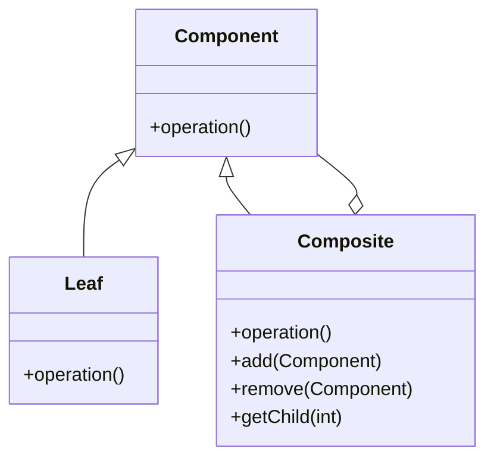
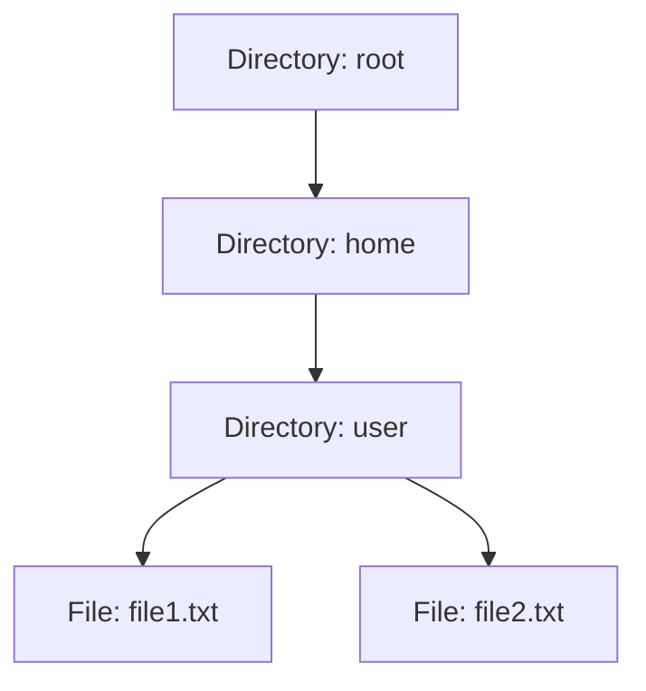

## 4.4. Composite Pattern

The Composite Pattern is a structural design pattern that allows you to compose objects into tree structures to represent part-whole hierarchies. This pattern enables clients to treat individual objects and compositions of objects uniformly. Let's delve into the intricacies of the Composite Pattern, its applicability, structure, and implementation through detailed pseudocode examples.

### Intent and Motivation

The primary intent of the Composite Pattern is to allow clients to work with individual objects and compositions of objects uniformly. This is particularly useful in scenarios where you need to represent a hierarchy of objects, such as graphical user interfaces, file systems, or organizational structures.

#### Key Motivations:

- **Simplifying Client Code**: By treating individual and composite objects uniformly, client code becomes simpler and more flexible.
- **Hierarchical Structures**: Ideal for representing tree structures where nodes can be both leaves and composites.
- **Recursive Composition**: Facilitates recursive compositions, allowing for complex structures to be built from simpler ones.

### Applicability

The Composite Pattern is applicable in scenarios where:

- You need to represent part-whole hierarchies of objects.
- You want clients to ignore the difference between compositions of objects and individual objects.
- You need to add new kinds of components to a system without breaking existing code.

### Structure

The Composite Pattern consists of several key components:

- **Component**: An abstract class or interface that defines the common interface for all objects in the composition.
- **Leaf**: Represents leaf objects in the composition. A leaf has no children.
- **Composite**: Represents a composite object that can have children. Implements child-related operations.
- **Client**: Interacts with objects through the Component interface.

Here's a visual representation of the Composite Pattern using a class diagram:



### Participants and Collaborations

- **Component**: Declares the interface for objects in the composition and implements default behavior for the interface common to all classes.
- **Leaf**: Implements the Component interface and represents leaf objects in the composition.
- **Composite**: Implements the Component interface and defines behavior for components having children. Stores child components and implements child-related operations.
- **Client**: Uses the Component interface to interact with objects in the composition.

### Consequences

The Composite Pattern offers several advantages:

- **Uniformity**: Simplifies client code by allowing uniform treatment of individual and composite objects.
- **Extensibility**: Makes it easy to add new kinds of components without changing existing code.
- **Complexity**: Can make the design overly general and complicate implementation if not used judiciously.

### Implementation Considerations

When implementing the Composite Pattern, consider the following:

- **Child Management**: Decide how to manage child components, including adding, removing, and accessing children.
- **Transparency vs. Safety**: Balance the need for a uniform interface with the need to prevent inappropriate operations on leaf nodes.
- **Efficiency**: Consider the performance implications of managing a large number of objects in a composite structure.

### Detailed Pseudocode Implementation

Let's explore a detailed pseudocode implementation of the Composite Pattern. We'll create a simple file system hierarchy where files and directories are treated uniformly.

```pseudocode
// Component interface
interface FileSystemComponent {
    method display(indent)
}

// Leaf class
class File implements FileSystemComponent {
    attribute name

    constructor File(name) {
        this.name = name
    }

    method display(indent) {
        print(indent + "File: " + this.name)
    }
}

// Composite class
class Directory implements FileSystemComponent {
    attribute name
    attribute children

    constructor Directory(name) {
        this.name = name
        this.children = []
    }

    method add(child) {
        this.children.append(child)
    }

    method remove(child) {
        this.children.remove(child)
    }

    method display(indent) {
        print(indent + "Directory: " + this.name)
        for each child in children {
            child.display(indent + "  ")
        }
    }
}

// Client code
method main() {
    root = new Directory("root")
    home = new Directory("home")
    user = new Directory("user")
    file1 = new File("file1.txt")
    file2 = new File("file2.txt")

    root.add(home)
    home.add(user)
    user.add(file1)
    user.add(file2)

    root.display("")
}
```

### Example Usage Scenarios

The Composite Pattern is widely used in various domains. Here are a few examples:

- **Graphical User Interfaces**: Widgets like buttons, panels, and windows can be composed into complex interfaces.
- **File Systems**: Directories and files can be represented as a tree structure.
- **Organizational Structures**: Employees and departments can be modeled as a hierarchy.

### Exercises

1. **Extend the File System Example**: Add functionality to calculate the total size of files in a directory.
2. **Implement a Menu System**: Create a composite structure for a menu system where each menu item can be a simple command or a submenu.
3. **Create a Graphics Editor**: Use the Composite Pattern to represent graphical shapes and groups of shapes.

### Visual Aids

To further illustrate the Composite Pattern, let's visualize a file system hierarchy:



### Try It Yourself

Encourage experimentation by modifying the pseudocode example. Try adding new file types or implementing additional operations like renaming files and directories.

### Differences and Similarities

The Composite Pattern is often compared to the Decorator Pattern. While both involve composition, the Composite Pattern focuses on part-whole hierarchies, whereas the Decorator Pattern focuses on adding responsibilities to objects dynamically.

### Knowledge Check

Before we conclude, let's reinforce what we've learned:

- **What is the primary intent of the Composite Pattern?**
- **How does the Composite Pattern simplify client code?**
- **What are the key components of the Composite Pattern?**

### Embrace the Journey

Remember, mastering design patterns is a journey. As you continue to explore and apply these patterns, you'll gain deeper insights into building robust and flexible software architectures. Keep experimenting, stay curious, and enjoy the journey!

## Quiz Time!



### What is the primary intent of the Composite Pattern?

- [x] To compose objects into tree structures to represent part-whole hierarchies
- [ ] To add responsibilities to objects dynamically
- [ ] To provide a unified interface to a set of interfaces in a subsystem
- [ ] To decouple an abstraction from its implementation

> **Explanation:** The Composite Pattern's primary intent is to compose objects into tree structures to represent part-whole hierarchies, allowing clients to treat individual and composite objects uniformly.

### Which component in the Composite Pattern represents leaf objects?

- [ ] Component
- [x] Leaf
- [ ] Composite
- [ ] Client

> **Explanation:** The Leaf component represents leaf objects in the composition, which have no children.

### What is a key advantage of the Composite Pattern?

- [ ] It simplifies the implementation of complex algorithms
- [x] It allows uniform treatment of individual and composite objects
- [ ] It enhances the performance of the system
- [ ] It provides a way to encapsulate a request as an object

> **Explanation:** A key advantage of the Composite Pattern is that it allows uniform treatment of individual and composite objects, simplifying client code.

### In the Composite Pattern, which class is responsible for managing child components?

- [ ] Leaf
- [ ] Component
- [x] Composite
- [ ] Client

> **Explanation:** The Composite class is responsible for managing child components, implementing child-related operations such as add, remove, and display.

### What is a common use case for the Composite Pattern?

- [ ] Implementing a logging system
- [x] Representing a file system hierarchy
- [ ] Creating a singleton instance
- [ ] Defining a family of algorithms

> **Explanation:** A common use case for the Composite Pattern is representing a file system hierarchy, where directories and files can be composed into a tree structure.

### How does the Composite Pattern affect client code?

- [ ] It makes client code more complex
- [x] It simplifies client code
- [ ] It requires clients to handle each object type differently
- [ ] It forces clients to manage object lifecycles

> **Explanation:** The Composite Pattern simplifies client code by allowing uniform treatment of individual and composite objects, reducing the need for type-specific handling.

### What is a potential drawback of the Composite Pattern?

- [ ] It makes the system less flexible
- [x] It can make the design overly general
- [ ] It reduces code reusability
- [ ] It complicates the client interface

> **Explanation:** A potential drawback of the Composite Pattern is that it can make the design overly general, complicating implementation if not used judiciously.

### Which pattern is often compared to the Composite Pattern?

- [ ] Singleton Pattern
- [x] Decorator Pattern
- [ ] Factory Method Pattern
- [ ] Observer Pattern

> **Explanation:** The Composite Pattern is often compared to the Decorator Pattern, as both involve composition, but they serve different purposes.

### True or False: The Composite Pattern is ideal for representing flat structures.

- [ ] True
- [x] False

> **Explanation:** False. The Composite Pattern is ideal for representing hierarchical structures, not flat structures.

### What is the role of the Client in the Composite Pattern?

- [ ] To implement child-related operations
- [ ] To represent leaf objects
- [ ] To define the common interface for all objects
- [x] To interact with objects through the Component interface

> **Explanation:** The Client interacts with objects through the Component interface, treating individual and composite objects uniformly.


