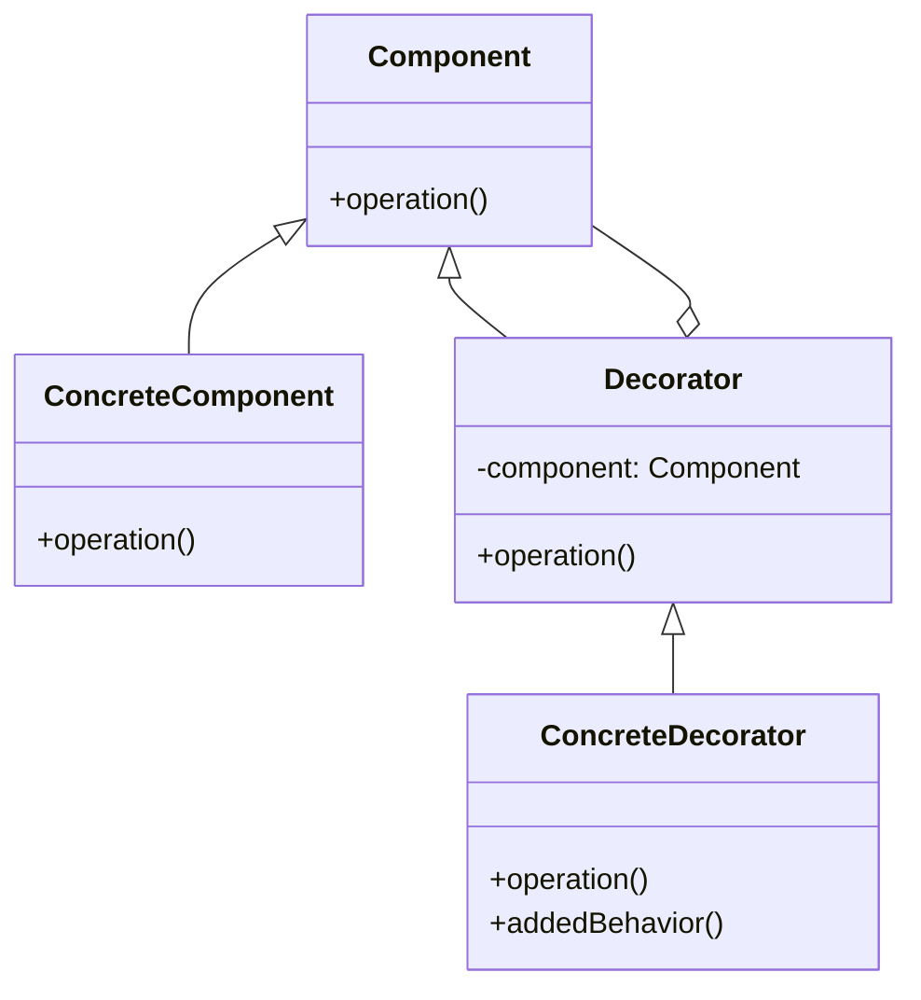
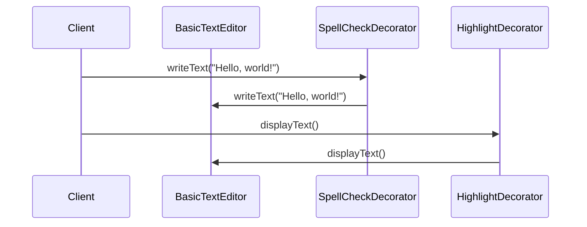

## 4.5. Decorator Pattern

The Decorator Pattern is a structural design pattern that allows behavior to be added to individual objects, either statically or dynamically, without affecting the behavior of other objects from the same class. This pattern is particularly useful when you want to add responsibilities to objects without using inheritance, providing a flexible alternative to subclassing for extending functionality.

### Intent and Motivation

The primary intent of the Decorator Pattern is to attach additional responsibilities to an object dynamically. This is achieved by creating a set of decorator classes that are used to wrap concrete components. Decorators provide a flexible alternative to subclassing for extending functionality.

#### Key Motivations:

- **Enhancing Functionality**: Add new behavior to objects without altering their structure.
- **Flexibility**: Decorators allow for the dynamic composition of behaviors.
- **Single Responsibility Principle**: By dividing functionality across classes, each class has a single responsibility.

### Applicability

Consider using the Decorator Pattern when:

- You want to add responsibilities to individual objects dynamically and transparently, without affecting other objects.
- You need to extend the functionality of classes in a way that is independent of the class hierarchy.
- You want to add responsibilities to an object that you may want to change or remove later.

### Structure

The Decorator Pattern involves a set of roles:

- **Component**: Defines the interface for objects that can have responsibilities added to them dynamically.
- **ConcreteComponent**: Defines an object to which additional responsibilities can be attached.
- **Decorator**: Maintains a reference to a Component object and defines an interface that conforms to Component's interface.
- **ConcreteDecorator**: Adds responsibilities to the component.

Here's a visual representation of the Decorator Pattern using a class diagram:



### Participants and Collaborations

- **Component**: The interface or abstract class that defines the operations that can be altered by decorators.
- **ConcreteComponent**: The class that implements the Component interface. It is the object to which additional responsibilities can be attached.
- **Decorator**: An abstract class that implements the Component interface and contains a reference to a Component object. It delegates all operations to the component.
- **ConcreteDecorator**: Extends the Decorator class and overrides operations to add additional behavior.

#### Collaborations:

- Decorators forward requests to their components and may perform additional actions before or after forwarding.
- Clients usually work with components through the Component interface.

### Consequences

The Decorator Pattern offers several advantages:

- **Flexibility**: More flexible than static inheritance because it allows you to mix and match decorators at runtime.
- **Responsibility Division**: Divides functionality across multiple classes, adhering to the Single Responsibility Principle.
- **Avoids Class Explosion**: Reduces the need for a large number of subclasses to achieve the same functionality.

However, there are also some trade-offs:

- **Complexity**: Can lead to a system with many small objects that may be difficult to understand and maintain.
- **Order Sensitivity**: The order in which decorators are applied can affect the behavior of the resulting object.

### Implementation Considerations

When implementing the Decorator Pattern, consider the following:

- **Managing Multiple Decorators**: Ensure that the order of decorators is well-defined and that they are applied consistently.
- **Transparency**: The decorators should be transparent to the client, meaning that the client should not need to know whether it is dealing with a decorated object or a plain component.
- **Performance**: Be mindful of the potential performance impact of adding multiple layers of decorators.

### Detailed Pseudocode Implementation

Let's explore a detailed pseudocode implementation of the Decorator Pattern. We'll create a simple example of a text editor where we can add features like spell checking and text highlighting dynamically.

```pseudocode
// Component Interface
interface TextEditor {
    method writeText(text)
    method displayText()
}

// ConcreteComponent
class BasicTextEditor implements TextEditor {
    private text = ""

    method writeText(text) {
        this.text += text
    }

    method displayText() {
        print("Displaying text: " + this.text)
    }
}

// Decorator
class TextEditorDecorator implements TextEditor {
    protected editor: TextEditor

    constructor(editor: TextEditor) {
        this.editor = editor
    }

    method writeText(text) {
        editor.writeText(text)
    }

    method displayText() {
        editor.displayText()
    }
}

// ConcreteDecoratorA
class SpellCheckDecorator extends TextEditorDecorator {
    method writeText(text) {
        // Perform spell check
        print("Spell checking text...")
        super.writeText(text)
    }
}

// ConcreteDecoratorB
class HighlightDecorator extends TextEditorDecorator {
    method displayText() {
        // Highlight text
        print("Highlighting text...")
        super.displayText()
    }
}

// Client code
editor = new BasicTextEditor()
editor = new SpellCheckDecorator(editor)
editor = new HighlightDecorator(editor)

editor.writeText("Hello, world!")
editor.displayText()
```

In this pseudocode, we have a `BasicTextEditor` class that implements the `TextEditor` interface. We then create a `TextEditorDecorator` class that wraps a `TextEditor` object and delegates calls to it. The `SpellCheckDecorator` and `HighlightDecorator` classes extend `TextEditorDecorator` to add additional functionality.

### Example Usage Scenarios

The Decorator Pattern can be applied in various scenarios, such as:

- **Graphical User Interfaces (GUIs)**: Adding scrollbars, borders, or other visual enhancements to components.
- **Streams in I/O Libraries**: Wrapping streams to add buffering, encryption, or compression.
- **Logging**: Adding logging functionality to existing classes without modifying them.

### Exercises

1. **Exercise 1**: Implement a logging decorator for the text editor example that logs every write operation.
2. **Exercise 2**: Create a new decorator that converts text to uppercase before writing it.
3. **Exercise 3**: Combine multiple decorators and observe the order of operations. What happens if you change the order?

### Visual Aids

To further illustrate the Decorator Pattern, let's visualize the sequence of operations when using decorators:



### Knowledge Check

Before we conclude, let's summarize the key takeaways:

- The Decorator Pattern allows for dynamic addition of responsibilities to objects.
- It provides a flexible alternative to subclassing, promoting code reusability and adherence to the Single Responsibility Principle.
- Decorators can be combined to create complex behaviors, but care must be taken to manage their order and transparency.

### Embrace the Journey

As you continue to explore design patterns, remember that the Decorator Pattern is just one of many tools in your toolkit. Keep experimenting, stay curious, and enjoy the journey of mastering design patterns!

## Quiz Time!



### What is the primary intent of the Decorator Pattern?

- [x] To attach additional responsibilities to an object dynamically
- [ ] To create a single instance of a class
- [ ] To define a family of algorithms
- [ ] To separate object construction from its representation

> **Explanation:** The Decorator Pattern is designed to add responsibilities to objects dynamically, providing a flexible alternative to subclassing.

### Which of the following is NOT a participant in the Decorator Pattern?

- [ ] Component
- [ ] ConcreteComponent
- [ ] Decorator
- [x] Singleton

> **Explanation:** The Singleton is not a participant in the Decorator Pattern. The participants are Component, ConcreteComponent, Decorator, and ConcreteDecorator.

### What is a key advantage of using the Decorator Pattern?

- [x] It provides a flexible alternative to subclassing
- [ ] It ensures a class has only one instance
- [ ] It allows for the creation of families of related objects
- [ ] It defines a skeleton of an algorithm

> **Explanation:** The Decorator Pattern allows for flexible extension of object functionality without subclassing.

### In the provided pseudocode, what does the SpellCheckDecorator do?

- [x] It performs spell checking before writing text
- [ ] It highlights text before displaying it
- [ ] It logs text before writing it
- [ ] It converts text to uppercase before writing it

> **Explanation:** The SpellCheckDecorator performs spell checking before delegating the write operation to the wrapped component.

### How can multiple decorators be managed effectively?

- [x] By ensuring the order of decorators is well-defined
- [ ] By using a single decorator for all functionalities
- [ ] By avoiding the use of decorators altogether
- [ ] By subclassing each decorator

> **Explanation:** The order of decorators can affect the behavior of the resulting object, so it is important to apply them in a well-defined order.

### What is a potential drawback of the Decorator Pattern?

- [x] It can lead to a system with many small objects
- [ ] It restricts the number of instances of a class
- [ ] It tightly couples the sender and receiver of a request
- [ ] It makes it difficult to add new operations

> **Explanation:** The Decorator Pattern can result in a system with many small objects, which may increase complexity.

### Which of the following is a common use case for the Decorator Pattern?

- [x] Adding scrollbars to a window in a GUI
- [ ] Creating a single instance of a database connection
- [ ] Defining a family of sorting algorithms
- [ ] Separating the construction of a complex object

> **Explanation:** The Decorator Pattern is commonly used in GUIs to add features like scrollbars to windows.

### What is the role of the ConcreteDecorator in the Decorator Pattern?

- [x] To add responsibilities to the component
- [ ] To define the interface for objects that can have responsibilities added
- [ ] To implement the component interface
- [ ] To maintain a reference to a component object

> **Explanation:** The ConcreteDecorator extends the Decorator class to add additional responsibilities to the component.

### What should be considered when implementing the Decorator Pattern?

- [x] Transparency to the client
- [ ] Ensuring a single instance of the class
- [ ] Defining a family of algorithms
- [ ] Separating object construction from its representation

> **Explanation:** Decorators should be transparent to the client, meaning the client should not need to know whether it is dealing with a decorated object or a plain component.

### True or False: The Decorator Pattern is an alternative to subclassing.

- [x] True
- [ ] False

> **Explanation:** True. The Decorator Pattern provides a flexible alternative to subclassing for extending functionality.


