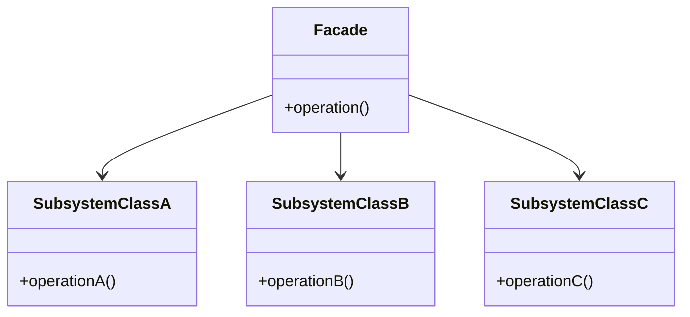
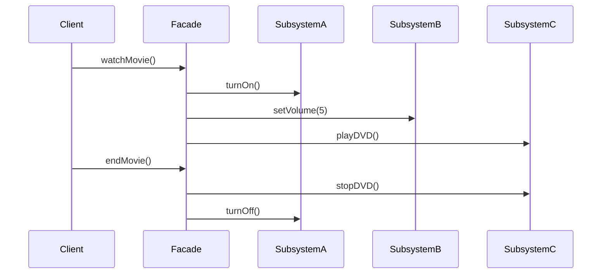

## 4.6. Facade Pattern

The Facade Pattern is a structural design pattern that provides a simplified interface to a complex subsystem. By doing so, it makes the subsystem easier to use and understand, reducing the complexity for the client. This pattern is particularly useful when dealing with complex libraries or frameworks, where multiple interfaces and classes are involved.

### Intent and Motivation

The primary intent of the Facade Pattern is to provide a unified interface to a set of interfaces in a subsystem. This pattern defines a higher-level interface that makes the subsystem easier to use. The motivation behind using the Facade Pattern includes:

- **Simplifying Client Interactions**: By providing a single entry point, the Facade Pattern reduces the number of objects the client needs to interact with.
- **Decoupling Clients from Subsystems**: Clients are not directly dependent on the subsystem classes, which makes the system more flexible and easier to maintain.
- **Improving Code Readability**: By hiding the complexity of the subsystem, the Facade Pattern makes the code more readable and easier to understand.

### Applicability

Consider using the Facade Pattern when:

- You want to provide a simple interface to a complex subsystem.
- There are many interdependent classes in the subsystem, and you want to simplify the interactions for the client.
- You want to layer your subsystems, using facades to define entry points to each level.
- You want to decouple the client from the subsystem, allowing for easier changes and maintenance.

### Structure

The structure of the Facade Pattern involves the following components:

- **Facade**: The class that provides a simplified interface to the subsystem.
- **Subsystem Classes**: The classes that implement the subsystem functionality. These classes handle the actual work but are hidden behind the facade.

Below is a UML diagram illustrating the Facade Pattern:



### Participants and Collaborations

- **Facade**: Knows which subsystem classes are responsible for a request. Delegates client requests to appropriate subsystem objects.
- **Subsystem Classes**: Implement subsystem functionality. Handle work assigned by the Facade object. Have no knowledge of the facade and keep no reference to it.

### Consequences

The Facade Pattern offers several benefits:

- **Simplified Interface**: By providing a single point of interaction, the facade simplifies the client's interaction with the subsystem.
- **Reduced Client-Side Complexity**: Clients are shielded from the complex interactions of the subsystem.
- **Decoupling**: The pattern decouples the client from the subsystem, which can lead to more flexible code.
- **Ease of Use**: The facade can make a library or framework easier to use by providing a more intuitive interface.

However, there are also some trade-offs:

- **Potential Over-Simplification**: The facade might oversimplify the subsystem, limiting the client's ability to use advanced features.
- **Single Point of Failure**: If the facade fails, it can affect the entire system.

### Implementation Considerations

When implementing the Facade Pattern, consider the following:

- **Layering Subsystems**: Use facades to layer your subsystems, providing a clear separation between different levels of functionality.
- **Designing the Facade Interface**: Ensure that the facade interface is intuitive and meets the needs of the client.
- **Maintaining Flexibility**: While the facade simplifies interactions, ensure that it does not limit access to important subsystem features.

### Detailed Pseudocode Implementation

Let's explore a pseudocode implementation of the Facade Pattern. Consider a scenario where we have a complex subsystem for managing a home theater system. The subsystem includes classes for controlling the DVD player, projector, and sound system.

```pseudocode
// Subsystem classes
class DVDPlayer {
    method playDVD() {
        // Code to play DVD
    }
    method stopDVD() {
        // Code to stop DVD
    }
}

class Projector {
    method turnOn() {
        // Code to turn on the projector
    }
    method turnOff() {
        // Code to turn off the projector
    }
}

class SoundSystem {
    method setVolume(volume) {
        // Code to set volume
    }
}

// Facade class
class HomeTheaterFacade {
    private dvdPlayer: DVDPlayer
    private projector: Projector
    private soundSystem: SoundSystem

    constructor() {
        this.dvdPlayer = new DVDPlayer()
        this.projector = new Projector()
        this.soundSystem = new SoundSystem()
    }

    method watchMovie() {
        this.projector.turnOn()
        this.soundSystem.setVolume(5)
        this.dvdPlayer.playDVD()
    }

    method endMovie() {
        this.dvdPlayer.stopDVD()
        this.projector.turnOff()
    }
}

// Client code
clientMethod() {
    homeTheater: HomeTheaterFacade = new HomeTheaterFacade()
    homeTheater.watchMovie()
    // Enjoy the movie
    homeTheater.endMovie()
}
```

### Example Usage Scenarios

The Facade Pattern is widely used in software development. Here are a few scenarios where it can be effectively applied:

- **Complex Libraries**: When dealing with complex libraries or APIs, a facade can simplify the interface for the client.
- **Subsystem Layering**: In large systems, facades can be used to layer subsystems, providing a clear separation between different levels of functionality.
- **Legacy Systems**: Facades can be used to wrap legacy systems, providing a modern interface to outdated code.

### Exercises

1. **Implement a Facade**: Create a facade for a banking system that includes classes for managing accounts, loans, and transactions.
2. **Extend the Facade**: Modify the home theater facade to include additional functionality, such as controlling lighting and temperature.
3. **Analyze a Real-World System**: Identify a real-world system that could benefit from a facade and describe how you would implement it.

### Visual Aids

To further illustrate the Facade Pattern, consider the following sequence diagram, which shows the interaction between the client and the subsystem through the facade:



### Knowledge Check

Before we move on, let's review some key points:

- **What is the primary purpose of the Facade Pattern?**
  - To provide a simplified interface to a complex subsystem.
- **What are the main components of the Facade Pattern?**
  - The Facade and the Subsystem Classes.
- **What are some benefits of using the Facade Pattern?**
  - Simplified interface, reduced client-side complexity, and decoupling.

### Embrace the Journey

Remember, mastering design patterns is a journey. As you continue to explore the Facade Pattern, consider how it can be applied to your own projects. Experiment with different implementations, and don't be afraid to make mistakes. Each step you take brings you closer to becoming a more skilled and versatile developer.

## Quiz Time!



### What is the primary intent of the Facade Pattern?

- [x] To provide a unified interface to a set of interfaces in a subsystem.
- [ ] To create a single instance of a class.
- [ ] To define an interface for creating objects.
- [ ] To separate object construction from its representation.

> **Explanation:** The Facade Pattern aims to provide a simplified interface to a complex subsystem, making it easier to use.

### Which of the following is a benefit of the Facade Pattern?

- [x] Simplified client interactions.
- [ ] Increased coupling between client and subsystem.
- [ ] Direct access to subsystem classes.
- [ ] Increased complexity for the client.

> **Explanation:** The Facade Pattern simplifies client interactions by providing a single entry point to the subsystem.

### What are the main components of the Facade Pattern?

- [x] Facade and Subsystem Classes.
- [ ] Singleton and Factory Classes.
- [ ] Builder and Director Classes.
- [ ] Observer and Subject Classes.

> **Explanation:** The Facade Pattern consists of a Facade class that interacts with multiple Subsystem Classes.

### When should you consider using the Facade Pattern?

- [x] When you want to provide a simple interface to a complex subsystem.
- [ ] When you need to create multiple instances of a class.
- [ ] When you want to encapsulate a request as an object.
- [ ] When you need to define a family of algorithms.

> **Explanation:** The Facade Pattern is useful when you want to simplify interactions with a complex subsystem.

### Which of the following is a potential trade-off of using the Facade Pattern?

- [x] Potential over-simplification of the subsystem.
- [ ] Increased complexity for the client.
- [ ] Direct dependency on subsystem classes.
- [ ] Lack of flexibility in the subsystem.

> **Explanation:** The Facade Pattern may oversimplify the subsystem, limiting access to advanced features.

### What is the role of the Facade in the Facade Pattern?

- [x] To provide a simplified interface to the subsystem.
- [ ] To implement the subsystem functionality.
- [ ] To create objects for the subsystem.
- [ ] To manage the lifecycle of subsystem objects.

> **Explanation:** The Facade provides a simplified interface to the subsystem, delegating requests to appropriate subsystem classes.

### How does the Facade Pattern affect client-side complexity?

- [x] It reduces client-side complexity.
- [ ] It increases client-side complexity.
- [ ] It has no effect on client-side complexity.
- [ ] It makes client-side complexity unpredictable.

> **Explanation:** By providing a single entry point, the Facade Pattern reduces the complexity for the client.

### What is a common use case for the Facade Pattern?

- [x] Simplifying interactions with complex libraries.
- [ ] Creating a single instance of a class.
- [ ] Encapsulating a request as an object.
- [ ] Defining a family of algorithms.

> **Explanation:** The Facade Pattern is commonly used to simplify interactions with complex libraries or frameworks.

### How does the Facade Pattern contribute to decoupling?

- [x] It decouples the client from the subsystem.
- [ ] It increases coupling between client and subsystem.
- [ ] It has no effect on coupling.
- [ ] It couples the client directly to subsystem classes.

> **Explanation:** The Facade Pattern decouples the client from the subsystem by providing a simplified interface.

### True or False: The Facade Pattern can be used to layer subsystems.

- [x] True
- [ ] False

> **Explanation:** The Facade Pattern can be used to layer subsystems, providing a clear separation between different levels of functionality.


