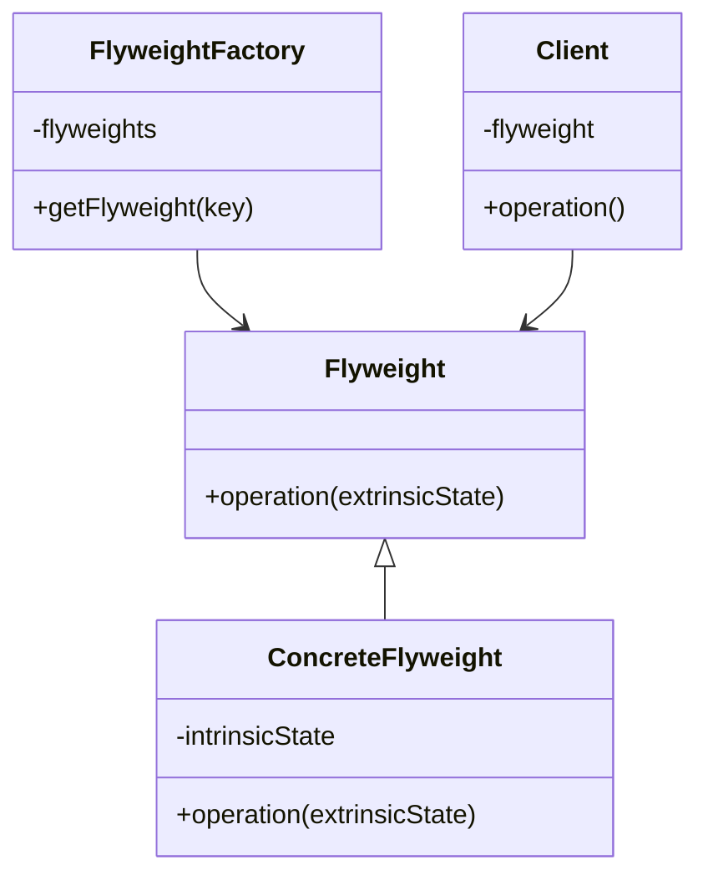
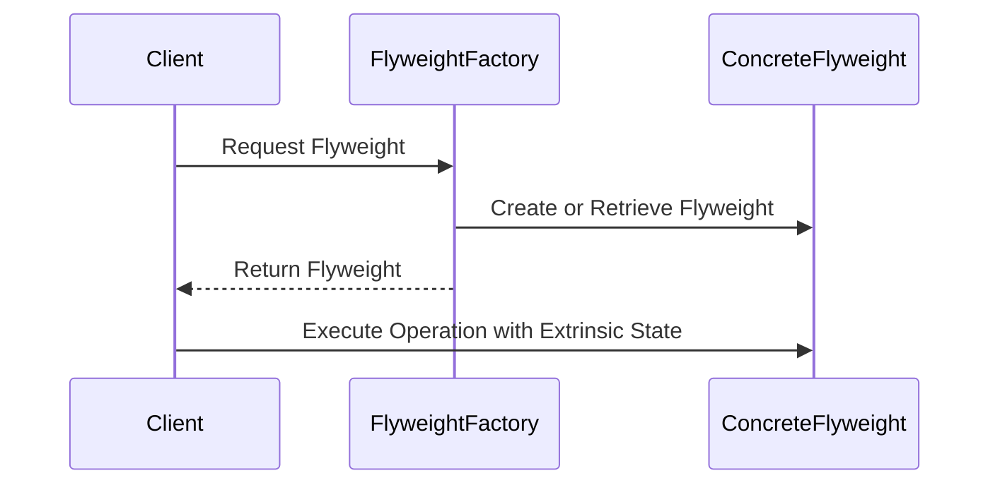

## 4.7. Flyweight Pattern

The Flyweight Pattern is a structural design pattern that focuses on minimizing memory usage by sharing as much data as possible with similar objects. This is particularly useful when dealing with a large number of objects that share common data. Let's delve into the intricacies of this pattern, its implementation, and its practical applications.

### Intent and Motivation

The primary intent of the Flyweight Pattern is to use sharing to support a large number of fine-grained objects efficiently. By sharing common parts of the state between multiple objects, the Flyweight Pattern reduces the memory footprint and enhances performance.

#### Key Motivations:

- **Memory Efficiency**: By sharing common data among objects, the Flyweight Pattern significantly reduces the memory usage.
- **Performance Optimization**: Reducing the number of objects in memory can lead to faster execution times, especially in systems with limited resources.
- **Scalability**: Helps in scaling applications by managing resources more efficiently.

### Applicability

The Flyweight Pattern is applicable in scenarios where:

- A large number of objects are required, and they share some common state.
- The cost of creating and maintaining these objects is high in terms of memory and performance.
- The objects can be divided into intrinsic (shared) and extrinsic (unique) states.

### Structure

The Flyweight Pattern involves several key components:

- **Flyweight**: The interface through which flyweights can act on the extrinsic state.
- **Concrete Flyweight**: Implements the Flyweight interface and adds storage for intrinsic state.
- **Flyweight Factory**: Manages and creates flyweight objects, ensuring that shared instances are used.
- **Client**: Maintains references to flyweight objects and computes or stores the extrinsic state.

#### UML Class Diagram



### Participants and Collaborations

- **Flyweight**: Declares an interface through which flyweights can receive and act on extrinsic state.
- **Concrete Flyweight**: Implements the Flyweight interface and stores intrinsic state. Concrete Flyweights are shared and immutable.
- **Flyweight Factory**: Creates and manages flyweight objects. Ensures that flyweights are shared properly.
- **Client**: Maintains references to flyweights and computes or stores extrinsic state.

### Consequences

#### Intrinsic vs. Extrinsic State

- **Intrinsic State**: Shared among objects and stored in the flyweight. It is independent of the flyweight's context.
- **Extrinsic State**: Context-dependent and varies with each flyweight instance. It is stored or computed by the client.

#### Benefits

- **Reduced Memory Usage**: By sharing intrinsic state, the Flyweight Pattern reduces the number of objects in memory.
- **Improved Performance**: Fewer objects mean less memory overhead and potentially faster execution.

#### Trade-offs

- **Complexity**: Managing the extrinsic state can add complexity to the client code.
- **Increased Responsibility**: Clients must manage the extrinsic state, which can lead to more complex interactions.

### Implementation Considerations

#### Managing Shared Objects

- **Flyweight Factory**: Use a factory to manage the creation and sharing of flyweight objects. The factory ensures that shared instances are reused.
- **Immutable Intrinsic State**: Ensure that the intrinsic state is immutable to avoid unintended side effects from shared data.

### Detailed Pseudocode Implementation

Let's explore a detailed pseudocode implementation of the Flyweight Pattern.

```pseudocode
// Flyweight Interface
interface Flyweight {
    method operation(extrinsicState)
}

// Concrete Flyweight
class ConcreteFlyweight implements Flyweight {
    private intrinsicState

    constructor(intrinsicState) {
        this.intrinsicState = intrinsicState
    }

    method operation(extrinsicState) {
        // Use intrinsicState and extrinsicState
        print("Intrinsic State: " + this.intrinsicState + ", Extrinsic State: " + extrinsicState)
    }
}

// Flyweight Factory
class FlyweightFactory {
    private flyweights = {}

    method getFlyweight(key) {
        if (key not in flyweights) {
            flyweights[key] = new ConcreteFlyweight(key)
        }
        return flyweights[key]
    }
}

// Client
class Client {
    private flyweightFactory

    constructor(flyweightFactory) {
        this.flyweightFactory = flyweightFactory
    }

    method operation(extrinsicState) {
        flyweight = flyweightFactory.getFlyweight("sharedState")
        flyweight.operation(extrinsicState)
    }
}

// Usage
flyweightFactory = new FlyweightFactory()
client = new Client(flyweightFactory)
client.operation("uniqueState1")
client.operation("uniqueState2")
```

### Example Usage Scenarios

The Flyweight Pattern is particularly useful in scenarios such as:

- **Text Editors**: Representing characters as flyweights, where the intrinsic state is the character code and the extrinsic state is the position in the document.
- **Graphics Applications**: Managing large numbers of graphical objects, such as trees in a forest, where the intrinsic state is the type of tree, and the extrinsic state is the position.
- **Game Development**: Representing game objects like bullets or enemies, where the intrinsic state is the type, and the extrinsic state is the position and state in the game world.

### Exercises

To reinforce your understanding of the Flyweight Pattern, try the following exercises:

1. **Implement a Flyweight Pattern**: Create a simple text editor that uses the Flyweight Pattern to manage characters.
2. **Modify the Pseudocode**: Change the intrinsic state to include additional properties and observe how it affects memory usage.
3. **Experiment with Extrinsic State**: Add more complexity to the extrinsic state and see how it impacts the client code.

### Visual Aids

#### Visualizing the Flyweight Pattern



### Knowledge Check

Before we conclude, let's summarize the key takeaways:

- The Flyweight Pattern is a structural pattern that focuses on sharing to efficiently manage large numbers of fine-grained objects.
- It separates the state into intrinsic (shared) and extrinsic (unique) parts.
- The Flyweight Factory plays a crucial role in managing shared objects and ensuring efficient reuse.

### Embrace the Journey

Remember, mastering design patterns is a journey. The Flyweight Pattern is just one of many tools in your software design toolkit. Keep experimenting, stay curious, and enjoy the process of learning and applying these patterns to build efficient and scalable applications.

## Quiz Time!



### What is the primary intent of the Flyweight Pattern?

- [x] To use sharing to support a large number of fine-grained objects efficiently.
- [ ] To encapsulate a request as an object.
- [ ] To define a family of algorithms.
- [ ] To provide a unified interface to a set of interfaces in a subsystem.

> **Explanation:** The Flyweight Pattern's primary intent is to use sharing to efficiently manage a large number of fine-grained objects.

### Which state is shared among objects in the Flyweight Pattern?

- [x] Intrinsic State
- [ ] Extrinsic State
- [ ] Both Intrinsic and Extrinsic State
- [ ] Neither Intrinsic nor Extrinsic State

> **Explanation:** The intrinsic state is shared among objects in the Flyweight Pattern.

### What role does the Flyweight Factory play?

- [x] It manages and creates flyweight objects, ensuring shared instances are used.
- [ ] It encapsulates a request as an object.
- [ ] It defines a family of algorithms.
- [ ] It provides a unified interface to a set of interfaces in a subsystem.

> **Explanation:** The Flyweight Factory manages and creates flyweight objects, ensuring that shared instances are reused.

### What is an example of an application of the Flyweight Pattern?

- [x] Text Editors
- [ ] Database Management Systems
- [ ] Web Browsers
- [ ] Operating Systems

> **Explanation:** Text editors can use the Flyweight Pattern to manage characters efficiently.

### What is a consequence of using the Flyweight Pattern?

- [x] Reduced Memory Usage
- [ ] Increased Memory Usage
- [ ] Slower Execution
- [ ] More Complex Algorithms

> **Explanation:** The Flyweight Pattern reduces memory usage by sharing intrinsic state among objects.

### What is the intrinsic state in the Flyweight Pattern?

- [x] The state that is shared among objects and stored in the flyweight.
- [ ] The state that is unique to each object and stored by the client.
- [ ] The state that is computed at runtime.
- [ ] The state that is used to encapsulate a request.

> **Explanation:** The intrinsic state is shared among objects and stored in the flyweight.

### What is the extrinsic state in the Flyweight Pattern?

- [x] The state that is unique to each object and stored by the client.
- [ ] The state that is shared among objects and stored in the flyweight.
- [ ] The state that is computed at runtime.
- [ ] The state that is used to encapsulate a request.

> **Explanation:** The extrinsic state is unique to each object and is managed by the client.

### How does the Flyweight Pattern improve performance?

- [x] By reducing the number of objects in memory.
- [ ] By increasing the number of objects in memory.
- [ ] By making algorithms more complex.
- [ ] By simplifying algorithms.

> **Explanation:** The Flyweight Pattern improves performance by reducing the number of objects in memory.

### What is a trade-off of using the Flyweight Pattern?

- [x] Increased complexity in managing extrinsic state.
- [ ] Decreased complexity in managing extrinsic state.
- [ ] Increased memory usage.
- [ ] Slower execution.

> **Explanation:** The Flyweight Pattern can increase complexity in managing extrinsic state.

### The Flyweight Pattern is a type of:

- [x] Structural Design Pattern
- [ ] Creational Design Pattern
- [ ] Behavioral Design Pattern
- [ ] Architectural Design Pattern

> **Explanation:** The Flyweight Pattern is a structural design pattern that focuses on efficient object sharing.


