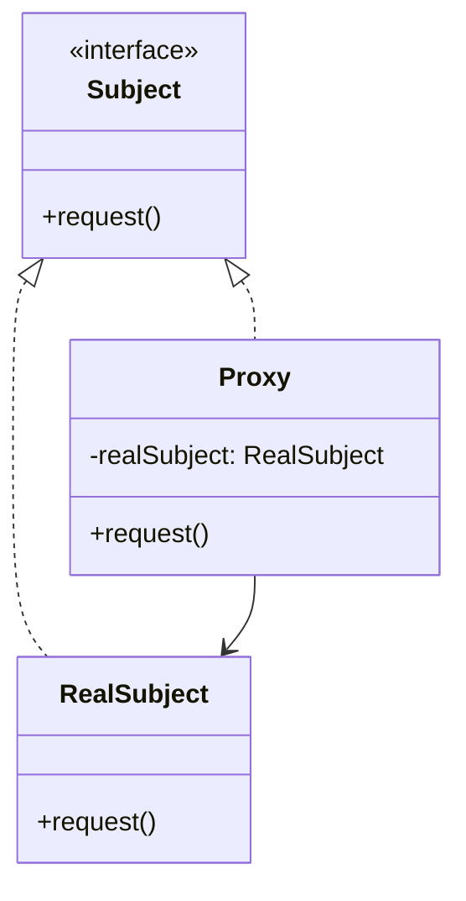
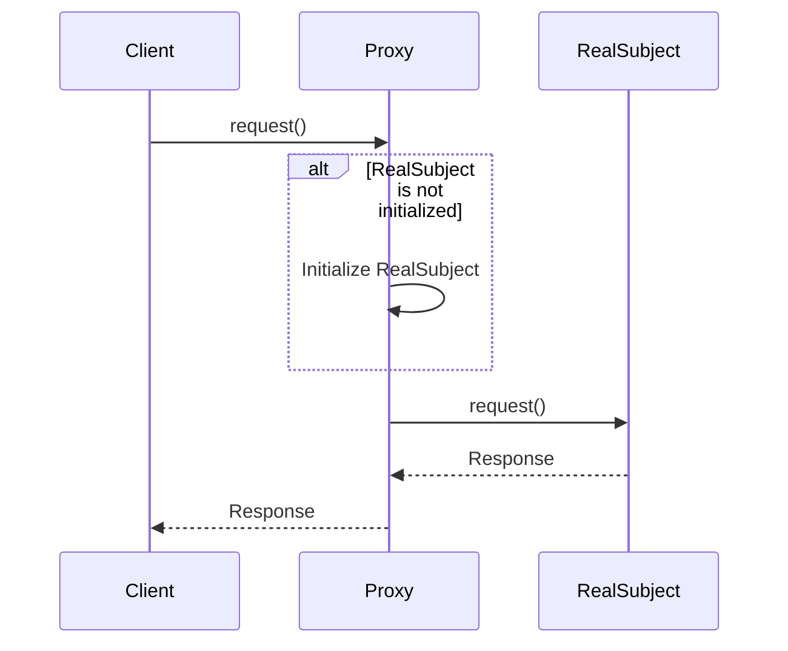

## 4.8. Proxy Pattern

The Proxy Pattern is a structural design pattern that provides a surrogate or placeholder for another object to control access to it. This pattern is particularly useful when you need to perform additional operations whenever an object is accessed, such as lazy initialization, access control, logging, or caching.

### Intent and Motivation

The primary intent of the Proxy Pattern is to provide a substitute for another object, allowing you to control access to it. This can be motivated by several factors:

- **Remote Proxy**: Represents an object in a different address space. It is used to hide the fact that an object resides in a different location.
- **Virtual Proxy**: Controls access to a resource that is expensive to create. It can delay the creation and initialization of the resource until it is needed.
- **Protection Proxy**: Controls access to the original object based on access rights. It can be used to add a layer of security.
- **Smart Reference**: Provides additional functionality, such as reference counting or logging, when accessing an object.

### Applicability

Consider using the Proxy Pattern when:

- You need to control access to an object.
- You want to add a layer of security or access control.
- You need to manage the lifecycle of a resource, such as lazy loading or caching.
- You want to add additional functionality to an object without modifying its code.

### Structure

The Proxy Pattern involves the following key components:

- **Subject**: The common interface for RealSubject and Proxy, allowing Proxy to be used anywhere RealSubject is expected.
- **RealSubject**: The actual object that the proxy represents.
- **Proxy**: The object that controls access to the RealSubject. It implements the same interface as RealSubject and maintains a reference to it.



### Participants and Collaborations

- **Subject**: Defines the common interface for RealSubject and Proxy so that a Proxy can be used anywhere a RealSubject is expected.
- **RealSubject**: The actual object that the Proxy represents.
- **Proxy**: Maintains a reference to the RealSubject and controls access to it. The Proxy can perform additional operations before or after forwarding a request to the RealSubject.

### Consequences

The Proxy Pattern offers several benefits and trade-offs:

- **Advantages**:
  - **Controlled Access**: Proxies can control access to the RealSubject, adding security or access control.
  - **Lazy Initialization**: Virtual proxies can delay the creation of expensive objects until they are needed.
  - **Additional Functionality**: Proxies can add functionality, such as logging or caching, without modifying the RealSubject.

- **Disadvantages**:
  - **Overhead**: Introducing a proxy can add overhead, especially if the proxy performs complex operations.
  - **Complexity**: The pattern can introduce additional complexity into the system, particularly if multiple proxies are used.

### Implementation Considerations

When implementing the Proxy Pattern, consider the following:

- **Overhead and Performance**: Ensure that the proxy does not introduce significant overhead, especially if it is used frequently.
- **Thread Safety**: If the proxy is used in a multithreaded environment, ensure that it is thread-safe.
- **Consistency**: Ensure that the proxy maintains consistent behavior with the RealSubject, so clients are unaware of the proxy's presence.

### Detailed Pseudocode Implementation

Let's explore a detailed pseudocode implementation of the Proxy Pattern. We'll use a simple example of a virtual proxy that controls access to an expensive resource.

```pseudocode
// Define the Subject interface
interface Subject {
    method request()
}

// Implement the RealSubject class
class RealSubject implements Subject {
    method request() {
        // Perform the actual operation
        print("RealSubject: Handling request.")
    }
}

// Implement the Proxy class
class Proxy implements Subject {
    private realSubject: RealSubject

    method request() {
        if (realSubject == null) {
            // Lazy initialization of the real subject
            realSubject = new RealSubject()
        }
        // Forward the request to the real subject
        realSubject.request()
    }
}

// Client code
function main() {
    proxy: Subject = new Proxy()
    // Use the proxy to access the real subject
    proxy.request()
}
```

In this example, the `Proxy` class controls access to the `RealSubject`. The `request` method in the `Proxy` class initializes the `RealSubject` only when it is needed, demonstrating lazy initialization.

### Example Usage Scenarios

The Proxy Pattern can be applied in various scenarios:

- **Remote Proxy**: Use a proxy to represent an object located on a remote server. The proxy handles communication with the server, providing a local interface for the client.
- **Virtual Proxy**: Use a proxy to delay the creation of a resource until it is needed. This can be useful for resources that are expensive to create or consume significant memory.
- **Protection Proxy**: Use a proxy to control access to an object based on user permissions. The proxy checks access rights before forwarding requests to the real object.

### Exercises

1. Implement a protection proxy that controls access to a sensitive resource based on user roles.
2. Modify the virtual proxy example to include logging functionality, recording each access to the real subject.
3. Create a remote proxy that simulates communication with a remote server.

### Visual Aids

Here is a sequence diagram illustrating the interaction between the client, proxy, and real subject:



### Knowledge Check

- Explain the primary intent of the Proxy Pattern.
- Describe a scenario where a virtual proxy would be beneficial.
- What are the potential drawbacks of using the Proxy Pattern?

### Embrace the Journey

Remember, mastering design patterns is a journey. As you explore the Proxy Pattern, consider how it can be applied to your projects. Experiment with different types of proxies and observe their impact on your code. Keep learning, stay curious, and enjoy the process!

## Quiz Time!



### What is the primary intent of the Proxy Pattern?

- [x] To provide a placeholder for another object to control access to it
- [ ] To create a new object by copying an existing one
- [ ] To define a family of algorithms and make them interchangeable
- [ ] To compose objects into tree structures to represent part-whole hierarchies

> **Explanation:** The Proxy Pattern is intended to provide a surrogate or placeholder for another object to control access to it.

### Which of the following is NOT a type of proxy?

- [ ] Remote Proxy
- [ ] Virtual Proxy
- [ ] Protection Proxy
- [x] Singleton Proxy

> **Explanation:** Singleton Proxy is not a recognized type of proxy. The common types are Remote, Virtual, and Protection Proxies.

### What is a potential disadvantage of using the Proxy Pattern?

- [x] It can introduce overhead and complexity
- [ ] It enhances code readability
- [ ] It simplifies object creation
- [ ] It reduces memory usage

> **Explanation:** The Proxy Pattern can introduce overhead and complexity, especially if the proxy performs complex operations.

### In the Proxy Pattern, what role does the Proxy class play?

- [x] It controls access to the RealSubject
- [ ] It defines the common interface for RealSubject and Proxy
- [ ] It performs the actual operations
- [ ] It composes objects into tree structures

> **Explanation:** The Proxy class controls access to the RealSubject and can perform additional operations before or after forwarding a request.

### When should you consider using a virtual proxy?

- [x] When you need to delay the creation of an expensive resource
- [ ] When you need to compose objects into tree structures
- [ ] When you need to create a new object by copying an existing one
- [ ] When you need to define a family of algorithms

> **Explanation:** A virtual proxy is useful when you need to delay the creation of an expensive resource until it is needed.

### What is the role of the RealSubject in the Proxy Pattern?

- [x] It is the actual object that the proxy represents
- [ ] It controls access to the Proxy
- [ ] It defines the common interface for Proxy and Subject
- [ ] It provides additional functionality like logging

> **Explanation:** The RealSubject is the actual object that the proxy represents and to which the proxy forwards requests.

### Which of the following scenarios is suitable for a protection proxy?

- [x] Controlling access to an object based on user permissions
- [ ] Delaying the creation of an expensive resource
- [ ] Representing an object located on a remote server
- [ ] Composing objects into tree structures

> **Explanation:** A protection proxy is suitable for controlling access to an object based on user permissions.

### How does a remote proxy differ from a virtual proxy?

- [x] A remote proxy represents an object in a different address space, while a virtual proxy controls access to an expensive resource
- [ ] A remote proxy delays the creation of a resource, while a virtual proxy represents an object in a different address space
- [ ] A remote proxy controls access based on user permissions, while a virtual proxy performs logging
- [ ] A remote proxy and a virtual proxy are the same

> **Explanation:** A remote proxy represents an object in a different address space, while a virtual proxy controls access to an expensive resource.

### What is the benefit of using a smart reference in a proxy?

- [x] It provides additional functionality, such as reference counting or logging
- [ ] It delays the creation of an expensive resource
- [ ] It represents an object located on a remote server
- [ ] It controls access based on user permissions

> **Explanation:** A smart reference provides additional functionality, such as reference counting or logging, when accessing an object.

### True or False: The Proxy Pattern can be used to add a layer of security to an object.

- [x] True
- [ ] False

> **Explanation:** True. The Proxy Pattern can be used to add a layer of security by controlling access to an object based on access rights.


