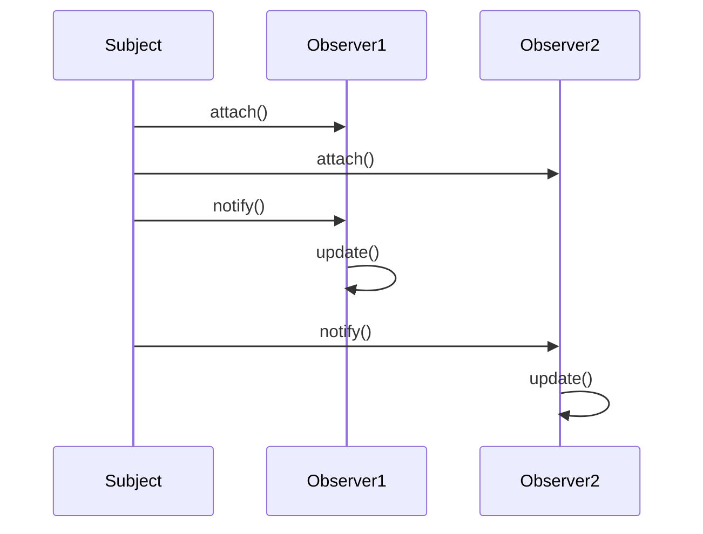

## 5.1. Introduction to Behavioral Patterns

In the realm of software development, particularly within object-oriented programming (OOP), design patterns serve as time-tested solutions to common design problems. Among these, behavioral design patterns play a crucial role in defining how objects interact and communicate with each other. This section delves into the purpose of behavioral patterns and how they manage algorithms and responsibilities among objects.

### Understanding Behavioral Patterns

Behavioral patterns focus on the interactions between objects, emphasizing the delegation of responsibilities and the communication patterns that emerge as a result. These patterns are essential for creating systems that are not only efficient but also maintainable and scalable. By understanding and applying behavioral patterns, developers can ensure that their systems are robust and capable of handling complex interactions seamlessly.

#### The Purpose of Behavioral Patterns

Behavioral patterns are designed to:

- **Encapsulate Algorithms**: By encapsulating algorithms, behavioral patterns allow for flexibility and interchangeability. This encapsulation enables developers to change algorithms at runtime without altering the objects that use them.
- **Delegate Responsibilities**: These patterns help in distributing responsibilities among objects, ensuring that each object has a clear and concise role within the system.
- **Promote Loose Coupling**: By focusing on the interactions between objects, behavioral patterns reduce dependencies, promoting a loosely coupled architecture that is easier to maintain and extend.
- **Enhance Communication**: They define clear communication protocols between objects, ensuring that data flows smoothly and efficiently throughout the system.

### Key Concepts in Behavioral Patterns

To fully grasp the significance of behavioral patterns, it's essential to understand some key concepts that underpin their design and implementation:

#### Encapsulation of Algorithms

Encapsulation is a fundamental principle in OOP, and behavioral patterns leverage this concept to encapsulate algorithms within objects. This encapsulation allows for:

- **Interchangeability**: Different algorithms can be swapped without affecting the objects that utilize them.
- **Flexibility**: Systems can adapt to changing requirements by altering the algorithms without modifying the entire system.
- **Reusability**: Encapsulated algorithms can be reused across different parts of a system or even in different projects.

#### Delegation of Responsibilities

Delegation is another core concept in behavioral patterns. By delegating responsibilities, these patterns ensure that:

- **Objects Have Clear Roles**: Each object is responsible for a specific aspect of the system, reducing complexity and improving readability.
- **System Cohesion**: Responsibilities are distributed in a way that promotes cohesion within the system, ensuring that related functionalities are grouped together.
- **Maintainability**: With clear roles and responsibilities, the system becomes easier to maintain and extend.

#### Promoting Loose Coupling

Loose coupling is a design goal that behavioral patterns strive to achieve. By reducing dependencies between objects, these patterns:

- **Increase Flexibility**: Changes in one part of the system have minimal impact on other parts, allowing for easier modifications and updates.
- **Enhance Scalability**: Systems can grow and evolve without becoming unwieldy or difficult to manage.
- **Improve Testability**: With reduced dependencies, individual components can be tested in isolation, leading to more reliable and robust systems.

#### Enhancing Communication

Effective communication between objects is crucial for the smooth operation of any system. Behavioral patterns define:

- **Clear Communication Protocols**: By establishing protocols, these patterns ensure that data is exchanged efficiently and accurately.
- **Consistent Data Flow**: They promote a consistent flow of information, reducing the likelihood of errors and inconsistencies.
- **Synchronization**: In systems where timing is critical, behavioral patterns help synchronize interactions, ensuring that operations occur in the correct order.

### Common Behavioral Patterns

There are several well-known behavioral patterns, each addressing specific interaction challenges within a system. Some of the most common include:

- **Chain of Responsibility**: This pattern allows a request to be passed along a chain of handlers, with each handler having the opportunity to process the request or pass it along.
- **Command**: Encapsulates a request as an object, allowing for parameterization of clients with queues, requests, and operations.
- **Interpreter**: Defines a representation for a language's grammar and provides an interpreter to process sentences in the language.
- **Iterator**: Provides a way to access elements of an aggregate object sequentially without exposing its underlying representation.
- **Mediator**: Defines an object that encapsulates how a set of objects interact, promoting loose coupling by keeping objects from referring to each other explicitly.
- **Memento**: Captures and externalizes an object's internal state without violating encapsulation, allowing the object to be restored to this state later.
- **Observer**: Defines a one-to-many dependency between objects, so that when one object changes state, all its dependents are notified and updated automatically.
- **State**: Allows an object to alter its behavior when its internal state changes, appearing to change its class.
- **Strategy**: Defines a family of algorithms, encapsulates each one, and makes them interchangeable, allowing the algorithm to vary independently from clients that use it.
- **Template Method**: Defines the skeleton of an algorithm in an operation, deferring some steps to subclasses.
- **Visitor**: Represents an operation to be performed on elements of an object structure, allowing new operations to be defined without changing the classes of the elements on which it operates.

### Sample Code Snippets

Let's explore a simple example of a behavioral pattern using pseudocode. We'll demonstrate the **Observer Pattern**, which is commonly used to implement distributed event-handling systems.

#### Observer Pattern Example

The Observer Pattern defines a one-to-many dependency between objects, allowing multiple observers to listen to and react to events from a subject.

```pseudocode
// Subject class
class Subject:
    observers = []

    method attach(observer):
        observers.add(observer)

    method detach(observer):
        observers.remove(observer)

    method notify():
        for observer in observers:
            observer.update()

// Observer interface
interface Observer:
    method update()

// Concrete Observer class
class ConcreteObserver implements Observer:
    method update():
        print("Observer has been updated")

// Client code
subject = Subject()
observer1 = ConcreteObserver()
observer2 = ConcreteObserver()

subject.attach(observer1)
subject.attach(observer2)

subject.notify()  // Both observer1 and observer2 will be updated
```

In this example, the `Subject` class maintains a list of observers and provides methods to attach, detach, and notify them. The `Observer` interface defines the `update` method that concrete observers must implement. When the subject's state changes, it calls the `notify` method, which in turn calls the `update` method on all attached observers.

### Visualizing Behavioral Patterns

To better understand how behavioral patterns work, let's visualize the Observer Pattern using a sequence diagram. This diagram illustrates the interaction between the subject and its observers.



In this sequence diagram, we see the `Subject` attaching `Observer1` and `Observer2`. When the `Subject` calls `notify`, each observer's `update` method is invoked, demonstrating the one-to-many relationship.

### Try It Yourself

To deepen your understanding of the Observer Pattern, try modifying the pseudocode example:

- Add a `ConcreteObserver` that logs a different message when updated.
- Implement a method in `Subject` to change its state and notify observers only if the state changes.
- Create a scenario where observers are dynamically attached and detached based on certain conditions.

### Design Considerations

When implementing behavioral patterns, consider the following:

- **Performance**: Ensure that the pattern does not introduce unnecessary overhead, especially in systems with a large number of objects.
- **Complexity**: While patterns can simplify interactions, they can also introduce complexity. Use them judiciously to avoid over-engineering.
- **Scalability**: Design patterns should support the growth of the system without requiring significant refactoring.
- **Maintainability**: Patterns should enhance the maintainability of the system by promoting clear and concise interactions.

### Differences and Similarities

Behavioral patterns often share similarities with other pattern categories, such as structural and creational patterns. However, they are distinct in their focus on object interactions and responsibilities. For instance:

- **Behavioral vs. Structural**: While structural patterns focus on the composition of classes and objects, behavioral patterns emphasize the interactions and communication between them.
- **Behavioral vs. Creational**: Creational patterns deal with object creation mechanisms, whereas behavioral patterns are concerned with the ways objects interact and collaborate.

### Conclusion

Behavioral design patterns are indispensable tools for managing complex interactions within object-oriented systems. By encapsulating algorithms, delegating responsibilities, promoting loose coupling, and enhancing communication, these patterns enable developers to build robust, scalable, and maintainable software. As you continue your journey in mastering design patterns, remember that the key to success lies in understanding the problem context and selecting the appropriate pattern to address it.

## Quiz Time!



### What is the primary focus of behavioral design patterns?

- [x] Managing interactions and responsibilities among objects
- [ ] Defining object creation mechanisms
- [ ] Structuring classes and objects
- [ ] Optimizing performance

> **Explanation:** Behavioral design patterns primarily focus on managing interactions and responsibilities among objects, ensuring efficient communication and delegation.

### Which concept is NOT a key focus of behavioral patterns?

- [ ] Encapsulation of algorithms
- [ ] Delegation of responsibilities
- [ ] Promoting loose coupling
- [x] Object creation

> **Explanation:** Object creation is the focus of creational patterns, not behavioral patterns.

### What is the main advantage of encapsulating algorithms in behavioral patterns?

- [x] Flexibility and interchangeability
- [ ] Increased complexity
- [ ] Reduced performance
- [ ] Tight coupling

> **Explanation:** Encapsulating algorithms allows for flexibility and interchangeability, enabling changes without affecting the objects that use them.

### Which pattern defines a one-to-many dependency between objects?

- [ ] Command
- [x] Observer
- [ ] Strategy
- [ ] State

> **Explanation:** The Observer Pattern defines a one-to-many dependency, allowing multiple observers to react to changes in a subject.

### What is the primary benefit of promoting loose coupling in behavioral patterns?

- [x] Increased flexibility and maintainability
- [ ] Reduced scalability
- [ ] Increased dependencies
- [ ] Decreased testability

> **Explanation:** Promoting loose coupling increases flexibility and maintainability by reducing dependencies between objects.

### Which pattern encapsulates a request as an object?

- [x] Command
- [ ] Interpreter
- [ ] Memento
- [ ] Visitor

> **Explanation:** The Command Pattern encapsulates a request as an object, allowing for parameterization of clients with queues, requests, and operations.

### What is a common characteristic of the State Pattern?

- [x] Allows an object to alter its behavior when its internal state changes
- [ ] Defines a one-to-many dependency
- [ ] Encapsulates a request as an object
- [ ] Provides a way to access elements sequentially

> **Explanation:** The State Pattern allows an object to alter its behavior when its internal state changes, appearing to change its class.

### Which pattern is used to provide a way to access elements of an aggregate object sequentially?

- [ ] Observer
- [ ] Command
- [x] Iterator
- [ ] Strategy

> **Explanation:** The Iterator Pattern provides a way to access elements of an aggregate object sequentially without exposing its underlying representation.

### What is the role of the Mediator Pattern?

- [x] Encapsulates how a set of objects interact
- [ ] Defines a representation for a language's grammar
- [ ] Captures and externalizes an object's internal state
- [ ] Represents an operation to be performed on elements of an object structure

> **Explanation:** The Mediator Pattern encapsulates how a set of objects interact, promoting loose coupling by keeping objects from referring to each other explicitly.

### True or False: Behavioral patterns are primarily concerned with the composition of classes and objects.

- [ ] True
- [x] False

> **Explanation:** False. Behavioral patterns are primarily concerned with the interactions and communication between objects, not their composition.


