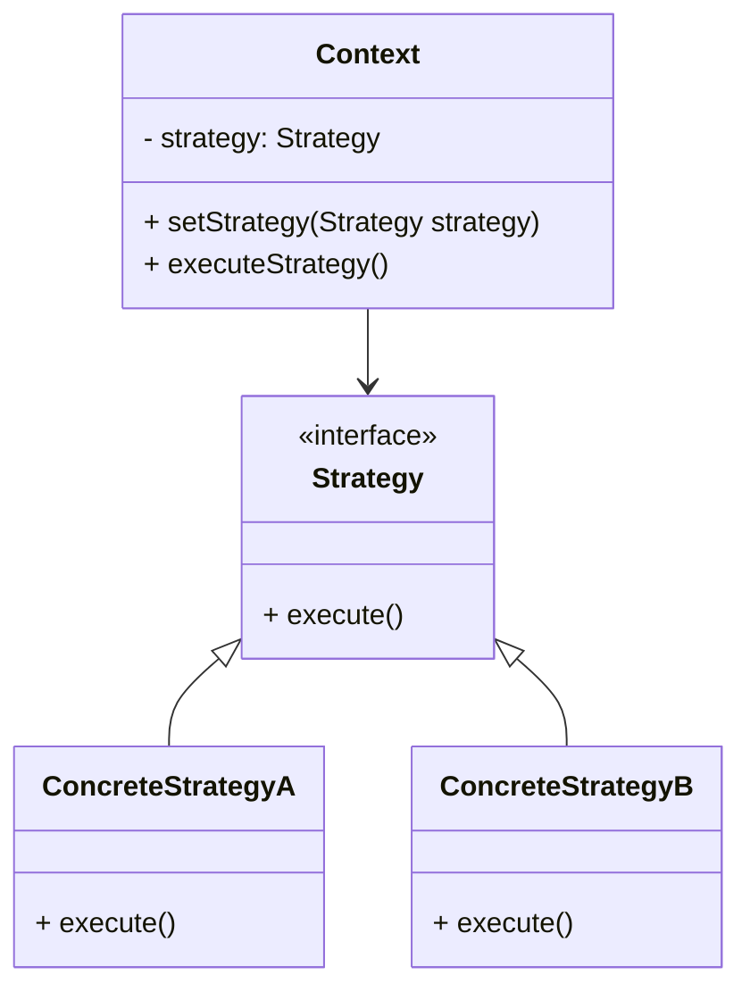
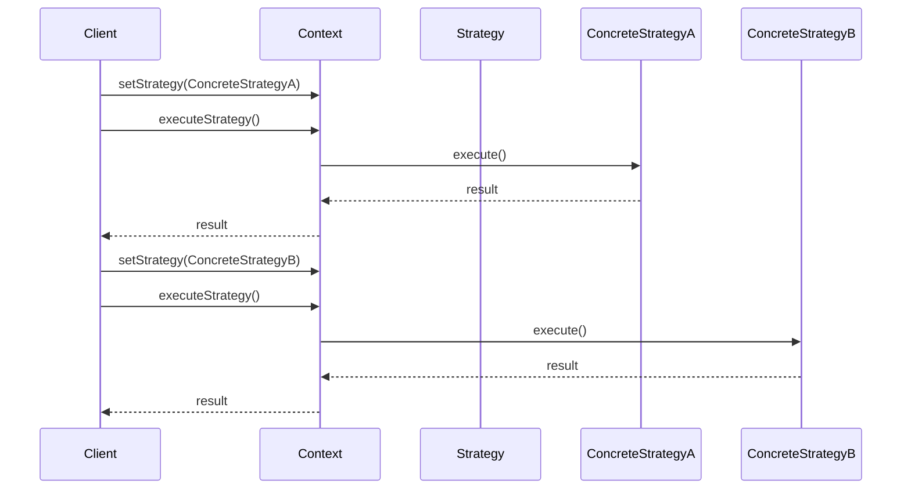

## 5.10. Strategy Pattern

The Strategy Pattern is a powerful design pattern in object-oriented programming that allows you to define a family of algorithms, encapsulate each one, and make them interchangeable. This pattern is particularly useful when you want to enable a client to choose an algorithm from a family of algorithms at runtime. By using the Strategy Pattern, you can enhance the flexibility and maintainability of your code by decoupling the algorithm from the client that uses it.

### Intent and Motivation

The primary intent of the Strategy Pattern is to define a family of algorithms, encapsulate each one, and make them interchangeable. This pattern allows the algorithm to vary independently from the clients that use it. The motivation behind using the Strategy Pattern is to avoid hardcoding algorithms into the client and to provide a way to select an algorithm at runtime.

- **Defining a Family of Algorithms**: The Strategy Pattern allows you to define a set of algorithms that can be used interchangeably. Each algorithm is encapsulated in its own class, implementing a common interface.
- **Encapsulating Each Algorithm**: By encapsulating algorithms in separate classes, you can easily add new algorithms or modify existing ones without affecting the client code.
- **Making Algorithms Interchangeable**: The Strategy Pattern enables you to switch between different algorithms at runtime, providing flexibility in how a task is performed.

### Applicability

The Strategy Pattern is applicable in the following scenarios:

- **Multiple Algorithms**: When you have multiple algorithms for a specific task and want to choose one at runtime.
- **Avoiding Conditional Statements**: When you want to avoid using complex conditional statements to select an algorithm.
- **Encapsulation**: When you want to encapsulate related algorithms in a way that allows them to be easily interchangeable.
- **Open/Closed Principle**: When you want to adhere to the Open/Closed Principle by allowing new algorithms to be added without modifying existing code.

### Structure

The Strategy Pattern consists of the following key components:

- **Strategy Interface**: Defines a common interface for all supported algorithms. The context uses this interface to call the algorithm defined by a concrete strategy.
- **Concrete Strategies**: Implement the strategy interface to provide specific algorithms.
- **Context**: Maintains a reference to a strategy object and uses it to perform the algorithm.



### Key Participants

- **Strategy**: The interface that defines the algorithm's skeleton.
- **ConcreteStrategy**: Classes that implement the strategy interface and provide specific algorithm implementations.
- **Context**: The class that maintains a reference to a strategy object and delegates the algorithm execution to the strategy.

### Participants and Collaborations

- **Strategy Interface**: Provides a common interface for all concrete strategies.
- **Concrete Strategies**: Implement the strategy interface and provide specific algorithm implementations.
- **Context**: Maintains a reference to a strategy object and delegates the algorithm execution to the strategy.

### Consequences

The Strategy Pattern offers several advantages:

- **Enhancing Flexibility**: By encapsulating algorithms in separate classes, you can easily switch between different algorithms at runtime.
- **Simplifying Code**: The Strategy Pattern helps simplify code by removing complex conditional statements used to select an algorithm.
- **Adhering to the Open/Closed Principle**: The Strategy Pattern allows you to add new algorithms without modifying existing code, adhering to the Open/Closed Principle.

### Implementation Considerations

When implementing the Strategy Pattern, consider the following:

- **Strategy Selection**: Provide a mechanism for selecting the appropriate strategy at runtime. This can be done through configuration files, user input, or other means.
- **Performance**: Consider the performance implications of switching strategies at runtime. Ensure that the strategy selection process does not introduce significant overhead.
- **State Management**: If strategies require state, ensure that the state is managed appropriately to avoid unintended side effects.

### Detailed Pseudocode Implementation

Let's explore a detailed pseudocode implementation of the Strategy Pattern. In this example, we'll create a simple calculator that can perform different operations (addition, subtraction, multiplication, division) using the Strategy Pattern.

```pseudocode
// Strategy Interface
interface OperationStrategy {
    execute(a, b)
}

// Concrete Strategy for Addition
class AdditionStrategy implements OperationStrategy {
    execute(a, b) {
        return a + b
    }
}

// Concrete Strategy for Subtraction
class SubtractionStrategy implements OperationStrategy {
    execute(a, b) {
        return a - b
    }
}

// Concrete Strategy for Multiplication
class MultiplicationStrategy implements OperationStrategy {
    execute(a, b) {
        return a * b
    }
}

// Concrete Strategy for Division
class DivisionStrategy implements OperationStrategy {
    execute(a, b) {
        if b == 0 then
            throw "Division by zero error"
        end if
        return a / b
    }
}

// Context
class Calculator {
    private strategy: OperationStrategy

    setStrategy(strategy: OperationStrategy) {
        this.strategy = strategy
    }

    executeStrategy(a, b) {
        return this.strategy.execute(a, b)
    }
}

// Client Code
calculator = new Calculator()

// Set strategy to addition and execute
calculator.setStrategy(new AdditionStrategy())
print("Addition: " + calculator.executeStrategy(5, 3))

// Set strategy to subtraction and execute
calculator.setStrategy(new SubtractionStrategy())
print("Subtraction: " + calculator.executeStrategy(5, 3))

// Set strategy to multiplication and execute
calculator.setStrategy(new MultiplicationStrategy())
print("Multiplication: " + calculator.executeStrategy(5, 3))

// Set strategy to division and execute
calculator.setStrategy(new DivisionStrategy())
print("Division: " + calculator.executeStrategy(5, 3))
```

### Example Usage Scenarios

The Strategy Pattern can be used in various scenarios, including:

- **Sorting Algorithms**: Implement different sorting algorithms (e.g., quicksort, mergesort, bubblesort) as strategies and allow the client to choose the desired sorting algorithm at runtime.
- **Payment Processing**: Implement different payment processing methods (e.g., credit card, PayPal, bank transfer) as strategies and allow the client to choose the desired payment method.
- **Data Compression**: Implement different data compression algorithms (e.g., gzip, bzip2, LZMA) as strategies and allow the client to choose the desired compression algorithm.

### Exercises

1. **Implement a Strategy Pattern for Sorting**: Create a sorting application using the Strategy Pattern. Implement different sorting algorithms (e.g., quicksort, mergesort, bubblesort) as strategies and allow the user to choose the desired sorting algorithm at runtime.

2. **Extend the Calculator Example**: Add more operations (e.g., modulus, exponentiation) to the calculator example using the Strategy Pattern. Implement these operations as new strategies and test them with the calculator.

3. **Create a Payment Processing System**: Implement a payment processing system using the Strategy Pattern. Implement different payment methods (e.g., credit card, PayPal, bank transfer) as strategies and allow the user to choose the desired payment method.

### Visual Aids

Below is a sequence diagram illustrating the interaction between the context and strategy in the Strategy Pattern.



### Design Considerations

- **When to Use**: Use the Strategy Pattern when you have multiple algorithms for a specific task and want to choose one at runtime, or when you want to avoid using complex conditional statements to select an algorithm.
- **Pitfalls**: Be cautious of the potential overhead introduced by switching strategies at runtime. Ensure that the strategy selection process does not introduce significant performance issues.

### Differences and Similarities

- **Strategy vs. State Pattern**: The Strategy Pattern is similar to the State Pattern in that both involve changing behavior at runtime. However, the Strategy Pattern focuses on selecting an algorithm, while the State Pattern focuses on changing the object's state.
- **Strategy vs. Template Method Pattern**: The Strategy Pattern is similar to the Template Method Pattern in that both involve defining a family of algorithms. However, the Strategy Pattern encapsulates each algorithm in a separate class, while the Template Method Pattern uses inheritance to define the algorithm's skeleton.

### Try It Yourself

To reinforce your understanding of the Strategy Pattern, try modifying the provided pseudocode examples. For instance, you can add a new operation to the calculator or implement a new sorting algorithm in the sorting application. Experiment with different strategies and observe how the Strategy Pattern enhances flexibility and maintainability.

Remember, this is just the beginning. As you progress, you'll build more complex and interactive applications using the Strategy Pattern. Keep experimenting, stay curious, and enjoy the journey!

## Quiz Time!



### What is the primary intent of the Strategy Pattern?

- [x] To define a family of algorithms, encapsulate each one, and make them interchangeable.
- [ ] To provide a way to access elements of an aggregate object sequentially.
- [ ] To define an object that encapsulates how a set of objects interact.
- [ ] To attach additional responsibilities to an object dynamically.

> **Explanation:** The Strategy Pattern's primary intent is to define a family of algorithms, encapsulate each one, and make them interchangeable.

### Which component of the Strategy Pattern maintains a reference to a strategy object?

- [ ] Strategy
- [ ] ConcreteStrategy
- [x] Context
- [ ] Client

> **Explanation:** The Context component maintains a reference to a strategy object and uses it to perform the algorithm.

### When should you consider using the Strategy Pattern?

- [x] When you have multiple algorithms for a specific task and want to choose one at runtime.
- [ ] When you want to provide a unified interface to a set of interfaces in a subsystem.
- [ ] When you want to compose objects into tree structures to represent part-whole hierarchies.
- [ ] When you want to decouple an abstraction from its implementation.

> **Explanation:** The Strategy Pattern is useful when you have multiple algorithms for a specific task and want to choose one at runtime.

### What is a key advantage of using the Strategy Pattern?

- [ ] It simplifies client interactions by providing a unified interface.
- [x] It enhances flexibility by allowing algorithms to be interchangeable.
- [ ] It supports undo/redo operations by encapsulating a request as an object.
- [ ] It provides a way to access elements of an aggregate object sequentially.

> **Explanation:** The Strategy Pattern enhances flexibility by allowing algorithms to be interchangeable.

### Which of the following is a consequence of the Strategy Pattern?

- [x] Simplifying code by removing complex conditional statements.
- [ ] Providing a placeholder for another object to control access to it.
- [ ] Defining the skeleton of an algorithm in an operation, deferring some steps to subclasses.
- [ ] Using sharing to support large numbers of fine-grained objects efficiently.

> **Explanation:** The Strategy Pattern simplifies code by removing complex conditional statements used to select an algorithm.

### What is the role of the ConcreteStrategy in the Strategy Pattern?

- [ ] To define a common interface for all supported algorithms.
- [x] To implement the strategy interface and provide specific algorithm implementations.
- [ ] To maintain a reference to a strategy object and delegate the algorithm execution.
- [ ] To encapsulate how a set of objects interact.

> **Explanation:** The ConcreteStrategy implements the strategy interface and provides specific algorithm implementations.

### How does the Strategy Pattern adhere to the Open/Closed Principle?

- [x] By allowing new algorithms to be added without modifying existing code.
- [ ] By providing a way to access elements of an aggregate object sequentially.
- [ ] By defining an object that encapsulates how a set of objects interact.
- [ ] By attaching additional responsibilities to an object dynamically.

> **Explanation:** The Strategy Pattern adheres to the Open/Closed Principle by allowing new algorithms to be added without modifying existing code.

### What is a potential pitfall of the Strategy Pattern?

- [ ] It introduces significant overhead by providing a unified interface to a set of interfaces.
- [x] It may introduce performance issues due to the overhead of switching strategies at runtime.
- [ ] It complicates client interactions by providing a placeholder for another object.
- [ ] It limits flexibility by using sharing to support large numbers of fine-grained objects.

> **Explanation:** The Strategy Pattern may introduce performance issues due to the overhead of switching strategies at runtime.

### Which pattern is commonly confused with the Strategy Pattern?

- [ ] Observer Pattern
- [x] State Pattern
- [ ] Composite Pattern
- [ ] Proxy Pattern

> **Explanation:** The Strategy Pattern is commonly confused with the State Pattern, as both involve changing behavior at runtime.

### True or False: The Strategy Pattern focuses on changing an object's state.

- [ ] True
- [x] False

> **Explanation:** False. The Strategy Pattern focuses on selecting an algorithm, not changing an object's state.


