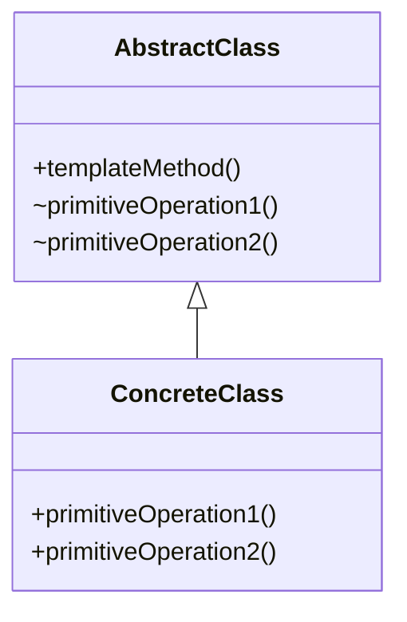
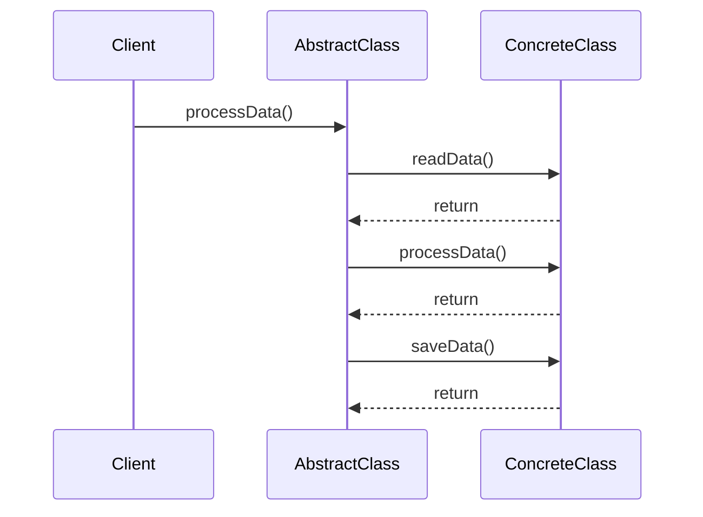

## 5.11. Template Method Pattern

The Template Method Pattern is a classic behavioral design pattern that defines the skeleton of an algorithm in a method, deferring some steps to subclasses. This pattern allows subclasses to redefine certain steps of an algorithm without changing its structure, promoting code reuse and consistency across different implementations.

### Intent and Motivation

The primary intent of the Template Method Pattern is to define the structure of an algorithm while allowing subclasses to provide specific implementations for certain steps. This pattern is particularly useful when you have multiple classes that share a similar process but differ in some specific steps. By using the Template Method Pattern, you can ensure that the overall structure of the algorithm remains consistent, while still allowing for flexibility in the implementation of individual steps.

#### Key Motivations:
- **Code Reuse**: By encapsulating the invariant parts of an algorithm in a base class, you can avoid code duplication and promote reuse.
- **Consistency**: Ensures that the algorithm's structure is consistent across different implementations, reducing the risk of errors.
- **Flexibility**: Allows subclasses to customize specific steps of the algorithm without affecting the overall structure.

### Applicability

The Template Method Pattern is applicable in scenarios where:
- You have multiple classes that implement variations of the same algorithm.
- You want to enforce a consistent algorithm structure across different implementations.
- You need to allow subclasses to customize specific steps of an algorithm.

### Structure

The Template Method Pattern consists of the following components:



- **AbstractClass**: Defines the template method, which contains the skeleton of the algorithm. It also declares abstract primitive operations that must be implemented by subclasses.
- **ConcreteClass**: Implements the primitive operations to carry out subclass-specific steps of the algorithm.

### Participants and Collaborations

- **AbstractClass**: 
  - Defines the template method, which outlines the algorithm's structure.
  - Declares abstract methods for each step of the algorithm that must be implemented by subclasses.

- **ConcreteClass**:
  - Implements the abstract methods defined in the AbstractClass.
  - Provides specific behavior for each step of the algorithm.

### Consequences

The Template Method Pattern offers several benefits:
- **Promotes Code Reuse**: By encapsulating the invariant parts of an algorithm in a base class, you can avoid code duplication and promote reuse.
- **Ensures Consistency**: The algorithm's structure is consistent across different implementations, reducing the risk of errors.
- **Provides Flexibility**: Subclasses can customize specific steps of the algorithm without affecting the overall structure.

However, there are also some potential drawbacks:
- **Increased Complexity**: The pattern can introduce additional complexity, as it requires the creation of an abstract class and multiple subclasses.
- **Limited Flexibility**: The pattern enforces a specific algorithm structure, which may not be suitable for all scenarios.

### Implementation Considerations

When implementing the Template Method Pattern, consider the following:

- **Hook Methods**: These are optional methods in the base class that can be overridden by subclasses to provide additional behavior. Hook methods allow subclasses to "hook into" the algorithm at specific points without having to override the entire template method.

- **Abstract Methods**: These are the steps of the algorithm that must be implemented by subclasses. They define the specific behavior for each step of the algorithm.

- **Concrete Methods**: These are the steps of the algorithm that are implemented in the base class and are not intended to be overridden by subclasses.

### Detailed Pseudocode Implementation

Let's explore a detailed pseudocode implementation of the Template Method Pattern. We'll use a simple example of a data processing pipeline, where the steps of the pipeline are defined in a base class, and subclasses provide specific implementations for each step.

```pseudocode
// Abstract class defining the template method
class DataProcessor {
    // Template method defining the skeleton of the algorithm
    method processData() {
        readData()
        processData()
        saveData()
    }

    // Abstract methods to be implemented by subclasses
    abstract method readData()
    abstract method processData()
    abstract method saveData()
}

// Concrete class implementing the abstract methods
class CSVDataProcessor extends DataProcessor {
    method readData() {
        // Read data from a CSV file
        print("Reading data from CSV file")
    }

    method processData() {
        // Process the CSV data
        print("Processing CSV data")
    }

    method saveData() {
        // Save the processed data to a file
        print("Saving processed data to file")
    }
}

// Concrete class implementing the abstract methods
class JSONDataProcessor extends DataProcessor {
    method readData() {
        // Read data from a JSON file
        print("Reading data from JSON file")
    }

    method processData() {
        // Process the JSON data
        print("Processing JSON data")
    }

    method saveData() {
        // Save the processed data to a database
        print("Saving processed data to database")
    }
}

// Client code
function main() {
    // Create a CSV data processor and process data
    csvProcessor = new CSVDataProcessor()
    csvProcessor.processData()

    // Create a JSON data processor and process data
    jsonProcessor = new JSONDataProcessor()
    jsonProcessor.processData()
}

main()
```

### Example Usage Scenarios

The Template Method Pattern is widely used in various scenarios, including:

- **Frameworks and Libraries**: Frameworks often use the Template Method Pattern to define the structure of operations, allowing developers to customize specific steps.
- **Data Processing Pipelines**: As demonstrated in the pseudocode example, the pattern is useful for defining data processing pipelines where the steps are consistent, but the implementation varies.
- **Game Development**: In game development, the pattern can be used to define the structure of game loops, allowing different games to implement specific behaviors.

### Exercises

To reinforce your understanding of the Template Method Pattern, try the following exercises:

1. **Implement a Template Method Pattern for a Report Generator**: Create an abstract class `ReportGenerator` with a template method `generateReport()`. Implement concrete classes for different types of reports, such as `PDFReportGenerator` and `HTMLReportGenerator`.

2. **Extend the Data Processing Example**: Add a new subclass `XMLDataProcessor` to the data processing example, implementing the abstract methods to read, process, and save XML data.

3. **Create a Template Method Pattern for a Sorting Algorithm**: Define an abstract class `Sorter` with a template method `sort()`. Implement concrete classes for different sorting algorithms, such as `BubbleSorter` and `QuickSorter`.

### Visual Aids

To better understand the Template Method Pattern, let's visualize the flow of the algorithm using a sequence diagram.



### Try It Yourself

Encourage experimentation by suggesting modifications to the code examples. For instance, try adding a new step to the data processing pipeline, such as `validateData()`, and implement it in the subclasses.

### References and Links

For further reading on the Template Method Pattern, consider the following resources:

- [Design Patterns: Elements of Reusable Object-Oriented Software](https://en.wikipedia.org/wiki/Design_Patterns) by Erich Gamma, Richard Helm, Ralph Johnson, and John Vlissides.
- [Template Method Pattern on Wikipedia](https://en.wikipedia.org/wiki/Template_method_pattern)

### Knowledge Check

To test your understanding of the Template Method Pattern, consider the following questions:

- What is the primary intent of the Template Method Pattern?
- How does the pattern promote code reuse?
- What are hook methods, and how are they used in the Template Method Pattern?
- In what scenarios is the Template Method Pattern most applicable?

### Embrace the Journey

Remember, mastering design patterns is a journey. As you continue to explore and implement different patterns, you'll gain a deeper understanding of how to create flexible, reusable, and maintainable software. Keep experimenting, stay curious, and enjoy the journey!

## Quiz Time!



### What is the primary intent of the Template Method Pattern?

- [x] To define the skeleton of an algorithm in a method, deferring some steps to subclasses
- [ ] To allow multiple classes to implement the same interface
- [ ] To encapsulate a request as an object
- [ ] To provide a way to access elements of an aggregate object sequentially

> **Explanation:** The Template Method Pattern defines the skeleton of an algorithm in a method, deferring some steps to subclasses, allowing for customization of certain steps while maintaining the overall structure.

### How does the Template Method Pattern promote code reuse?

- [x] By encapsulating the invariant parts of an algorithm in a base class
- [ ] By allowing subclasses to implement their own versions of the entire algorithm
- [ ] By providing a way to access elements of an aggregate object sequentially
- [ ] By encapsulating a request as an object

> **Explanation:** The Template Method Pattern promotes code reuse by encapsulating the invariant parts of an algorithm in a base class, allowing subclasses to implement only the variable parts.

### What are hook methods in the context of the Template Method Pattern?

- [x] Optional methods in the base class that can be overridden by subclasses
- [ ] Methods that must be implemented by all subclasses
- [ ] Methods that define the entire algorithm in the base class
- [ ] Methods that provide a way to access elements of an aggregate object sequentially

> **Explanation:** Hook methods are optional methods in the base class that can be overridden by subclasses to provide additional behavior without having to override the entire template method.

### In what scenarios is the Template Method Pattern most applicable?

- [x] When you have multiple classes that implement variations of the same algorithm
- [ ] When you need to encapsulate a request as an object
- [ ] When you need to provide a way to access elements of an aggregate object sequentially
- [ ] When you need to define a one-to-many dependency between objects

> **Explanation:** The Template Method Pattern is most applicable when you have multiple classes that implement variations of the same algorithm, allowing for consistency and customization.

### Which of the following is a consequence of using the Template Method Pattern?

- [x] Promotes code reuse and ensures consistency
- [ ] Increases coupling between classes
- [ ] Requires all subclasses to implement the entire algorithm
- [ ] Provides a way to access elements of an aggregate object sequentially

> **Explanation:** The Template Method Pattern promotes code reuse and ensures consistency by defining the invariant parts of an algorithm in a base class and allowing subclasses to customize specific steps.

### What is the role of the AbstractClass in the Template Method Pattern?

- [x] To define the template method and declare abstract methods for each step of the algorithm
- [ ] To implement the entire algorithm without any customization
- [ ] To provide a way to access elements of an aggregate object sequentially
- [ ] To encapsulate a request as an object

> **Explanation:** The AbstractClass defines the template method and declares abstract methods for each step of the algorithm, which must be implemented by subclasses.

### What is the role of the ConcreteClass in the Template Method Pattern?

- [x] To implement the abstract methods defined in the AbstractClass
- [ ] To define the template method and declare abstract methods for each step of the algorithm
- [ ] To provide a way to access elements of an aggregate object sequentially
- [ ] To encapsulate a request as an object

> **Explanation:** The ConcreteClass implements the abstract methods defined in the AbstractClass, providing specific behavior for each step of the algorithm.

### How does the Template Method Pattern ensure consistency across different implementations?

- [x] By defining the overall structure of the algorithm in a base class
- [ ] By allowing subclasses to implement their own versions of the entire algorithm
- [ ] By providing a way to access elements of an aggregate object sequentially
- [ ] By encapsulating a request as an object

> **Explanation:** The Template Method Pattern ensures consistency across different implementations by defining the overall structure of the algorithm in a base class, allowing subclasses to customize specific steps.

### True or False: The Template Method Pattern can introduce additional complexity by requiring the creation of an abstract class and multiple subclasses.

- [x] True
- [ ] False

> **Explanation:** True. The Template Method Pattern can introduce additional complexity by requiring the creation of an abstract class and multiple subclasses, which may not be suitable for all scenarios.

### Which of the following is NOT a benefit of the Template Method Pattern?

- [ ] Promotes code reuse
- [ ] Ensures consistency
- [ ] Provides flexibility
- [x] Increases coupling between classes

> **Explanation:** The Template Method Pattern promotes code reuse, ensures consistency, and provides flexibility, but it does not increase coupling between classes.


