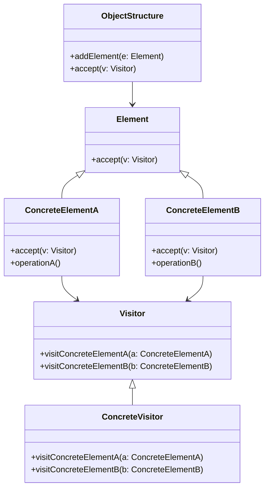
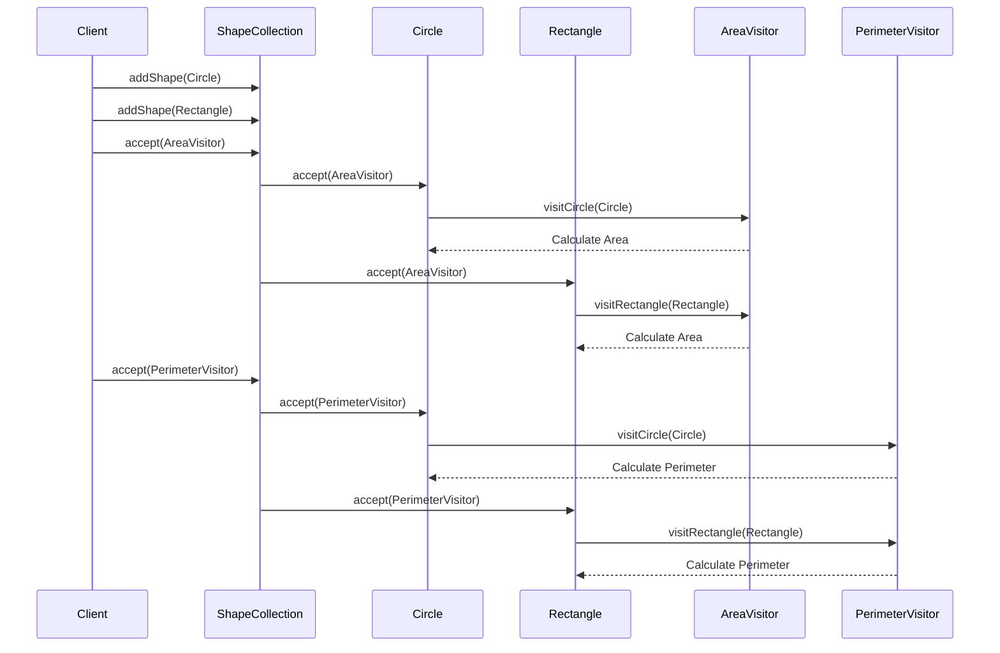

## 5.12. Visitor Pattern

The Visitor Pattern is a powerful design pattern in the realm of object-oriented programming that allows you to define new operations on a set of objects without changing the objects themselves. It is part of the behavioral design patterns, which focus on how classes and objects interact and communicate with each other. In this section, we will delve into the intricacies of the Visitor Pattern, exploring its intent, structure, applicability, and implementation through detailed pseudocode examples.

### Intent and Motivation

The primary intent of the Visitor Pattern is to represent an operation to be performed on elements of an object structure. By using the Visitor Pattern, you can add new operations to existing object structures without modifying the structures themselves. This is particularly useful when you have a complex object structure and need to perform various unrelated operations on it.

#### Key Motivations:

- **Separation of Concerns**: The Visitor Pattern separates the algorithm from the object structure, allowing you to define new operations independently.
- **Extensibility**: It enables you to add new operations without altering the classes of the elements on which it operates.
- **Double Dispatch**: The pattern uses a technique called double dispatch to ensure that the correct operation is executed for a particular object type.

### Applicability

The Visitor Pattern is applicable in scenarios where:

- You have an object structure with many distinct classes and want to perform operations on these objects without modifying their classes.
- You need to add new operations frequently, and modifying the object structure classes each time is not feasible.
- The object structure is stable, but the operations on it are subject to change.
- You want to perform operations that depend on both the concrete class of the element and the class of the visitor.

### Structure

The Visitor Pattern involves several key participants and collaborations that work together to achieve its objectives.

#### Key Participants:

- **Visitor**: Declares a visit operation for each class of ConcreteElement in the object structure.
- **ConcreteVisitor**: Implements each operation declared by Visitor. Each operation implements a fragment of the algorithm defined for the structure.
- **Element**: Defines an accept operation that takes a visitor as an argument.
- **ConcreteElement**: Implements the accept operation, which calls the corresponding visit operation on the visitor.
- **ObjectStructure**: Can enumerate its elements and provide a high-level interface to allow the visitor to visit its elements.

#### Class Diagram

Below is a class diagram illustrating the relationships between the participants in the Visitor Pattern:



### Participants and Collaborations

- **Visitor**: The interface or abstract class that declares a visit method for each type of ConcreteElement.
- **ConcreteVisitor**: Implements the operations defined in the Visitor interface. Each operation implements a fragment of the algorithm defined for the structure.
- **Element**: An interface or abstract class that defines an accept method, which takes a visitor as an argument.
- **ConcreteElement**: Implements the accept method, which calls the corresponding visit method on the visitor.
- **ObjectStructure**: A class that can enumerate its elements and provide a high-level interface to allow the visitor to visit its elements.

### Consequences

The Visitor Pattern offers several advantages and trade-offs:

#### Advantages:

- **Adding New Operations**: New operations can be added easily by creating new visitor classes.
- **Separation of Concerns**: Operations are separated from the object structure, making the design cleaner and more maintainable.
- **Flexibility**: The pattern allows for different operations to be performed on the same object structure without altering the structure.

#### Trade-offs:

- **Circular Dependency**: The pattern can introduce circular dependencies between the visitor and the elements.
- **Complexity**: It can increase the complexity of the code, especially if the object structure is not stable.
- **Double Dispatch**: The pattern relies on double dispatch, which can be difficult to understand and implement for beginners.

### Implementation Considerations

When implementing the Visitor Pattern, consider the following:

- **Double Dispatch**: Ensure that the pattern uses double dispatch to call the correct operation on the visitor for the specific element type.
- **Visitor Interface**: Define a visitor interface with a visit method for each concrete element class.
- **Element Interface**: Define an element interface with an accept method that takes a visitor as an argument.
- **Concrete Visitors**: Implement concrete visitor classes that define the operations to be performed on each element type.

### Detailed Pseudocode Implementation

Let's explore a detailed pseudocode implementation of the Visitor Pattern. We'll create a simple example where we have different types of shapes, and we want to perform operations like calculating the area and perimeter.

```pseudocode
// Visitor interface
interface Visitor {
    visitCircle(circle: Circle)
    visitRectangle(rectangle: Rectangle)
}

// ConcreteVisitor for calculating area
class AreaVisitor implements Visitor {
    visitCircle(circle: Circle) {
        // Calculate area of the circle
        area = PI * circle.radius * circle.radius
        print("Area of Circle: " + area)
    }
    
    visitRectangle(rectangle: Rectangle) {
        // Calculate area of the rectangle
        area = rectangle.width * rectangle.height
        print("Area of Rectangle: " + area)
    }
}

// ConcreteVisitor for calculating perimeter
class PerimeterVisitor implements Visitor {
    visitCircle(circle: Circle) {
        // Calculate perimeter of the circle
        perimeter = 2 * PI * circle.radius
        print("Perimeter of Circle: " + perimeter)
    }
    
    visitRectangle(rectangle: Rectangle) {
        // Calculate perimeter of the rectangle
        perimeter = 2 * (rectangle.width + rectangle.height)
        print("Perimeter of Rectangle: " + perimeter)
    }
}

// Element interface
interface Shape {
    accept(visitor: Visitor)
}

// ConcreteElement Circle
class Circle implements Shape {
    radius: Number
    
    accept(visitor: Visitor) {
        visitor.visitCircle(this)
    }
}

// ConcreteElement Rectangle
class Rectangle implements Shape {
    width: Number
    height: Number
    
    accept(visitor: Visitor) {
        visitor.visitRectangle(this)
    }
}

// ObjectStructure
class ShapeCollection {
    shapes: List<Shape>
    
    addShape(shape: Shape) {
        shapes.add(shape)
    }
    
    accept(visitor: Visitor) {
        for each shape in shapes {
            shape.accept(visitor)
        }
    }
}

// Client code
shapeCollection = new ShapeCollection()
shapeCollection.addShape(new Circle(5))
shapeCollection.addShape(new Rectangle(4, 6))

areaVisitor = new AreaVisitor()
perimeterVisitor = new PerimeterVisitor()

shapeCollection.accept(areaVisitor)
shapeCollection.accept(perimeterVisitor)
```

### Example Usage Scenarios

The Visitor Pattern is particularly useful in scenarios where you have a complex object structure and need to perform various operations on it. Some common use cases include:

- **Compilers**: Performing operations like type checking, code generation, and optimization on abstract syntax trees.
- **Graphics Applications**: Applying operations like rendering, transformation, and hit testing on graphical objects.
- **Document Processing**: Performing operations like formatting, printing, and exporting on document elements.

### Exercises

To reinforce your understanding of the Visitor Pattern, try the following exercises:

1. **Extend the Example**: Add a new shape, such as a Triangle, to the pseudocode example and implement the necessary visitor methods to calculate its area and perimeter.
2. **New Operation**: Implement a new visitor that calculates the diagonal of rectangles and the diameter of circles.
3. **Complex Object Structure**: Create a more complex object structure with different types of elements and implement a visitor that performs a specific operation on each element type.

### Visual Aids

To better understand the Visitor Pattern, let's visualize the interaction between the elements and the visitors using a sequence diagram.



### Differences and Similarities

The Visitor Pattern is often compared to other design patterns, such as the Strategy Pattern and the Command Pattern. Here are some key differences and similarities:

- **Visitor vs. Strategy**: The Strategy Pattern defines a family of algorithms and makes them interchangeable, whereas the Visitor Pattern defines new operations on an object structure without changing the structure itself.
- **Visitor vs. Command**: The Command Pattern encapsulates a request as an object, allowing for parameterization of clients with queues, requests, and operations. The Visitor Pattern, on the other hand, focuses on adding new operations to an object structure.

### Knowledge Check

Before we conclude, let's summarize the key takeaways:

- The Visitor Pattern allows you to define new operations on an object structure without modifying the structure itself.
- It uses double dispatch to ensure that the correct operation is executed for a particular object type.
- The pattern is useful in scenarios where you have a stable object structure but frequently need to add new operations.

### Embrace the Journey

Remember, mastering design patterns is a journey. The Visitor Pattern is just one of many tools in your software design toolkit. As you continue to explore and apply design patterns, you'll gain a deeper understanding of how to create flexible, maintainable, and scalable software systems. Keep experimenting, stay curious, and enjoy the journey!

## Quiz Time!



### What is the primary intent of the Visitor Pattern?

- [x] To represent an operation to be performed on elements of an object structure
- [ ] To encapsulate a request as an object
- [ ] To define a family of algorithms and make them interchangeable
- [ ] To provide a unified interface to a set of interfaces in a subsystem

> **Explanation:** The Visitor Pattern's primary intent is to represent an operation to be performed on elements of an object structure.

### Which technique does the Visitor Pattern use to ensure the correct operation is executed for a particular object type?

- [x] Double Dispatch
- [ ] Single Dispatch
- [ ] Polymorphism
- [ ] Delegation

> **Explanation:** The Visitor Pattern uses double dispatch to ensure that the correct operation is executed for a particular object type.

### What is a key advantage of using the Visitor Pattern?

- [x] Adding new operations easily
- [ ] Reducing the number of classes
- [ ] Simplifying the object structure
- [ ] Increasing the complexity of the code

> **Explanation:** A key advantage of the Visitor Pattern is that it allows adding new operations easily without modifying the object structure.

### In the Visitor Pattern, what role does the ConcreteVisitor play?

- [x] Implements each operation declared by the Visitor
- [ ] Defines an accept operation that takes a visitor as an argument
- [ ] Provides a high-level interface to allow the visitor to visit its elements
- [ ] Declares a visit operation for each class of ConcreteElement

> **Explanation:** The ConcreteVisitor implements each operation declared by the Visitor interface.

### What is a potential trade-off when using the Visitor Pattern?

- [x] Circular Dependency
- [ ] Reduced Flexibility
- [ ] Increased Code Simplicity
- [ ] Limited Extensibility

> **Explanation:** A potential trade-off of the Visitor Pattern is the introduction of circular dependencies between the visitor and the elements.

### Which of the following is NOT a participant in the Visitor Pattern?

- [ ] Visitor
- [ ] Element
- [ ] ConcreteVisitor
- [x] Strategy

> **Explanation:** Strategy is not a participant in the Visitor Pattern; it is a separate design pattern.

### How does the Visitor Pattern enhance flexibility?

- [x] By allowing different operations to be performed on the same object structure without altering the structure
- [ ] By reducing the number of classes in the object structure
- [ ] By simplifying the implementation of algorithms
- [ ] By making the object structure more complex

> **Explanation:** The Visitor Pattern enhances flexibility by allowing different operations to be performed on the same object structure without altering the structure.

### What is a common use case for the Visitor Pattern?

- [x] Compilers performing operations on abstract syntax trees
- [ ] Managing command histories
- [ ] Providing a way to access elements of an aggregate object sequentially
- [ ] Defining an object that encapsulates how a set of objects interact

> **Explanation:** A common use case for the Visitor Pattern is in compilers, where it is used to perform operations on abstract syntax trees.

### True or False: The Visitor Pattern is useful when the object structure is unstable.

- [ ] True
- [x] False

> **Explanation:** False. The Visitor Pattern is most useful when the object structure is stable, but the operations on it are subject to change.

### Which pattern is often compared to the Visitor Pattern due to its focus on operations?

- [x] Command Pattern
- [ ] Singleton Pattern
- [ ] Adapter Pattern
- [ ] Observer Pattern

> **Explanation:** The Command Pattern is often compared to the Visitor Pattern due to its focus on encapsulating operations.


