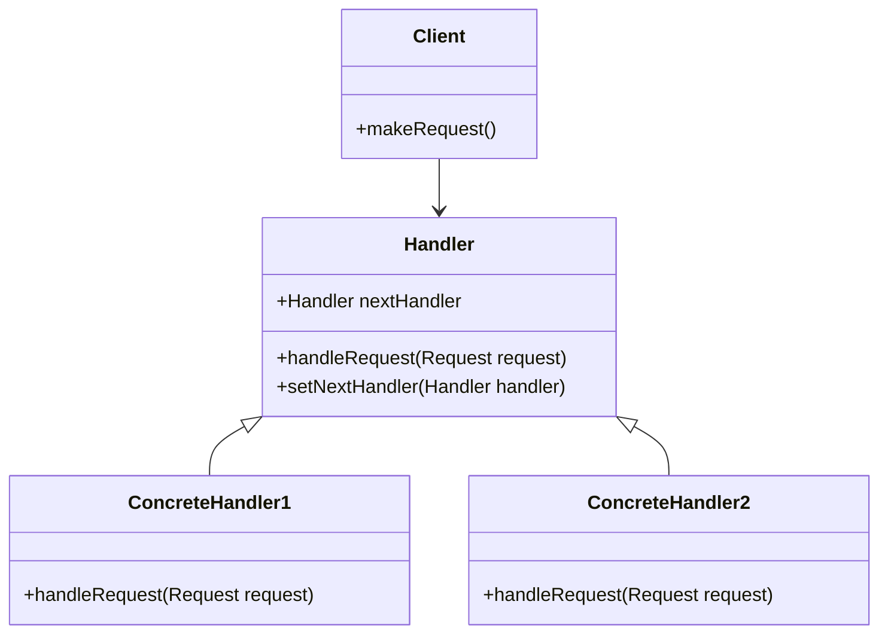
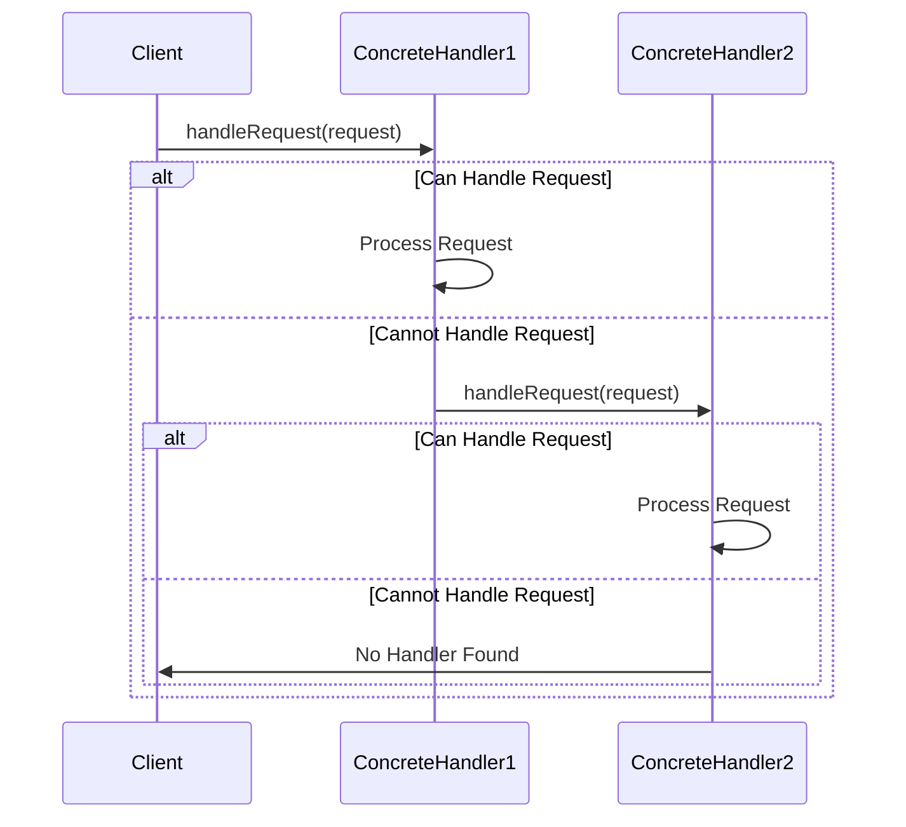

## 5.2. Chain of Responsibility Pattern

The Chain of Responsibility pattern is a behavioral design pattern that allows multiple objects to handle a request without coupling the sender to the receiver. This pattern is particularly useful when you want to pass a request along a chain of potential handlers until one of them handles it. Let's delve into the intricacies of this pattern, exploring its intent, applicability, structure, participants, consequences, and implementation.

### Intent and Motivation

The primary intent of the Chain of Responsibility pattern is to decouple the sender of a request from its receiver by allowing multiple objects to have the opportunity to handle the request. This is achieved by passing the request along a chain of handlers until one of them processes it.

#### Key Motivations:

- **Avoiding Tight Coupling:** By decoupling the sender and receiver, the pattern promotes flexibility and reusability. The sender does not need to know which handler will process the request.
- **Dynamic Handling:** The chain can be configured dynamically, allowing for flexible request handling at runtime.
- **Simplifying Object Responsibilities:** Each handler in the chain has a single responsibility, which aligns with the Single Responsibility Principle (SRP).

### Applicability

The Chain of Responsibility pattern is applicable in scenarios where:

- Multiple objects can handle a request, but the specific handler is not known a priori.
- You want to issue a request to one of several objects without specifying the receiver explicitly.
- The set of handlers and their order can be changed dynamically.

### Structure

The structure of the Chain of Responsibility pattern involves several key components:



### Participants and Collaborations

- **Handler:** Defines an interface for handling requests and optionally implements the successor link.
- **ConcreteHandler:** Handles requests it is responsible for. It can access its successor and pass the request along the chain if it cannot handle it.
- **Client:** Initiates the request to a handler in the chain.

### Consequences

The Chain of Responsibility pattern offers several benefits and trade-offs:

#### Benefits:

- **Reduced Coupling:** The sender and receiver are decoupled, promoting flexibility and reusability.
- **Dynamic Chain Configuration:** Handlers can be added or removed at runtime, allowing for dynamic request handling.
- **Single Responsibility:** Each handler has a clear and focused responsibility.

#### Trade-offs:

- **Uncertain Handling:** There is no guarantee that a request will be handled, which may require additional error handling.
- **Performance Overhead:** Passing a request along a long chain can introduce performance overhead.

### Implementation Considerations

When implementing the Chain of Responsibility pattern, consider the following:

- **Handling Request Termination:** Ensure that there is a mechanism to terminate the chain if no handler processes the request.
- **Chain Configuration:** Design the chain configuration to be flexible and easily modifiable.
- **Error Handling:** Implement error handling to manage cases where no handler processes the request.

### Detailed Pseudocode Implementation

Let's explore a detailed pseudocode implementation of the Chain of Responsibility pattern.

```pseudocode
// Define the Handler interface
class Handler:
    var nextHandler: Handler

    method setNextHandler(handler: Handler):
        this.nextHandler = handler

    method handleRequest(request: Request):
        if this.canHandle(request):
            this.process(request)
        else if this.nextHandler is not null:
            this.nextHandler.handleRequest(request)

// Define a ConcreteHandler1
class ConcreteHandler1 extends Handler:
    method canHandle(request: Request) -> boolean:
        // Determine if this handler can process the request
        return request.type == "Type1"

    method process(request: Request):
        print("ConcreteHandler1 processed the request")

// Define a ConcreteHandler2
class ConcreteHandler2 extends Handler:
    method canHandle(request: Request) -> boolean:
        // Determine if this handler can process the request
        return request.type == "Type2"

    method process(request: Request):
        print("ConcreteHandler2 processed the request")

// Define the Client
class Client:
    method makeRequest():
        handler1 = new ConcreteHandler1()
        handler2 = new ConcreteHandler2()
        handler1.setNextHandler(handler2)

        request = new Request("Type1")
        handler1.handleRequest(request)
```

### Example Usage Scenarios

The Chain of Responsibility pattern is widely used in various scenarios, such as:

- **Event Handling Systems:** In GUI applications, events can be passed along a chain of handlers until one processes it.
- **Logging Frameworks:** Different loggers can handle log messages based on their severity levels.
- **Authorization Systems:** Requests for resources can be passed through a chain of authorization handlers.

### Exercises

1. **Modify the Chain:** Extend the pseudocode example to include a third handler that processes requests of "Type3".
2. **Dynamic Chain Configuration:** Implement a mechanism to dynamically add or remove handlers from the chain at runtime.
3. **Error Handling:** Add error handling to manage cases where no handler processes the request.

### Visual Aids

To further illustrate the Chain of Responsibility pattern, let's visualize the flow of a request through the chain using a sequence diagram.



### Design Considerations

When using the Chain of Responsibility pattern, keep in mind:

- **Chain Length:** Consider the length of the chain and its impact on performance.
- **Responsibility Assignment:** Ensure that each handler has a clear and specific responsibility.
- **Termination Condition:** Implement a termination condition to handle cases where no handler processes the request.

### Differences and Similarities

The Chain of Responsibility pattern is often compared to other patterns, such as:

- **Command Pattern:** Both patterns involve request handling, but the Command pattern encapsulates requests as objects, while the Chain of Responsibility passes requests along a chain.
- **Observer Pattern:** Both patterns involve multiple objects responding to events, but the Observer pattern notifies all observers, whereas the Chain of Responsibility passes the request until one handler processes it.

### Try It Yourself

To deepen your understanding of the Chain of Responsibility pattern, try modifying the pseudocode example:

- **Add a New Handler:** Introduce a new handler that processes requests of a different type.
- **Change the Chain Order:** Experiment with different orders of handlers in the chain.
- **Implement a Logging System:** Use the pattern to create a logging system where different loggers handle messages based on severity.

### Embrace the Journey

Remember, mastering design patterns is a journey. The Chain of Responsibility pattern is just one of many tools in your software design toolkit. As you continue to explore and experiment, you'll discover new ways to apply these patterns to solve complex problems. Keep experimenting, stay curious, and enjoy the journey!

## Quiz Time!



### What is the primary intent of the Chain of Responsibility pattern?

- [x] To decouple the sender of a request from its receiver
- [ ] To couple the sender and receiver tightly
- [ ] To ensure only one object can handle a request
- [ ] To create a single handler for all requests

> **Explanation:** The Chain of Responsibility pattern aims to decouple the sender of a request from its receiver by allowing multiple objects to handle the request.

### Which component in the Chain of Responsibility pattern defines an interface for handling requests?

- [x] Handler
- [ ] ConcreteHandler
- [ ] Client
- [ ] Request

> **Explanation:** The Handler component defines an interface for handling requests and optionally implements the successor link.

### In the Chain of Responsibility pattern, what happens if no handler processes the request?

- [ ] The request is automatically processed by the client
- [x] The request is not processed
- [ ] The request is sent back to the sender
- [ ] The request is discarded

> **Explanation:** If no handler processes the request, it remains unhandled, which may require additional error handling.

### What is a potential trade-off of using the Chain of Responsibility pattern?

- [ ] Increased coupling between sender and receiver
- [x] Performance overhead due to long chains
- [ ] Reduced flexibility in request handling
- [ ] Guaranteed request handling

> **Explanation:** Passing a request along a long chain can introduce performance overhead, which is a potential trade-off of using this pattern.

### Which of the following is NOT a benefit of the Chain of Responsibility pattern?

- [ ] Reduced coupling
- [ ] Dynamic chain configuration
- [ ] Single responsibility for handlers
- [x] Guaranteed request handling

> **Explanation:** The Chain of Responsibility pattern does not guarantee request handling, as a request may not be processed if no handler is suitable.

### How can the chain configuration be modified in the Chain of Responsibility pattern?

- [x] Dynamically at runtime
- [ ] Statically at compile time
- [ ] Only by the client
- [ ] Only by the handlers

> **Explanation:** The chain configuration can be modified dynamically at runtime, allowing for flexible request handling.

### What should be considered when implementing the Chain of Responsibility pattern?

- [x] Handling request termination
- [ ] Ensuring all handlers process the request
- [ ] Coupling sender and receiver
- [ ] Using a single handler for all requests

> **Explanation:** Handling request termination is important to manage cases where no handler processes the request.

### Which pattern is often compared to the Chain of Responsibility pattern?

- [ ] Singleton Pattern
- [ ] Factory Method Pattern
- [x] Command Pattern
- [ ] Decorator Pattern

> **Explanation:** The Command pattern is often compared to the Chain of Responsibility pattern, as both involve request handling.

### What is the role of the Client in the Chain of Responsibility pattern?

- [x] To initiate the request to a handler in the chain
- [ ] To handle requests directly
- [ ] To define the interface for handling requests
- [ ] To process requests of a specific type

> **Explanation:** The Client initiates the request to a handler in the chain, starting the request handling process.

### True or False: The Chain of Responsibility pattern guarantees that a request will be handled.

- [ ] True
- [x] False

> **Explanation:** The Chain of Responsibility pattern does not guarantee that a request will be handled, as it depends on the suitability of the handlers in the chain.


