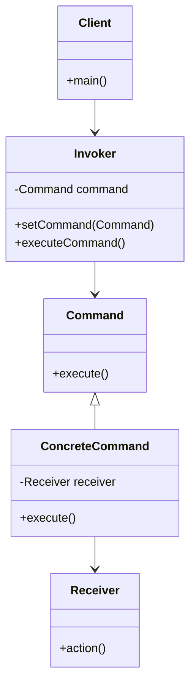
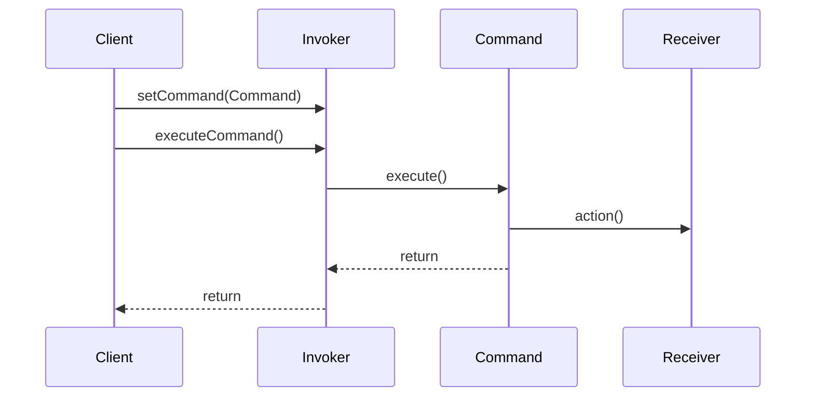

## 5.3. Command Pattern

The Command Pattern is a fundamental behavioral design pattern in object-oriented programming that encapsulates a request as an object, thereby allowing for parameterization of clients with queues, requests, and operations. This pattern is particularly useful for implementing undo/redo operations, logging changes, and supporting transactional behavior in applications.

### Intent and Motivation

The primary intent of the Command Pattern is to encapsulate a request as an object, thereby allowing you to parameterize clients with different requests, queue or log requests, and support undoable operations. This pattern decouples the object that invokes the operation from the one that knows how to perform it.

#### Key Motivations:

1. **Decoupling Sender and Receiver**: By encapsulating requests, the Command Pattern decouples the sender of a request from its receiver, allowing for more flexible and reusable code.
2. **Supporting Undo/Redo Operations**: The pattern allows for easy implementation of undoable operations by storing the state of commands.
3. **Command Queuing and Logging**: Commands can be queued, logged, or executed at a later time, providing flexibility in how requests are handled.

### Applicability

The Command Pattern is applicable in scenarios where:

- You need to parameterize objects with operations.
- You want to queue operations, schedule their execution, or execute them remotely.
- You need to support undoable operations.
- You want to log changes so that they can be reapplied in case of a system crash.

### Structure

The Command Pattern involves several key components:

- **Command Interface**: Declares an interface for executing an operation.
- **Concrete Command**: Implements the Command interface and defines the binding between a Receiver object and an action.
- **Receiver**: Knows how to perform the operations associated with carrying out a request.
- **Invoker**: Asks the command to carry out the request.
- **Client**: Creates a ConcreteCommand object and sets its receiver.



### Participants and Collaborations

- **Command**: Declares an interface for executing an operation.
- **ConcreteCommand**: Implements the Command interface, binding a Receiver to an action.
- **Receiver**: Contains the logic to perform the action.
- **Invoker**: Holds a command and can invoke its execution.
- **Client**: Configures the Invoker with a ConcreteCommand.

### Consequences

The Command Pattern offers several benefits:

- **Decoupling**: It decouples the classes that invoke the operation from the object that knows how to perform it.
- **Undo/Redo**: It makes it easy to add new commands, including undo and redo operations.
- **Command History**: Commands can be stored for later execution, allowing for complex command sequences to be managed.

### Implementation Considerations

When implementing the Command Pattern, consider the following:

- **Command Histories**: Maintain a history of executed commands to support undo/redo functionality.
- **Command Parameters**: Commands may need parameters to execute properly; consider how these will be passed and stored.
- **Concurrency**: If commands are executed in a multi-threaded environment, ensure thread safety.

### Detailed Pseudocode Implementation

Let's explore a detailed pseudocode implementation of the Command Pattern. We'll create a simple text editor application that supports undo and redo operations.

```pseudocode
// Command Interface
interface Command {
    execute()
    undo()
}

// Concrete Command for adding text
class AddTextCommand implements Command {
    private TextEditor editor
    private String text

    constructor(editor, text) {
        this.editor = editor
        this.text = text
    }

    execute() {
        editor.addText(text)
    }

    undo() {
        editor.removeText(text)
    }
}

// Receiver
class TextEditor {
    private String content = ""

    addText(text) {
        content += text
    }

    removeText(text) {
        content = content.substring(0, content.length - text.length)
    }

    getContent() {
        return content
    }
}

// Invoker
class CommandInvoker {
    private Stack<Command> history = new Stack<Command>()

    executeCommand(Command command) {
        command.execute()
        history.push(command)
    }

    undo() {
        if (!history.isEmpty()) {
            Command command = history.pop()
            command.undo()
        }
    }
}

// Client
class Client {
    main() {
        TextEditor editor = new TextEditor()
        CommandInvoker invoker = new CommandInvoker()

        Command addHello = new AddTextCommand(editor, "Hello")
        invoker.executeCommand(addHello)

        Command addWorld = new AddTextCommand(editor, " World")
        invoker.executeCommand(addWorld)

        print(editor.getContent()) // Output: Hello World

        invoker.undo()
        print(editor.getContent()) // Output: Hello

        invoker.undo()
        print(editor.getContent()) // Output: (empty)
    }
}
```

### Example Usage Scenarios

The Command Pattern is versatile and can be applied in various scenarios:

1. **Text Editors**: Implementing undo/redo functionality for text changes.
2. **GUI Buttons**: Associating actions with button clicks in a graphical user interface.
3. **Transaction Systems**: Logging and executing transactions in a banking system.
4. **Remote Procedure Calls**: Encapsulating requests to be sent over a network.

### Exercises

1. **Extend the Text Editor**: Modify the pseudocode to include a `Redo` operation. Implement a `redo()` method in `CommandInvoker` and adjust the `Command` interface as needed.
2. **Add New Commands**: Create a new command for deleting text from the editor. Implement the `DeleteTextCommand` class and integrate it with the existing system.
3. **Implement a Macro Recorder**: Extend the text editor to record a sequence of commands and replay them. Implement a `MacroCommand` class that stores a list of commands and executes them in sequence.

### Visual Aids

To better understand the flow of the Command Pattern, let's visualize the sequence of operations using a sequence diagram.



### Knowledge Check

- **What is the primary purpose of the Command Pattern?**
- **How does the Command Pattern support undo/redo operations?**
- **What are some common scenarios where the Command Pattern is applicable?**

### Embrace the Journey

Remember, mastering design patterns like the Command Pattern is a journey. As you continue to explore and implement these patterns, you'll gain a deeper understanding of how to create flexible, maintainable, and scalable software systems. Keep experimenting, stay curious, and enjoy the process of learning and applying design patterns in your projects!

## Quiz Time!



### What is the primary intent of the Command Pattern?

- [x] To encapsulate a request as an object
- [ ] To create a family of related objects
- [ ] To define a one-to-many dependency between objects
- [ ] To provide a unified interface to a set of interfaces

> **Explanation:** The Command Pattern encapsulates a request as an object, allowing for parameterization of clients with queues, requests, and operations.

### Which component in the Command Pattern knows how to perform the operations associated with carrying out a request?

- [ ] Invoker
- [ ] Client
- [x] Receiver
- [ ] Command

> **Explanation:** The Receiver contains the logic to perform the action associated with the command.

### How does the Command Pattern support undo operations?

- [x] By maintaining a history of executed commands
- [ ] By using a single command object for all operations
- [ ] By directly modifying the receiver's state
- [ ] By encapsulating multiple requests in a single object

> **Explanation:** The Command Pattern supports undo operations by maintaining a history of executed commands, allowing them to be reversed.

### In which scenario is the Command Pattern NOT applicable?

- [ ] Implementing undo/redo functionality
- [ ] Associating actions with GUI buttons
- [ ] Logging and executing transactions
- [x] Directly modifying object properties

> **Explanation:** The Command Pattern is not typically used for directly modifying object properties; it is more suited for encapsulating requests and actions.

### What is the role of the Invoker in the Command Pattern?

- [ ] To execute the command directly
- [x] To hold a command and invoke its execution
- [ ] To perform the action associated with the command
- [ ] To create and configure the command

> **Explanation:** The Invoker holds a command and can invoke its execution, but it does not perform the action itself.

### Which of the following is a benefit of using the Command Pattern?

- [x] Decoupling the sender from the receiver
- [ ] Increasing the complexity of the code
- [ ] Making it harder to add new commands
- [ ] Reducing flexibility in handling requests

> **Explanation:** The Command Pattern decouples the sender of a request from its receiver, enhancing flexibility and reusability.

### What is a common use case for the Command Pattern?

- [ ] Implementing complex algorithms
- [x] Supporting undo/redo operations in applications
- [ ] Directly accessing object properties
- [ ] Simplifying data structures

> **Explanation:** A common use case for the Command Pattern is supporting undo/redo operations in applications, such as text editors.

### Which pattern is commonly used in conjunction with the Command Pattern to manage command histories?

- [ ] Singleton Pattern
- [ ] Observer Pattern
- [x] Memento Pattern
- [ ] Factory Pattern

> **Explanation:** The Memento Pattern is often used in conjunction with the Command Pattern to manage command histories and support undo/redo functionality.

### What is the role of the Client in the Command Pattern?

- [x] To create a ConcreteCommand object and set its receiver
- [ ] To execute the command directly
- [ ] To perform the action associated with the command
- [ ] To hold and invoke the command

> **Explanation:** The Client creates a ConcreteCommand object and sets its receiver, configuring the command for execution.

### True or False: The Command Pattern can be used to implement remote procedure calls.

- [x] True
- [ ] False

> **Explanation:** True. The Command Pattern can encapsulate requests to be sent over a network, making it suitable for implementing remote procedure calls.


