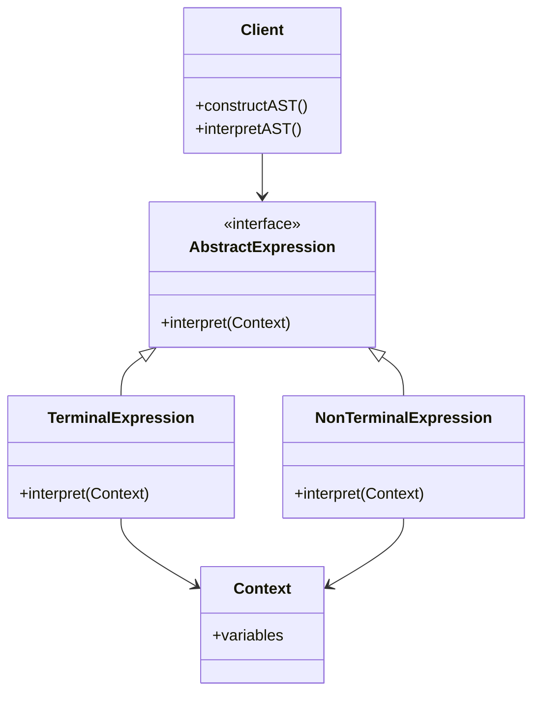
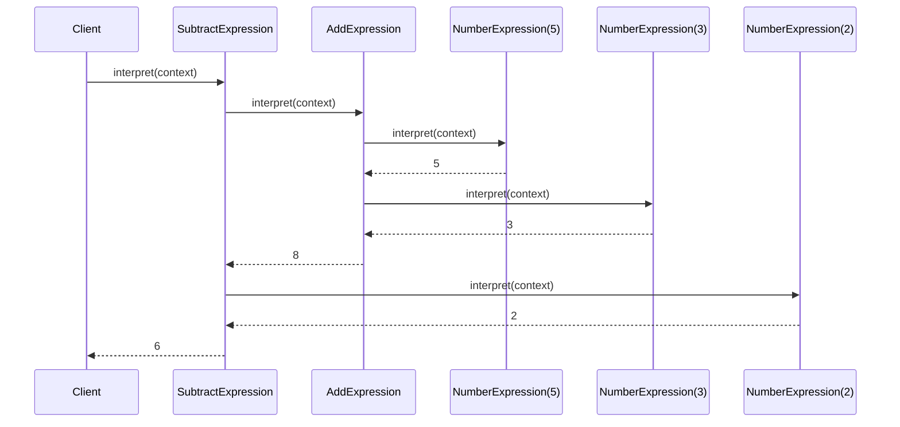

## 5.4. Interpreter Pattern

In the realm of software design, the **Interpreter Pattern** stands out as a powerful tool for defining a representation for a language and providing an interpreter for its sentences. This pattern is particularly useful when you need to interpret expressions in a language, whether it be a simple grammar or a complex scripting language. Let's delve into the intricacies of the Interpreter Pattern, exploring its intent, structure, implementation, and practical applications.

### Intent and Motivation

The primary intent of the Interpreter Pattern is to define a grammar for a language and provide an interpreter to process sentences in that language. This pattern is instrumental in scenarios where you need to interpret expressions or commands, enabling the execution of operations defined by the language's grammar.

**Motivation:**

- **Language Representation:** Define a clear and concise representation for a language's grammar, enabling easy interpretation and execution of its sentences.
- **Flexibility:** Allow for the addition of new expressions and operations without modifying existing code, promoting extensibility and maintainability.
- **Reusability:** Create reusable components that can be leveraged across different applications requiring similar language interpretation capabilities.

### Applicability

The Interpreter Pattern is applicable in scenarios where:

- You need to interpret expressions in a language, such as mathematical expressions, configuration files, or command scripts.
- The grammar of the language is simple and stable, making it feasible to represent each rule as a class.
- You want to add new expressions or operations to the language without altering existing code.
- The language's sentences can be represented as an abstract syntax tree (AST) for easy traversal and interpretation.

### Structure

The structure of the Interpreter Pattern involves several key components:

- **AbstractExpression:** Defines the interface for interpreting expressions.
- **TerminalExpression:** Implements the interpretation operation for terminal symbols in the grammar.
- **NonTerminalExpression:** Implements the interpretation operation for non-terminal symbols, typically involving recursive calls to interpret sub-expressions.
- **Context:** Contains information that's global to the interpreter, such as variable values or external resources.
- **Client:** Constructs the abstract syntax tree representing a specific sentence in the language and initiates its interpretation.

Below is a Mermaid.js diagram illustrating the structure of the Interpreter Pattern:



### Participants and Collaborations

- **AbstractExpression:** Declares an `interpret` method that is implemented by both terminal and non-terminal expressions.
- **TerminalExpression:** Represents a leaf node in the abstract syntax tree, implementing the `interpret` method for terminal symbols.
- **NonTerminalExpression:** Represents a composite node in the abstract syntax tree, implementing the `interpret` method for non-terminal symbols, often involving recursion.
- **Context:** Provides the necessary context for interpreting expressions, such as variable values or external resources.
- **Client:** Constructs the abstract syntax tree and initiates the interpretation process by calling the `interpret` method on the root node.

### Consequences

The Interpreter Pattern offers several benefits and trade-offs:

- **Designing Grammars for Simple Languages:** The pattern is well-suited for designing grammars for simple languages, where each rule can be represented as a class.
- **Extensibility:** New expressions and operations can be added without modifying existing code, promoting flexibility and maintainability.
- **Complexity:** The pattern can lead to a large number of classes, especially for complex grammars, potentially increasing the complexity of the codebase.
- **Performance:** The recursive nature of the pattern can impact performance, particularly for deeply nested expressions.

### Implementation Considerations

When implementing the Interpreter Pattern, consider the following:

- **Parsing Techniques:** Choose an appropriate parsing technique for constructing the abstract syntax tree, such as recursive descent parsing or using a parser generator.
- **Grammar Representation:** Ensure that the grammar is simple and stable, making it feasible to represent each rule as a class.
- **Performance Optimization:** Consider optimizing the interpretation process for performance, especially for complex or deeply nested expressions.

### Detailed Pseudocode Implementation

Let's explore a detailed pseudocode implementation of the Interpreter Pattern, illustrating how to define a simple arithmetic expression language and interpret its sentences.

```pseudocode
// AbstractExpression interface
interface AbstractExpression {
    method interpret(context: Context): Number
}

// TerminalExpression for numbers
class NumberExpression implements AbstractExpression {
    private value: Number
    
    constructor(value: Number) {
        this.value = value
    }
    
    method interpret(context: Context): Number {
        return this.value
    }
}

// NonTerminalExpression for addition
class AddExpression implements AbstractExpression {
    private left: AbstractExpression
    private right: AbstractExpression
    
    constructor(left: AbstractExpression, right: AbstractExpression) {
        this.left = left
        this.right = right
    }
    
    method interpret(context: Context): Number {
        return this.left.interpret(context) + this.right.interpret(context)
    }
}

// NonTerminalExpression for subtraction
class SubtractExpression implements AbstractExpression {
    private left: AbstractExpression
    private right: AbstractExpression
    
    constructor(left: AbstractExpression, right: AbstractExpression) {
        this.left = left
        this.right = right
    }
    
    method interpret(context: Context): Number {
        return this.left.interpret(context) - this.right.interpret(context)
    }
}

// Context class
class Context {
    // Context can hold variables or other global information
}

// Client code
method main() {
    // Construct the abstract syntax tree for the expression (5 + 3) - 2
    expression: AbstractExpression = new SubtractExpression(
        new AddExpression(
            new NumberExpression(5),
            new NumberExpression(3)
        ),
        new NumberExpression(2)
    )
    
    // Interpret the expression
    context: Context = new Context()
    result: Number = expression.interpret(context)
    print("Result: " + result) // Output: Result: 6
}
```

### Example Usage Scenarios

The Interpreter Pattern is versatile and can be applied in various scenarios:

- **Mathematical Expressions:** Interpret and evaluate mathematical expressions, such as arithmetic operations or algebraic equations.
- **Configuration Files:** Parse and interpret configuration files, enabling dynamic configuration of applications.
- **Command Scripts:** Interpret command scripts, allowing users to define and execute sequences of commands.
- **Domain-Specific Languages (DSLs):** Implement DSLs for specific domains, enabling users to define and execute domain-specific operations.

### Exercises

1. **Extend the Arithmetic Language:** Add support for multiplication and division operations to the arithmetic expression language. Implement the necessary classes and update the client code to interpret expressions involving these operations.

2. **Variable Support:** Modify the interpreter to support variables. Implement a `VariableExpression` class that retrieves variable values from the context and update the client code to interpret expressions involving variables.

3. **Boolean Expressions:** Implement a simple language for boolean expressions, including operations such as AND, OR, and NOT. Define the necessary classes and implement the interpreter to evaluate boolean expressions.

### Visual Aids

Below is a sequence diagram illustrating the interpretation process for the expression `(5 + 3) - 2`:



### Knowledge Check

- **Question:** What is the primary intent of the Interpreter Pattern?
- **Question:** In what scenarios is the Interpreter Pattern most applicable?
- **Question:** What are the key components of the Interpreter Pattern?
- **Question:** How does the Interpreter Pattern promote extensibility?
- **Question:** What are some potential performance considerations when using the Interpreter Pattern?

### Embrace the Journey

Remember, mastering the Interpreter Pattern is just one step in your journey to becoming a proficient software architect. As you continue to explore design patterns, you'll gain a deeper understanding of how to create flexible, maintainable, and scalable software systems. Keep experimenting, stay curious, and enjoy the journey!

## Quiz Time!



### What is the primary intent of the Interpreter Pattern?

- [x] To define a representation for a language and provide an interpreter for its sentences.
- [ ] To create a single instance of a class.
- [ ] To separate object construction from its representation.
- [ ] To provide a unified interface to a set of interfaces in a subsystem.

> **Explanation:** The Interpreter Pattern is designed to define a grammar for a language and provide an interpreter to process sentences in that language.

### In what scenarios is the Interpreter Pattern most applicable?

- [x] When you need to interpret expressions in a simple and stable language.
- [ ] When you need to ensure a class has only one instance.
- [ ] When you need to decouple an abstraction from its implementation.
- [ ] When you need to provide a way to access elements of an aggregate object sequentially.

> **Explanation:** The Interpreter Pattern is applicable when the grammar of the language is simple and stable, making it feasible to represent each rule as a class.

### What are the key components of the Interpreter Pattern?

- [x] AbstractExpression, TerminalExpression, NonTerminalExpression, Context, Client
- [ ] Singleton, Factory, Builder, Prototype, Context
- [ ] Adapter, Bridge, Composite, Decorator, Facade
- [ ] Chain of Responsibility, Command, Interpreter, Iterator, Mediator

> **Explanation:** The key components of the Interpreter Pattern include AbstractExpression, TerminalExpression, NonTerminalExpression, Context, and Client.

### How does the Interpreter Pattern promote extensibility?

- [x] By allowing new expressions and operations to be added without modifying existing code.
- [ ] By ensuring a class has only one instance.
- [ ] By providing a unified interface to a set of interfaces in a subsystem.
- [ ] By decoupling an abstraction from its implementation.

> **Explanation:** The Interpreter Pattern promotes extensibility by allowing new expressions and operations to be added without altering existing code, making it flexible and maintainable.

### What are some potential performance considerations when using the Interpreter Pattern?

- [x] The recursive nature of the pattern can impact performance, particularly for deeply nested expressions.
- [ ] The pattern can lead to a large number of classes, increasing code complexity.
- [ ] The pattern can make it difficult to ensure a class has only one instance.
- [ ] The pattern can complicate the process of providing a unified interface to a set of interfaces in a subsystem.

> **Explanation:** The recursive nature of the Interpreter Pattern can affect performance, especially for deeply nested expressions, and the pattern can lead to a large number of classes, increasing code complexity.

### True or False: The Interpreter Pattern is best suited for complex and dynamic languages.

- [ ] True
- [x] False

> **Explanation:** The Interpreter Pattern is best suited for simple and stable languages, where each rule can be represented as a class.

### Which component of the Interpreter Pattern contains information that's global to the interpreter?

- [x] Context
- [ ] AbstractExpression
- [ ] TerminalExpression
- [ ] Client

> **Explanation:** The Context component contains information that's global to the interpreter, such as variable values or external resources.

### What is a potential drawback of using the Interpreter Pattern?

- [x] It can lead to a large number of classes, especially for complex grammars.
- [ ] It can make it difficult to ensure a class has only one instance.
- [ ] It can complicate the process of providing a unified interface to a set of interfaces in a subsystem.
- [ ] It can make it challenging to decouple an abstraction from its implementation.

> **Explanation:** A potential drawback of the Interpreter Pattern is that it can lead to a large number of classes, especially for complex grammars, increasing code complexity.

### What is the role of the Client in the Interpreter Pattern?

- [x] Constructs the abstract syntax tree and initiates the interpretation process.
- [ ] Contains information that's global to the interpreter.
- [ ] Represents a leaf node in the abstract syntax tree.
- [ ] Declares an interpret method that is implemented by both terminal and non-terminal expressions.

> **Explanation:** The Client constructs the abstract syntax tree representing a specific sentence in the language and initiates its interpretation by calling the interpret method on the root node.

### Which of the following is NOT a component of the Interpreter Pattern?

- [ ] AbstractExpression
- [ ] TerminalExpression
- [ ] NonTerminalExpression
- [x] Singleton

> **Explanation:** Singleton is not a component of the Interpreter Pattern. The components include AbstractExpression, TerminalExpression, NonTerminalExpression, Context, and Client.


