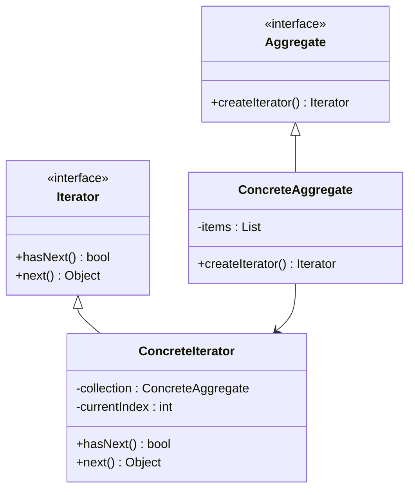
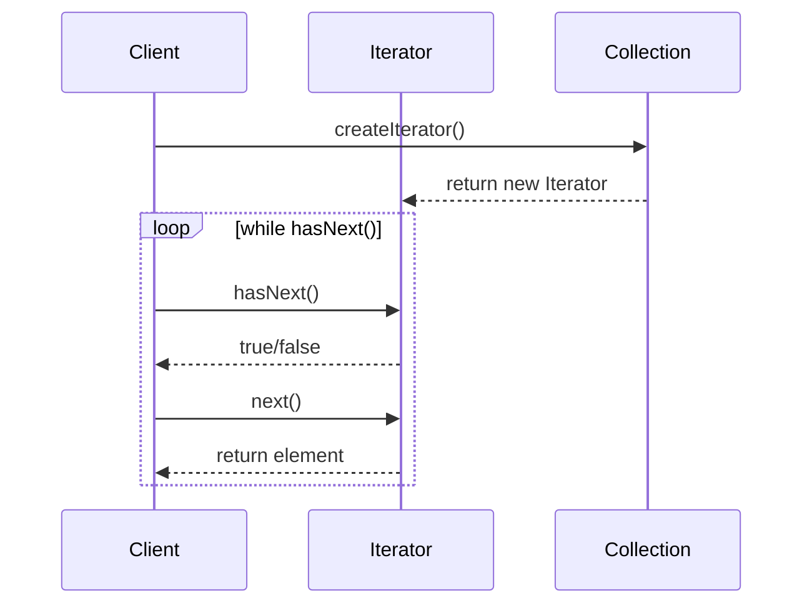

## 5.5. Iterator Pattern

The Iterator Pattern is a fundamental concept in object-oriented design that allows developers to traverse elements of a collection without exposing its underlying structure. This pattern is particularly useful for providing a uniform way to access elements of various collections, such as lists, trees, or graphs, in a sequential manner. In this comprehensive guide, we will delve into the intricacies of the Iterator Pattern, exploring its intent, applicability, structure, and implementation through detailed pseudocode examples.

### Intent and Motivation

The primary intent of the Iterator Pattern is to provide a mechanism to access elements of an aggregate object sequentially without exposing its internal representation. This pattern is motivated by the need to decouple the traversal logic from the aggregate object, allowing for flexible and reusable iteration mechanisms.

#### Key Benefits

- **Encapsulation**: By hiding the internal structure of the collection, the Iterator Pattern promotes encapsulation, ensuring that the collection's implementation details remain hidden from the client.
- **Flexibility**: The pattern allows for different types of iteration strategies, such as forward, backward, or even custom traversal orders, without modifying the collection itself.
- **Polymorphic Iteration**: It enables polymorphic iteration over collections, allowing different types of collections to be traversed using a common interface.

### Applicability

The Iterator Pattern is applicable in scenarios where:

- You need to traverse a collection of objects without exposing its internal structure.
- Different traversal strategies are required, and you want to encapsulate these strategies in separate iterator classes.
- You want to provide a uniform interface for traversing different types of collections.

### Structure

The Iterator Pattern typically involves the following components:

- **Iterator Interface**: Defines the methods for accessing and traversing elements.
- **Concrete Iterator**: Implements the Iterator interface and maintains the current position in the traversal.
- **Aggregate Interface**: Defines a method to create an iterator object.
- **Concrete Aggregate**: Implements the Aggregate interface and returns an instance of a Concrete Iterator.

Let's visualize the structure using a class diagram:



### Participants and Collaborations

- **Iterator**: The interface that defines methods for traversing elements.
- **ConcreteIterator**: Implements the Iterator interface and keeps track of the current position in the collection.
- **Aggregate**: The interface for creating an iterator.
- **ConcreteAggregate**: Implements the Aggregate interface and returns a ConcreteIterator.

These participants collaborate to provide a seamless iteration mechanism over the collection, allowing clients to access elements without knowing the underlying structure.

### Consequences

The Iterator Pattern offers several advantages:

- **Polymorphic Iteration**: It supports polymorphic iteration over collections, enabling the same traversal logic to be applied to different types of collections.
- **Simplified Client Code**: Clients can traverse collections without needing to understand their internal structure, leading to cleaner and more maintainable code.
- **Decoupled Traversal Logic**: The traversal logic is separated from the collection, allowing for easy modification and extension of iteration strategies.

However, there are some trade-offs to consider:

- **Increased Complexity**: Introducing iterators can add complexity to the design, especially when dealing with complex traversal strategies.
- **Potential Performance Overhead**: Depending on the implementation, iterators may introduce performance overhead due to additional method calls and state management.

### Implementation Considerations

When implementing the Iterator Pattern, consider the following:

- **External vs. Internal Iterators**: Decide whether to use external iterators, where the client controls the iteration, or internal iterators, where the collection controls the iteration.
- **State Management**: Ensure that the iterator maintains the necessary state to support traversal, such as the current position in the collection.
- **Thread Safety**: If the collection is accessed concurrently, consider implementing thread-safe iterators to prevent data corruption.

### Detailed Pseudocode Implementation

Let's explore a detailed pseudocode implementation of the Iterator Pattern. We'll create a simple collection of integers and provide an iterator to traverse the elements.

```pseudocode
// Define the Iterator interface
interface Iterator {
    method hasNext() : bool
    method next() : Object
}

// Implement the Concrete Iterator
class IntegerIterator implements Iterator {
    private collection : IntegerCollection
    private currentIndex : int = 0

    constructor(collection : IntegerCollection) {
        this.collection = collection
    }

    method hasNext() : bool {
        return currentIndex < collection.size()
    }

    method next() : Object {
        if hasNext() {
            return collection.get(currentIndex++)
        } else {
            throw new Error("No more elements")
        }
    }
}

// Define the Aggregate interface
interface Aggregate {
    method createIterator() : Iterator
}

// Implement the Concrete Aggregate
class IntegerCollection implements Aggregate {
    private items : List = []

    method add(item : int) {
        items.add(item)
    }

    method get(index : int) : int {
        return items[index]
    }

    method size() : int {
        return items.size()
    }

    method createIterator() : Iterator {
        return new IntegerIterator(this)
    }
}

// Client code
collection = new IntegerCollection()
collection.add(1)
collection.add(2)
collection.add(3)

iterator = collection.createIterator()

while iterator.hasNext() {
    print(iterator.next())
}
```

In this pseudocode example, we define an `Iterator` interface with `hasNext` and `next` methods. The `IntegerIterator` class implements this interface and provides the logic for traversing the `IntegerCollection`. The `IntegerCollection` class implements the `Aggregate` interface, allowing clients to create an iterator for traversing its elements.

### Example Usage Scenarios

The Iterator Pattern is widely used in various scenarios, such as:

- **Collections Frameworks**: In many programming languages, collections frameworks use iterators to provide a uniform way to traverse different types of collections.
- **Tree Traversal**: Iterators can be used to traverse tree structures, allowing for different traversal strategies, such as pre-order, in-order, or post-order traversal.
- **Graph Traversal**: In graph algorithms, iterators can be used to traverse nodes or edges in a specific order.

### Exercises

To reinforce your understanding of the Iterator Pattern, try the following exercises:

1. **Implement a Reverse Iterator**: Modify the pseudocode example to create a reverse iterator that traverses the collection in reverse order.
2. **Create a Filtered Iterator**: Implement an iterator that only returns elements that satisfy a specific condition (e.g., even numbers).
3. **Design a Composite Iterator**: Combine multiple iterators into a single iterator that traverses elements from multiple collections.

### Visual Aids

To further illustrate the Iterator Pattern, let's visualize the sequence of interactions between the client, iterator, and collection using a sequence diagram:



This sequence diagram demonstrates how the client interacts with the iterator to traverse the collection, invoking `hasNext` and `next` methods to access elements sequentially.

### Try It Yourself

To deepen your understanding of the Iterator Pattern, try modifying the pseudocode examples provided. Experiment with different types of collections, such as strings or custom objects, and implement various iteration strategies. Consider implementing both external and internal iterators to see how they differ in terms of control flow and client interaction.

### References and Links

For further reading on the Iterator Pattern and its applications, consider exploring the following resources:

- [Design Patterns: Elements of Reusable Object-Oriented Software](https://en.wikipedia.org/wiki/Design_Patterns) by Erich Gamma, Richard Helm, Ralph Johnson, and John Vlissides
- [Iterator Pattern on Wikipedia](https://en.wikipedia.org/wiki/Iterator_pattern)
- [MDN Web Docs on Iterators](https://developer.mozilla.org/en-US/docs/Web/JavaScript/Guide/Iterators_and_Generators)

### Knowledge Check

To ensure you've grasped the key concepts of the Iterator Pattern, reflect on the following questions:

- What are the main benefits of using the Iterator Pattern?
- How does the Iterator Pattern promote encapsulation and flexibility?
- What are the differences between external and internal iterators?

### Embrace the Journey

Remember, mastering design patterns is a journey. As you explore the Iterator Pattern, consider how it can be applied to your own projects. Experiment with different implementations and iteration strategies, and don't hesitate to explore other design patterns that complement the Iterator Pattern. Keep learning, stay curious, and enjoy the process of becoming a more skilled and versatile developer.

## Quiz Time!



### What is the primary intent of the Iterator Pattern?

- [x] To provide a way to access elements of an aggregate object sequentially without exposing its underlying representation.
- [ ] To provide a way to create objects without specifying their concrete classes.
- [ ] To define a family of algorithms, encapsulate each one, and make them interchangeable.
- [ ] To compose objects into tree structures to represent part-whole hierarchies.

> **Explanation:** The Iterator Pattern is designed to provide a mechanism for accessing elements of a collection sequentially without exposing the collection's internal structure.

### Which component in the Iterator Pattern is responsible for maintaining the current position in the traversal?

- [ ] Aggregate
- [ ] Concrete Aggregate
- [x] Concrete Iterator
- [ ] Iterator Interface

> **Explanation:** The Concrete Iterator is responsible for implementing the Iterator interface and maintaining the current position in the traversal.

### What is a key benefit of using the Iterator Pattern?

- [x] It supports polymorphic iteration over collections.
- [ ] It simplifies object creation by separating construction from representation.
- [ ] It allows for the dynamic addition of responsibilities to objects.
- [ ] It provides a way to define a family of algorithms.

> **Explanation:** The Iterator Pattern supports polymorphic iteration, allowing the same traversal logic to be applied to different types of collections.

### What is the difference between external and internal iterators?

- [x] External iterators allow the client to control the iteration, while internal iterators let the collection control the iteration.
- [ ] External iterators are used for tree structures, while internal iterators are used for lists.
- [ ] External iterators are faster than internal iterators.
- [ ] External iterators are only used in functional programming languages.

> **Explanation:** External iterators give control of the iteration process to the client, whereas internal iterators encapsulate the iteration logic within the collection itself.

### Which of the following is NOT a consequence of the Iterator Pattern?

- [ ] Polymorphic iteration
- [ ] Simplified client code
- [ ] Decoupled traversal logic
- [x] Increased coupling between client and collection

> **Explanation:** The Iterator Pattern actually reduces coupling between the client and the collection by encapsulating the traversal logic within the iterator.

### What is a potential drawback of using the Iterator Pattern?

- [x] It can introduce performance overhead due to additional method calls and state management.
- [ ] It makes the collection's internal structure more complex.
- [ ] It limits the types of collections that can be traversed.
- [ ] It requires all collections to be of the same type.

> **Explanation:** The Iterator Pattern can introduce performance overhead because of the additional method calls and state management required for iteration.

### In the pseudocode example, what method is used to add elements to the collection?

- [ ] insert()
- [x] add()
- [ ] append()
- [ ] push()

> **Explanation:** The `add` method is used in the pseudocode example to add elements to the `IntegerCollection`.

### Which method in the Iterator interface is responsible for checking if there are more elements to traverse?

- [ ] next()
- [x] hasNext()
- [ ] getNext()
- [ ] isDone()

> **Explanation:** The `hasNext` method is responsible for checking if there are more elements to traverse in the collection.

### What is the role of the Aggregate interface in the Iterator Pattern?

- [x] To define a method for creating an iterator object.
- [ ] To maintain the current position in the traversal.
- [ ] To provide a way to access elements of the collection.
- [ ] To encapsulate the iteration logic within the collection.

> **Explanation:** The Aggregate interface defines a method for creating an iterator object, allowing clients to obtain an iterator for traversing the collection.

### True or False: The Iterator Pattern is only applicable to collections that store homogeneous elements.

- [ ] True
- [x] False

> **Explanation:** The Iterator Pattern can be applied to collections that store both homogeneous and heterogeneous elements, as it provides a mechanism for accessing elements sequentially without regard to their type.


