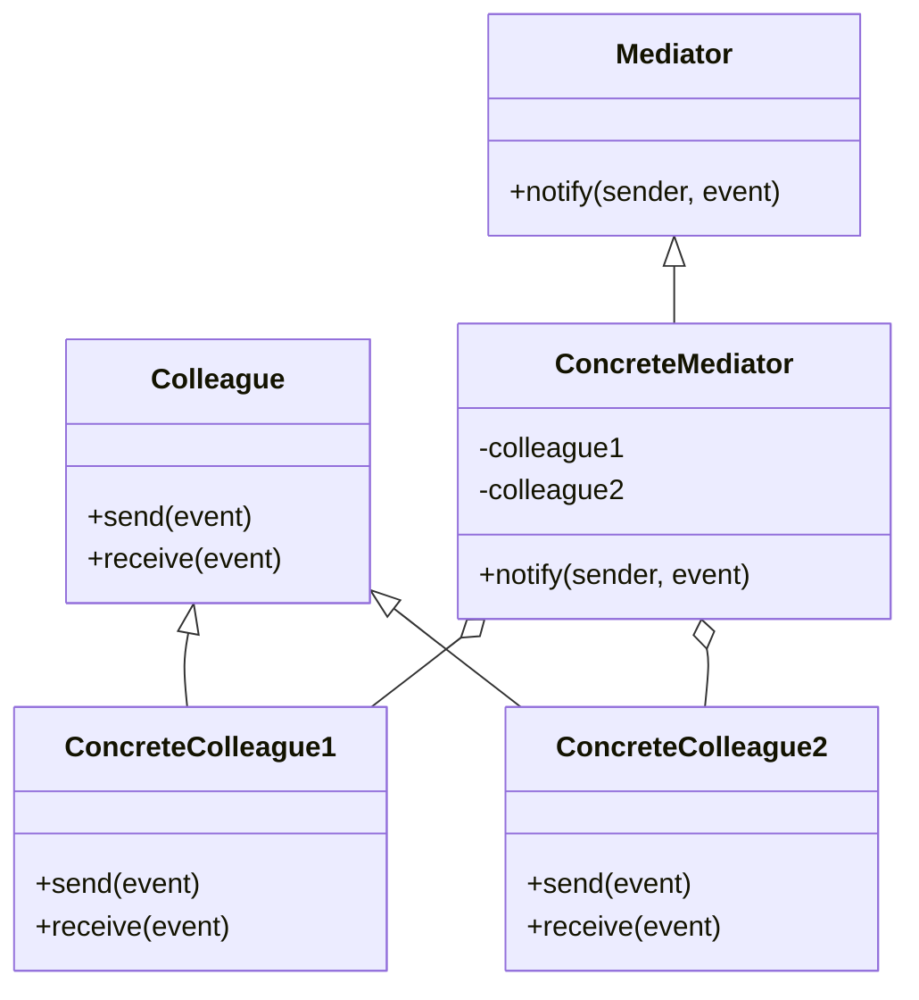
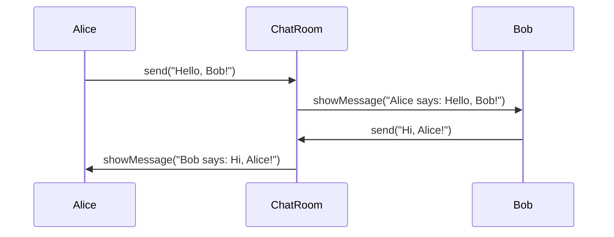

## 5.6. Mediator Pattern

In the realm of object-oriented programming (OOP), managing the interactions between objects can become complex and cumbersome, especially as systems grow in size and functionality. The Mediator Pattern emerges as a solution to this problem by encapsulating the way objects interact, thereby reducing the dependencies between them. This pattern is a cornerstone of behavioral design patterns, offering a structured approach to managing communication and collaboration among objects.

### Intent and Motivation

The primary intent of the Mediator Pattern is to define an object that encapsulates how a set of objects interact. By centralizing the communication logic in a mediator, objects no longer need to refer to each other explicitly, which reduces the coupling between them. This decoupling facilitates easier maintenance and evolution of the system, as changes to the interaction logic are confined to the mediator.

#### Key Motivations:

- **Decoupling Components:** By removing direct dependencies between interacting objects, the Mediator Pattern reduces the complexity of the system.
- **Centralized Control:** The mediator acts as a hub for communication, allowing for more manageable and understandable interaction logic.
- **Flexibility and Scalability:** With interactions centralized, adding new components or modifying existing ones becomes simpler, as changes are localized to the mediator.

### Applicability

The Mediator Pattern is applicable in scenarios where:

- **Complex Interactions:** Multiple objects interact in complex ways, and managing these interactions directly would lead to tightly coupled code.
- **Reusability:** You want to reuse objects in different contexts without altering their interaction logic.
- **Simplified Communication:** A need exists to simplify communication by introducing an intermediary that handles all interactions.

### Structure

The structure of the Mediator Pattern involves several key components:

- **Mediator:** An interface defining the communication methods.
- **ConcreteMediator:** A class implementing the Mediator interface, encapsulating the interaction logic between Colleague objects.
- **Colleague:** An interface or abstract class for objects that interact with each other through the mediator.
- **ConcreteColleague:** Classes implementing the Colleague interface, interacting with each other through the mediator.

#### Diagram Representation



### Participants and Collaborations

- **Mediator:** Defines the interface for communication between Colleague objects.
- **ConcreteMediator:** Implements the Mediator interface and coordinates communication between Colleagues.
- **Colleague:** Represents an object that communicates with other Colleagues through the Mediator.
- **ConcreteColleague:** Implements the Colleague interface and interacts with other Colleagues through the Mediator.

### Consequences

#### Reducing Coupling Among Components

- **Decoupling:** By centralizing communication, the Mediator Pattern reduces the direct dependencies between Colleague objects, promoting loose coupling.
- **Simplified Maintenance:** Changes to interaction logic are confined to the mediator, making maintenance and updates more straightforward.
- **Enhanced Reusability:** Colleague objects can be reused in different contexts without modification, as their interaction logic is externalized to the mediator.

### Implementation Considerations

#### Managing Complexity

- **Complexity Management:** The mediator can become complex if it handles too many interactions. It's essential to ensure that the mediator's responsibilities are well-defined and manageable.
- **Performance Considerations:** Introducing a mediator can add an additional layer of communication, which may impact performance. It's crucial to balance the benefits of decoupling with the potential performance overhead.

### Detailed Pseudocode Implementation

Let's explore a detailed pseudocode implementation of the Mediator Pattern. We'll create a simple chat room application where users (Colleagues) communicate through a chat room (Mediator).

```pseudocode
// Define the Mediator interface
interface ChatRoomMediator {
    method showMessage(user, message)
}

// Implement the ConcreteMediator
class ChatRoom implements ChatRoomMediator {
    method showMessage(user, message) {
        print(user.getName() + " says: " + message)
    }
}

// Define the Colleague interface
abstract class User {
    protected mediator: ChatRoomMediator
    protected name: String

    constructor(mediator: ChatRoomMediator, name: String) {
        this.mediator = mediator
        this.name = name
    }

    method getName() {
        return this.name
    }

    method send(message: String) {
        mediator.showMessage(this, message)
    }
}

// Implement ConcreteColleague
class ChatUser extends User {
    constructor(mediator: ChatRoomMediator, name: String) {
        super(mediator, name)
    }
}

// Usage
mediator = new ChatRoom()
user1 = new ChatUser(mediator, "Alice")
user2 = new ChatUser(mediator, "Bob")

user1.send("Hello, Bob!")
user2.send("Hi, Alice!")
```

### Example Usage Scenarios

- **Chat Applications:** As demonstrated in the pseudocode, chat applications can leverage the Mediator Pattern to manage communication between users.
- **UI Components:** In graphical user interfaces, mediators can manage interactions between different UI components, such as buttons, text fields, and sliders.
- **Workflow Systems:** Workflow systems can use mediators to coordinate tasks and activities, ensuring that each component interacts correctly with others.

### Exercises

1. **Extend the Chat Application:** Modify the pseudocode to include a feature where the mediator logs all messages to a file.
2. **UI Component Interaction:** Implement a mediator for a simple UI with buttons and text fields, where the buttons update the text fields through the mediator.
3. **Workflow Coordination:** Design a mediator for a workflow system that coordinates tasks based on specific conditions.

### Visual Aids

To further illustrate the Mediator Pattern, let's visualize the interaction flow in a chat application using a sequence diagram.



### Design Considerations

- **When to Use:** The Mediator Pattern is ideal when you need to manage complex interactions between objects without creating tight coupling.
- **Pitfalls:** Avoid overloading the mediator with too many responsibilities, as this can lead to a "god object" that is difficult to maintain.

### Differences and Similarities

- **Mediator vs. Observer:** While both patterns manage communication between objects, the Mediator Pattern centralizes interaction logic, whereas the Observer Pattern allows objects to subscribe to events and react to changes.
- **Mediator vs. Facade:** The Facade Pattern provides a simplified interface to a subsystem, while the Mediator Pattern manages interactions between objects within a system.

### Try It Yourself

Encourage experimentation by suggesting modifications to the code examples:

- **Add New Features:** Extend the chat application to support private messages between users.
- **Implement Logging:** Introduce a logging mechanism in the mediator to track all interactions.
- **UI Enhancements:** Create a more complex UI interaction scenario with multiple components interacting through the mediator.

### Knowledge Check

- **Question:** What is the primary benefit of using the Mediator Pattern?
- **Answer:** The primary benefit is reducing coupling among components by centralizing interaction logic in a mediator.

### Embrace the Journey

Remember, mastering design patterns is a journey. The Mediator Pattern is just one tool in your toolkit for building robust, maintainable software. Keep experimenting, stay curious, and enjoy the process of learning and applying these patterns in your projects.

## Quiz Time!



### What is the primary intent of the Mediator Pattern?

- [x] To define an object that encapsulates how a set of objects interact
- [ ] To provide a simplified interface to a set of interfaces in a subsystem
- [ ] To allow an object to alter its behavior when its internal state changes
- [ ] To define a family of algorithms, encapsulating each one

> **Explanation:** The Mediator Pattern's primary intent is to define an object that encapsulates how a set of objects interact, reducing dependencies between them.

### Which component in the Mediator Pattern coordinates communication between Colleagues?

- [ ] Colleague
- [x] ConcreteMediator
- [ ] Mediator
- [ ] ConcreteColleague

> **Explanation:** The ConcreteMediator implements the Mediator interface and coordinates communication between Colleague objects.

### In which scenario is the Mediator Pattern most applicable?

- [x] When multiple objects interact in complex ways
- [ ] When you need to provide a unified interface to a subsystem
- [ ] When you want to encapsulate a request as an object
- [ ] When you need to define a one-to-many dependency between objects

> **Explanation:** The Mediator Pattern is most applicable when multiple objects interact in complex ways, and managing these interactions directly would lead to tightly coupled code.

### What is a potential pitfall of the Mediator Pattern?

- [ ] It increases coupling between components
- [x] The mediator can become a "god object" with too many responsibilities
- [ ] It makes adding new components difficult
- [ ] It reduces code reusability

> **Explanation:** A potential pitfall of the Mediator Pattern is that the mediator can become a "god object" with too many responsibilities, making it difficult to maintain.

### How does the Mediator Pattern enhance reusability?

- [x] By externalizing interaction logic to the mediator
- [ ] By allowing objects to subscribe to events
- [ ] By providing a simplified interface to a subsystem
- [ ] By encapsulating a request as an object

> **Explanation:** The Mediator Pattern enhances reusability by externalizing interaction logic to the mediator, allowing Colleague objects to be reused in different contexts without modification.

### What is the role of the Colleague in the Mediator Pattern?

- [x] To represent an object that communicates with other Colleagues through the Mediator
- [ ] To define the interface for communication between Colleague objects
- [ ] To implement the Mediator interface and coordinate communication
- [ ] To provide a simplified interface to a subsystem

> **Explanation:** The Colleague represents an object that communicates with other Colleagues through the Mediator.

### Which pattern is commonly confused with the Mediator Pattern?

- [ ] Singleton
- [x] Observer
- [ ] Factory Method
- [ ] Decorator

> **Explanation:** The Observer Pattern is commonly confused with the Mediator Pattern, but they differ in how they manage communication between objects.

### What is a key benefit of using the Mediator Pattern?

- [x] It reduces direct dependencies between interacting objects
- [ ] It provides a simplified interface to a subsystem
- [ ] It allows an object to alter its behavior when its internal state changes
- [ ] It defines a family of algorithms, encapsulating each one

> **Explanation:** A key benefit of using the Mediator Pattern is that it reduces direct dependencies between interacting objects, promoting loose coupling.

### What should you avoid when implementing a mediator?

- [ ] Allowing the mediator to handle too few interactions
- [x] Overloading the mediator with too many responsibilities
- [ ] Using the mediator for simple interactions
- [ ] Defining multiple mediators for the same set of objects

> **Explanation:** When implementing a mediator, you should avoid overloading it with too many responsibilities, as this can lead to a "god object" that is difficult to maintain.

### True or False: The Mediator Pattern simplifies communication by introducing an intermediary that handles all interactions.

- [x] True
- [ ] False

> **Explanation:** True. The Mediator Pattern simplifies communication by introducing an intermediary (the mediator) that handles all interactions between objects.


