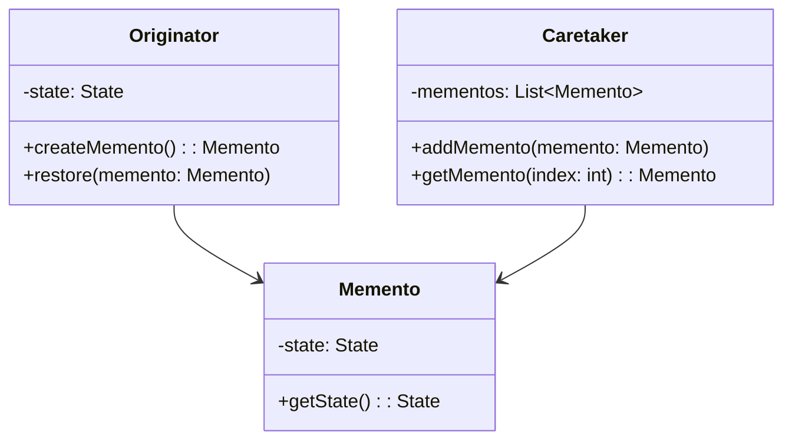
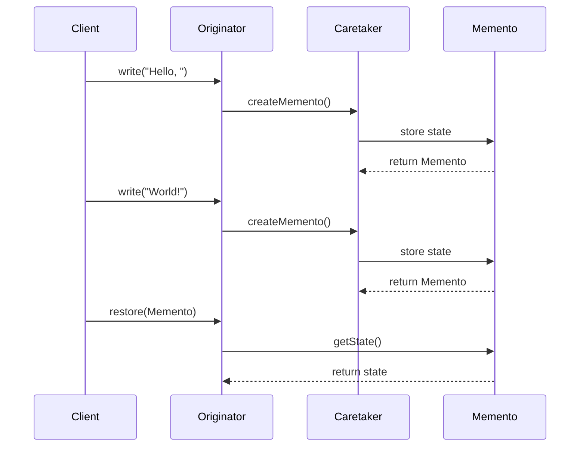

## 5.7. Memento Pattern

The Memento Pattern is a behavioral design pattern that provides a way to capture and externalize an object's internal state without violating encapsulation. This pattern is particularly useful when you need to implement undo or rollback functionality, allowing an object's state to be saved and restored at a later time.

### Intent and Motivation

The primary intent of the Memento Pattern is to capture an object's internal state so that it can be restored later. This is achieved without exposing the internal details of the object, thereby maintaining encapsulation. The Memento Pattern is often used in scenarios where you need to provide undo functionality, such as in text editors, drawing applications, or any system where changes need to be reversible.

**Motivation:** Imagine a text editor where users can type, delete, and format text. Users expect to undo their actions to revert to a previous state. The Memento Pattern allows the editor to save the state of the document at various points, enabling users to undo changes without exposing the document's internal structure.

### Applicability

The Memento Pattern is applicable in the following scenarios:

- **Undo/Redo Functionality:** When you need to implement undo and redo operations, capturing the state of an object at different times.
- **State Restoration:** When you need to restore an object to a previous state, such as in crash recovery systems.
- **Snapshot Management:** When you need to take snapshots of an object's state for later comparison or analysis.

### Structure

The Memento Pattern involves three key participants:

1. **Originator:** The object whose state needs to be saved and restored.
2. **Memento:** A representation of the Originator's state, capturing the necessary information to restore the state.
3. **Caretaker:** Manages the Memento's lifecycle, storing and retrieving Mementos as needed.

Below is a class diagram illustrating the structure of the Memento Pattern:



### Participants and Collaborations

- **Originator:** Creates a Memento containing a snapshot of its current internal state and uses the Memento to restore its state.
- **Memento:** Stores the internal state of the Originator. It is opaque to other objects, meaning that only the Originator can access its state.
- **Caretaker:** Responsible for keeping track of the Mementos. It does not modify or inspect the contents of the Mementos.

### Consequences

The Memento Pattern provides several benefits:

- **Encapsulation Preservation:** The internal state of the Originator is not exposed to other objects, maintaining encapsulation.
- **State Restoration:** Enables the restoration of an object's state to a previous point, facilitating undo operations.
- **Simplified State Management:** By externalizing state management, the Originator can focus on its primary responsibilities.

However, there are some trade-offs:

- **Memory Overhead:** Storing multiple Mementos can consume significant memory, especially if the state is large.
- **Complexity:** Managing the lifecycle of Mementos can add complexity to the system.

### Implementation Considerations

When implementing the Memento Pattern, consider the following:

- **State Changes:** Determine which parts of the object's state need to be captured and restored.
- **Efficiency:** Optimize the storage of Mementos to minimize memory usage, possibly using techniques like incremental state storage.
- **Access Control:** Ensure that only the Originator can access the Memento's state to maintain encapsulation.

### Detailed Pseudocode Implementation

Let's walk through a pseudocode implementation of the Memento Pattern. We'll create a simple text editor that supports undo functionality.

```pseudocode
// Define the Memento class
class Memento {
    private state: String

    constructor(state: String) {
        this.state = state
    }

    function getState(): String {
        return this.state
    }
}

// Define the Originator class
class TextEditor {
    private content: String

    function write(text: String) {
        this.content += text
    }

    function createMemento(): Memento {
        return new Memento(this.content)
    }

    function restore(memento: Memento) {
        this.content = memento.getState()
    }

    function getContent(): String {
        return this.content
    }
}

// Define the Caretaker class
class Caretaker {
    private mementos: List<Memento> = []

    function addMemento(memento: Memento) {
        this.mementos.append(memento)
    }

    function getMemento(index: int): Memento {
        return this.mementos[index]
    }
}

// Example usage
editor = new TextEditor()
caretaker = new Caretaker()

editor.write("Hello, ")
caretaker.addMemento(editor.createMemento())

editor.write("World!")
caretaker.addMemento(editor.createMemento())

print(editor.getContent()) // Output: Hello, World!

editor.restore(caretaker.getMemento(0))
print(editor.getContent()) // Output: Hello, 
```

### Example Usage Scenarios

The Memento Pattern is widely used in applications where state management is crucial. Here are some example scenarios:

- **Text Editors:** Implementing undo and redo functionality to manage document changes.
- **Game Development:** Saving game states to allow players to revert to previous points.
- **Configuration Management:** Storing and restoring configuration settings in applications.

### Exercises

1. **Implement a Calculator with Undo Functionality:** Create a simple calculator that supports basic operations and allows users to undo their last operation.
2. **Extend the Text Editor Example:** Modify the text editor to support redo functionality in addition to undo.
3. **Optimize Memento Storage:** Implement a strategy to optimize the storage of Mementos, reducing memory usage.

### Visual Aids

To further illustrate the Memento Pattern, let's visualize the process of saving and restoring state using a sequence diagram:



### Knowledge Check

Before we conclude, let's reinforce our understanding with a few questions:

- What is the primary intent of the Memento Pattern?
- How does the Memento Pattern preserve encapsulation?
- What are some potential drawbacks of using the Memento Pattern?

### Embrace the Journey

Remember, mastering design patterns is a journey. The Memento Pattern is a powerful tool in your toolkit, enabling you to manage object state effectively. As you continue to explore design patterns, keep experimenting and applying them to real-world problems. Stay curious and enjoy the journey!

## Quiz Time!



### What is the primary intent of the Memento Pattern?

- [x] To capture and restore an object's internal state without violating encapsulation.
- [ ] To provide a global point of access to an object.
- [ ] To define a family of algorithms and make them interchangeable.
- [ ] To allow an object to alter its behavior when its internal state changes.

> **Explanation:** The Memento Pattern is designed to capture and restore an object's internal state without exposing its implementation details, thus preserving encapsulation.

### Which participant in the Memento Pattern is responsible for storing the state of the Originator?

- [ ] Originator
- [x] Memento
- [ ] Caretaker
- [ ] Client

> **Explanation:** The Memento is responsible for storing the internal state of the Originator, allowing it to be restored later.

### What is a potential drawback of using the Memento Pattern?

- [ ] It exposes the internal state of the Originator.
- [x] It can lead to high memory usage if many Mementos are stored.
- [ ] It increases the coupling between objects.
- [ ] It makes the system less flexible.

> **Explanation:** Storing multiple Mementos can consume significant memory, especially if the state is large or if many states are saved.

### How does the Memento Pattern help in implementing undo functionality?

- [x] By capturing the state of an object at different points in time.
- [ ] By providing a global access point to the object's state.
- [ ] By allowing the object to change its behavior based on its state.
- [ ] By defining a family of interchangeable algorithms.

> **Explanation:** The Memento Pattern captures the state of an object at various points, enabling the restoration of previous states, which is essential for undo functionality.

### In the Memento Pattern, who is responsible for managing the lifecycle of Mementos?

- [ ] Originator
- [ ] Memento
- [x] Caretaker
- [ ] Client

> **Explanation:** The Caretaker is responsible for managing the lifecycle of Mementos, including storing and retrieving them as needed.

### What is the role of the Originator in the Memento Pattern?

- [x] To create and restore Mementos.
- [ ] To manage the lifecycle of Mementos.
- [ ] To store the internal state of the object.
- [ ] To provide a unified interface to a set of interfaces.

> **Explanation:** The Originator creates Mementos to capture its state and uses them to restore its state when needed.

### How does the Memento Pattern maintain encapsulation?

- [x] By ensuring that only the Originator can access the Memento's state.
- [ ] By exposing the internal state of the Originator to the Caretaker.
- [ ] By allowing the Caretaker to modify the Memento's state.
- [ ] By providing a global access point to the Memento's state.

> **Explanation:** The Memento Pattern maintains encapsulation by ensuring that the Memento's state is only accessible to the Originator, keeping the internal details hidden from other objects.

### Which of the following is NOT a participant in the Memento Pattern?

- [ ] Originator
- [ ] Memento
- [ ] Caretaker
- [x] Observer

> **Explanation:** The Observer is not a participant in the Memento Pattern. The main participants are the Originator, Memento, and Caretaker.

### True or False: The Memento Pattern can be used to implement redo functionality.

- [x] True
- [ ] False

> **Explanation:** The Memento Pattern can be used to implement both undo and redo functionality by capturing and restoring object states.

### Which design pattern is commonly used alongside the Memento Pattern to manage complex state changes?

- [ ] Singleton
- [x] Command
- [ ] Adapter
- [ ] Strategy

> **Explanation:** The Command Pattern is often used alongside the Memento Pattern to encapsulate state changes, making it easier to manage complex state transitions and undo/redo operations.


