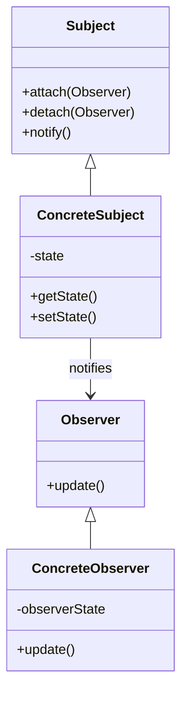
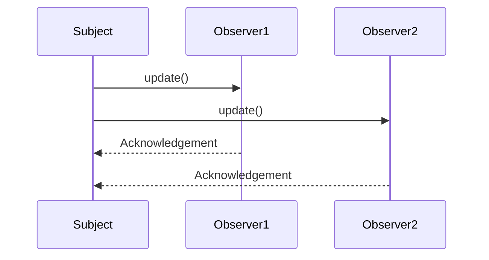

## 5.8. Observer Pattern

The Observer Pattern is a cornerstone of object-oriented design, enabling a one-to-many dependency between objects. This pattern is essential for creating systems where objects need to be automatically updated when another object changes state. Let's delve into the intricacies of the Observer Pattern, its applicability, structure, participants, and implementation.

### Intent and Motivation

The primary intent of the Observer Pattern is to define a one-to-many dependency between objects so that when one object changes state, all its dependents are notified and updated automatically. This pattern is particularly useful in scenarios where a change in one object requires changes in others, but the objects should remain loosely coupled.

#### Key Benefits

- **Decoupling**: The Observer Pattern promotes loose coupling between the subject and observers. The subject doesn't need to know the details of the observers.
- **Dynamic Relationships**: Observers can be added or removed at runtime, providing flexibility in managing dependencies.
- **Reusability**: The pattern enhances code reusability by allowing different observers to react to changes in a subject without modifying the subject.

### Applicability

The Observer Pattern is applicable in various scenarios, including:

- **Event Handling Systems**: When implementing systems where multiple components need to respond to events, such as GUI frameworks.
- **Data Binding**: In applications where UI components need to reflect changes in the underlying data model.
- **Distributed Systems**: When updates need to be propagated across different components or services.

### Structure

The Observer Pattern involves several key components:

- **Subject**: The object that holds the state and notifies observers of changes.
- **Observer**: The interface or abstract class that defines the update method, which is called by the subject.
- **ConcreteObserver**: Implements the Observer interface and defines the action to be taken when notified.
- **ConcreteSubject**: Extends the Subject and maintains a list of observers.

#### Diagram



### Participants and Collaborations

- **Subject**: Maintains a list of observers and provides methods to attach and detach observers. It also has a method to notify all observers of any state changes.
- **Observer**: Defines an interface for objects that should be notified of changes in the subject.
- **ConcreteSubject**: Stores the state of interest to ConcreteObservers and sends notifications when the state changes.
- **ConcreteObserver**: Maintains a reference to a ConcreteSubject object and implements the Observer interface to keep its state consistent with the subject's.

### Consequences

The Observer Pattern offers several advantages:

- **Loose Coupling**: Observers are loosely coupled to the subject, allowing for independent evolution.
- **Broadcast Communication**: A subject can broadcast updates to multiple observers, reducing the need for complex inter-object communication.
- **Dynamic Relationships**: Observers can be added or removed at runtime, providing flexibility.

However, there are also some trade-offs:

- **Potential Performance Overhead**: Notifying a large number of observers can be costly.
- **Complexity in Managing Observers**: Care must be taken to manage the lifecycle of observers, especially in dynamic systems.

### Implementation Considerations

When implementing the Observer Pattern, consider the following:

#### Push vs. Pull Models

- **Push Model**: The subject sends detailed information about the change to observers. This can lead to unnecessary data being sent if observers don't need all the information.
- **Pull Model**: Observers request the information they need from the subject. This can reduce unnecessary data transfer but may result in more calls to the subject.

#### Detailed Pseudocode Implementation

Let's explore a detailed pseudocode implementation of the Observer Pattern.

```pseudocode
// Observer interface
interface Observer {
    method update(subject: Subject)
}

// ConcreteObserver class
class ConcreteObserver implements Observer {
    private observerState

    method update(subject: Subject) {
        observerState = subject.getState()
        // Additional logic to handle the updated state
    }
}

// Subject interface
interface Subject {
    method attach(observer: Observer)
    method detach(observer: Observer)
    method notify()
}

// ConcreteSubject class
class ConcreteSubject implements Subject {
    private state
    private observers: List<Observer> = []

    method attach(observer: Observer) {
        observers.add(observer)
    }

    method detach(observer: Observer) {
        observers.remove(observer)
    }

    method notify() {
        for each observer in observers {
            observer.update(this)
        }
    }

    method getState() {
        return state
    }

    method setState(newState) {
        state = newState
        notify()
    }
}
```

### Example Usage Scenarios

The Observer Pattern is widely used in various domains. Here are some example scenarios:

- **Graphical User Interfaces (GUIs)**: In GUI applications, the Observer Pattern is used to update the display when the underlying data changes.
- **Real-Time Systems**: In real-time monitoring systems, observers can be used to update displays or logs when new data is available.
- **Event-Driven Architectures**: In systems where components need to react to events, such as messaging systems or notification services.

### Exercises

1. **Implement a Weather Station**: Create a simple weather station application using the Observer Pattern. The station should notify observers (e.g., display units) when the temperature changes.
2. **Stock Market Ticker**: Develop a stock market ticker application where observers are notified of stock price changes.
3. **Chat Application**: Implement a chat application where users are notified of new messages in a chat room.

### Visual Aids

To further illustrate the Observer Pattern, consider the following sequence diagram, which shows the interaction between a subject and its observers.



### Try It Yourself

To deepen your understanding, try modifying the pseudocode implementation:

- **Add More Observers**: Extend the example by adding more observer types and see how they react to changes in the subject.
- **Implement Different Notification Strategies**: Experiment with different notification strategies, such as only notifying observers under certain conditions.

### Knowledge Check

- **What is the primary intent of the Observer Pattern?**
- **How does the Observer Pattern promote loose coupling?**
- **What are the differences between the push and pull models in the Observer Pattern?**

### Embrace the Journey

Remember, mastering design patterns is a journey. As you explore the Observer Pattern, consider how it can be applied to your projects. Keep experimenting, stay curious, and enjoy the process of learning and applying these powerful design principles.

## Quiz Time!



### What is the primary intent of the Observer Pattern?

- [x] To define a one-to-many dependency between objects so that when one object changes state, all its dependents are notified and updated automatically.
- [ ] To manage the lifecycle of objects in a system.
- [ ] To encapsulate a request as an object.
- [ ] To provide a way to access elements of an aggregate object sequentially.

> **Explanation:** The Observer Pattern is designed to establish a one-to-many dependency between objects, ensuring that changes in one object are automatically reflected in its dependents.

### How does the Observer Pattern promote loose coupling?

- [x] By allowing the subject to notify observers without knowing their details.
- [ ] By encapsulating a request as an object.
- [ ] By providing a global access point to a single instance.
- [ ] By defining a family of algorithms and making them interchangeable.

> **Explanation:** The Observer Pattern promotes loose coupling by allowing the subject to notify observers without needing to know their specific details or implementations.

### What is a potential drawback of the Observer Pattern?

- [x] Notifying a large number of observers can lead to performance overhead.
- [ ] It tightly couples the subject and observers.
- [ ] It limits the number of observers that can be attached.
- [ ] It requires all observers to be updated synchronously.

> **Explanation:** While the Observer Pattern offers many benefits, notifying a large number of observers can lead to performance overhead, especially in systems with many observers.

### In the Observer Pattern, what is the role of the ConcreteObserver?

- [x] To implement the Observer interface and define the action to be taken when notified.
- [ ] To maintain a list of observers and notify them of changes.
- [ ] To define an interface for objects that should be notified of changes.
- [ ] To store the state of interest to ConcreteObservers and send notifications.

> **Explanation:** The ConcreteObserver implements the Observer interface and defines the specific action to be taken when it is notified of changes by the subject.

### What are the two models used in the Observer Pattern for notifying observers?

- [x] Push Model
- [x] Pull Model
- [ ] Synchronous Model
- [ ] Asynchronous Model

> **Explanation:** The Observer Pattern can use either the Push Model, where the subject sends detailed information to observers, or the Pull Model, where observers request the information they need.

### Which of the following is NOT a benefit of the Observer Pattern?

- [ ] Loose Coupling
- [ ] Dynamic Relationships
- [ ] Reusability
- [x] Guaranteed Synchronous Updates

> **Explanation:** The Observer Pattern does not guarantee synchronous updates. Observers are notified, but the pattern does not dictate how or when they process the updates.

### In the Observer Pattern, what is the responsibility of the Subject?

- [x] To maintain a list of observers and notify them of changes.
- [ ] To implement the Observer interface and define the action to be taken when notified.
- [ ] To store the state of interest to ConcreteObservers and send notifications.
- [ ] To define an interface for objects that should be notified of changes.

> **Explanation:** The Subject is responsible for maintaining a list of observers and notifying them of any changes in its state.

### How can the Observer Pattern be used in a GUI application?

- [x] To update the display when the underlying data changes.
- [ ] To encapsulate a request as an object.
- [ ] To provide a global access point to a single instance.
- [ ] To define a family of algorithms and make them interchangeable.

> **Explanation:** In GUI applications, the Observer Pattern is often used to update the display when the underlying data model changes, ensuring that the UI reflects the current state.

### What is the main difference between the push and pull models in the Observer Pattern?

- [x] In the push model, the subject sends detailed information to observers; in the pull model, observers request the information they need.
- [ ] In the push model, observers request information; in the pull model, the subject sends detailed information.
- [ ] The push model is synchronous, while the pull model is asynchronous.
- [ ] The push model is used for real-time systems, while the pull model is used for batch processing.

> **Explanation:** The main difference is that in the push model, the subject actively sends information to observers, whereas in the pull model, observers request the information they need from the subject.

### True or False: The Observer Pattern is only applicable in GUI applications.

- [ ] True
- [x] False

> **Explanation:** False. The Observer Pattern is applicable in various domains beyond GUI applications, including real-time systems, event-driven architectures, and more.



Remember, this is just the beginning. As you progress, you'll build more complex and interactive systems. Keep experimenting, stay curious, and enjoy the journey!
