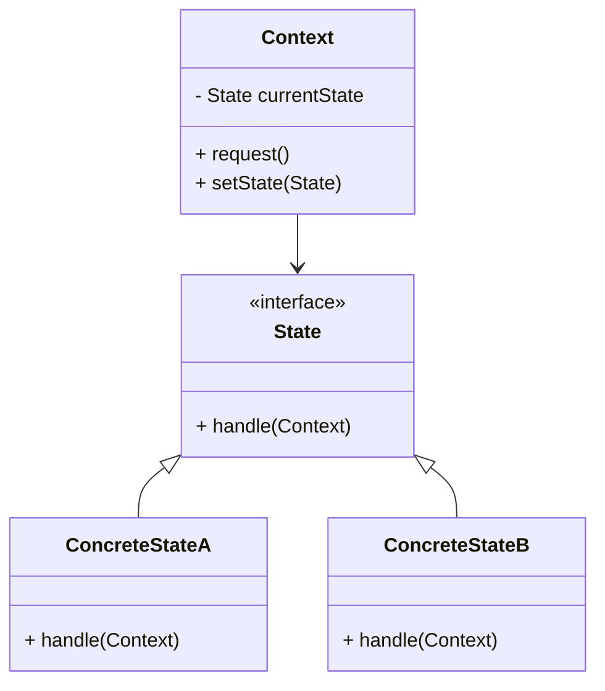
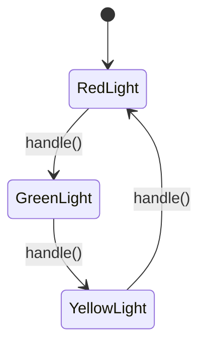

## 5.9. State Pattern

The State Pattern is a behavioral design pattern that allows an object to alter its behavior when its internal state changes. This pattern is particularly useful for simplifying complex conditional logic by encapsulating state-specific behavior within separate state objects.

### Intent and Motivation

The primary intent of the State Pattern is to allow an object to change its behavior when its internal state changes, making it appear as if the object has changed its class. This pattern is motivated by the need to manage state-dependent behavior in a clean and organized manner.

#### Key Motivations:

- **Encapsulation of State-Specific Behavior**: By encapsulating behavior associated with a particular state, the State Pattern promotes cleaner code and reduces the complexity of conditional logic.
- **Dynamic Behavior Changes**: The pattern allows for dynamic changes in behavior without altering the object’s class, enabling more flexible and maintainable code.
- **Improved Code Organization**: Separating state-specific behavior into distinct classes enhances code readability and maintainability.

### Applicability

The State Pattern is applicable in scenarios where:

- An object’s behavior depends on its state, and it must change its behavior at runtime depending on that state.
- State-specific behavior should be encapsulated within state objects.
- The number of states is manageable and not excessively large, as each state requires its own class.
- You want to avoid large conditional statements that manage state transitions.

### Structure

The State Pattern involves several key components:

- **Context**: The object whose behavior varies based on its state. It maintains a reference to an instance of a `State` subclass that defines the current state.
- **State**: An interface or abstract class defining the behavior associated with a particular state.
- **ConcreteState**: Subclasses of `State` that implement state-specific behavior.

#### UML Class Diagram



### Participants and Collaborations

- **Context**: Maintains an instance of a `State` subclass that defines the current state. It delegates state-specific behavior to the current `State` object.
- **State**: Defines an interface for encapsulating the behavior associated with a particular state of the `Context`.
- **ConcreteState**: Implements behavior associated with a state of the `Context`.

### Consequences

The State Pattern offers several benefits:

- **Simplifying Complex Conditionals**: By encapsulating state-specific behavior, the pattern eliminates complex conditional statements, making code easier to read and maintain.
- **State Transition Management**: The pattern provides a clear mechanism for managing state transitions, enhancing code organization.
- **Enhanced Flexibility**: New states and transitions can be added with minimal changes to existing code, promoting extensibility.

### Implementation Considerations

When implementing the State Pattern, consider the following:

- **State Transitions**: Clearly define how and when state transitions occur. Ensure that the `Context` can change its current state dynamically.
- **State Interface**: Design a robust `State` interface that can accommodate all necessary state-specific behavior.
- **Avoiding Excessive State Classes**: While the pattern is powerful, avoid creating an excessive number of state classes, which can lead to increased complexity.

### Detailed Pseudocode Implementation

Let's explore a detailed pseudocode implementation of the State Pattern. We'll use a simple example of a `TrafficLight` system that changes its behavior based on its current state (e.g., Red, Green, Yellow).

```pseudocode
// State interface
interface TrafficLightState {
    method handle(context: TrafficLight)
}

// Concrete State: Red
class RedLight implements TrafficLightState {
    method handle(context: TrafficLight) {
        print("Red Light: Stop")
        context.setState(new GreenLight())
    }
}

// Concrete State: Green
class GreenLight implements TrafficLightState {
    method handle(context: TrafficLight) {
        print("Green Light: Go")
        context.setState(new YellowLight())
    }
}

// Concrete State: Yellow
class YellowLight implements TrafficLightState {
    method handle(context: TrafficLight) {
        print("Yellow Light: Caution")
        context.setState(new RedLight())
    }
}

// Context class
class TrafficLight {
    private currentState: TrafficLightState

    constructor() {
        this.currentState = new RedLight()
    }

    method setState(state: TrafficLightState) {
        this.currentState = state
    }

    method request() {
        this.currentState.handle(this)
    }
}

// Client code
trafficLight = new TrafficLight()
trafficLight.request() // Red Light: Stop
trafficLight.request() // Green Light: Go
trafficLight.request() // Yellow Light: Caution
trafficLight.request() // Red Light: Stop
```

### Example Usage Scenarios

The State Pattern is versatile and can be applied in various scenarios, such as:

- **User Interface Components**: Managing different states of UI components, such as buttons that change behavior based on user interaction.
- **Game Development**: Implementing state-dependent behavior in game characters or objects, such as different attack modes or movement patterns.
- **Workflow Engines**: Handling different stages of a workflow, where each stage has specific behavior and transitions to other stages.

### Exercises

To reinforce your understanding of the State Pattern, try the following exercises:

1. **Implement a Vending Machine**: Create a vending machine that changes its behavior based on its current state (e.g., Idle, Selecting, Dispensing).
2. **Design a Media Player**: Implement a media player that changes its behavior based on its state (e.g., Playing, Paused, Stopped).
3. **Develop a Document Editor**: Create a document editor that changes its behavior based on its mode (e.g., Editing, Reviewing, Commenting).

### Visual Aids

To further illustrate the State Pattern, let's visualize the state transitions of our `TrafficLight` example.

#### State Transition Diagram



### Design Considerations

When using the State Pattern, keep the following considerations in mind:

- **State Transition Logic**: Clearly define the logic for state transitions to ensure smooth and predictable behavior changes.
- **State-Specific Behavior**: Ensure that each `ConcreteState` class encapsulates only the behavior relevant to that state, promoting separation of concerns.
- **Avoiding Excessive Complexity**: While the State Pattern is powerful, avoid creating an excessive number of state classes, which can lead to increased complexity.

### Differences and Similarities

The State Pattern is often compared to other behavioral patterns, such as the Strategy Pattern. While both patterns involve encapsulating behavior, they differ in their focus:

- **State Pattern**: Focuses on changing behavior based on the object's state, with state transitions managed internally.
- **Strategy Pattern**: Focuses on selecting behavior algorithms at runtime, with no inherent state transitions.

By understanding these differences, you can choose the appropriate pattern for your specific use case.

### Try It Yourself

To deepen your understanding of the State Pattern, try modifying the `TrafficLight` example:

- **Add a New State**: Introduce a new state, such as `Flashing`, and update the state transitions accordingly.
- **Change Transition Logic**: Modify the transition logic to skip the `YellowLight` state and go directly from `GreenLight` to `RedLight`.

Remember, experimenting with code is a great way to solidify your understanding of design patterns!

### Embrace the Journey

Mastering the State Pattern is a valuable skill in object-oriented design. As you continue to explore and apply design patterns, you'll find new ways to enhance your software's flexibility and maintainability. Keep experimenting, stay curious, and enjoy the journey!

## Quiz Time!



### What is the primary intent of the State Pattern?

- [x] To allow an object to change its behavior when its internal state changes.
- [ ] To provide a global point of access to a resource.
- [ ] To encapsulate a request as an object.
- [ ] To define a one-to-many dependency between objects.

> **Explanation:** The State Pattern allows an object to alter its behavior when its internal state changes, making it appear as if the object has changed its class.

### Which component in the State Pattern maintains a reference to the current state?

- [x] Context
- [ ] State
- [ ] ConcreteState
- [ ] Client

> **Explanation:** The Context maintains a reference to an instance of a `State` subclass that defines the current state.

### What is a key benefit of using the State Pattern?

- [x] Simplifying complex conditional logic.
- [ ] Providing a global point of access to a resource.
- [ ] Encapsulating a request as an object.
- [ ] Defining a one-to-many dependency between objects.

> **Explanation:** The State Pattern simplifies complex conditional logic by encapsulating state-specific behavior within separate state objects.

### In the State Pattern, what role does the ConcreteState play?

- [x] Implements behavior associated with a particular state of the Context.
- [ ] Maintains a reference to the current state.
- [ ] Defines an interface for encapsulating behavior.
- [ ] Encapsulates a request as an object.

> **Explanation:** ConcreteState implements behavior associated with a particular state of the Context.

### When is the State Pattern most applicable?

- [x] When an object's behavior depends on its state and must change at runtime.
- [ ] When you need to provide a global point of access to a resource.
- [ ] When you need to encapsulate a request as an object.
- [ ] When you need to define a one-to-many dependency between objects.

> **Explanation:** The State Pattern is applicable when an object's behavior depends on its state and must change at runtime.

### What is a potential drawback of the State Pattern?

- [x] It can lead to an excessive number of state classes.
- [ ] It complicates the code with unnecessary state transitions.
- [ ] It makes the code less flexible.
- [ ] It tightly couples the Context and State classes.

> **Explanation:** While the State Pattern is powerful, it can lead to an excessive number of state classes, which can increase complexity.

### How does the State Pattern differ from the Strategy Pattern?

- [x] The State Pattern focuses on changing behavior based on the object's state, while the Strategy Pattern focuses on selecting behavior algorithms at runtime.
- [ ] The State Pattern provides a global point of access to a resource, while the Strategy Pattern encapsulates a request as an object.
- [ ] The State Pattern defines a one-to-many dependency between objects, while the Strategy Pattern simplifies complex conditional logic.
- [ ] The State Pattern encapsulates a request as an object, while the Strategy Pattern provides a global point of access to a resource.

> **Explanation:** The State Pattern focuses on changing behavior based on the object's state, while the Strategy Pattern focuses on selecting behavior algorithms at runtime.

### What is a key consideration when implementing the State Pattern?

- [x] Clearly define how and when state transitions occur.
- [ ] Ensure that the Context class is tightly coupled with the State classes.
- [ ] Avoid encapsulating state-specific behavior within separate state objects.
- [ ] Minimize the number of state transitions.

> **Explanation:** When implementing the State Pattern, it's important to clearly define how and when state transitions occur to ensure smooth and predictable behavior changes.

### True or False: The State Pattern can be used to manage different stages of a workflow.

- [x] True
- [ ] False

> **Explanation:** True. The State Pattern can be used to manage different stages of a workflow, where each stage has specific behavior and transitions to other stages.

### Which of the following is NOT a participant in the State Pattern?

- [ ] Context
- [ ] State
- [ ] ConcreteState
- [x] Singleton

> **Explanation:** Singleton is not a participant in the State Pattern. The participants are Context, State, and ConcreteState.


