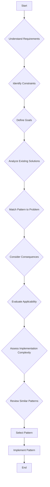

## 6.1. Selecting the Right Pattern

Choosing the right design pattern is a critical skill for any software developer. It requires a deep understanding of both the problem at hand and the patterns available. In this section, we will explore how to analyze problem contexts, follow pattern selection guidelines, and identify common scenarios where specific patterns are most appropriate.

### Analyzing Problem Contexts

The first step in selecting the right design pattern is to thoroughly analyze the problem context. This involves understanding the requirements, constraints, and goals of the software system you are designing. Here are some key considerations:

#### 1. Understand the Requirements

- **Functional Requirements**: What does the system need to do? Identify the core functionalities that must be implemented.
- **Non-Functional Requirements**: Consider performance, scalability, security, and other quality attributes that might influence your design decisions.

#### 2. Identify Constraints

- **Technical Constraints**: These might include hardware limitations, existing system architectures, or specific technologies that must be used.
- **Business Constraints**: Budget, timeline, and resource availability can also impact your choice of design patterns.

#### 3. Define Goals

- **Short-term Goals**: What immediate problems need solving? This might include improving code readability or reducing complexity.
- **Long-term Goals**: Consider future maintenance, scalability, and potential for reuse.

#### 4. Analyze Existing Solutions

- **Review Current Implementations**: Look at existing code to identify areas of improvement or refactoring opportunities.
- **Evaluate Previous Patterns**: If patterns have been used before, assess their effectiveness and suitability for the current problem.

### Pattern Selection Guidelines

Once you have a clear understanding of the problem context, you can follow these guidelines to select the most appropriate design pattern:

#### 1. Match the Pattern to the Problem

- **Intent**: Start by understanding the intent of each pattern. What problem is it designed to solve?
- **Structure**: Consider the structure of the pattern. Does it fit well with your existing architecture?
- **Participants**: Identify the key participants in the pattern and see if they align with your system's components.

#### 2. Consider the Consequences

- **Benefits**: What advantages does the pattern offer? This might include improved flexibility, reusability, or maintainability.
- **Trade-offs**: Are there any downsides to using the pattern? Consider potential increases in complexity or performance overhead.

#### 3. Evaluate Applicability

- **Context**: Is the pattern applicable to your specific context? Some patterns are more suited to certain types of problems or domains.
- **Scalability**: Will the pattern scale with your system as it grows? Consider both current and future needs.

#### 4. Assess Implementation Complexity

- **Ease of Implementation**: How difficult is it to implement the pattern? Consider the learning curve and potential for errors.
- **Integration with Existing Code**: How well will the pattern integrate with your existing codebase?

#### 5. Review Similar Patterns

- **Compare and Contrast**: Look at similar patterns and compare their strengths and weaknesses. This can help you make a more informed decision.
- **Avoid Common Confusions**: Some patterns are easily confused with one another. Make sure you understand the differences.

### Common Scenarios and Appropriate Patterns

To further aid in pattern selection, let's explore some common scenarios and the patterns that are often most appropriate:

#### Scenario 1: Managing Object Creation

- **Problem**: You need to manage the creation of objects in a way that decouples the client from the concrete classes.
- **Appropriate Patterns**:
  - **Factory Method**: Use this pattern to define an interface for creating an object, but let subclasses alter the type of objects that will be created.
  - **Abstract Factory**: Choose this pattern when you need to create families of related objects without specifying their concrete classes.
  - **Builder**: Opt for the Builder pattern when you need to construct a complex object step by step.

#### Scenario 2: Structuring Complex Systems

- **Problem**: You need to organize a complex system into manageable components.
- **Appropriate Patterns**:
  - **Composite**: Use this pattern to treat individual objects and compositions of objects uniformly.
  - **Facade**: Implement a Facade to provide a simplified interface to a complex subsystem.
  - **Decorator**: Choose the Decorator pattern to add responsibilities to objects dynamically.

#### Scenario 3: Enhancing Communication Between Objects

- **Problem**: You need to manage interactions between objects in a flexible and decoupled manner.
- **Appropriate Patterns**:
  - **Observer**: Use this pattern to establish a one-to-many dependency between objects.
  - **Mediator**: Implement a Mediator to centralize complex communications and control interactions.
  - **Chain of Responsibility**: Opt for this pattern to pass requests along a chain of handlers.

#### Scenario 4: Implementing Behavioral Logic

- **Problem**: You need to encapsulate algorithms or behaviors and make them interchangeable.
- **Appropriate Patterns**:
  - **Strategy**: Use this pattern to define a family of algorithms and make them interchangeable.
  - **State**: Choose the State pattern to allow an object to alter its behavior when its internal state changes.
  - **Command**: Implement the Command pattern to encapsulate a request as an object.

#### Scenario 5: Optimizing Performance

- **Problem**: You need to optimize performance by managing resources efficiently.
- **Appropriate Patterns**:
  - **Flyweight**: Use this pattern to share objects to support large numbers of fine-grained objects efficiently.
  - **Proxy**: Implement a Proxy to control access to an object, potentially reducing resource usage.

### Code Examples

Let's illustrate some of these scenarios with pseudocode examples:

#### Factory Method Pattern

```pseudocode
// Define an interface for creating an object
interface Creator {
    method createProduct(): Product
}

// Concrete implementation of the Creator
class ConcreteCreator implements Creator {
    method createProduct(): Product {
        return new ConcreteProduct()
    }
}

// Product interface
interface Product {
    method use(): void
}

// Concrete implementation of the Product
class ConcreteProduct implements Product {
    method use(): void {
        // Implementation of product usage
    }
}

// Client code
function main() {
    Creator creator = new ConcreteCreator()
    Product product = creator.createProduct()
    product.use()
}
```

#### Observer Pattern

```pseudocode
// Subject interface
interface Subject {
    method attach(observer: Observer): void
    method detach(observer: Observer): void
    method notify(): void
}

// Concrete implementation of the Subject
class ConcreteSubject implements Subject {
    private observers: List<Observer> = []

    method attach(observer: Observer): void {
        observers.add(observer)
    }

    method detach(observer: Observer): void {
        observers.remove(observer)
    }

    method notify(): void {
        for each observer in observers {
            observer.update()
        }
    }
}

// Observer interface
interface Observer {
    method update(): void
}

// Concrete implementation of the Observer
class ConcreteObserver implements Observer {
    method update(): void {
        // Implementation of update logic
    }
}

// Client code
function main() {
    Subject subject = new ConcreteSubject()
    Observer observer1 = new ConcreteObserver()
    Observer observer2 = new ConcreteObserver()

    subject.attach(observer1)
    subject.attach(observer2)

    subject.notify()
}
```

### Visualizing Pattern Selection

To further aid in understanding, let's visualize the process of selecting a design pattern using a flowchart:



This flowchart outlines the key steps in selecting a design pattern, from understanding the requirements to implementing the chosen pattern.

### Try It Yourself

Experiment with the provided pseudocode examples by making the following modifications:

- **Factory Method Pattern**: Try creating a new type of product and modify the `ConcreteCreator` to produce this new product.
- **Observer Pattern**: Add a new type of observer and see how it interacts with the subject.

### References and Links

For further reading on design patterns, consider the following resources:

- [Design Patterns: Elements of Reusable Object-Oriented Software](https://en.wikipedia.org/wiki/Design_Patterns) by Erich Gamma, Richard Helm, Ralph Johnson, and John Vlissides.
- [Refactoring: Improving the Design of Existing Code](https://martinfowler.com/books/refactoring.html) by Martin Fowler.
- [Head First Design Patterns](https://www.oreilly.com/library/view/head-first-design/0596007124/) by Eric Freeman and Elisabeth Robson.

### Knowledge Check

To reinforce your understanding, consider the following questions:

- What are the key steps in analyzing a problem context for pattern selection?
- How do you match a pattern to a problem?
- What are some common scenarios where specific patterns are most appropriate?

### Embrace the Journey

Remember, selecting the right design pattern is an art that improves with practice. As you encounter new problems, you'll become more adept at identifying the most suitable patterns. Keep experimenting, stay curious, and enjoy the journey!

## Quiz Time!



### What is the first step in selecting the right design pattern?

- [x] Analyzing the problem context
- [ ] Implementing the pattern
- [ ] Writing pseudocode
- [ ] Testing the solution

> **Explanation:** The first step is to analyze the problem context to understand the requirements, constraints, and goals.

### Which pattern is suitable for creating families of related objects?

- [ ] Singleton
- [x] Abstract Factory
- [ ] Observer
- [ ] Strategy

> **Explanation:** The Abstract Factory pattern provides an interface for creating families of related objects.

### What should you consider when evaluating the applicability of a pattern?

- [x] Context and scalability
- [ ] Only the current problem
- [ ] The number of classes
- [ ] The programming language

> **Explanation:** Consider the context and scalability to ensure the pattern fits both current and future needs.

### Which pattern is appropriate for managing object creation?

- [x] Factory Method
- [ ] Observer
- [ ] State
- [ ] Iterator

> **Explanation:** The Factory Method pattern is used to manage object creation by defining an interface for creating objects.

### What is a benefit of using the Observer pattern?

- [ ] It reduces code readability
- [x] It establishes a one-to-many dependency
- [ ] It increases coupling
- [ ] It simplifies object creation

> **Explanation:** The Observer pattern establishes a one-to-many dependency between objects, promoting loose coupling.

### Which pattern is used to encapsulate algorithms?

- [ ] Singleton
- [ ] Observer
- [x] Strategy
- [ ] Composite

> **Explanation:** The Strategy pattern is used to encapsulate algorithms and make them interchangeable.

### What is a key consideration when selecting a design pattern?

- [x] Implementation complexity
- [ ] The number of lines of code
- [ ] The color scheme of the IDE
- [ ] The size of the development team

> **Explanation:** Consider the implementation complexity to ensure the pattern can be integrated effectively.

### Which pattern is best for optimizing performance through resource management?

- [ ] Observer
- [ ] Command
- [ ] State
- [x] Flyweight

> **Explanation:** The Flyweight pattern is used to optimize performance by sharing objects to manage resources efficiently.

### What is the purpose of the Facade pattern?

- [ ] To create objects
- [ ] To encapsulate algorithms
- [x] To provide a simplified interface
- [ ] To manage object states

> **Explanation:** The Facade pattern provides a simplified interface to a complex subsystem.

### True or False: The first step in selecting a design pattern is to implement the pattern.

- [ ] True
- [x] False

> **Explanation:** The first step is to analyze the problem context, not to implement the pattern.


