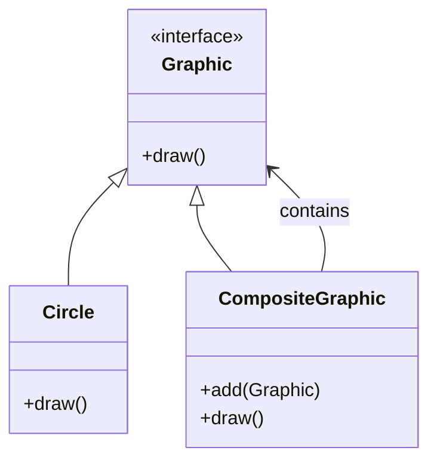
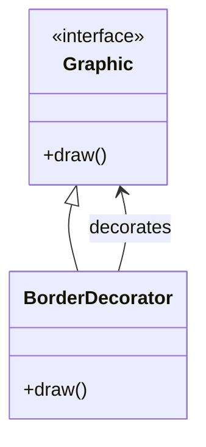

## 6.2. Combining Patterns

In the realm of software design, individual design patterns offer powerful solutions to specific problems. However, the true strength of design patterns emerges when they are combined to address complex challenges. In this section, we'll explore the art of combining patterns, creating composite patterns, and examine real-world case studies that demonstrate their practical application.

### Patterns Working Together

Design patterns are not isolated solutions; they can be combined to create more sophisticated and adaptable systems. When patterns work together, they can address multiple concerns simultaneously, enhancing the flexibility and robustness of software architecture. Let's delve into the key concepts of combining patterns.

#### The Synergy of Patterns

When we combine patterns, we leverage the strengths of each to create a more comprehensive solution. For example, the **Decorator Pattern** can be combined with the **Composite Pattern** to allow individual components and groups of components to be decorated with additional behavior. This synergy enables developers to build complex systems with minimal code duplication and high reusability.

#### Identifying Complementary Patterns

To effectively combine patterns, it's essential to identify those that complement each other. Patterns that solve different aspects of a problem or operate at different levels of abstraction often work well together. For instance, the **Factory Method Pattern** can be combined with the **Singleton Pattern** to ensure a single instance of a factory is used throughout an application.

#### Benefits of Combining Patterns

- **Enhanced Flexibility**: Combining patterns allows for more flexible designs that can adapt to changing requirements.
- **Improved Modularity**: Patterns can be combined to create modular systems where components can be easily swapped or extended.
- **Increased Reusability**: By combining patterns, we can create reusable components that solve multiple problems simultaneously.
- **Reduced Complexity**: Composite patterns can simplify complex systems by encapsulating intricate interactions within well-defined structures.

### Composite Patterns

Composite patterns are a powerful way to manage complexity by combining multiple design patterns into a cohesive solution. Let's explore some common composite patterns and their applications.

#### Composite Pattern

The **Composite Pattern** itself is a fundamental pattern that allows individual objects and compositions of objects to be treated uniformly. This pattern is often combined with others to manage hierarchical structures.

**Intent**: Compose objects into tree structures to represent part-whole hierarchies, allowing clients to treat individual objects and compositions uniformly.

**Key Participants**:
- **Component**: Declares the interface for objects in the composition.
- **Leaf**: Represents leaf objects in the composition.
- **Composite**: Represents a composite object that can contain other objects.

**Applicability**: Use the Composite Pattern when you want to represent part-whole hierarchies of objects and treat individual objects and compositions uniformly.

**Sample Code Snippet**:

```pseudocode
// Component interface
interface Graphic {
    method draw()
}

// Leaf class
class Circle implements Graphic {
    method draw() {
        // Draw circle
    }
}

// Composite class
class CompositeGraphic implements Graphic {
    private list<Graphic> children

    method add(Graphic g) {
        children.add(g)
    }

    method draw() {
        for each child in children {
            child.draw()
        }
    }
}

// Client code
circle1 = new Circle()
circle2 = new Circle()
composite = new CompositeGraphic()
composite.add(circle1)
composite.add(circle2)
composite.draw()
```

**Design Considerations**: The Composite Pattern is ideal for representing hierarchies where individual objects and compositions need to be treated uniformly. It simplifies client code by allowing clients to interact with complex structures through a simple interface.

#### Combining Composite with Decorator

The **Decorator Pattern** is often combined with the Composite Pattern to add responsibilities to individual components or entire compositions dynamically.

**Intent**: Attach additional responsibilities to an object dynamically. Decorators provide a flexible alternative to subclassing for extending functionality.

**Sample Code Snippet**:

```pseudocode
// Decorator class
class BorderDecorator implements Graphic {
    private Graphic decoratedGraphic

    method BorderDecorator(Graphic g) {
        decoratedGraphic = g
    }

    method draw() {
        // Add border
        decoratedGraphic.draw()
    }
}

// Client code
circle = new Circle()
decoratedCircle = new BorderDecorator(circle)
decoratedCircle.draw()
```

**Design Considerations**: Combining the Composite and Decorator Patterns allows for dynamic addition of responsibilities to both individual components and entire compositions. This combination is particularly useful in graphical user interfaces where elements can be decorated with additional features like borders or shadows.

### Case Studies of Combined Patterns

Let's explore some real-world case studies that demonstrate the power of combining design patterns.

#### Case Study 1: Building a Text Editor

In building a text editor, we can combine the **Composite Pattern** with the **Command Pattern** to manage complex document structures and user actions.

**Patterns Used**:
- **Composite Pattern**: To represent the document structure as a hierarchy of text elements.
- **Command Pattern**: To encapsulate user actions as command objects, enabling undo/redo functionality.

**Implementation**:

```pseudocode
// Composite Pattern for document structure
interface DocumentElement {
    method render()
}

class Text implements DocumentElement {
    method render() {
        // Render text
    }
}

class Paragraph implements DocumentElement {
    private list<DocumentElement> children

    method add(DocumentElement e) {
        children.add(e)
    }

    method render() {
        for each child in children {
            child.render()
        }
    }
}

// Command Pattern for user actions
interface Command {
    method execute()
    method undo()
}

class AddTextCommand implements Command {
    private DocumentElement element
    private Document document

    method AddTextCommand(DocumentElement e, Document d) {
        element = e
        document = d
    }

    method execute() {
        document.add(element)
    }

    method undo() {
        document.remove(element)
    }
}

// Client code
document = new Document()
text = new Text()
addTextCommand = new AddTextCommand(text, document)
addTextCommand.execute()
addTextCommand.undo()
```

**Benefits**: This combination allows for a flexible and extensible text editor where document structures can be easily modified, and user actions can be undone or redone.

#### Case Study 2: Building a GUI Framework

In a graphical user interface (GUI) framework, we can combine the **Observer Pattern** with the **Strategy Pattern** to manage event handling and layout strategies.

**Patterns Used**:
- **Observer Pattern**: To notify components of events such as user interactions.
- **Strategy Pattern**: To define different layout strategies for arranging components.

**Implementation**:

```pseudocode
// Observer Pattern for event handling
interface Observer {
    method update()
}

class Button implements Observer {
    method update() {
        // Handle button click
    }
}

// Strategy Pattern for layout
interface LayoutStrategy {
    method arrangeComponents(list<Component> components)
}

class GridLayout implements LayoutStrategy {
    method arrangeComponents(list<Component> components) {
        // Arrange components in a grid
    }
}

// Client code
button = new Button()
layout = new GridLayout()
layout.arrangeComponents([button])
button.update()
```

**Benefits**: This combination allows for a modular GUI framework where components can be notified of events and arranged using different layout strategies.

### Try It Yourself

Now that we've explored the power of combining patterns, let's try it ourselves. Modify the code examples provided to add new features or combine additional patterns. For example, try adding a **Flyweight Pattern** to the text editor case study to manage shared text styles efficiently.

### Visualizing Composite Patterns

To better understand how composite patterns work, let's visualize the structure using Mermaid.js diagrams.

#### Composite Pattern Structure



**Description**: This diagram illustrates the structure of the Composite Pattern, showing how the `CompositeGraphic` class can contain multiple `Graphic` objects, including `Circle` instances.

#### Decorator Pattern Structure



**Description**: This diagram illustrates the structure of the Decorator Pattern, showing how the `BorderDecorator` class decorates a `Graphic` object.

### References and Links

For further reading on design patterns and their combinations, consider exploring the following resources:

- [Design Patterns: Elements of Reusable Object-Oriented Software](https://en.wikipedia.org/wiki/Design_Patterns) by Erich Gamma, Richard Helm, Ralph Johnson, and John Vlissides.
- [Refactoring to Patterns](https://martinfowler.com/books/refactoring.html) by Joshua Kerievsky.
- [Head First Design Patterns](https://www.oreilly.com/library/view/head-first-design/0596007124/) by Eric Freeman and Elisabeth Robson.

### Knowledge Check

To reinforce your understanding, consider the following questions:

- How can combining patterns enhance the flexibility of a software system?
- What are some common challenges when combining patterns?
- How does the Composite Pattern simplify client code?

### Embrace the Journey

Remember, combining patterns is an art that requires practice and experimentation. As you continue your journey in software design, keep exploring new ways to combine patterns and create innovative solutions. Stay curious, and enjoy the process of mastering design patterns!

## Quiz Time!



### What is the primary benefit of combining design patterns?

- [x] Enhanced flexibility and modularity
- [ ] Increased complexity
- [ ] Reduced code readability
- [ ] Increased coupling

> **Explanation:** Combining design patterns enhances flexibility and modularity by allowing patterns to address multiple concerns simultaneously.

### Which pattern is often combined with the Composite Pattern to add responsibilities dynamically?

- [x] Decorator Pattern
- [ ] Singleton Pattern
- [ ] Observer Pattern
- [ ] Strategy Pattern

> **Explanation:** The Decorator Pattern is often combined with the Composite Pattern to add responsibilities to individual components or entire compositions dynamically.

### In the text editor case study, which pattern is used to manage user actions?

- [x] Command Pattern
- [ ] Observer Pattern
- [ ] Strategy Pattern
- [ ] Singleton Pattern

> **Explanation:** The Command Pattern is used to encapsulate user actions as command objects, enabling undo/redo functionality.

### What is the role of the Composite Pattern in a GUI framework?

- [ ] To notify components of events
- [ ] To define different layout strategies
- [x] To represent the document structure as a hierarchy
- [ ] To manage shared text styles

> **Explanation:** In a GUI framework, the Composite Pattern is used to represent the document structure as a hierarchy of text elements.

### Which pattern is used to notify components of events in a GUI framework?

- [ ] Strategy Pattern
- [x] Observer Pattern
- [ ] Composite Pattern
- [ ] Decorator Pattern

> **Explanation:** The Observer Pattern is used to notify components of events such as user interactions.

### What is a common challenge when combining patterns?

- [ ] Increased code duplication
- [x] Managing interactions between patterns
- [ ] Reduced flexibility
- [ ] Decreased modularity

> **Explanation:** A common challenge when combining patterns is managing interactions between patterns to ensure they work together effectively.

### How does the Decorator Pattern enhance the Composite Pattern?

- [x] By adding responsibilities dynamically
- [ ] By simplifying client code
- [ ] By reducing code duplication
- [ ] By managing shared text styles

> **Explanation:** The Decorator Pattern enhances the Composite Pattern by allowing for dynamic addition of responsibilities to both individual components and entire compositions.

### What is the benefit of using the Strategy Pattern in a GUI framework?

- [x] Defining different layout strategies
- [ ] Notifying components of events
- [ ] Managing user actions
- [ ] Representing document structure

> **Explanation:** The Strategy Pattern is used to define different layout strategies for arranging components in a GUI framework.

### How can the Flyweight Pattern be used in a text editor?

- [x] To manage shared text styles efficiently
- [ ] To encapsulate user actions
- [ ] To notify components of events
- [ ] To define different layout strategies

> **Explanation:** The Flyweight Pattern can be used in a text editor to manage shared text styles efficiently, reducing memory usage.

### True or False: Combining patterns can reduce the complexity of a software system.

- [x] True
- [ ] False

> **Explanation:** True. Combining patterns can reduce complexity by encapsulating intricate interactions within well-defined structures.


