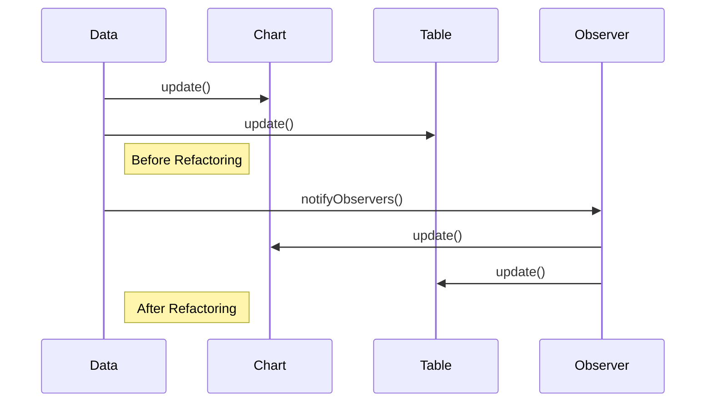

## 6.3. Refactoring to Patterns

Refactoring is the process of restructuring existing computer code without changing its external behavior. The goal is to improve the nonfunctional attributes of the software. Refactoring to patterns involves identifying areas in your code that can be improved by applying design patterns. This process not only enhances code readability and maintainability but also aligns the code with best practices in software design.

### Identifying Code Smells

Before we dive into refactoring, it's crucial to identify code smells. Code smells are indicators of potential issues in your code that may hinder its scalability, readability, or maintainability. They are not bugs but rather symptoms of deeper problems. Here are some common code smells:

- **Duplicated Code**: The same code structure appears in multiple places. This can lead to difficulties in maintenance and increased chances of errors.
- **Long Method**: Methods that are excessively long and try to do too much. They can be challenging to understand and test.
- **Large Class**: Classes that have grown too large and have too many responsibilities.
- **Feature Envy**: A method that seems more interested in a class other than the one it is in.
- **Inappropriate Intimacy**: Classes that spend too much time delving into each other's private details.
- **Lazy Class**: A class that is not doing enough to justify its existence.
- **Speculative Generality**: Code that is more abstract or general than it needs to be, often due to over-engineering.

Identifying these smells is the first step in refactoring to patterns. Once identified, we can apply design patterns to address these issues.

### Transforming Code Using Patterns

Refactoring to patterns involves transforming your code to incorporate design patterns, thereby improving its structure and design. Let's explore how we can transform code using some common design patterns.

#### Example 1: Refactoring with the Singleton Pattern

**Code Smell**: Global variables or objects that should only have a single instance.

**Solution**: Use the Singleton Pattern to ensure a class has only one instance and provide a global point of access to it.

**Pseudocode Before Refactoring**:

```pseudocode
class Logger {
    method log(message) {
        // Log the message
    }
}

globalLogger = new Logger()
```

**Pseudocode After Refactoring**:

```pseudocode
class Logger {
    private static instance = null

    private Logger() {
        // Private constructor
    }

    static method getInstance() {
        if (instance == null) {
            instance = new Logger()
        }
        return instance
    }

    method log(message) {
        // Log the message
    }
}

// Usage
logger = Logger.getInstance()
logger.log("This is a log message")
```

In this example, we transformed the global logger into a Singleton, ensuring that only one instance of the `Logger` class exists.

#### Example 2: Refactoring with the Factory Method Pattern

**Code Smell**: Complex object creation code scattered throughout the application.

**Solution**: Use the Factory Method Pattern to encapsulate object creation.

**Pseudocode Before Refactoring**:

```pseudocode
class Car {
    method drive() {
        // Drive the car
    }
}

class Truck {
    method drive() {
        // Drive the truck
    }
}

vehicleType = "car"
if (vehicleType == "car") {
    vehicle = new Car()
} else if (vehicleType == "truck") {
    vehicle = new Truck()
}
vehicle.drive()
```

**Pseudocode After Refactoring**:

```pseudocode
abstract class Vehicle {
    abstract method drive()
}

class Car extends Vehicle {
    method drive() {
        // Drive the car
    }
}

class Truck extends Vehicle {
    method drive() {
        // Drive the truck
    }
}

class VehicleFactory {
    static method createVehicle(type) {
        if (type == "car") {
            return new Car()
        } else if (type == "truck") {
            return new Truck()
        }
        return null
    }
}

// Usage
vehicle = VehicleFactory.createVehicle("car")
vehicle.drive()
```

By using the Factory Method Pattern, we encapsulate the creation logic within the `VehicleFactory`, making the code more modular and easier to maintain.

#### Example 3: Refactoring with the Observer Pattern

**Code Smell**: Tight coupling between classes that need to notify each other of changes.

**Solution**: Use the Observer Pattern to allow objects to be notified of changes in other objects without tight coupling.

**Pseudocode Before Refactoring**:

```pseudocode
class Data {
    method update() {
        // Update data
        chart.update()
        table.update()
    }
}

class Chart {
    method update() {
        // Update chart
    }
}

class Table {
    method update() {
        // Update table
    }
}

data = new Data()
chart = new Chart()
table = new Table()
data.update()
```

**Pseudocode After Refactoring**:

```pseudocode
interface Observer {
    method update()
}

class Data {
    private observers = []

    method addObserver(observer) {
        observers.add(observer)
    }

    method removeObserver(observer) {
        observers.remove(observer)
    }

    method notifyObservers() {
        for each observer in observers {
            observer.update()
        }
    }

    method update() {
        // Update data
        notifyObservers()
    }
}

class Chart implements Observer {
    method update() {
        // Update chart
    }
}

class Table implements Observer {
    method update() {
        // Update table
    }
}

// Usage
data = new Data()
chart = new Chart()
table = new Table()
data.addObserver(chart)
data.addObserver(table)
data.update()
```

With the Observer Pattern, we decouple the `Data` class from the `Chart` and `Table` classes, allowing them to be notified of changes without direct dependencies.

### Incremental Refactoring Strategies

Refactoring to patterns should be done incrementally to minimize risks and ensure that the code remains functional throughout the process. Here are some strategies for incremental refactoring:

1. **Start with Small Changes**: Begin by refactoring small, isolated parts of the code. This reduces the risk of introducing errors and makes it easier to test changes.

2. **Use Automated Tests**: Ensure that you have a comprehensive suite of automated tests before starting refactoring. Tests will help you verify that the behavior of the code remains unchanged.

3. **Refactor One Pattern at a Time**: Focus on refactoring to one pattern at a time. This helps in understanding the impact of each change and makes it easier to track progress.

4. **Document Changes**: Keep detailed documentation of the changes you make during refactoring. This will help in understanding the rationale behind each change and in maintaining the code in the future.

5. **Review and Iterate**: After refactoring, review the code to ensure that it meets the desired standards. Be prepared to iterate and make further improvements if necessary.

### Visualizing the Refactoring Process

To better understand the refactoring process, let's visualize the transformation of code using a sequence diagram. This diagram illustrates the interaction between objects before and after refactoring with the Observer Pattern.



In the sequence diagram above, we see how the `Data` class directly calls the `update` methods of `Chart` and `Table` before refactoring. After refactoring, the `Data` class notifies observers, which then update themselves.

### Try It Yourself

To deepen your understanding, try refactoring the following pseudocode using the Strategy Pattern:

**Pseudocode Before Refactoring**:

```pseudocode
class PaymentProcessor {
    method processPayment(type, amount) {
        if (type == "credit") {
            // Process credit payment
        } else if (type == "paypal") {
            // Process PayPal payment
        }
    }
}

// Usage
processor = new PaymentProcessor()
processor.processPayment("credit", 100)
```

**Challenge**: Refactor the code to use the Strategy Pattern, allowing for more flexible payment processing.

### Knowledge Check

- What are code smells, and why are they important in refactoring?
- How does the Singleton Pattern help in managing global instances?
- What are the benefits of using the Factory Method Pattern?
- How does the Observer Pattern promote loose coupling between classes?
- What strategies can be used for incremental refactoring?

### Key Takeaways

- Refactoring to patterns involves identifying code smells and transforming code using design patterns.
- Design patterns such as Singleton, Factory Method, and Observer can significantly improve code structure and maintainability.
- Incremental refactoring strategies help manage risks and ensure code quality during the refactoring process.
- Visualizing the refactoring process with diagrams can aid in understanding the transformation of code.

Remember, refactoring is an ongoing process. As you continue to develop and maintain software, regularly revisit your code to identify opportunities for improvement and refactoring. Keep experimenting, stay curious, and enjoy the journey!

## Quiz Time!



### What is a code smell?

- [x] An indicator of potential issues in the code that may hinder its scalability or maintainability.
- [ ] A bug in the code that causes it to malfunction.
- [ ] A feature that enhances code readability.
- [ ] A design pattern used to improve code structure.

> **Explanation:** Code smells are indicators of potential issues in the code that may hinder its scalability, readability, or maintainability. They are not bugs but symptoms of deeper problems.

### Which pattern ensures a class has only one instance and provides a global point of access to it?

- [x] Singleton Pattern
- [ ] Factory Method Pattern
- [ ] Observer Pattern
- [ ] Strategy Pattern

> **Explanation:** The Singleton Pattern ensures a class has only one instance and provides a global point of access to it.

### What is the primary benefit of using the Factory Method Pattern?

- [x] Encapsulating object creation to promote modularity and ease of maintenance.
- [ ] Ensuring only one instance of a class exists.
- [ ] Allowing objects to be notified of changes in other objects.
- [ ] Defining a family of algorithms and making them interchangeable.

> **Explanation:** The Factory Method Pattern encapsulates object creation, promoting modularity and ease of maintenance.

### How does the Observer Pattern promote loose coupling?

- [x] By allowing objects to be notified of changes in other objects without direct dependencies.
- [ ] By ensuring only one instance of a class exists.
- [ ] By encapsulating object creation.
- [ ] By defining a family of algorithms and making them interchangeable.

> **Explanation:** The Observer Pattern promotes loose coupling by allowing objects to be notified of changes in other objects without direct dependencies.

### What is an incremental refactoring strategy?

- [x] A strategy that involves making small, isolated changes to minimize risks and ensure code quality.
- [ ] A strategy that involves refactoring the entire codebase at once.
- [ ] A strategy that focuses on refactoring to multiple patterns simultaneously.
- [ ] A strategy that does not involve testing changes.

> **Explanation:** Incremental refactoring involves making small, isolated changes to minimize risks and ensure code quality.

### What is the purpose of using automated tests during refactoring?

- [x] To verify that the behavior of the code remains unchanged.
- [ ] To introduce new features to the code.
- [ ] To remove all code smells.
- [ ] To ensure that only one instance of a class exists.

> **Explanation:** Automated tests verify that the behavior of the code remains unchanged during refactoring.

### Which pattern is suitable for managing global instances?

- [x] Singleton Pattern
- [ ] Factory Method Pattern
- [ ] Observer Pattern
- [ ] Strategy Pattern

> **Explanation:** The Singleton Pattern is suitable for managing global instances.

### What is the benefit of documenting changes during refactoring?

- [x] It helps in understanding the rationale behind each change and in maintaining the code in the future.
- [ ] It ensures that the code has no bugs.
- [ ] It automatically removes all code smells.
- [ ] It guarantees that the code is optimized for performance.

> **Explanation:** Documenting changes helps in understanding the rationale behind each change and in maintaining the code in the future.

### What is the Observer Pattern used for?

- [x] Allowing objects to be notified of changes in other objects.
- [ ] Ensuring only one instance of a class exists.
- [ ] Encapsulating object creation.
- [ ] Defining a family of algorithms and making them interchangeable.

> **Explanation:** The Observer Pattern is used for allowing objects to be notified of changes in other objects.

### True or False: Refactoring to patterns should be done all at once to ensure consistency.

- [ ] True
- [x] False

> **Explanation:** Refactoring to patterns should be done incrementally to minimize risks and ensure that the code remains functional throughout the process.


