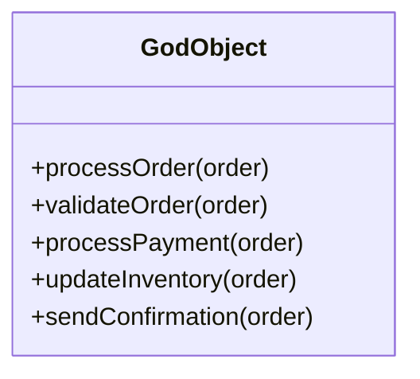
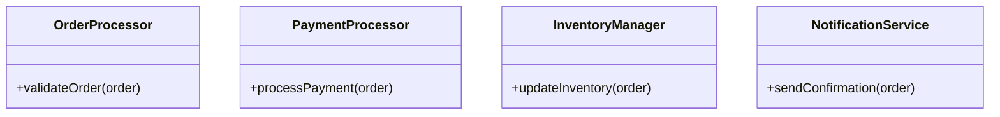
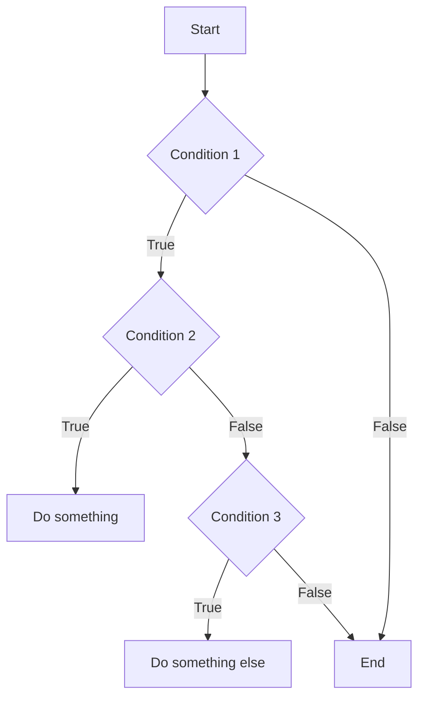
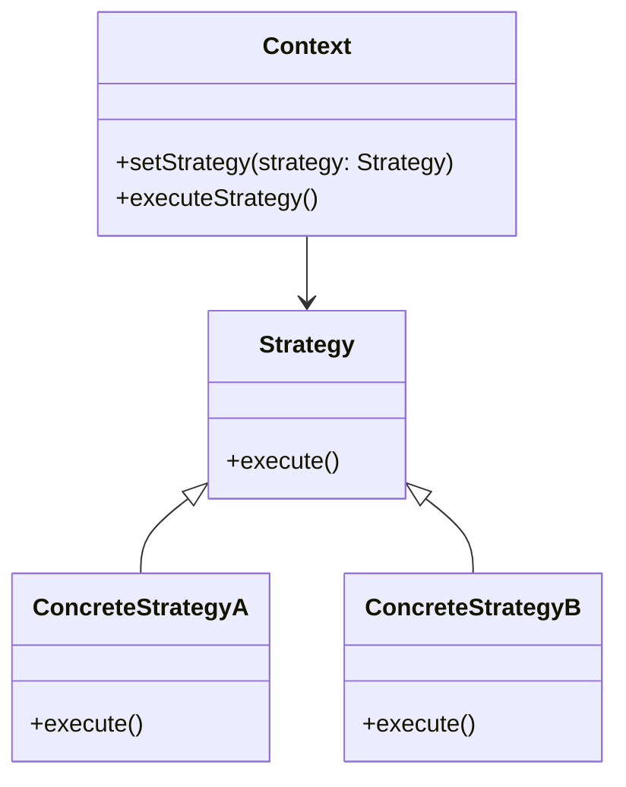

## 6.4. Avoiding Anti-Patterns

In the realm of software development, anti-patterns are like the dark side of design patterns. While design patterns provide solutions to common problems, anti-patterns represent common responses to recurring problems that are ineffective and counterproductive. In this section, we will explore how to recognize these anti-patterns, strategies to prevent poor design choices, and how to transform anti-patterns into effective patterns.

### Recognizing Common Anti-Patterns

An anti-pattern is a pattern that may seem beneficial at first but ultimately leads to negative consequences. Recognizing these anti-patterns is the first step in avoiding them. Let's delve into some of the most common anti-patterns in object-oriented design.

#### 1. The God Object

**Description:** The God Object anti-pattern occurs when a single class is overloaded with too many responsibilities. This class becomes a "god" because it knows too much and does too much.

**Consequences:** This leads to code that is difficult to maintain, test, and extend. The God Object violates the Single Responsibility Principle (SRP), making the system fragile.

**Example:**

```pseudocode
class GodObject
    method processOrder(order)
        // Validate order
        // Process payment
        // Update inventory
        // Send confirmation email
    end method
end class
```

**Solution:** Break down the God Object into smaller, more focused classes, each with a single responsibility. This aligns with the SRP and promotes better code organization.

#### 2. Spaghetti Code

**Description:** Spaghetti Code is characterized by a tangled and complex control structure, making it difficult to follow and maintain.

**Consequences:** It leads to increased difficulty in understanding and modifying the code, often resulting in bugs and errors.

**Example:**

```pseudocode
if condition1
    if condition2
        // Do something
    else
        if condition3
            // Do something else
        end if
    end if
end if
```

**Solution:** Refactor the code to use clear and concise control structures. Employ design patterns like the Strategy or State pattern to manage complex logic more effectively.

#### 3. Lava Flow

**Description:** Lava Flow refers to code that is left behind after a project is completed, often because it was too risky or difficult to remove.

**Consequences:** This results in a bloated codebase with obsolete code that can introduce bugs and hinder future development.

**Example:**

```pseudocode
class LegacySystem
    method oldMethod()
        // Old code that is no longer used
    end method
end class
```

**Solution:** Regularly review and refactor the codebase to remove unused or obsolete code. Implement automated tests to ensure that changes do not introduce new bugs.

#### 4. Golden Hammer

**Description:** The Golden Hammer anti-pattern occurs when a developer uses a familiar solution or tool for every problem, regardless of its suitability.

**Consequences:** This leads to inefficient solutions and can stifle innovation and creativity.

**Example:**

```pseudocode
class DataProcessor
    method processData(data)
        // Always use a specific algorithm, even if it's not the best fit
    end method
end class
```

**Solution:** Encourage the exploration of different solutions and tools. Evaluate the problem context and choose the most appropriate design pattern or technology.

#### 5. Copy-Paste Programming

**Description:** Copy-Paste Programming involves duplicating code instead of creating reusable components or functions.

**Consequences:** This leads to code duplication, making maintenance difficult and increasing the risk of bugs.

**Example:**

```pseudocode
class UserManager
    method createUser()
        // Code to create a user
    end method

    method deleteUser()
        // Similar code to delete a user
    end method
end class
```

**Solution:** Refactor the code to use reusable functions or classes. Apply the DRY (Don't Repeat Yourself) principle to eliminate duplication.

### Strategies to Prevent Poor Design Choices

Preventing poor design choices requires a proactive approach. Here are some strategies to help you avoid anti-patterns and make better design decisions.

#### 1. Adhere to SOLID Principles

The SOLID principles provide a strong foundation for creating maintainable and scalable software. By adhering to these principles, you can avoid many common anti-patterns.

- **Single Responsibility Principle (SRP):** Ensure each class has one responsibility.
- **Open/Closed Principle (OCP):** Design classes that can be extended without modifying existing code.
- **Liskov Substitution Principle (LSP):** Subtypes should be substitutable for their base types.
- **Interface Segregation Principle (ISP):** Create specific interfaces for different clients.
- **Dependency Inversion Principle (DIP):** Depend on abstractions, not on concrete implementations.

#### 2. Conduct Code Reviews

Regular code reviews help identify potential anti-patterns early in the development process. Encourage team members to provide constructive feedback and suggest improvements.

#### 3. Use Automated Testing

Automated tests ensure that code changes do not introduce new bugs. They also provide a safety net for refactoring efforts, making it easier to eliminate anti-patterns.

#### 4. Foster a Culture of Continuous Learning

Encourage team members to stay updated on best practices and new design patterns. Provide opportunities for training and professional development.

#### 5. Embrace Refactoring

Refactoring is the process of improving the structure of existing code without changing its behavior. Regular refactoring helps prevent the accumulation of technical debt and anti-patterns.

### Turning Anti-Patterns into Patterns

Transforming anti-patterns into effective patterns involves recognizing the underlying problem and applying the appropriate design pattern or principle to address it.

#### 1. From God Object to Modular Design

**Transformation:** Break down the God Object into smaller, focused classes. Use design patterns like the Facade or Mediator to manage interactions between these classes.

**Example:**

```pseudocode
class OrderProcessor
    method validateOrder(order)
        // Validate order
    end method
end class

class PaymentProcessor
    method processPayment(order)
        // Process payment
    end method
end class

class InventoryManager
    method updateInventory(order)
        // Update inventory
    end method
end class

class NotificationService
    method sendConfirmation(order)
        // Send confirmation email
    end method
end class
```

#### 2. From Spaghetti Code to Strategy Pattern

**Transformation:** Use the Strategy pattern to encapsulate algorithms and make them interchangeable. This simplifies complex control structures.

**Example:**

```pseudocode
interface Strategy
    method execute()
end interface

class ConcreteStrategyA implements Strategy
    method execute()
        // Implementation A
    end method
end class

class ConcreteStrategyB implements Strategy
    method execute()
        // Implementation B
    end method
end class

class Context
    private strategy: Strategy

    method setStrategy(strategy: Strategy)
        this.strategy = strategy
    end method

    method executeStrategy()
        this.strategy.execute()
    end method
end class
```

#### 3. From Lava Flow to Clean Architecture

**Transformation:** Regularly refactor the codebase to remove obsolete code. Implement a clean architecture that separates concerns and promotes testability.

**Example:**

```pseudocode
class CleanArchitecture
    method execute()
        // Use dependency injection to manage dependencies
    end method
end class
```

#### 4. From Golden Hammer to Contextual Design

**Transformation:** Evaluate the problem context and choose the most suitable design pattern or tool. Encourage experimentation and innovation.

**Example:**

```pseudocode
class ContextualProcessor
    method processData(data, strategy: Strategy)
        strategy.execute(data)
    end method
end class
```

#### 5. From Copy-Paste Programming to DRY Principle

**Transformation:** Refactor the code to eliminate duplication. Use functions or classes to encapsulate reusable logic.

**Example:**

```pseudocode
class UserManager
    method manageUser(action: String, user: User)
        if action == "create"
            // Code to create a user
        else if action == "delete"
            // Code to delete a user
        end if
    end method
end class
```

### Visualizing Anti-Patterns and Transformations

To better understand how anti-patterns can be transformed into effective patterns, let's visualize these concepts using Mermaid.js diagrams.

#### Visualizing the God Object Anti-Pattern



#### Visualizing the Modular Design Pattern



#### Visualizing the Spaghetti Code Anti-Pattern



#### Visualizing the Strategy Pattern



### Knowledge Check

To reinforce your understanding of anti-patterns and how to avoid them, consider the following questions:

1. What is an anti-pattern, and how does it differ from a design pattern?
2. How can the God Object anti-pattern be transformed into a modular design?
3. What are some strategies to prevent poor design choices in software development?
4. Why is it important to conduct regular code reviews?
5. How does the Strategy pattern help in managing complex control structures?

### Try It Yourself

To deepen your understanding, try modifying the code examples provided. For instance, experiment with different strategies in the Strategy pattern example. Consider how you might apply these transformations in your own projects.

### Embrace the Journey

Remember, avoiding anti-patterns is an ongoing journey. As you gain experience, you'll become more adept at recognizing and transforming anti-patterns into effective patterns. Stay curious, keep learning, and enjoy the process of mastering object-oriented design.

## Quiz Time!



### What is an anti-pattern?

- [x] A common but ineffective solution to a recurring problem
- [ ] A well-established solution to a common problem
- [ ] A design pattern that is always beneficial
- [ ] A pattern that is rarely used

> **Explanation:** An anti-pattern is a common response to a recurring problem that is ineffective and counterproductive.

### How can the God Object anti-pattern be addressed?

- [x] By breaking it down into smaller, focused classes
- [ ] By adding more methods to handle additional responsibilities
- [ ] By using a single class for all functionalities
- [ ] By ignoring the issue

> **Explanation:** The God Object can be addressed by breaking it down into smaller classes, each with a single responsibility.

### What is the consequence of Spaghetti Code?

- [x] It makes the code difficult to follow and maintain
- [ ] It improves code readability
- [ ] It simplifies complex logic
- [ ] It enhances code performance

> **Explanation:** Spaghetti Code results in tangled and complex control structures, making the code difficult to follow and maintain.

### Which principle helps in avoiding the God Object anti-pattern?

- [x] Single Responsibility Principle
- [ ] Open/Closed Principle
- [ ] Liskov Substitution Principle
- [ ] Interface Segregation Principle

> **Explanation:** The Single Responsibility Principle ensures that each class has only one responsibility, helping to avoid the God Object anti-pattern.

### What is a key strategy to prevent poor design choices?

- [x] Conducting regular code reviews
- [ ] Ignoring feedback from team members
- [ ] Using a single solution for all problems
- [ ] Avoiding automated testing

> **Explanation:** Conducting regular code reviews helps identify potential anti-patterns early in the development process.

### How can the Golden Hammer anti-pattern be avoided?

- [x] By evaluating the problem context and choosing the most suitable solution
- [ ] By using the same tool for every problem
- [ ] By avoiding experimentation
- [ ] By sticking to familiar solutions

> **Explanation:** The Golden Hammer can be avoided by evaluating the problem context and choosing the most suitable solution or tool.

### What is the DRY principle?

- [x] Don't Repeat Yourself
- [ ] Do Repeat Yourself
- [ ] Don't Refactor Yourself
- [ ] Do Refactor Yourself

> **Explanation:** The DRY principle stands for "Don't Repeat Yourself," emphasizing the elimination of code duplication.

### How does the Strategy pattern help in software design?

- [x] By encapsulating algorithms and making them interchangeable
- [ ] By creating a single class for all functionalities
- [ ] By increasing code duplication
- [ ] By ignoring complex logic

> **Explanation:** The Strategy pattern helps by encapsulating algorithms and making them interchangeable, simplifying complex control structures.

### What is the purpose of refactoring?

- [x] To improve the structure of existing code without changing its behavior
- [ ] To add new features to the code
- [ ] To increase code complexity
- [ ] To remove all comments from the code

> **Explanation:** Refactoring improves the structure of existing code without changing its behavior, helping to prevent anti-patterns.

### True or False: Anti-patterns are always beneficial in software development.

- [ ] True
- [x] False

> **Explanation:** False. Anti-patterns are ineffective and counterproductive solutions to recurring problems.


